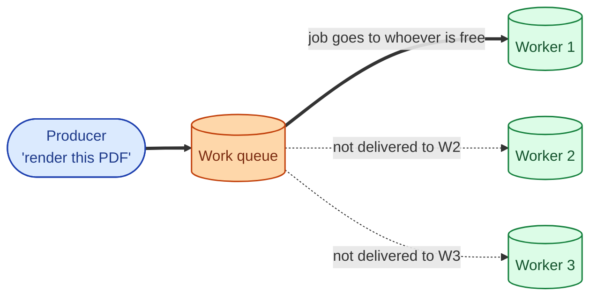
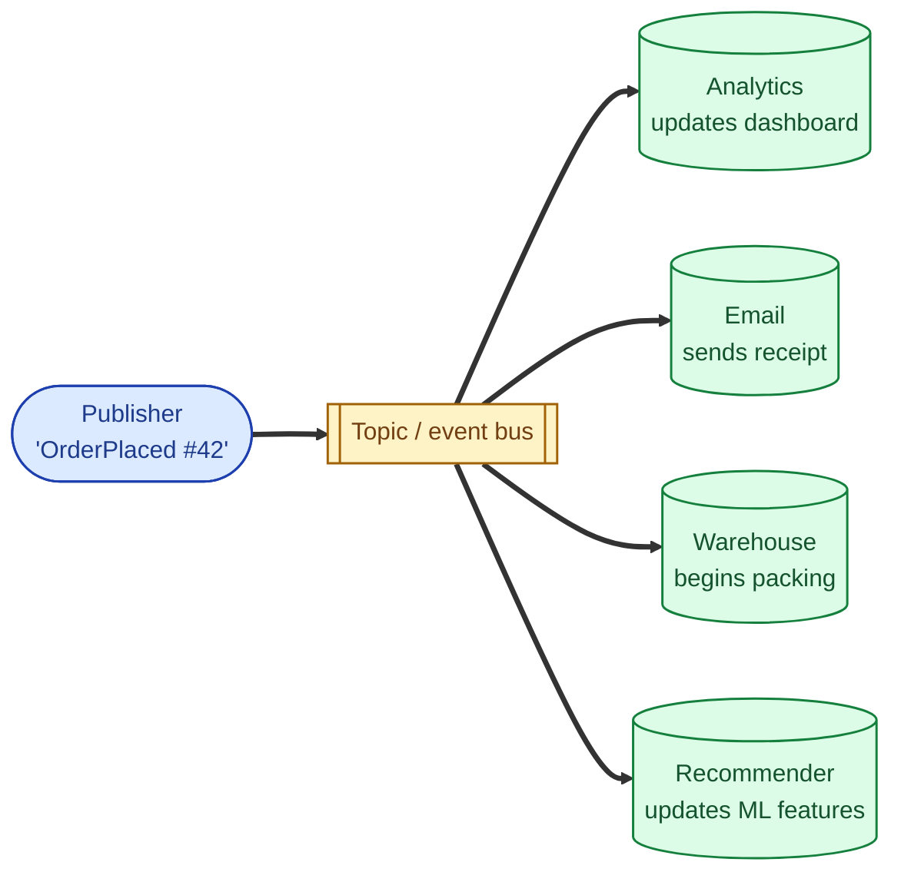
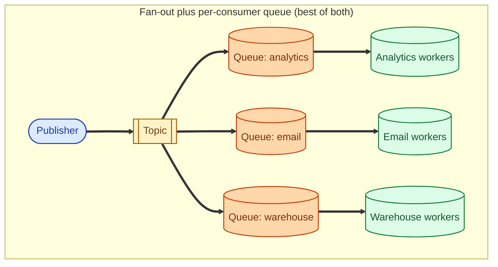

A queue and a pub/sub topic look similar from the outside (producers send, consumers receive) but they answer different questions. A queue answers "which of my workers will do this job?" Exactly one. A pub/sub topic answers "who wants to know that this happened?" Everyone who subscribed. Reaching for the wrong one is a common architecture bug, because both work at first; the problem only shows up when you add the second consumer.

## Point-to-point queue: one job, one worker

A message is consumed by exactly one of the workers attached to the queue. The broker hands it out, the worker acks, the message is gone.

The mental model: many workers competing for jobs, the queue handing them out one at a time. Adding more workers makes the queue drain faster; it does not change what each worker does.

Examples: render a PDF, send an email, encode a video, run a payment. There is one piece of work, exactly one worker should do it.

## Pub/sub: one event, many subscribers

A producer publishes an event to a topic. Every subscriber to that topic gets its own copy and processes it independently. None of them are competing.

The mental model: an announcement on a public board. Everyone who cares can read it; they each react in their own way; nobody owns the announcement.

Examples: `OrderPlaced`, `UserSignedUp`, `PaymentFailed`. Many systems care about the same event for different reasons.

## What happens when you mix them up

If you put a job that should be done once on a pub/sub topic with three subscribers, the job runs three times. You charge the user three times. You ship three items. You send three emails.

If you put an event that many systems want on a single-consumer queue, only the first system that subscribes gets the events. The other systems never see them and you cannot fan out without copying.

The fix in real systems is usually one of:

- **Use a queue per consumer group.** Pub/sub plus a queue per subscriber. Kafka does this with consumer groups; AWS does it with SNS-to-many-SQS-queues; RabbitMQ does it with a fanout exchange and a queue per consumer.
- **Use a single queue with a worker pool.** When the goal is "do this job once, distribute across workers."

The topic distributes copies. Each downstream's own queue absorbs spikes and lets that team scale workers independently. This is the production pattern most large systems land on.

## How each broker maps to these models

| System | Queue | Pub/sub | Both at once |
|---|---|---|---|
| Kafka | n/a (use a single consumer group) | multiple consumer groups on a topic | yes, native |
| RabbitMQ | direct or topic exchange to a queue | fanout exchange to many queues | yes, native |
| SQS | yes, native | no — use SNS to fan out to multiple SQS queues | SNS+SQS pattern |
| Google Pub/Sub | n/a (subscribers compete via shared subscription) | publish to topic, many subscriptions | yes, native |

Kafka and Google Pub/Sub make "many consumer groups on the same stream" the natural shape. SQS makes you reach for SNS to fan out. RabbitMQ does both fluently via its exchange model.

## Two scenarios

**Scenario one: a thumbnail-generation job.**

A user uploads an image. You need to produce a thumbnail. One worker should do it; if you have ten workers, each one should take a different job. This is a **queue**. Workers compete. One thumbnail per upload. Scale workers to control throughput.

**Scenario two: an `OrderPlaced` event.**

The checkout publishes `OrderPlaced`. The analytics team wants to count revenue. The email team wants to send a receipt. The warehouse needs to pack the order. The recommender wants to update ML features. Four independent reactions to one fact. This is **pub/sub**. Each downstream gets its own copy and processes on its own timeline.

## What this connects to

- **Why use a message queue.** Pub/sub is a flavour of "use a queue", with different semantics. See [Why use a message queue](/practice/system-design/concepts/032-why-message-queue/).
- **Kafka vs RabbitMQ vs SQS.** Each broker models these patterns differently. See [Kafka vs RabbitMQ vs SQS](/practice/system-design/concepts/033-kafka-vs-rabbitmq-vs-sqs/).
- **Delivery semantics.** Apply the same way to both. See [Delivery semantics](/practice/system-design/concepts/034-delivery-semantics/).
- **Event sourcing.** Built on append-only pub/sub style streams. See [Event sourcing vs state-based persistence](/practice/system-design/concepts/036-event-sourcing/).

## Common mistakes

- **Putting an action on a pub/sub topic.** "Charge this card" should not be a topic event that multiple subscribers might consume. Make it a queue or a per-consumer queue from a topic.
- **Putting an event on a single queue.** "OrderPlaced" should not be consumed by one team and lost to the others. Make it a topic with fan-out queues.
- **Sharing a single SQS queue across teams.** First team to consume "wins" the message; the others never see it. Use SNS-to-SQS or move to a real pub/sub system.
- **Forgetting that each subscriber needs its own retry semantics.** If three subscribers each retry on failure, the producer sees nothing special, but the system overall does triple work on a transient outage.
- **No event schema.** Topics outlive every team that publishes to them. Without a schema and versioning policy, consumers break silently when producers change the shape.
- **Misusing "topic" in RabbitMQ.** RabbitMQ "topic exchanges" are about routing keys, not about pub/sub fanout. Fanout exchanges are what you want for "everyone gets a copy".

## Quick recap

- Queue: one job, one worker. Adding workers raises throughput, not delivery count.
- Pub/sub: one event, many independent subscribers. Each gets its own copy.
- Production systems usually combine them: publish to a topic, fan out to per-consumer queues.
- Putting an action on a topic or an event on a queue is the classic architecture bug. The wrong shape becomes obvious only when the second consumer shows up.

This concept sits in **Stage 3 (Caching, queues, and async work)** of the [System Design Roadmap](/practice/system-design/roadmap/).
