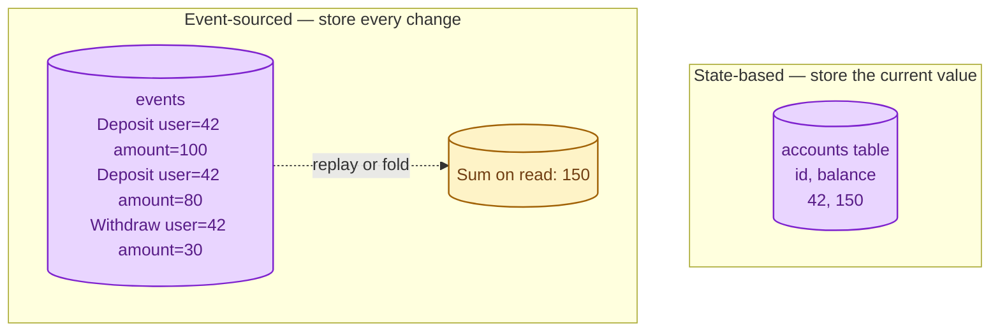
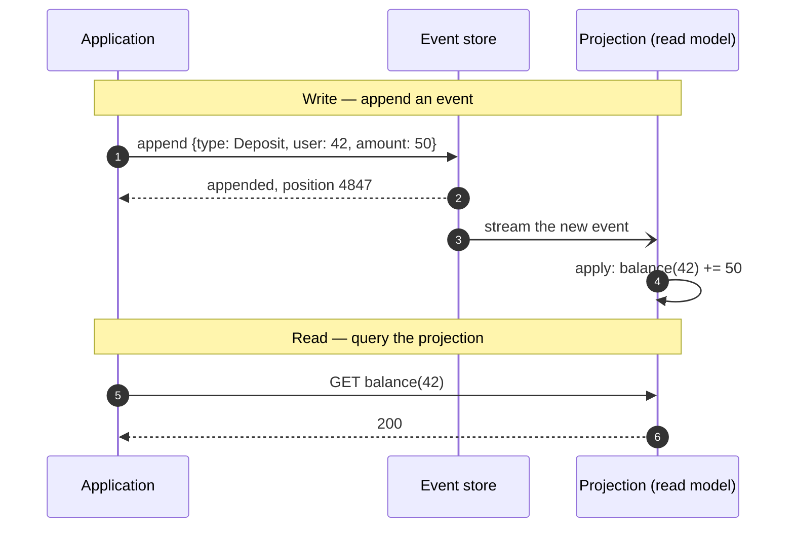
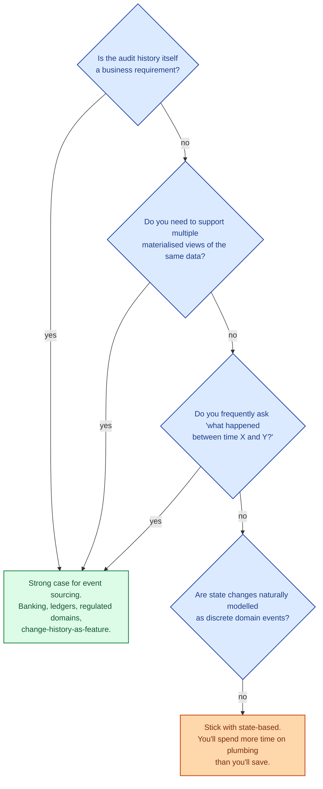
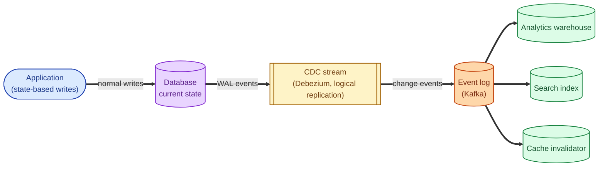

State-based persistence stores the current value: "user 42's balance is $150." Event sourcing stores every change that ever happened: "deposit $100, deposit $80, withdraw $30." The current state is just whatever you get by replaying the events. Most software is state-based. Event sourcing is the alternative architecture that turns the audit log into the source of truth. It is powerful and rare, and the reasons it stays rare are worth understanding before you reach for it.

## The same balance, two ways

Same balance, two storage philosophies. The first overwrites. The second appends. The first throws away history; the second keeps every fact.

## How an event-sourced system reads and writes

Writes append a single event. Reads either re-fold the events to get the current state, or read from a separate **projection** that someone built by folding the events ahead of time.

The append is durable and small. Projections are caches built from the log; they can be rebuilt at any time by replaying.

## What event sourcing buys you

- **Full audit trail.** Every change is a fact. You can answer "what was the balance on March 3?" by replaying up to that date.
- **Time travel.** Past state is recoverable by replaying to any point.
- **Multiple read models.** One event log can feed many projections (per-user view, analytics view, fraud view, ML features), each shaped for its own queries.
- **Easy to debug.** "Why is this number wrong?" is answered by reading the event sequence.
- **Natural integration with downstream systems.** Other services subscribe to the event stream and react.

## What event sourcing costs

- **Every read is a projection.** Current state is not where you wrote; you must build read models. CQRS naturally pairs with event sourcing for exactly this reason.
- **Schema evolution is hard.** Events live forever. Old events have old shapes. You need versioned event types and upcasters or downcasters.
- **GDPR and right-to-erasure.** An append-only log conflicts with "delete this user's data." Production systems usually combine event sourcing with a separate identifying-data store that can be redacted.
- **Operational complexity.** Replay, snapshots, schema migration, projection rebuilds. All extra moving parts.
- **Steeper learning curve.** Developers who think in CRUD have to switch to thinking in events.

## When event sourcing is the right choice

For ledgers, accounting, regulated systems, anything where "show me the history" is a feature (not a maintenance burden), event sourcing is genuinely the right shape. For CRUD-shaped business apps, it is overhead you do not need.

## The middle path: change-data-capture

Most teams want the benefits of event sourcing (audit log, downstream integration) without committing to it as the primary storage model. The pragmatic answer is **change-data-capture (CDC)**: the application writes to a state-based database as usual, and the database's write-ahead log is streamed as events to downstream consumers.

CDC gives you an event stream as a side effect of normal writes. Most production "event-driven" architectures are CDC plus a queue, not true event sourcing. That is fine; it captures most of the value with much less commitment.

## Two scenarios

**Scenario one: a payment ledger.**

Regulators require every transaction to be auditable forever. Balances must be reconstructible from the transaction history. Disputes need to know "what was the balance the moment the customer claims they had insufficient funds?" Event sourcing is genuinely the right shape. Append-only is a feature, not a workaround.

**Scenario two: a SaaS user-profile system.**

CRUD on users. Edit a name, change an avatar, update a setting. State-based is right. If you want an audit log, write to an audit table or stream changes to Kafka via CDC. Going full event-sourced for a profile system is a year of plumbing for a feature nobody asked for.

## What this connects to

- **Why use a message queue.** Event sourcing is essentially "the log is the database." See [Why use a message queue](/practice/system-design/concepts/032-why-message-queue/).
- **Kafka.** The canonical event log; Kafka was designed for this shape. See [Kafka vs RabbitMQ vs SQS](/practice/system-design/concepts/033-kafka-vs-rabbitmq-vs-sqs/).
- **Pub/sub vs queue.** Event logs are pub/sub at heart; many projections subscribe to the same stream. See [Pub/sub vs point-to-point queue](/practice/system-design/concepts/035-pubsub-vs-queue/).
- **OLTP vs OLAP.** Projections are often shaped like denormalised analytics tables. See [OLTP vs OLAP](/practice/system-design/concepts/014-oltp-vs-olap/).
- **Schema migrations.** Migrating event schemas is its own beast and not the same as migrating tables. See [Schema migrations with zero downtime](/practice/system-design/concepts/013-zero-downtime-migrations/).

## Common mistakes

- **Going event-sourced because "it sounds modern."** Years later, the team is still rebuilding projections and debating schema versions. Pick a workload that genuinely benefits.
- **Treating events as commands.** Events describe what happened; commands describe what someone wants. Mixing the two muddles your design.
- **No snapshots.** Replaying a million events to compute a balance is slow. Periodic snapshots let you start replay from a known state.
- **Mutable events.** An event is a fact about the past. If you change it, the past changes. Never. Add new events; do not edit old ones.
- **Forgetting GDPR.** Append-only conflicts with delete-on-request. Most production setups keep PII in a side store that can be redacted, leaving the event log with only references.
- **No versioning policy.** Old events shaped differently from new ones. You need a documented upcasting path, or your replays will break in mysterious ways.
- **CQRS without need.** Event sourcing usually pairs with CQRS (separate read and write models). Both add complexity. Justify each, not just one or the other.

## Quick recap

- State-based: store the current value. Default for almost everything.
- Event-sourced: store every change. Read by replaying.
- Pays off when audit, time-travel, or multi-view requirements are real.
- Costs are real: projections, schema evolution, GDPR, learning curve.
- Most "event-driven" systems are CDC, not true event sourcing — and that is usually the right pragmatic choice.

This concept sits in **Stage 5 (Distributed systems hard parts)** of the [System Design Roadmap](/practice/system-design/roadmap/).
