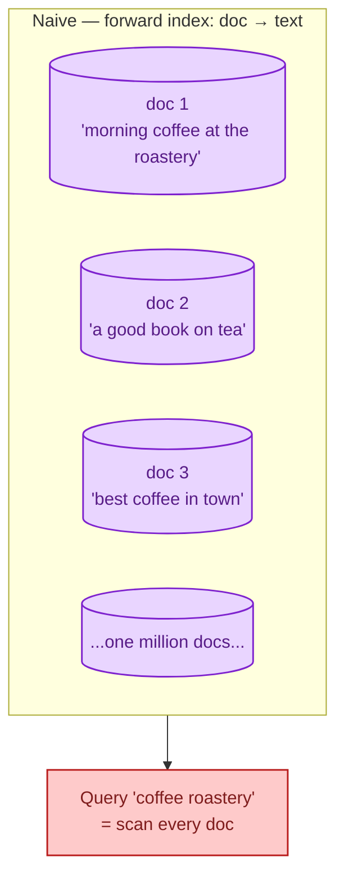
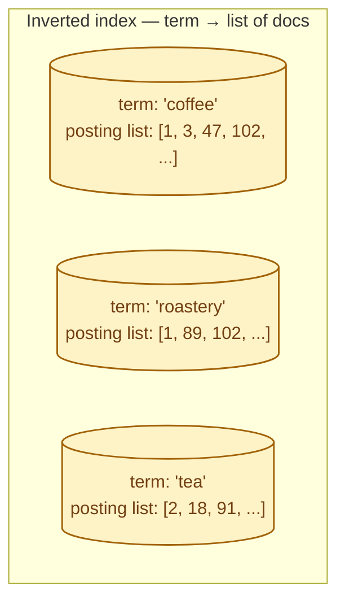
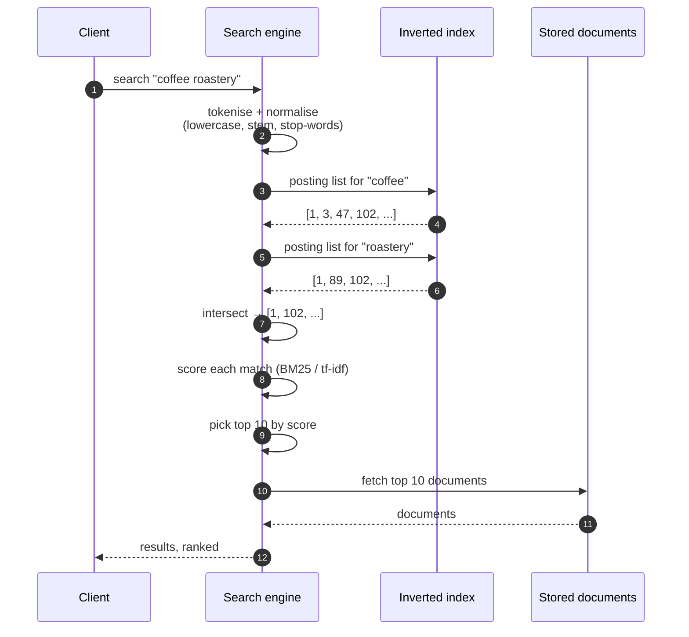
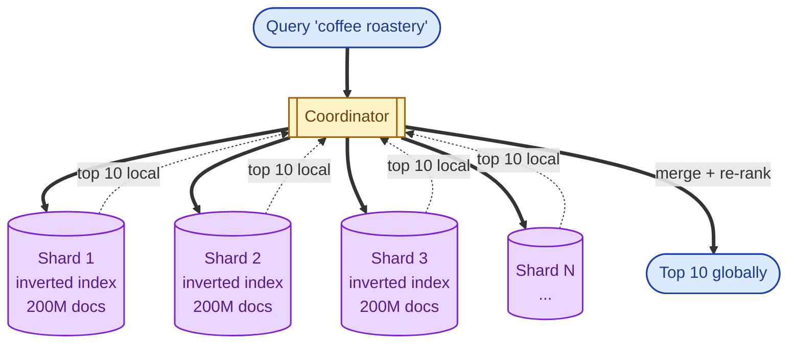

A relational database is great at "find rows where id = 7" and miserable at "find rows containing the words *coffee* and *roastery* in any order, ranked by relevance." Full-text search at scale needs a different data structure: the **inverted index**, which flips the problem on its head and stores "for each word, here are the documents that contain it." Once you have one, queries that would have scanned a billion rows answer in milliseconds. Once you have one at scale, you understand why Elasticsearch, OpenSearch, Solr, and Lucene all exist.

## The problem

Imagine a million documents. Someone searches for "coffee roastery". The naive approach is to scan every document, check whether both words appear, and return the matches. On a million documents averaging a kilobyte each, that is a gigabyte of reading per query. It does not scale.

You need a structure that lets the query jump straight to the relevant documents without touching the rest. That structure is the inverted index.

## The fix: invert the relationship

For each term, store the list of documents that contain it. That list is called a **posting list**. A search becomes "look up each query term, get the posting list, intersect or union them, rank the results."

The look-up itself is a hash lookup or a B-tree walk: microseconds. The posting lists are sorted lists of doc IDs that can be intersected efficiently. A search for "coffee roastery" intersects the two lists and gets `[1, 102, ...]`. From a billion documents you can pull a candidate set of dozens in single-digit milliseconds.

## The full query path

Three things have to be fast for this to work at scale: the posting list lookup, the intersection, and the scoring. The whole industry of search engines is, mostly, engineering each of these three things harder.

## Scoring: which result wins

A query like "coffee roastery" might match a thousand documents. The user wants the best ten at the top. Modern search engines use **BM25** (a refinement of tf-idf) to score each match.

The intuition:

- **Term frequency (tf):** more occurrences of the term in this document = higher score (with diminishing returns).
- **Inverse document frequency (idf):** rare terms count more than common ones. "Coffee" is everywhere; "roastery" is rare; a match on "roastery" should weigh more.
- **Document length normalisation:** shorter documents that match are usually better than longer ones that contain the same words diluted in noise.

You almost never tune BM25 directly. You learn that boosting certain fields (title, tags) and applying filters before scoring (only published, only this category) often matter more than score tuning.

## How this scales: sharding

A single inverted index does not fit on one machine forever. You shard it: partition the documents across N shards, each with its own inverted index. A query fans out to every shard, each returns its top K, the coordinator merges.

The latency floor is the slowest shard. Most production search clusters use **replicas per shard** so the coordinator can pick the fastest replica per shard, smoothing out tail latency. This is the architecture inside Elasticsearch, OpenSearch, Solr, and Vespa.

## Writes: indexing pipeline

Each step is a real engineering decision. Stemming makes "run", "running", "ran" the same term (helpful for English, terrible for code search). Stop-word removal saves space but loses phrase matching ("to be or not to be" becomes nothing). Custom analyzers are how you tune search for a specific domain.

## When to use full-text search

- Free-form text queries from users (product search, support tickets, content sites).
- Logs and observability: search across structured-but-noisy text.
- Faceted browsing: filter by category, brand, price, plus a text query in one query.
- "Did you mean" suggestions, typo tolerance, autocomplete.

## When **not** to use full-text search

- Exact-match key lookups. A database is faster and cheaper.
- The system of record for transactional data. Search engines have weaker consistency than databases.
- Heavy aggregations across all rows. Use OLAP, not search.
- Tiny datasets where a `LIKE` query is fast enough. Operations is the cost; do not pay it for nothing.

## What this connects to

- **Elasticsearch vs OpenSearch vs Solr.** The popular engines built on top of Lucene-style inverted indexes. See [Elasticsearch vs OpenSearch vs Solr](/practice/system-design/concepts/038-elasticsearch-vs-opensearch-vs-solr/).
- **Indexes that help and hurt.** Database indexes are a different beast but related thinking. See [Indexes that help, indexes that hurt](/practice/system-design/concepts/010-indexes-help-and-hurt/).
- **Sharding strategies.** Shard-and-scatter is the same pattern. See [Sharding strategies](/practice/system-design/concepts/012-sharding-strategies/).
- **OLTP vs OLAP.** Search is a separate workload from both, with its own engine. See [OLTP vs OLAP](/practice/system-design/concepts/014-oltp-vs-olap/).

## Common mistakes

- **Using the database `LIKE '%coffee%'` at scale.** Sequential scan on a wildcard prefix. Performance falls off a cliff in a year.
- **Indexing everything.** Larger index, slower writes, more disk, no actual benefit. Index the fields you search; store the rest.
- **Wrong analyzer.** Stemming for product SKUs ruins exact matches. Pick analyzers per field, not per language.
- **No replicas.** A single failed shard kills a query. Replicate.
- **Treating the search engine as the source of truth.** Search engines have weaker durability and consistency than databases. Keep the primary store separate; rebuild the search index from it.
- **Ignoring relevance feedback.** If the top result is rarely clicked, your ranking is wrong. Measure click-through, refine the boosts.

## Quick recap

- Forward index: doc → text. Naive, does not scale.
- Inverted index: term → posting list of docs. The whole field.
- Query: look up postings, intersect, score, rank, fetch.
- Sharding scales out; replicas hide tail latency.
- The relevance work (analyzers, boosting, BM25 tuning) is the part that takes years to get right.

This concept sits in **Stage 4 (Scaling and reliability)** of the [System Design Roadmap](/practice/system-design/roadmap/).
