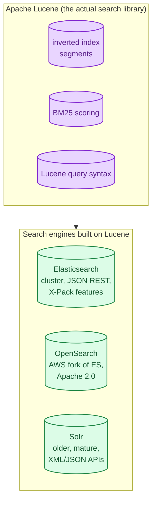
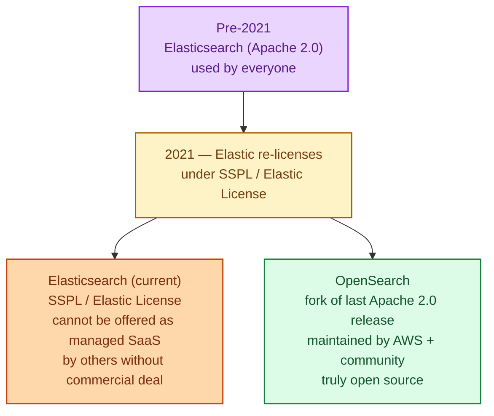
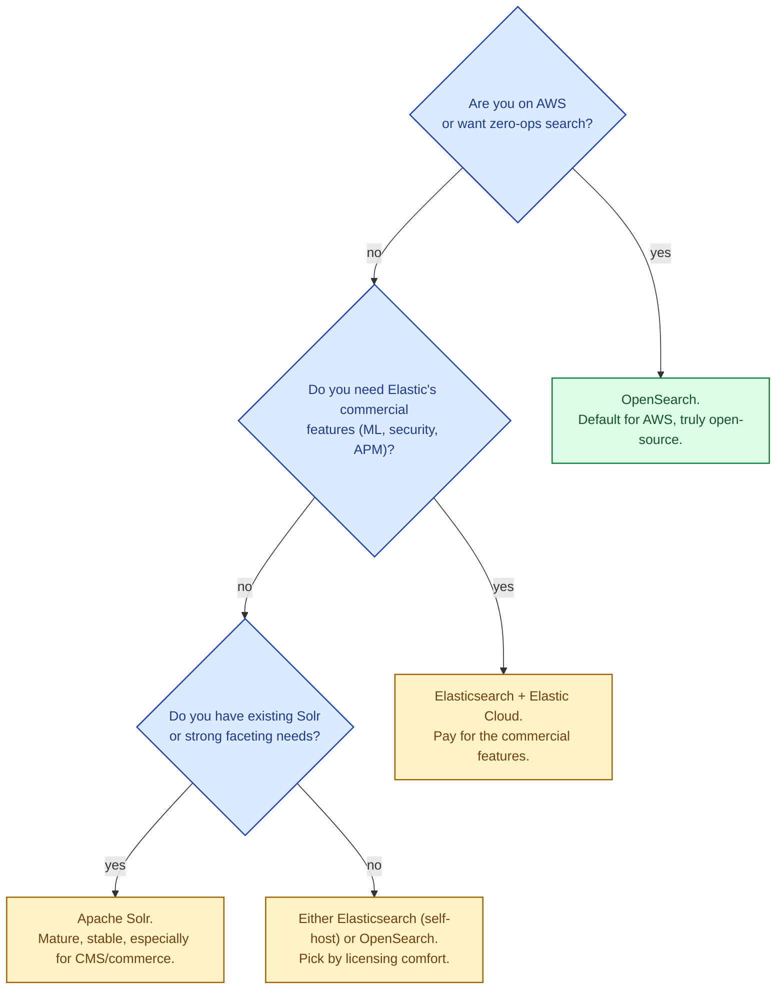

All three are search engines built on top of Apache Lucene. They all do inverted indexes, sharded clusters, BM25 ranking, faceting, and aggregations. The differences that matter today are licensing (because of a real fork in 2021), operations model (managed vs self-hosted), and the ecosystem around each. This is one of those decisions where the technology is similar but the surrounding choice (license, vendor, integration story) is what drives the answer.

## The shared core: Lucene

All three engines wrap Apache Lucene, the Java library that implements the actual inverted index, segment management, and Lucene query language. Lucene is doing the heavy lifting; the engines wrap it with clustering, REST APIs, security, and tooling.

Pick the engine, not the algorithm. The search quality differences between them are small; the operational and licensing differences are not.

## The 2021 fork: Elastic license vs OpenSearch

Elasticsearch was Apache 2.0 (fully open source) until 2021. Elastic, the company, then re-licensed it under the **Elastic License (SSPL/Elastic License v2)** that restricts running Elasticsearch as a managed service for others. AWS, which sold "Amazon Elasticsearch Service," forked the last Apache 2.0 release and called it **OpenSearch**.

Since the fork, the two have diverged:

This single fact drives most platform decisions today. If you run on AWS, OpenSearch is the default. If you run Elastic Cloud or you want Elastic's commercial features (Machine Learning, Security, APM), you stay on Elasticsearch.

## What each is best at today

### Elasticsearch

The original, still the most feature-rich, still the most popular outside AWS.

- Best for: anything where you want the latest features, Elastic Cloud, the Elastic Stack (Kibana, Logstash, Beats, APM), and you are okay with the licensing.
- Strengths: Mature observability stack (ELK), great UI in Kibana, advanced ML and security features in commercial tier.
- Caveats: Licensing concerns if you want to offer it as a service to others. Some features (security, alerting) are commercial-only in the standard distribution.

### OpenSearch

The Apache 2.0 fork, maintained by AWS and a growing community.

- Best for: anyone on AWS (Amazon OpenSearch Service is the managed offering), anyone who wants truly open-source licensing, anyone allergic to vendor lock-in.
- Strengths: True Apache 2.0. Security and alerting bundled free. Strong AWS integration. Community is healthy and growing.
- Caveats: Slightly behind Elasticsearch on cutting-edge features (machine learning, some advanced aggregations). Tooling outside AWS is catching up but is smaller.

### Apache Solr

The other Lucene-based engine, older than Elasticsearch, mature, less hyped, still excellent.

- Best for: content platforms (CMSes), e-commerce search (Solr's faceting story is excellent), enterprises with existing Solr deployments, anyone who values stability over novelty.
- Strengths: Battle-tested. SolrCloud handles distribution. Strong faceting and filtering. Permissively licensed (Apache 2.0).
- Caveats: Less momentum than Elasticsearch / OpenSearch in the cloud era. Smaller community today. The ELK stack ecosystem effectively monopolises observability use cases.

## The picker

For most new projects today: **OpenSearch on AWS** or **Elasticsearch on Elastic Cloud**. Solr is the right answer for specific enterprise and commerce use cases. Self-hosting any of them is a real ops commitment; managed offerings exist for a reason.

## Two scenarios

**Scenario one: a SaaS application running entirely in AWS.**

Use Amazon OpenSearch Service. It is managed, fully open-source, integrated with IAM, CloudWatch, and Lambda. Migrating away later is straightforward (the API is Elasticsearch-compatible up to a point). Total operational cost: very low.

**Scenario two: an e-commerce site with faceted product search and existing Solr expertise.**

Solr is genuinely the right tool. Its facet and filter capabilities are excellent for catalog browsing. The team already knows it. The community is smaller than Elasticsearch's, but the engine is rock-solid and you save the migration cost.

## What this connects to

- **Search at scale.** The underlying mechanism all three engines implement. See [Search at scale: inverted indexes](/practice/system-design/concepts/037-search-at-scale/).
- **Sharding strategies.** All three shard the same way. See [Sharding strategies](/practice/system-design/concepts/012-sharding-strategies/).
- **OLTP vs OLAP.** Search is its own workload, neither pure OLTP nor pure OLAP. See [OLTP vs OLAP](/practice/system-design/concepts/014-oltp-vs-olap/).
- **CDC.** Search indexes are usually populated from a primary database via change-data-capture. See [Event sourcing vs state-based persistence](/practice/system-design/concepts/036-event-sourcing/).

## Common mistakes

- **Picking Elasticsearch for SaaS-on-AWS without reading the license.** You may have signed up for a commercial contract you did not need.
- **Treating any of them as a primary database.** Search engines have weaker durability and consistency. Keep the source of truth in a database; rebuild the search index from it.
- **Underestimating the operational cost.** Self-hosting an Elastic / OpenSearch cluster at any real scale is a full-time job (capacity planning, snapshots, rolling upgrades, security patches). Managed offerings often pay for themselves.
- **Mixing dev and prod traffic on one cluster.** Heavy aggregations from a dev environment can starve production search. Separate clusters or use per-tenant resource isolation.
- **Default shard counts forever.** Both ES and OpenSearch default to small shard counts. They are tuned for getting started, not for production. Plan shard sizing per index.
- **Ignoring index lifecycle management.** Search indexes grow forever if you let them. Use index rollover and retention policies.

## Quick recap

- All three are Lucene-based search engines with similar core capabilities.
- Elasticsearch: most popular, restrictive license since 2021, strong commercial tier.
- OpenSearch: Apache 2.0 fork of Elasticsearch, default on AWS, growing community.
- Solr: older but mature, excellent for faceted browsing and enterprise commerce.
- The choice is driven by licensing, vendor, and ecosystem more than by raw capability.

This concept sits in **Stage 4 (Scaling and reliability)** of the [System Design Roadmap](/practice/system-design/roadmap/).
