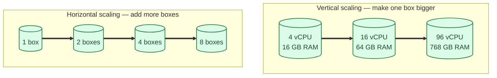
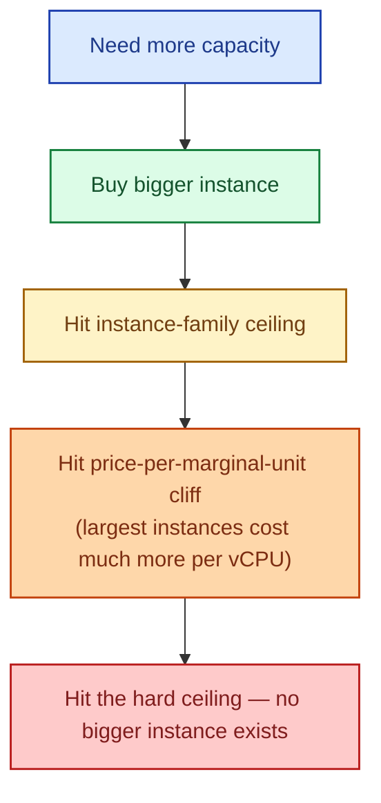
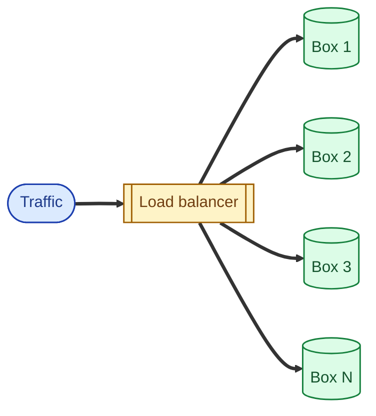
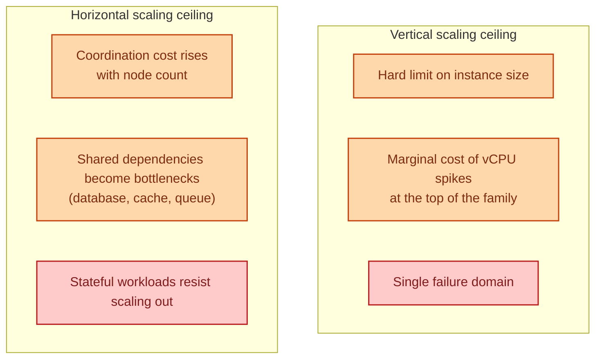

Vertical scaling makes the box bigger: more CPU, more memory, faster disk. Horizontal scaling adds more boxes. Both work. They have completely different ceilings, different costs, and different failure modes. The trick is knowing which one you are actually hitting the wall on, because the right answer is often "do both, in this order, for this reason."

## The picture

Same goal (more capacity), two completely different shapes. Vertical scales one node; horizontal multiplies nodes.

## Vertical scaling: easy until it isn't

Buy a bigger machine. Move the workload to it. Done.

- No code changes. The application thinks it is still on one box.
- No coordination problems. The database is the database.
- No new failure modes. Same single point of failure as before.

That last point is the catch. A bigger machine is still **one** machine. If it dies, everything is down. And there is a ceiling: the biggest cloud instance has a maximum, and beyond it you cannot pay for more, no matter the budget.

Vertical scaling is great while it works. The marginal cost climbs sharply at the high end (the biggest instances cost 3x what their size suggests). And there is no answer to "the biggest box is not big enough."

## Horizontal scaling: cheap per box, complicated overall

Add more boxes, route traffic across them. Capacity is now roughly N times one box.

- Capacity scales near-linearly with box count (within reason).
- A single box dying is a non-event; others absorb its load.
- You can grow and shrink with traffic.

But there is a tax:

- You need a load balancer in front. See [Load balancer: why, how, when](/practice/system-design/concepts/028-load-balancer-basics/).
- The service has to be stateless, or you need shared state. See [Stateless vs stateful services](/practice/system-design/concepts/040-stateless-vs-stateful/).
- Coordination problems appear (cache invalidation across nodes, distributed locks, leader election).
- Observability gets harder. "Which box served this request?" becomes a real question.

## Where each one falls over

Vertical hits a hardware ceiling. Horizontal hits a coordination ceiling. Most production systems use both: vertical for the database (until you have to shard), horizontal for the stateless layers (application servers, workers).

## The right order

For 95% of systems:

1. **Build stateless services.** Even at one instance, design for many. Externalise state to a database or cache. See [Stateless vs stateful services](/practice/system-design/concepts/040-stateless-vs-stateful/).
2. **Vertical-scale the database** until it hurts. Modern Postgres on a serious machine handles workloads people would have called "web-scale" ten years ago.
3. **Horizontal-scale the application layer** as soon as traffic justifies more than one instance.
4. **Add read replicas** when reads dominate. See [Read replicas](/practice/system-design/concepts/011-read-replicas/).
5. **Shard the database** only when the primary truly can't keep up. See [Sharding strategies](/practice/system-design/concepts/012-sharding-strategies/).

Skipping step 1 makes everything else harder. Jumping to step 5 too early adds operational complexity for a problem that did not need solving yet.

## Two scenarios

**Scenario one: a SaaS app at 100k users.**

One m5.2xlarge Postgres handles everything. The application runs on three m5.large boxes behind an ALB. Traffic doubles? Add three more application boxes (horizontal). Database hot? Move to m5.4xlarge (vertical). No sharding. No microservices. The team focuses on product.

**Scenario two: a real-time bidding platform at 50,000 QPS.**

Vertical scaling at the application layer is a non-starter; one box cannot do that throughput. Horizontal everything: hundreds of stateless boxes behind a high-capacity LB. The database is sharded by partner ID. Caching is distributed (Redis cluster). State lives in shared stores, never on the boxes. This is what horizontal scaling unlocks; you cannot get here vertically.

## What this connects to

- **Stateless vs stateful services.** The precondition for horizontal scaling. See [Stateless vs stateful services](/practice/system-design/concepts/040-stateless-vs-stateful/).
- **Load balancers.** Required for horizontal anything-with-traffic. See [Load balancer: why, how, when](/practice/system-design/concepts/028-load-balancer-basics/).
- **Read replicas.** Vertical-scale's cheap cousin: more read capacity without sharding. See [Read replicas](/practice/system-design/concepts/011-read-replicas/).
- **Sharding strategies.** The final horizontal move for a database. See [Sharding strategies](/practice/system-design/concepts/012-sharding-strategies/).
- **CAP theorem.** Horizontal scaling introduces partitions, which forces consistency trade-offs. See [CAP theorem](/practice/system-design/concepts/016-cap-theorem/).

## Common mistakes

- **Jumping to horizontal scaling too early.** Three nodes when one would do means three times the operational surface for the same throughput.
- **Vertical-scaling forever without a plan.** The cliff at the top of the instance family is real. Have a horizontal story before you need it.
- **Horizontal-scaling a stateful service.** Without externalised state, more nodes means more pinned users, more sticky sessions, more failure modes. See [Sticky sessions](/practice/system-design/concepts/031-sticky-sessions/).
- **Forgetting the database's shared-dependency problem.** Ten application servers all talking to one Postgres just moves the bottleneck. Pool connections; read from replicas; shard when necessary.
- **Measuring throughput, ignoring tail latency.** Adding nodes raises throughput but does not lower p99 unless the per-request slowness is also fixed.

## Quick recap

- Vertical: bigger box, no code change, single failure domain, hard ceiling.
- Horizontal: more boxes, near-linear capacity, coordination tax, requires statelessness.
- Real systems use both. Default order: stateless code → vertical DB → horizontal app → replicas → shards.
- The right answer is rarely "all horizontal" or "all vertical." It is "which bottleneck am I actually hitting right now?"

This concept sits in **Stage 4 (Scaling and reliability)** of the [System Design Roadmap](/practice/system-design/roadmap/).
