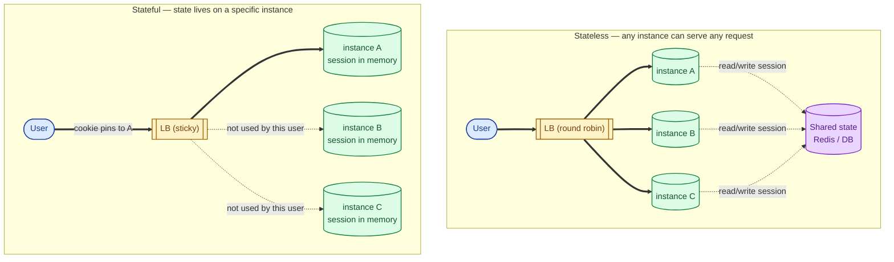
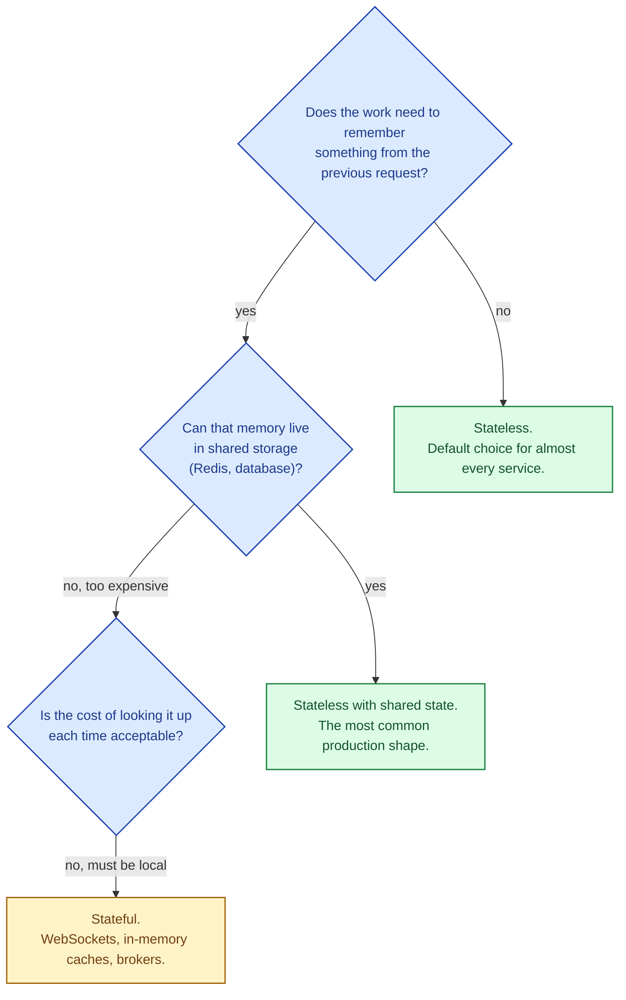

A stateless service forgets the user the moment the response goes out. Anything the next request needs has to come back in the request itself or be looked up from somewhere shared. A stateful service remembers between requests by keeping data in its own memory or on its own disk. Stateless is the default for almost every modern web service, because it scales trivially. Stateful is sometimes unavoidable, and the pain it causes is the reason "make it stateless" is one of the first refactors any growing system goes through.

## The shape of each

In the stateless world, every instance is identical and interchangeable. In the stateful world, every user has "their" instance, and losing that instance loses their state.

## Why stateless scales so well

- **Add a node, get capacity.** No warm-up, no pinning, no rebalancing. The load balancer starts sending requests; the new node serves them.
- **Lose a node, lose nothing.** The other nodes have all the same code and reach the same state stores. Users do not notice.
- **Rolling deploys are easy.** Take one node out, redeploy, return. Repeat. No session loss.
- **Autoscaling works.** Scale up during a spike; scale down at night. No drama.
- **Crashes are recoverable.** Restart the service; everything keeps working.

The cost is that every request pays for state lookup somewhere else. A read from Redis is 0.5 ms; a read from a database is a few milliseconds. That cost adds up at scale, which is why distributed caches exist.

## Why stateful is sometimes the only honest answer

Some workloads have state by their nature:

- **WebSockets and long-lived TCP connections.** The connection is, by definition, pinned to one process. You cannot pretend it is stateless.
- **In-process caches that take minutes to warm.** Throwing away the cache on every request is too expensive.
- **In-memory ML feature lookups, embedding tables, sketches.** Built up over time, expensive to rebuild.
- **Databases, message brokers, search engines.** These are the canonical stateful services. They scale through replication and sharding, not by being stateless.

For a typical web application, the answer is almost always "stateless with shared state". Most state is small enough that a Redis or a database lookup per request is cheap, and the operational simplicity is worth far more than the few milliseconds of latency.

## The migration most teams do

A monolith starts stateful. Sessions in process memory, in-memory caches, file uploads on local disk. It works fine until the second instance shows up. Then:

1. **Move sessions to Redis.** First step is also the highest-impact. Stickiness disappears.
2. **Move uploads to object storage.** No more "this file lives on box 7." S3, GCS, or Azure Blob.
3. **Move caches to a shared cache.** App-instance caches are replaced by Redis or Memcached.
4. **Move file-based processing to queues.** A worker reads from a queue instead of from a local watch.

By the time you finish, the service is fully stateless and any instance can handle any request. From here, horizontal scaling, rolling deploys, autoscaling, and disaster recovery all become routine.

## What this connects to

- **Horizontal vs vertical scaling.** Stateless is the precondition for cheap horizontal scaling. See [Horizontal vs vertical scaling](/practice/system-design/concepts/039-horizontal-vs-vertical/).
- **Sticky sessions.** What you reach for when the service is stateful and you have not externalised state yet. See [Sticky sessions](/practice/system-design/concepts/031-sticky-sessions/).
- **Caching.** Shared caches are how you make a stateless service feel fast. See [Why cache and what to cache](/practice/system-design/concepts/023-why-cache-what-cache/).
- **Microservices vs monolith.** Stateless services compose into microservices much more easily. See [Microservices vs monolith](/practice/system-design/concepts/041-microservices-vs-monolith/).

## Common mistakes

- **In-memory sessions in production.** Works for one box. Breaks the moment you add a second.
- **Local file storage on application servers.** A box dies and the files are gone. Use object storage from day one.
- **Stateful caches that take 10 minutes to warm.** A rolling deploy now causes a 10-minute latency hit per instance. Either accept it explicitly or warm caches from a shared source.
- **Pretending WebSockets are stateless.** They are not. Plan for the connection-pinning reality (graceful drain, reconnection).
- **Storing state on autoscaled instances.** Autoscaling assumes interchangeability. Stateful + autoscaled is a recipe for lost data.
- **Reaching for sticky sessions instead of fixing state.** Stickiness is a bridge, not a destination.

## Quick recap

- Stateless: any instance handles any request. Trivial to scale, deploy, and replace.
- Stateful: state lives on a specific instance. Necessary for some workloads (WebSockets, brokers, databases) but a liability for typical web services.
- The pragmatic shape is "stateless services + shared state stores (Redis, DB, object storage)."
- The migration from stateful to stateless is one of the first investments any growing system makes, and the one that pays off the most.

This concept sits in **Stage 4 (Scaling and reliability)** of the [System Design Roadmap](/practice/system-design/roadmap/).
