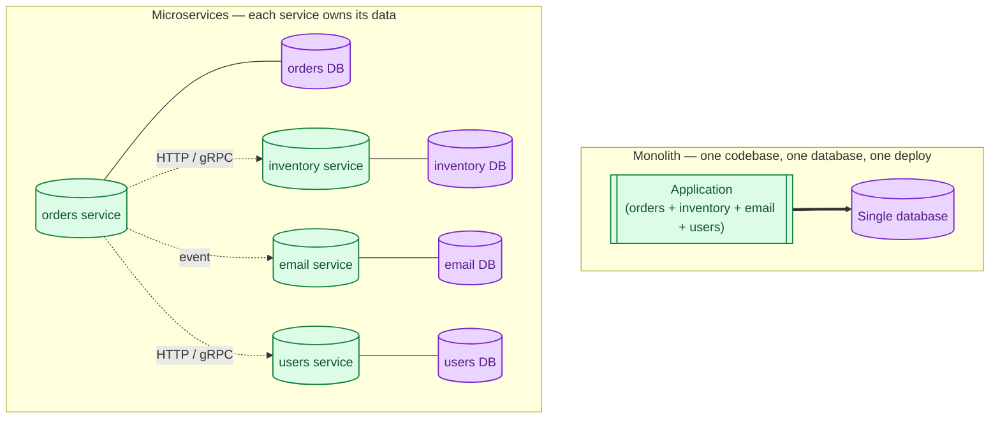
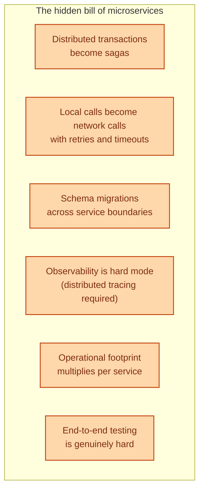
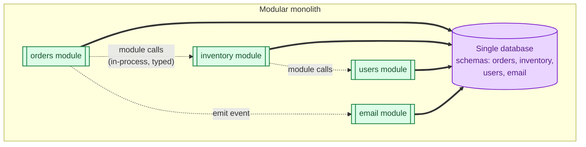

A monolith is one deployable unit with one codebase and one database. Microservices split that into many independently deployable services, each with its own database and its own team. The big mistake of the 2010s was treating microservices as a technical superpower. The big lesson of the 2020s is that microservices solve organisational problems first and technical problems second. They have real costs that only pay off once you have specific problems a monolith genuinely cannot solve.

## What each shape looks like

The diagram tells the story. A monolith is one box. Microservices are many small boxes connected by network calls and events, each with its own data.

## What a monolith is genuinely good at

- **One deploy, one log file, one debugger.** Stack traces span the whole flow. Local development is "run the app."
- **Database transactions across modules.** Need to update orders and inventory atomically? `BEGIN`, do both, `COMMIT`. Done.
- **Cheap refactors.** Move a function, rename a class. The compiler tells you what broke.
- **Easy to staff.** One repo, one CI pipeline, one onboarding. Two engineers can ship features in their first week.

For a team of fewer than ~20 engineers, a monolith is almost always the right shape. The Shopify and GitHub stories of "monolith at hundreds of engineers" are real. Monolithic does not mean small.

## What microservices solve

Microservices pay off when you have one or more of these problems, and a monolith genuinely makes them worse:

- **Many teams stepping on each other's deploys.** A microservice per team lets each ship on its own cadence.
- **Different scaling profiles.** The video-encoding service needs 100 GPU boxes; the user-profile service needs 3 small ones. Different scaling per service is hard in a monolith.
- **Different technology needs.** ML pipeline in Python, billing in Go, frontend BFF in Node. Forcing one stack on everyone is sometimes the worse trade-off.
- **Independent reliability tiers.** The marketing pages should never be able to take down checkout.
- **Independent fault domains.** A memory leak in the chat module should not crash payments.

If none of these problems are real for you, microservices are buying solutions for problems you do not have, and paying real money for them.

## What microservices cost

Each of these is a tax you pay forever. The benefits had better be worth it. For a team of 8 building a CRUD app, they almost never are. For a team of 800 building Amazon, they obviously are.

## The middle path: the modular monolith

Most growing systems do not need to choose. The modular monolith keeps the monolith's deployment simplicity while enforcing internal boundaries: clearly-owned modules, dependency rules between them, per-module migrations. If a module later needs to become its own service, the seams are already there.

You still have one deploy, one log, one transaction. But internally, the code is structured so that "extracting orders into its own service" is a finite refactor instead of a year-long project. This is what Shopify, GitHub, and Stack Overflow do at scale; this is what most teams should do at any scale.

## When to split (the honest signals)

- A single module reaches a different reliability tier than the rest (payments, search, video).
- A team genuinely owns a clear domain and is slowed down by everyone else's deploys.
- A specific module needs a radically different scaling or tech profile (ML, video, real-time).
- The database schema is being torn apart by competing teams and the boundaries are now blurry beyond repair.

If none of these signals is present, splitting is premature.

## Two scenarios

**Scenario one: a SaaS app at 20 engineers, 500k users.**

One Rails or Django or Spring monolith, one Postgres, behind a load balancer. Six well-defined modules inside. Pull requests get reviewed quickly, the team ships every day. Microservices would 10x the operational complexity for zero customer-visible benefit. This is the modal correct answer for most companies.

**Scenario two: a platform at 200 engineers, video uploads at scale.**

Some real signals: the upload-encoding pipeline needs GPUs and Python; the payments team needs to ship on its own audited cadence; the marketing-page team breaks builds twice a week. Splitting starts to pay off: extract encoding, extract payments, extract the marketing CMS. Each split is justified by a specific pain. The remaining monolith is fine; it does not all need to be services.

## What this connects to

- **Stateless vs stateful services.** Microservices that share state are not really microservices. See [Stateless vs stateful services](/practice/system-design/concepts/040-stateless-vs-stateful/).
- **Two-phase commit vs sagas.** A monolith's cross-module transactions become sagas across services. See [Two-phase commit vs sagas](/practice/system-design/concepts/020-2pc-vs-sagas/).
- **Why use a message queue.** Inter-service communication is almost always queues plus HTTP. See [Why use a message queue](/practice/system-design/concepts/032-why-message-queue/).
- **Observability.** Distributed tracing becomes necessary, not optional. See [Observability: metrics, logs, traces](/practice/system-design/concepts/056-observability-metrics-logs-traces/).
- **API versioning.** Service boundaries become contracts you cannot break casually. See [API versioning strategies](/practice/system-design/concepts/060-api-versioning/).

## Common mistakes

- **Microservices for "best practices."** No specific problem is being solved; you are just paying the operational tax.
- **Splitting a small team across many services.** Each service ends up half-maintained.
- **Distributed monolith.** Many services that have to be deployed together to work. The worst of both worlds.
- **A database per service in name only.** If five services share one database, you have one service in five processes, not five services.
- **Skipping the modular monolith step.** Going straight from "messy monolith" to "messy microservices" multiplies the mess instead of cleaning it up.
- **Treating "microservices" as a binary.** Most production systems are "a small number of services, each substantial." Not "fifty tiny services."

## Quick recap

- Monolith: one codebase, one database, one deploy. Cheap, fast, perfectly fine at significant scale.
- Microservices: independent services for independent teams or wildly different scaling needs. Real benefits, real ongoing cost.
- Modular monolith: most teams' actual best answer. Keep one deploy, enforce internal boundaries, extract later if needed.
- The question is not "is this trendy?" It is "what specific problem is the split solving?"

This concept sits in **Stage 4 (Scaling and reliability)** of the [System Design Roadmap](/practice/system-design/roadmap/).
