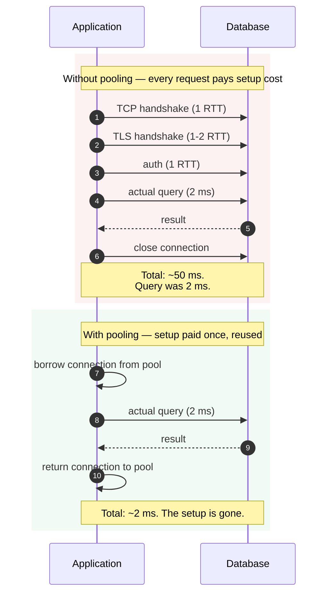
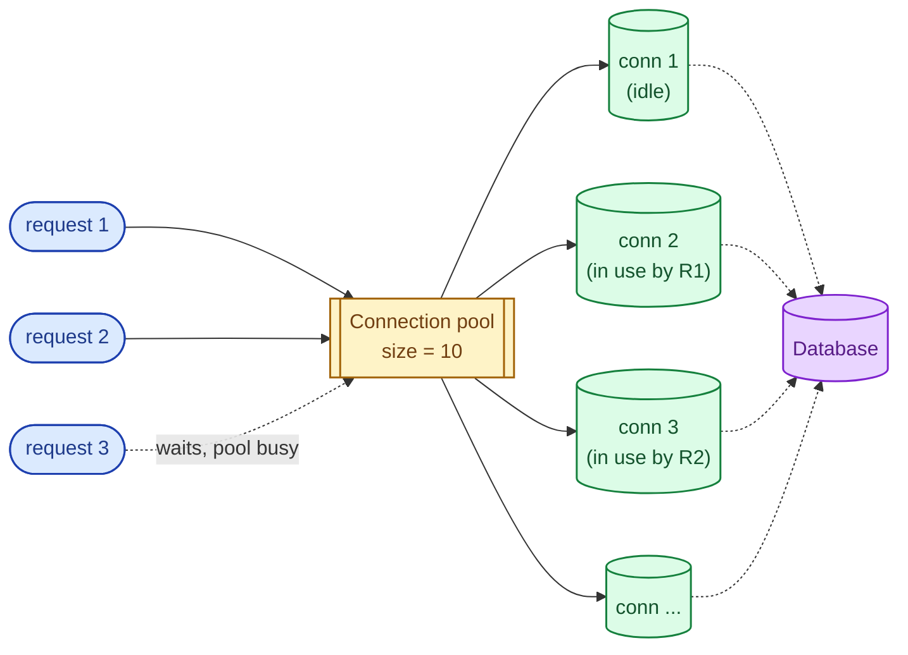
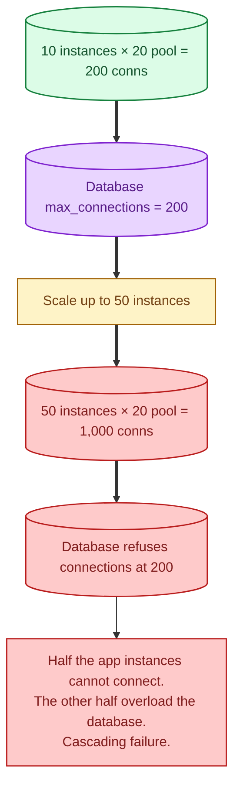
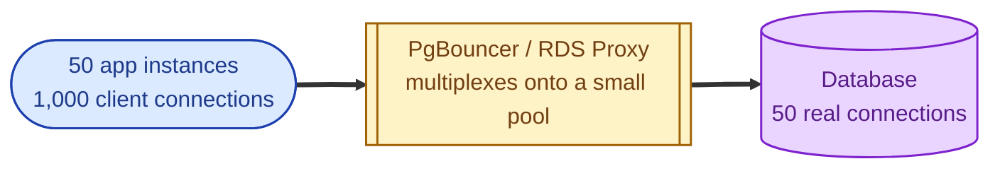

Opening a database connection is expensive. Doing it on every request is a famous performance bug. The fix is a connection pool: a small set of pre-opened connections that the application borrows, uses, and returns. It is a tiny piece of infrastructure that fixes a huge class of problems and creates one specific outage pattern that bites every team eventually.

## Why opening a connection is expensive

A Postgres connection costs roughly:

- TCP handshake (1 RTT)
- TLS handshake (1-2 RTTs if TLS)
- Authentication (1 RTT for the password exchange)
- Backend process startup on the database (memory, parser, plan cache)

Total: tens to low-hundreds of milliseconds, depending on network and database. The actual query that follows might take 2 ms. The setup is 50x the work.

The first time someone profiles a slow endpoint and discovers "the database call is fast but the connection setup eats 50 ms", connection pooling becomes obvious.

## How a connection pool works

The application starts up. It opens N connections to the database and holds them. When a request comes in, the code asks the pool for a connection. The pool hands one over. The request runs its query. When done, the connection goes back to the pool, not back to the database.

If all connections are in use, the new request waits for one to come back. This is the central trade-off: the pool size caps your concurrency at the database, and waiting is the alternative to overloading the database.

## Sizing the pool

The first instinct is "make the pool huge." The result is "we hit the database's max_connections limit, and now everything fails." Databases have a per-server connection limit, and each connection costs the database memory (roughly 10 MB each in Postgres). You cannot just keep adding.

A useful rule of thumb: aim for a pool small enough that **total connections (pool size × number of app instances) is well below the database's max_connections**. For a 100-connection Postgres, 10 app instances each with a pool of 5 is fine. Each instance with a pool of 50 is asking for an outage.

## The failure mode every team eventually hits

You scale up the application from 10 instances to 50 during a launch. Each instance has a pool of 20 connections. The math says 1,000 connections. The database is configured for 200. Half the new instances cannot connect; the others starve the database. Errors cascade.

The fix: an **external connection pooler** (PgBouncer, RDS Proxy, ProxySQL) that sits between the application and the database. The pooler holds the small number of real database connections; the application talks to the pooler with as many connections as it wants. The pooler multiplexes.

This single change resolves most "we ran out of database connections" outages forever.

## Other things pools have to handle

- **Stale connections.** A connection that has been idle for hours may have been killed by the database, a firewall, or a load balancer. The pool needs to test or recycle them.
- **Connection age.** Long-running connections accumulate state; rotating them prevents quiet memory growth and helps roll out certificate changes.
- **Timeouts.** When all connections are busy, how long does a caller wait before giving up? Without a timeout, request threads pile up and the app falls over.
- **Validation on borrow.** Some pools test the connection ("SELECT 1") before handing it out, which catches dead ones at borrow time at a small cost.

## When you do not need a pool

- Serverless functions with very low concurrency and short lifetimes. Each invocation may genuinely need its own connection; the pool buys nothing.
- A single script that runs once and exits.
- A workload that opens a connection, streams for hours, and never lets go. The "connection" is the application here.

For everything else (any persistent server with even modest traffic), a pool is mandatory and is usually built into the framework.

## What this connects to

- **Horizontal scaling.** Pools matter because every instance opens its own. See [Horizontal vs vertical scaling](/practice/system-design/concepts/039-horizontal-vs-vertical/).
- **Sharding strategies.** Sharded databases have per-shard connection budgets; pooling math gets harder. See [Sharding strategies](/practice/system-design/concepts/012-sharding-strategies/).
- **Read replicas.** Each replica has its own connection limit; the pool needs to know which connections go where. See [Read replicas](/practice/system-design/concepts/011-read-replicas/).
- **Bulkheads.** A pool per critical path prevents one slow downstream from starving the whole app. See [Bulkheads and rate limiting](/practice/system-design/concepts/047-bulkheads-and-rate-limiting/).

## Common mistakes

- **No pool at all.** Every request opens its own connection. p99 latency is dominated by handshakes.
- **Pool size too large.** Multiplied across instances, you exhaust the database's limit and outage cascades.
- **Pool size too small.** Requests queue forever waiting for a connection. p99 latency spikes; users see timeouts.
- **No timeout on borrow.** A starved pool turns every request into an indefinite hang.
- **Ignoring the database's max_connections.** Always do the math: app instances × pool size < db max_connections (with margin).
- **No external pooler at scale.** Once you have many app instances, the per-instance pool stops being enough. PgBouncer or equivalent is mandatory.
- **Treating pool exhaustion as a "pool too small" problem.** Sometimes the real problem is slow queries holding connections too long. Fix the queries; do not just grow the pool.

## Quick recap

- Connections are expensive to open. Reuse them via a pool.
- Pool size is bounded by the database's connection limit divided across instances.
- At scale, put PgBouncer or RDS Proxy in front; multiplex thousands of client connections onto a small real pool.
- Always set a borrow timeout and recycle stale connections.
- A misconfigured pool is the single most common cause of "the database went down" mysteries during launches.

This concept sits in **Stage 4 (Scaling and reliability)** of the [System Design Roadmap](/practice/system-design/roadmap/).
