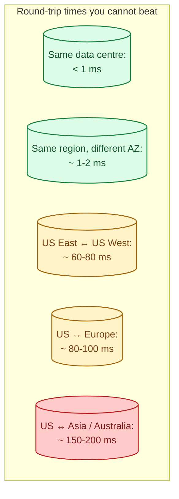
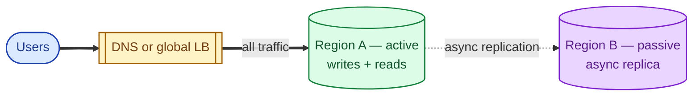
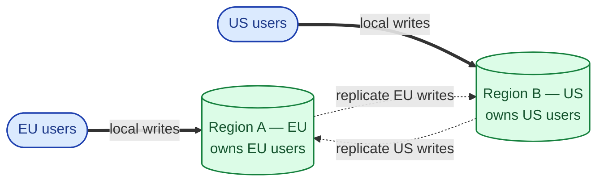
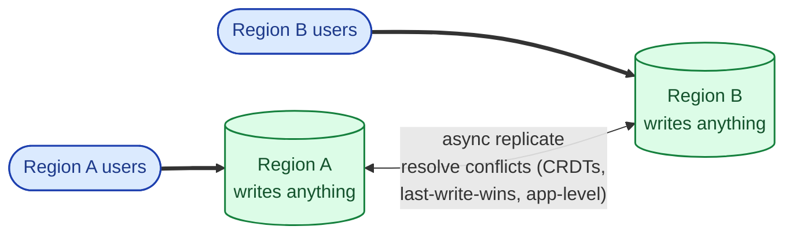
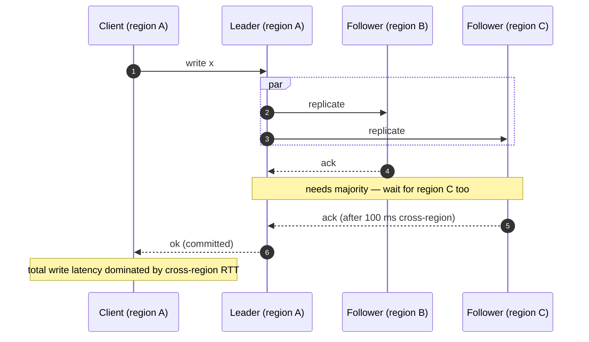

Running in one region is simple. Running in two or more is a different system. The reasons you want multi-region (lower latency for global users, disaster recovery, regulatory data locality) are clear. The cost is not, and the surprise is always the same: writes across regions are slow and consistent writes across regions are very slow. The senior question is "which workloads need cross-region writes at all?" because the honest answer is usually "fewer than you think."

## Why distance is the enemy

Light in a fibre travels around 200,000 km/s. A round trip from Sydney to London is around 17,000 km each way. Even with perfect routing, that is 170 ms of pure physics, before any software runs.

A synchronous write that has to be acknowledged in another region pays this round-trip on every commit. A user in Sydney waiting on a write to London is waiting on speed of light.

## Three multi-region topologies

### Active-passive (the easiest)

One region serves all traffic. The other is a warm standby, replicated to asynchronously. If the active region dies, traffic fails over to the standby.

**Strength.** Simple. No cross-region write coordination. One source of truth.

**Weakness.** The passive region is idle hardware. Failover is non-zero (minutes to switch DNS and warm caches). You may lose the last few seconds of writes if replication is async.

This is the right default for almost every team's first multi-region deployment.

### Active-active with regional ownership

Both regions serve traffic. Each region owns a slice of the data (by user, by tenant, by geography). Users in Europe write to the European region; users in the US write to the US region. The two regions sync but rarely write to the same row.

**Strength.** Both regions are hot. Users get local-latency writes. No idle hardware.

**Weakness.** Requires data ownership boundaries (which user lives where). Cross-region writes (a user moves regions, a single transaction touches both partitions) are still slow.

This is the shape Spotify, Slack, and many SaaS products use. Routing is by user or tenant; conflicts are rare because each row has a clear home region.

### Active-active everywhere (the hardest)

Both regions can write to anything. Writes propagate; conflicts are detected and resolved.

**Strength.** Fully redundant. Maximum availability. Any region can serve any user.

**Weakness.** Conflict resolution is hard. Two regions can both write to the same row in the same second; the system has to merge or pick a winner. This is where you reach for CRDTs, vector clocks (see [Time, clocks, and ordering](/practice/system-design/concepts/022-time-clocks-ordering/)), or accept "last write wins" and the data loss it implies.

Used by: globally-distributed databases (CockroachDB, Spanner, YugabyteDB) and DNS-style systems where conflicts are rare.

## Strong consistency across regions

If you genuinely need strongly consistent writes across regions (Spanner-style), the cost is paid on every write: the system runs a consensus protocol that requires a majority of voters to acknowledge, and at least one voter is in a far region. Every write eats one cross-region round-trip.

For payments and ledgers where correctness matters more than speed, this is the right cost. For everything else, it is unacceptable.

## What you actually need it for

- **Disaster recovery.** A regional outage should not take you down. Active-passive at minimum.
- **Regulatory data residency.** GDPR, India's DPDPA, China's PIPL. Some data **must** live in specific regions.
- **Global low-latency reads.** A user 200 ms away from your origin will feel slow. CDN handles much of this; multi-region handles the rest (see [CDN](/practice/system-design/concepts/027-cdn-when-you-need-it/)).
- **Capacity.** Some workloads genuinely outgrow a single region's quota.

## Three scenarios

**Scenario one: a SaaS app with mostly US users.**

Active-passive. Primary in us-east-1, warm standby in us-west-2. Failover plan is documented and rehearsed quarterly. RPO of a few seconds (async replication), RTO of 15 minutes (DNS + cache warm). Total cost: roughly 1.5x single region. The right shape for 90% of companies that want multi-region.

**Scenario two: a global SaaS with EU and US tenants.**

Active-active with regional ownership. Each tenant is pinned to a home region in the user table. EU tenants write to eu-west-1; US tenants write to us-east-1. The pin enforces data residency for GDPR. Cross-region replication runs for disaster recovery only; a single tenant never writes to both regions in the same second.

**Scenario three: a globally-strong-consistent product (rare and expensive).**

You actually need a write in Tokyo to be visible in London before it returns. You pay for it with Spanner or CockroachDB and accept ~100-200 ms per write. This is the right shape for ledgers and money movement at global scale. For everything else, it is overkill.

## What this connects to

- **CAP theorem.** Multi-region is where CAP stops being theoretical. See [CAP theorem](/practice/system-design/concepts/016-cap-theorem/).
- **Consistency models.** Active-active forces you to pick a consistency model explicitly. See [Strong, eventual, causal consistency](/practice/system-design/concepts/017-consistency-models/).
- **Consensus.** Strong consistency across regions runs a consensus protocol over WAN. See [Consensus: Raft and Paxos](/practice/system-design/concepts/018-consensus-raft-paxos/).
- **Disaster recovery.** The reason you start thinking about multi-region in the first place. See [Disaster recovery: RTO vs RPO](/practice/system-design/concepts/050-disaster-recovery/).
- **CDN.** Solves the read-latency story for static content without going multi-region for writes. See [CDN](/practice/system-design/concepts/027-cdn-when-you-need-it/).

## Common mistakes

- **Active-active because it sounds cooler.** You inherit a conflict resolution problem you do not need. Active-passive is the right default.
- **Forgetting cross-region cost.** Every byte that crosses a region boundary costs money. Multi-region bills are routinely 2-3x single-region.
- **Not rehearsing failover.** Multi-region you have never actually failed over to is a multi-region you do not have.
- **Believing async replication means no data loss.** It does not. The last few seconds of writes can be lost on a hard regional failure.
- **Strong consistency everywhere.** Pay the latency tax once, in the paths that need it. The rest of the system can be eventual.
- **DNS-based failover that is slower than you think.** TTLs, cached resolvers, browser caches. A "30-second failover" can be a 10-minute one for many users.

## Quick recap

- Distance equals latency; you cannot beat the speed of light.
- Active-passive: simple, the right default. Idle hardware, but easy.
- Active-active with regional ownership: hot in both regions, no cross-region write conflicts. The shape for most global SaaS.
- Active-active everywhere: maximum redundancy, maximum complexity. Conflict resolution is required.
- Strong consistency across regions exists (Spanner, Cockroach) and costs a cross-region round-trip per write.

This concept sits in **Stage 4 (Scaling and reliability)** of the [System Design Roadmap](/practice/system-design/roadmap/).
