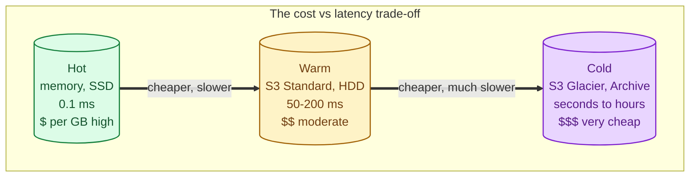
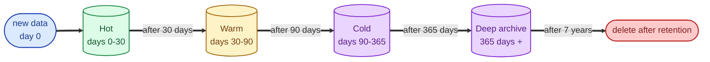
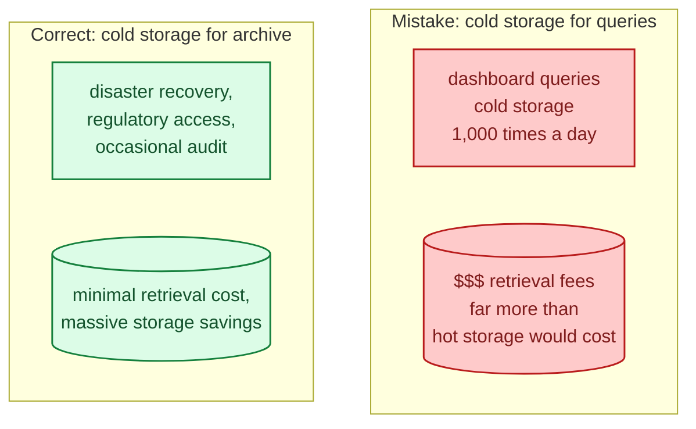
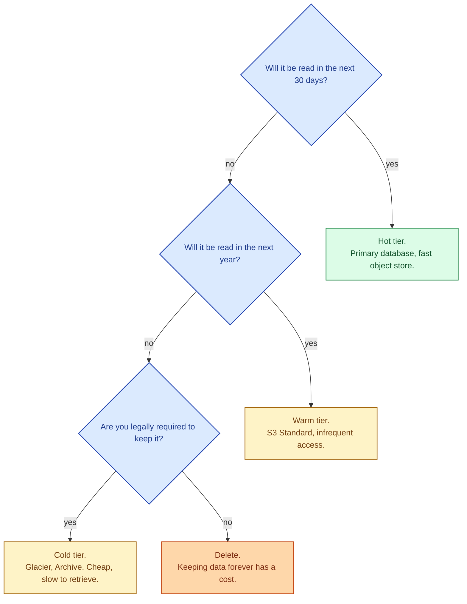

Not all data is read at the same rate. Logs from today are queried constantly; logs from three months ago are queried rarely; logs from five years ago are queried almost never but legally cannot be deleted. Paying for fast storage for all of it is wasteful. Hot, warm, and cold storage tiers exist to match the cost of storage to the cost of access, and a well-tiered system can cut storage bills by 10x or more without changing what users can do.

## What "tier" actually means

A tier is a storage class with a specific cost-performance profile:

- **Hot:** fast reads, low latency, expensive per GB. Memory, SSD, primary database.
- **Warm:** cheaper per GB, slower (tens to hundreds of ms). Spinning disk, near-line storage, S3 Standard.
- **Cold:** much cheaper per GB, very slow first byte (seconds to hours). S3 Glacier, Azure Archive, tape.

Each step costs less per GB and reads slower on first access. The trade-off is a spectrum, not a binary.

## Concrete numbers (rough, end of 2025)

| Tier | Example | Cost / GB / month | First-byte latency | Min storage duration |
|---|---|---|---|---|
| Memory | RAM | very high | ~100 ns | none |
| Hot SSD | Postgres, NVMe | ~$0.10 to $0.30 | ~0.1-1 ms | none |
| Warm object | S3 Standard | ~$0.023 | ~50-200 ms | none |
| Cool | S3 Standard-IA | ~$0.0125 | similar to standard | 30 days |
| Cold | S3 Glacier Instant | ~$0.004 | ~100 ms | 90 days |
| Deep cold | S3 Glacier Deep Archive | ~$0.00099 | 12-48 hours | 180 days |

The cost gap between hot SSD and deep archive is roughly **300x**. Even modest tiering pays for itself within months on any non-trivial dataset.

## The pattern: lifecycle policies

Most cloud object stores let you express tiering as a rule: "move objects to cool after 30 days; to cold after 90; to deep archive after 365; delete after 7 years."

You write the policy once; the storage provider handles the moves. The application does not change; the URL stays the same. The slow part is only when someone reads cold data, and then it is genuinely slow (or even hour-scale for the deepest tiers).

## How tiering shows up in real workloads

### Logs and observability

Recent logs are hot (Elasticsearch / OpenSearch, queried by operators). After a few days, they roll to cheap object storage. After a few weeks, they go to Glacier. After regulatory retention is met, they get deleted. This is the canonical tiering story; most observability vendors automate it.

### Time-series databases

Recent metrics at 1-second resolution; older metrics downsampled to 1-minute, 1-hour, 1-day; very old metrics in cold storage. See [Time-series databases](/practice/system-design/concepts/015-time-series-databases/).

### Analytics warehouses

BigQuery, Snowflake, and friends all have automatic tiering: tables that haven't been queried go cold, lowering storage cost without disabling the query.

### Backups

Daily backups warm for 30 days, weekly for 90, monthly for years, all in archive tiers. Cheap to keep; recoverable if you have the time.

## The hidden cost: retrieval

Cold storage is cheap to keep but expensive to read. Glacier charges per GB **retrieved**, plus per-request fees. A retrieval-heavy workload on cold storage can cost more than just keeping the data hot.

The rule of thumb: cold tier is for data you genuinely will not query in normal operations. If queries happen, hot or warm is cheaper despite the higher per-GB price.

## Picking tiers

The last branch is the one most teams skip. Storing data "in case" forever is a real cost. If you do not have a regulatory or product reason to keep something, set a deletion policy.

## Two scenarios

**Scenario one: a logging pipeline.**

Last 14 days in OpenSearch (hot, searchable). 14 to 90 days in S3 Standard, queryable via Athena (warm). 90 days to 7 years in Glacier (cold, for compliance). After 7 years, deleted. Total storage cost is a fraction of "keep everything hot forever" with no operational downside.

**Scenario two: user-uploaded video.**

Last 30 days in fast hot storage with a CDN cache (popular videos are still hot). Older videos that have not been viewed in 60 days move to S3 Infrequent Access. The retrieval cost is fine because old videos are rarely played. A view of a cold video costs more, but the average across the library saves dramatically.

## What this connects to

- **CDN.** A CDN is itself a hot edge tier in front of warmer origin storage. See [CDN](/practice/system-design/concepts/027-cdn-when-you-need-it/).
- **Time-series databases.** Native tiering by time. See [Time-series databases](/practice/system-design/concepts/015-time-series-databases/).
- **OLTP vs OLAP.** Warehouses use tiered storage internally. See [OLTP vs OLAP](/practice/system-design/concepts/014-oltp-vs-olap/).
- **Replication vs backup.** Backups are usually cold-tier; replicas are hot. See [Replication vs backup](/practice/system-design/concepts/049-replication-vs-backup/).
- **Disaster recovery.** RTO determines how cold your backups can be. See [Disaster recovery: RTO vs RPO](/practice/system-design/concepts/050-disaster-recovery/).

## Common mistakes

- **Keeping everything hot.** Bills scale linearly with retention; the trick is that you do not pay 10x for 10x-old data if you tier.
- **Cold storage for queryable data.** Retrieval fees add up; sometimes hot is cheaper than cold + frequent retrieval.
- **Forgetting minimum durations.** Cool and cold tiers often charge for a minimum retention period; deleting early costs the full duration anyway.
- **No deletion policy.** Some data should not live forever. Set retention even on warm tiers.
- **Manual archiving.** Lifecycle policies do this for free. Stop writing cron jobs for it.
- **Assuming cold is instant.** Glacier Deep Archive takes 12-48 hours. If a regulator gives you 24 hours to produce records, deep archive is the wrong tier.

## Quick recap

- Storage tiers trade cost for first-byte latency.
- Hot for live queries, warm for occasional reads, cold for archive, deep cold for rarely-touched compliance.
- Cost gap is 100x to 300x between hot SSD and deep archive.
- Use lifecycle policies; let the platform move data for you.
- The right time to set retention is the day you start writing data.

This concept sits in **Stage 4 (Scaling and reliability)** of the [System Design Roadmap](/practice/system-design/roadmap/).
