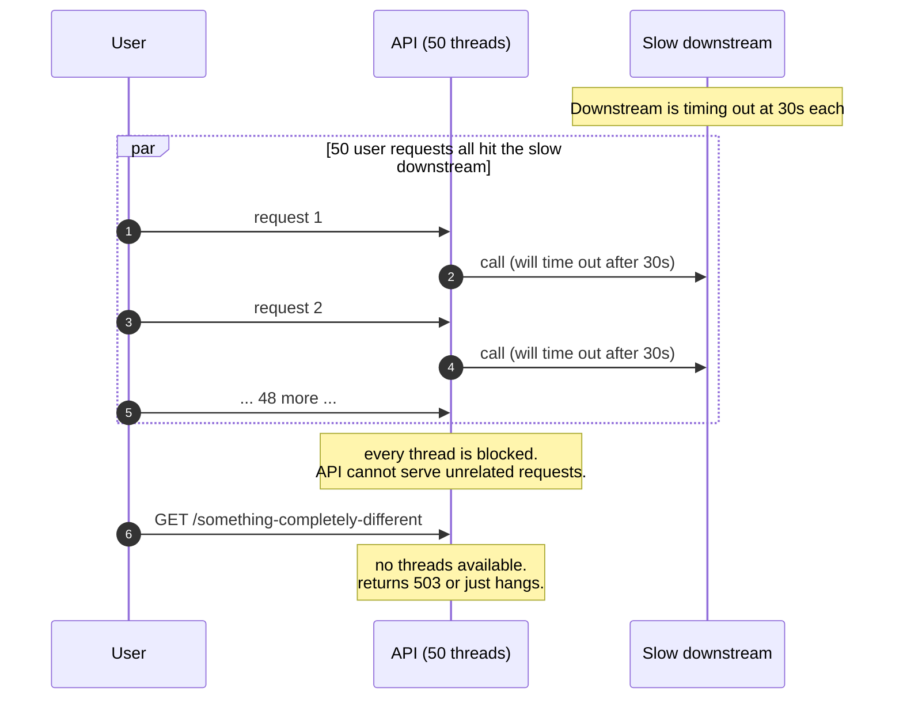
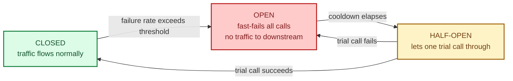
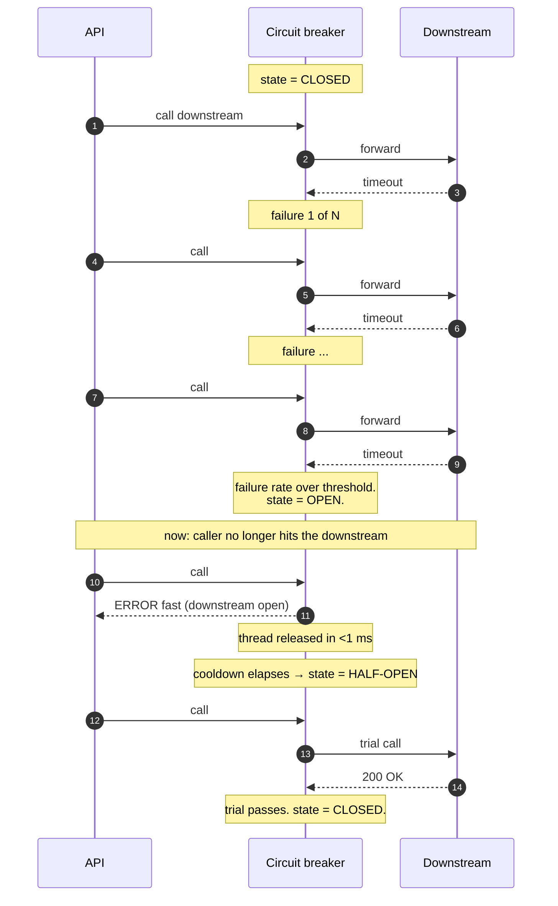

A circuit breaker is a small piece of code that watches calls to a downstream service. When too many of them fail, it stops calling the downstream entirely for a while: every call returns an error immediately, without trying. After a cooldown, it cautiously tries again. The name comes from electricity, and the analogy is exact: a fuse that pops when the current is too high, then resets when conditions are safe.

Without one, a slow or failing downstream takes the caller's threads, sockets, and timeouts with it. With one, the caller fails fast, frees its resources, and lets the downstream recover instead of being hammered.

## The problem it solves

A downstream service is slow. Each call takes 30 seconds before timing out instead of 30 milliseconds. The caller has 50 worker threads. Within seconds, all 50 are stuck on the slow downstream. Now the caller is unresponsive to **everything**, not just the slow downstream.

The slow downstream did not even have to fail. Just being slow was enough to take the caller down. This is a **cascading failure**, and it is the single biggest threat to a distributed system's availability.

## The three states

A circuit breaker is a state machine. It moves between three states based on what it has seen.

- **Closed:** the breaker is "closed" like a closed circuit; current flows. The caller calls the downstream normally. Failures are counted.
- **Open:** too many failures. The breaker pops open. Every call returns an error immediately, without touching the downstream. This protects the caller's threads and gives the downstream room to recover.
- **Half-open:** after a cooldown (often 5 to 60 seconds), the breaker lets a single trial call through. If it succeeds, the breaker closes again. If it fails, the breaker re-opens and waits another cooldown.

## What it actually does during failure

The caller's threads stop dying on the downstream. The downstream gets a break instead of a stampede. When the downstream recovers, a single probe confirms it before traffic floods back.

## Picking thresholds

The whole point of the breaker is that the defaults work most of the time. The two numbers that matter:

- **Failure threshold.** "Open the circuit when N% of the last M requests failed." Typical: 50% over the last 20 requests.
- **Cooldown duration.** How long the breaker stays open before trying again. Typical: 5 to 30 seconds.

Too sensitive: the breaker opens on every blip and your downstream-dependent paths flap. Too lenient: it does not trip until the damage is done.

A good circuit breaker also distinguishes **types** of failure. A 500 error from the downstream means trip. A 404 ("not found") usually does not, because not-found is not a downstream health signal.

## When it earns its keep

- The caller has a thread or connection budget and the downstream can hang it.
- The downstream's failure is "all of it" rather than per-request (a regional outage, a deploy gone wrong, a memory leak).
- Recovery is helped by less traffic, not by more retries.

## When it does not help

- The downstream returns errors fast already. The threads are not blocked; there is no cascading failure to prevent.
- The failure rate is just a few percent and the rest succeed normally. A breaker tripping would harm more than help.
- The caller can simply not need the downstream for that path. Better to make the path optional. See [Graceful degradation](/practice/system-design/concepts/048-graceful-degradation/).

## Two scenarios

**Scenario one: a payment provider integration.**

Your API calls Stripe on every checkout. Stripe has a regional outage; every call times out at 30 seconds. Without a breaker, every checkout thread hangs and the whole site becomes unresponsive. With a breaker, after the first dozen failures the breaker opens, the next checkouts get a clean "payments are temporarily unavailable" error in 1 ms, and the rest of the site keeps working.

**Scenario two: a recommendation feed inside a product page.**

The recommender takes too long sometimes. The product page wraps the call in a circuit breaker with a short cooldown. When the recommender is slow, the breaker opens, the page renders without recommendations, and the user sees the rest of the product without noticing. The recommender comes back; the breaker probes; recommendations return.

## What this connects to

- **Retry with backoff.** Retries and circuit breakers are complementary; retries fight transient errors, breakers fight sustained ones. See [Retry with exponential backoff and jitter](/practice/system-design/concepts/046-retry-backoff-jitter/).
- **Bulkheads.** Both isolate failure; bulkheads slice resources, breakers cut traffic. See [Bulkheads and rate limiting](/practice/system-design/concepts/047-bulkheads-and-rate-limiting/).
- **Graceful degradation.** A breaker only protects the caller; the path still needs a fallback. See [Graceful degradation](/practice/system-design/concepts/048-graceful-degradation/).
- **Idempotency.** Required when the breaker recovers and retries land. See [Idempotency](/practice/system-design/concepts/021-idempotency/).

## Common mistakes

- **No circuit breaker at all.** The most common failure mode of a real distributed system. One slow downstream takes everything else with it.
- **Treating every error as a trip event.** 404s and validation errors are not downstream health signals. Only trip on signals that indicate the service itself is broken.
- **Cooldown too short.** The breaker opens, probes too soon, the downstream is still dead, traffic floods back, cycle repeats. Pick cooldowns generous enough to let the downstream recover.
- **One global breaker for many endpoints.** A slow `/recommendations` should not open the breaker that protects `/checkout`. Per-endpoint breakers are the norm.
- **No metric or alert on opens.** A silent open is a feature working invisibly; a silent open every five minutes is a problem you do not know about.
- **Forgetting the fallback.** A breaker that opens with no graceful degradation just turns "slow" into "error." Pair every breaker with a sane fallback.

## Quick recap

- A circuit breaker fast-fails calls to a sick downstream so the caller does not hang on them.
- Three states: closed (normal), open (fast-fail), half-open (probe).
- Trip on signals that indicate the downstream is unhealthy, not on every error.
- Pair with retries (for transient errors) and a graceful fallback (for the user-facing path).
- Cascading failures are the single biggest threat to availability; circuit breakers are the cheapest defence.

This concept sits in **Stage 4 (Scaling and reliability)** of the [System Design Roadmap](/practice/system-design/roadmap/).
