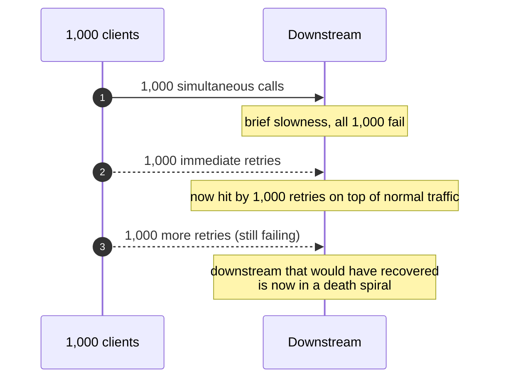
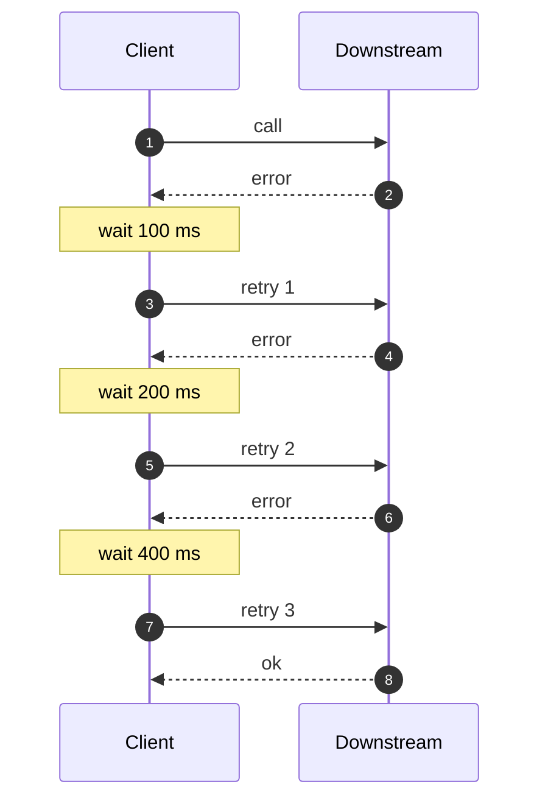
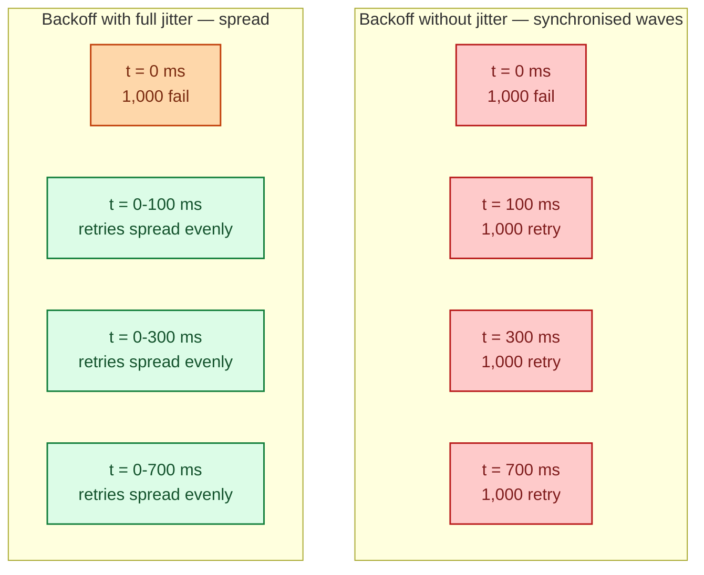
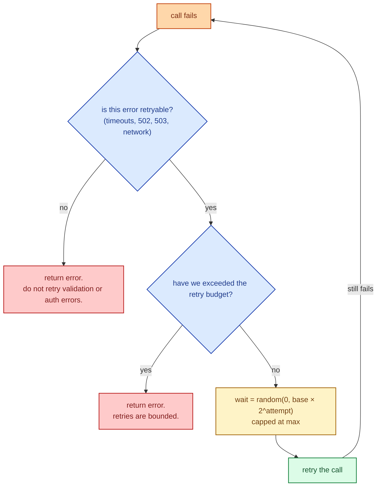

When a downstream call fails, the caller has a choice: give up, or try again. Trying again is usually correct because most failures are transient. But "try again" needs three rules: a cap on how many times, growing pauses between attempts (backoff), and random offsets on those pauses (jitter). Skip any one and you have created a new problem; usually a stampede that the downstream cannot survive.

## What a naive retry does to a struggling downstream

Picture 1,000 clients all calling the same downstream at the same time. The downstream has a brief moment of slowness; all 1,000 see an error.

The downstream never gets a moment to breathe. A short blip becomes a sustained outage because every client is hammering at the same time. This is a **retry storm**, and it is one of the easiest ways to take down your own infrastructure.

## Exponential backoff: wait longer each time

The first fix is to pause before each retry, and to make the pause grow with each attempt. A common formula:

> **delay = base × 2^attempt**

With base = 100 ms: 100 ms, 200 ms, 400 ms, 800 ms, 1600 ms. The intuition: if the first retry did not work, the downstream is probably still in trouble; wait longer before adding more load.

A single client now stops hammering. Good. But put 1,000 of them together and they all retry at exactly the same moments. Same problem, slightly spaced.

## Jitter: the part everyone forgets

Add a random offset to each delay. Two clients that fail at the same moment now retry at slightly different times. The downstream stops seeing synchronised waves.

The most common jitter formula is **full jitter**: pick a delay uniformly between zero and the backoff cap.

> **delay = random(0, base × 2^attempt)**

Average wait is similar, but the distribution is smooth instead of spiky. The downstream sees a gradual recovery curve instead of repeated waves.

Jitter matters more than backoff. Backoff helps one client; jitter is what saves the downstream from synchronised retries from many clients.

## The full recipe

Every retry policy in production should answer these three questions:

1. **Is this error retryable?** Network errors, 502, 503, 504, and explicit "retry me" headers: yes. Validation errors, auth errors, business-logic errors: no.
2. **Have we tried enough?** A retry budget (e.g., 3 attempts, 30 seconds total) prevents runaway loops.
3. **How long do we wait?** Exponential backoff with full jitter, capped at a sensible maximum (often 30 seconds).

## Retries and idempotency

Retries replay the request. If the original request created an order, retrying might create a second one. Without idempotency, retries quietly cause real harm: double-charges, double-emails, double-shipments. Idempotency keys are mandatory companions to retries. See [Idempotency](/practice/system-design/concepts/021-idempotency/).

## Retries vs circuit breakers

Both fight transient failures, in different ways:

- **Retries** assume the error is brief; trying again will work.
- **Circuit breakers** assume the error is sustained; stop trying so the downstream recovers.

They compose: retry transient errors a few times; if errors persist, the breaker opens and stops retries until the cooldown elapses.

## Two scenarios

**Scenario one: an API client calling a flaky third-party service.**

The third-party returns 503s occasionally for a few seconds. Without retries, every blip becomes a user-visible error. With three retries on a 100 ms base + full jitter, almost all blips are absorbed and the user never sees them.

**Scenario two: a background job hitting an internal service that just deployed.**

Right after a deploy, the new pods have a 30-second warm-up. Workers that hit them get 502s. With retries + jitter, the workers spread their retries over a few seconds; by the time the budget expires, the new pods are warm and serving. Without jitter, the workers all retry at the same moments and overwhelm the slowest-warming pod.

## What this connects to

- **Circuit breaker.** The complementary pattern; retries handle blips, breakers handle outages. See [Circuit breaker](/practice/system-design/concepts/045-circuit-breaker/).
- **Idempotency.** Required by anything that retries. See [Idempotency](/practice/system-design/concepts/021-idempotency/).
- **Bulkheads and rate limiting.** A retry storm overwhelms downstream; rate limiting and bulkheads contain the damage. See [Bulkheads and rate limiting](/practice/system-design/concepts/047-bulkheads-and-rate-limiting/).
- **Delivery semantics.** At-least-once delivery means messages get retried; consumers must be idempotent. See [Delivery semantics](/practice/system-design/concepts/034-delivery-semantics/).

## Common mistakes

- **Retry without backoff.** A retry storm in one line of code.
- **Backoff without jitter.** Synchronised waves; multiple clients turn one outage into a sustained one.
- **No retry budget.** Failed call retries forever. Threads and connections pile up.
- **Retrying non-idempotent operations.** Two charges. Two emails. Two shipments.
- **Retrying every error.** A 400 Bad Request will be 400 Bad Request next time. Validation errors are not transient.
- **Server-side retries on top of client-side retries.** Each layer multiplies; one user request becomes 27 downstream calls. Pick one place to retry.
- **No metric on retry rate.** If 50% of your calls retry, you have a downstream problem hiding behind apparent success. Measure.

## Quick recap

- Retry on transient errors (timeouts, 502, 503), not on validation or auth errors.
- Exponential backoff prevents one client from hammering.
- Jitter prevents many clients from hammering in unison.
- Cap retries with a budget; the alternative is runaway loops.
- Always idempotent. Always.

This concept sits in **Stage 4 (Scaling and reliability)** of the [System Design Roadmap](/practice/system-design/roadmap/).
