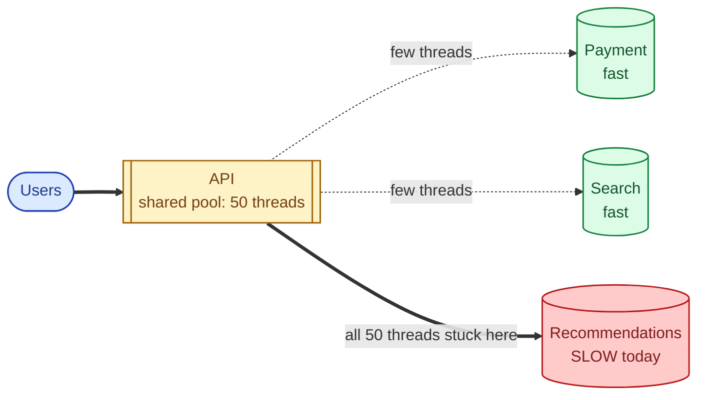
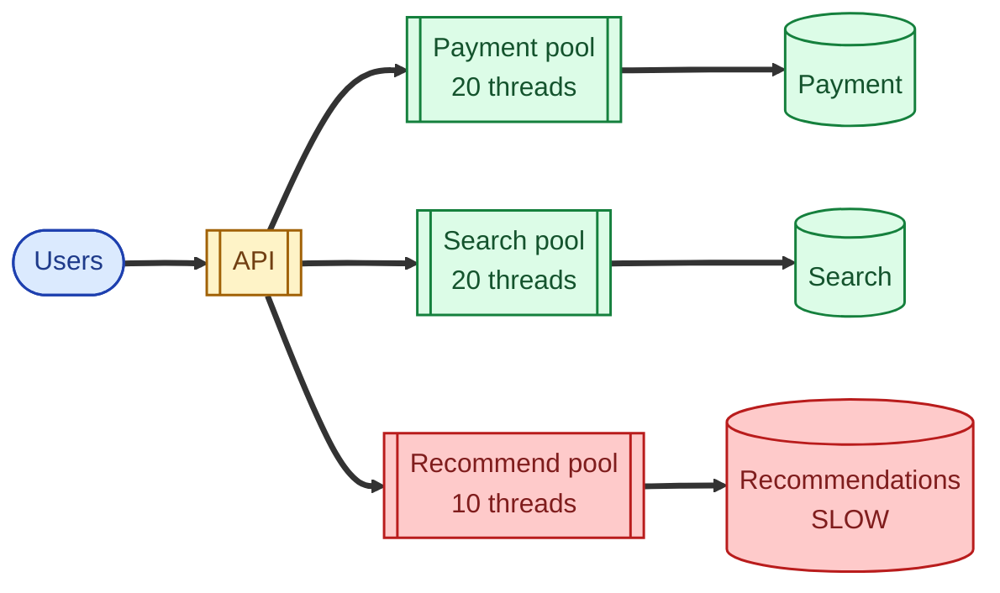
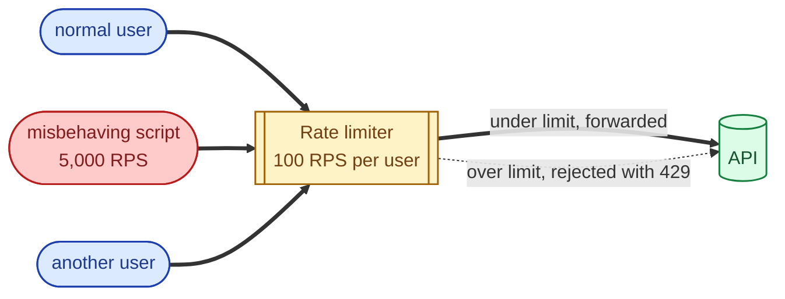

A bulkhead is a wall inside a ship that stops a flood in one compartment from sinking the rest. In software, a bulkhead is the same idea: isolate resources so a failure in one place cannot consume the resources that other places need to keep working. Rate limiting is its first cousin: cap the inputs so no single caller can monopolise the system. Both exist for the same reason. Without them, one bad actor (an angry user, a runaway script, a slow downstream) takes everything down with it.

## The problem they solve

A web app talks to three downstreams: payment, search, recommendations. They share one thread pool of 50 threads.

Recommendations is slow. Threads pile up there. Payment requests cannot get a thread. The slow downstream took down the unrelated, healthy downstream's path. The system is "up", but checkout is broken because of a recommender that nobody is even looking at.

## Bulkheads: separate pools per downstream

Give each downstream its own thread budget. A slow downstream consumes its own quota and stops there.

Recommendations is still slow. Its 10 threads still pile up. But payment has its own 20 threads, untouched. Checkout still works. The slow path is the only thing that hurts; everything else is fine.

This is what a bulkhead buys you: **failure containment**. The blast radius of any one downstream's bad day is now bounded.

## Bulkheads in practice

Bulkheads can be coarse or fine:

- **Per downstream.** The pattern above. Each external dependency gets its own thread pool, connection pool, or semaphore.
- **Per tenant.** In multi-tenant systems, a per-tenant quota prevents one noisy customer from starving the others.
- **Per process.** Separate processes (or containers, or pods) per concern. A leak in one cannot eat the memory the others need.

The trade-off is wasted capacity: pools that are sized for the worst case sit underutilised most of the time. The trade is worth it. Underutilised capacity is cheap; cascading outages are not.

## Rate limiting: cap the inputs

A bulkhead protects you from a slow downstream. A rate limit protects you from an aggressive caller (a script gone wild, a misbehaving partner, a DDoS attempt, or just one user accidentally generating ten thousand requests per second). The shape is "this caller may make at most N requests per T time."

The misbehaving caller gets 429 Too Many Requests. Everyone else carries on normally. The detailed mechanics (token bucket, leaky bucket, fixed window, sliding window) are covered in their own concept page; see [Rate limiting strategies](/practice/system-design/concepts/053-rate-limiting-strategies/).

## How bulkheads and rate limiting compose

| Risk | Tool |
|---|---|
| Slow downstream eats threads | Bulkhead (separate pools) |
| One caller floods you | Rate limiting (per caller) |
| One tenant hurts others | Tenant bulkhead + per-tenant rate limit |
| Sustained downstream failure | Circuit breaker |
| Transient downstream blip | Retry with backoff and jitter |

Production systems use all of them together. A reliable service typically has: rate limiting at the edge, per-downstream bulkheads inside, circuit breakers around each downstream, and retries-with-backoff for transient errors.

## Two scenarios

**Scenario one: a product page that calls three services.**

The page calls inventory (must), reviews (nice to have), and recommendations (nice to have). Without bulkheads, a slow recommender starves inventory and the page errors. With bulkheads, recommendations has 5 threads; even if it hangs, the inventory call has its own 15 threads and the page renders with a blank recommendations slot. Add graceful degradation, and the user does not even notice. See [Graceful degradation](/practice/system-design/concepts/048-graceful-degradation/).

**Scenario two: a public API used by partners.**

One partner deploys a bug that retries every request 50 times. Without rate limiting, this one partner consumes all your capacity and other partners see errors. With per-partner rate limits at the API gateway, the bad partner gets 429s as soon as they exceed their quota; the rest of the world keeps working. The bad partner notices their own problem; you do not have to.

## What this connects to

- **Circuit breaker.** Combines with bulkheads: bulkheads contain the slow path; the breaker stops calling it. See [Circuit breaker](/practice/system-design/concepts/045-circuit-breaker/).
- **Retry with backoff.** Retries amplify load; rate limits cap it. They compose carefully. See [Retry with exponential backoff and jitter](/practice/system-design/concepts/046-retry-backoff-jitter/).
- **Rate limiting strategies.** The mechanics of the rate limiter itself. See [Rate limiting strategies](/practice/system-design/concepts/053-rate-limiting-strategies/).
- **Connection pooling.** A pool is a kind of bulkhead at the database layer. See [Connection pooling](/practice/system-design/concepts/042-connection-pooling/).
- **Graceful degradation.** What you do once the bulkhead has stopped you from calling the broken downstream. See [Graceful degradation](/practice/system-design/concepts/048-graceful-degradation/).

## Common mistakes

- **No bulkheads at all.** A slow non-critical downstream takes the whole service down. The classic incident.
- **Shared connection pool for all downstreams.** Same problem. The database connection pool gets exhausted by one slow query and everything that needs the database errors.
- **Rate limits only at the load balancer.** Per-IP at the edge does not help if many users behind a corporate NAT share an IP. Layer rate limits: edge plus per-user-id inside.
- **No way to lift the limit.** Sometimes you want a partner to run a one-off batch import. If your rate limit cannot be bumped for them, you are creating a support ticket every time.
- **Sizing bulkheads by guess.** Measure the steady-state and peak concurrency per downstream and size from there.
- **Rejecting silently.** Always return 429 with a `Retry-After` header so clients can back off intelligently.

## Quick recap

- Bulkheads: separate resource pools so one bad downstream does not starve the others.
- Rate limits: cap inputs so no one caller can monopolise the system.
- Combine with circuit breakers (stop calling the broken thing) and graceful degradation (render without it).
- Underutilised capacity is the price of failure containment; cheap compared to cascading outages.
- The reliable production stack: edge rate limit + per-downstream bulkhead + per-downstream breaker + retry-with-backoff. Default it on.

This concept sits in **Stage 4 (Scaling and reliability)** of the [System Design Roadmap](/practice/system-design/roadmap/).
