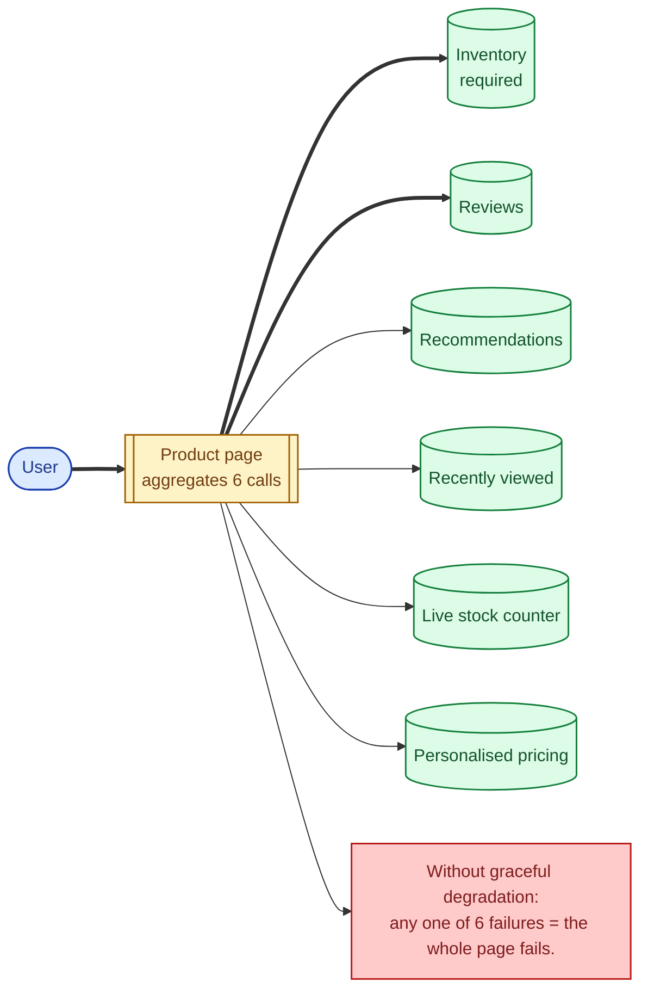
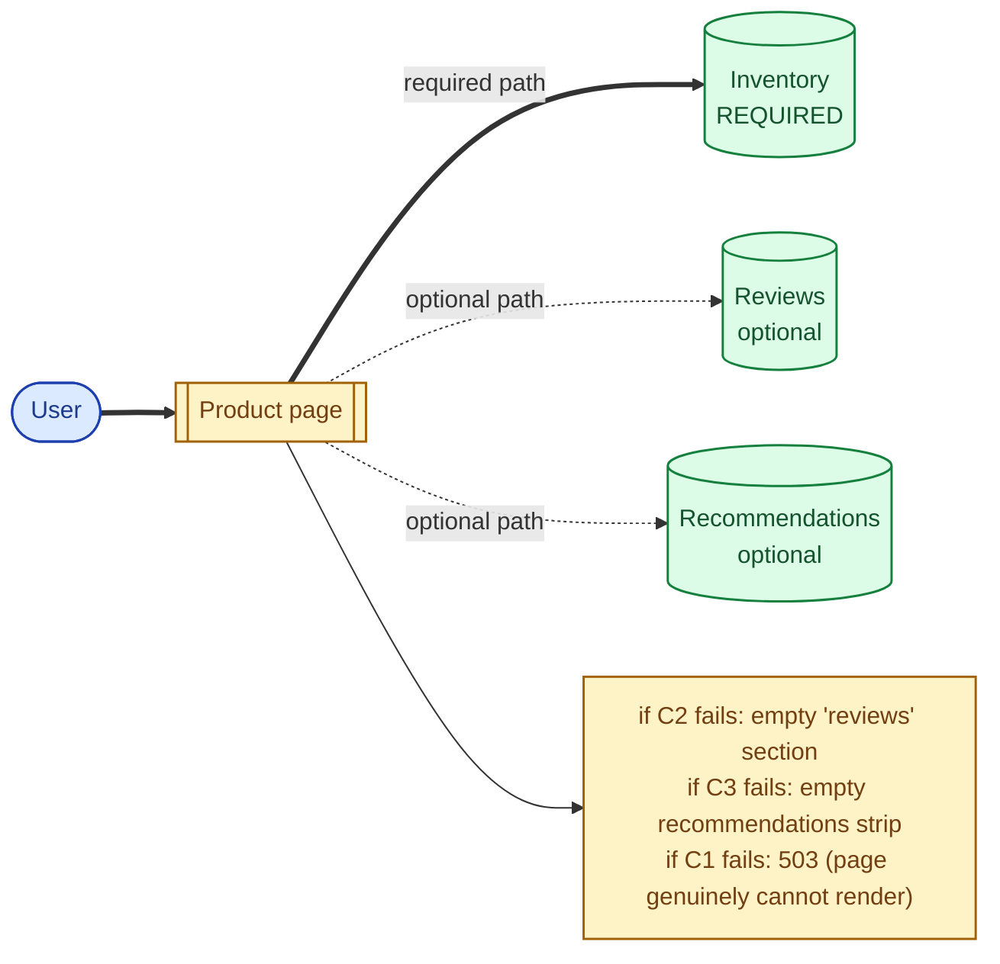
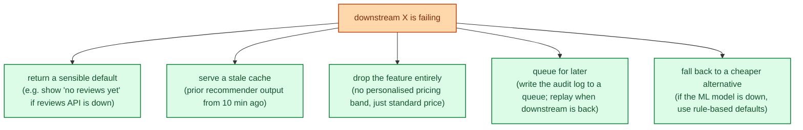
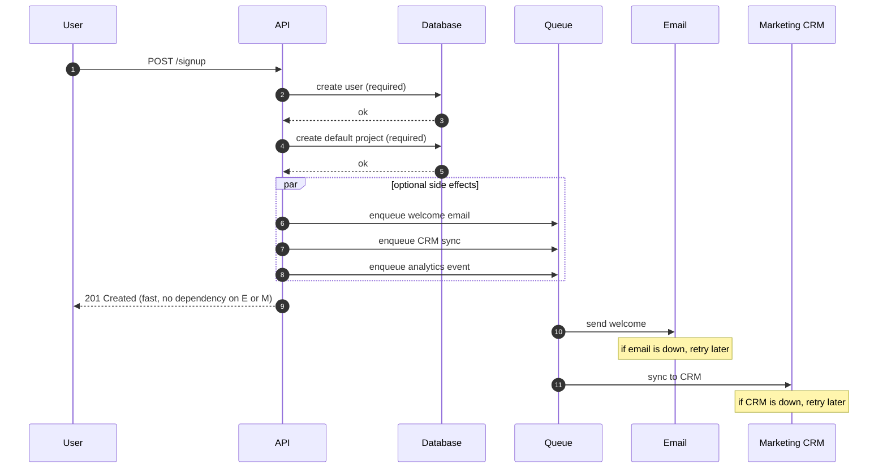

Graceful degradation is the discipline of failing in pieces instead of all at once. When one downstream is down, the user does not see an error page; they see your product, minus the feature that was unhealthy. The recommendations slot is empty. The "people you may know" sidebar is missing. The receipt email queues up to send later. Everything else still works. Done well, half your users do not even notice an outage that took down a major dependency.

## Why "all or nothing" is the wrong default

The simplest code path makes a call to every dependency and renders the response. If any call fails, the whole response fails. This is fine for a single endpoint that does one thing. It is fatal for a page that aggregates from many services.

If each call has even 99.9% availability, six together have 99.4% (compounded). A single 30-second blip across six independent services is almost guaranteed every hour. Without degradation, your page is unavailable a lot more than your dependencies are.

## The pattern: required vs optional

Mark each dependency as required or optional. The page renders if every required call succeeds. Optional failures degrade gracefully: the section disappears, a default is shown, or a stale cache fills in.

A product page genuinely cannot work without inventory data; that is required. Reviews and recommendations are nice; their absence is invisible to most users.

## Patterns of degradation

You pick one per feature, ahead of time. The whole point is that degradation is **deliberate**, not what happens by accident.

## A worked example: signup flow

A signup involves:

1. Create the account in the database. **Required.**
2. Send a welcome email. **Optional** (queue it for later).
3. Send analytics event. **Optional** (drop on failure).
4. Add user to the marketing CRM. **Optional** (retry in background).
5. Provision a default project. **Required** for first-run experience.

Without degradation, the signup blocks on five things and fails if any of them does. With degradation, the user gets a working account immediately; emails, CRM, and analytics catch up in the background; the only paths that can fail signup are the two required ones (account and project), both of which are inside your own database.

The user-visible signup time is the database write. The other side effects can fail and retry independently; the user never notices.

## Degradation and the rest of the resilience stack

Graceful degradation is the **outcome** other patterns enable:

- **Circuit breaker** stops calling a broken downstream. The fallback is degradation.
- **Bulkhead** stops the broken downstream from starving healthy paths. The fallback is degradation.
- **Timeout** stops a slow downstream from hanging the caller. The fallback is degradation.

Without a defined degradation behaviour, those patterns just turn a slow downstream into a fast error. With degradation, the error becomes invisible.

## Two scenarios

**Scenario one: a video platform's home page.**

The page shows trending videos, recommendations, recently watched, and notifications. During a recommender outage, the page renders with: trending (still up), no recommendations (the slot is replaced by trending continuation), recently watched (still up), notifications (still up). 95% of users do not realise anything is wrong because trending fills the recommender's slot and nothing errors out. The recommender team gets paged; the product is up.

**Scenario two: a checkout that depends on tax calculation.**

The tax service is down. Without degradation, checkout cannot complete; revenue stops. With degradation, the checkout uses a cached tax rate from earlier in the session (slightly stale, but probably correct), proceeds with the purchase, and flags the order for tax reconciliation. The user buys. The accounting team fixes a few orders by hand. Better than zero revenue.

The senior question here is: "how stale is acceptable?" Sometimes the answer is "not at all" (a precise tax obligation matters), and degradation means refusing the order with an honest message instead of charging an unsupported amount. Either way, the choice is deliberate.

## What this connects to

- **Circuit breaker.** Stops calling the broken downstream so degradation kicks in. See [Circuit breaker](/practice/system-design/concepts/045-circuit-breaker/).
- **Bulkheads.** Contain the broken downstream's resource use. See [Bulkheads and rate limiting](/practice/system-design/concepts/047-bulkheads-and-rate-limiting/).
- **Caching.** A cache hit is one of the most common degradation fallbacks. See [Why cache and what to cache](/practice/system-design/concepts/023-why-cache-what-cache/).
- **Synchronous vs asynchronous.** Moving optional side effects to async is the most reliable degradation pattern. See [Synchronous vs asynchronous](/practice/system-design/concepts/005-sync-vs-async/).
- **Idempotency.** Required for the async retries that make degradation work. See [Idempotency](/practice/system-design/concepts/021-idempotency/).

## Common mistakes

- **Implicit dependencies.** Every required call is a single point of failure. Audit them; either make them genuinely required (rare) or design a degradation path.
- **Cascading required calls.** If A calls B which calls C, then C is implicitly required by A even though A's code does not show it. Walk the call graph.
- **No alert on the fallback path.** When recommendations is silently degraded, you need to know. Otherwise it is a silent outage.
- **Stale cache without an expiry.** "Use last good value" forever means using bad data forever once the upstream stays broken. Time-bound the fallback.
- **Lying to the user.** A degraded path that pretends everything is fine creates trust issues when reality leaks through. Sometimes "we are having trouble loading reviews" is the right message.
- **Treating degradation as a feature you do later.** Building it into the design from the start is much cheaper than retrofitting.

## Quick recap

- Required vs optional: mark dependencies before you write the code.
- Fallbacks are deliberate: defaults, stale cache, queue for later, drop the feature, cheaper alternative.
- Pair with timeouts, circuit breakers, and bulkheads; degradation is what those patterns make possible.
- The goal is that a single dependency's bad day is invisible to most users.
- Alert on degraded paths. Silent degradation is silent outage.

This concept sits in **Stage 4 (Scaling and reliability)** of the [System Design Roadmap](/practice/system-design/roadmap/).
