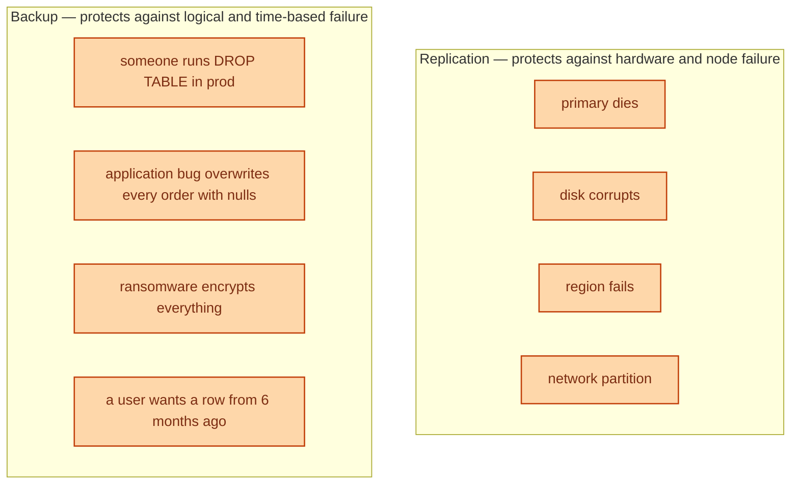
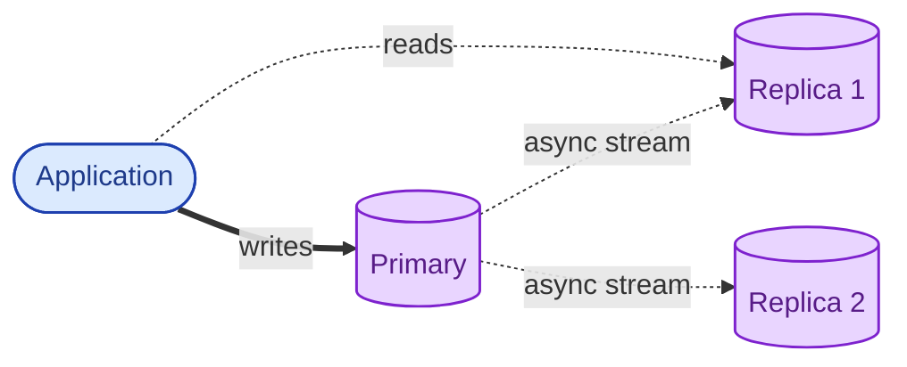
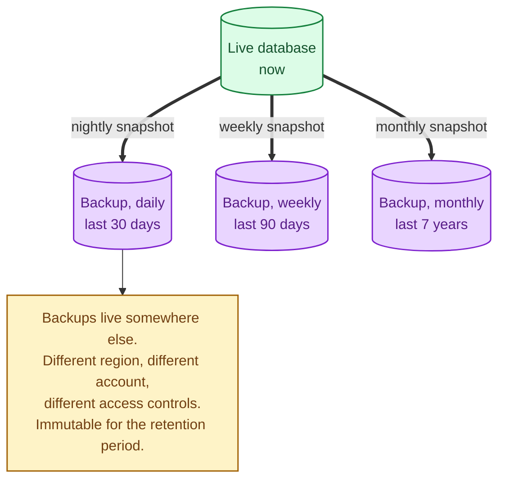
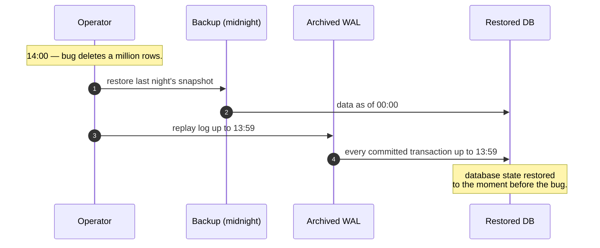
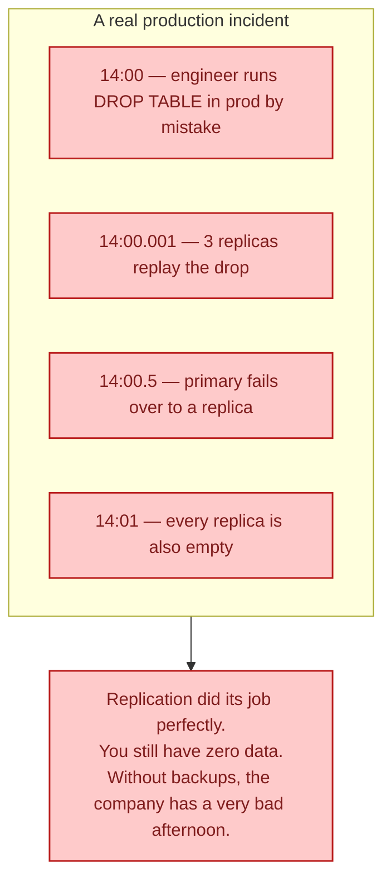

Replication is a continuously-updated copy of the data, kept on another machine so failover is fast. A backup is a frozen snapshot from a point in time, kept somewhere safe so you can recover from a mistake. Both are copies. They protect against completely different failures. Treating one as the other is the failure mode behind some of the most embarrassing data-loss incidents in the industry.

## What each one protects you from

Replication answers "the box is gone." Backup answers "the data is wrong and was wrong on the replicas too." The dangerous mistake is using replication and calling it a backup. The mistakes that backups exist to recover from will be faithfully replicated to every replica in milliseconds, leaving you nothing to roll back to.

## Replication

A primary database streams its changes to one or more replicas. The replicas apply the changes; the data is kept (nearly) in sync.

This is the same pattern as in [Read replicas](/practice/system-design/concepts/011-read-replicas/). Replicas can serve reads, take over during a primary failure (failover), and provide geographic redundancy.

**What replication protects you from:** primary instance death, hardware failure, network partitions, regional outages (with cross-region replication).

**What replication does not protect you from:** any logical error. A `DELETE FROM users` runs on the primary and is dutifully replicated to every replica. They all delete `users`. Replication did exactly what it was designed to do; it gave you no protection.

## Backup

A backup is a point-in-time snapshot stored separately from the live database. Yesterday's backup contains yesterday's data, exactly as it was, regardless of what has happened since.

**What backup protects you from:** a wrong DELETE, an application bug that corrupted data, ransomware, accidental dropped table, regulatory "produce records from 4 years ago", a customer asking for the version of their document before the last save.

**What backup does not protect you from:** the time gap between now and the last backup. If the backup is nightly and the corruption happened at 4 PM, you have lost the day's data when you restore.

## The combination: point-in-time recovery

Modern databases support **point-in-time recovery (PITR)**, which is the marriage of the two. The backup gives you the database at midnight. The replication log (WAL / binlog) is also archived. To restore to any moment, restore the backup and then replay the log up to the chosen second.

Replication gives you "the box is gone, the data is the same." PITR gives you "the data is wrong now, take me back five minutes." You want both.

## Why they are not substitutes

This is the failure mode that "we have replication, so we're fine" overlooks. The whole point of backups is to be untouchable when something writes garbage to the live cluster.

## Where backups should actually live

A backup that lives in the same account as the live database is barely a backup. A bad actor or a runaway script can delete it too. Production-quality backup setups have all of these:

- **Different account or cloud project.** Cannot be deleted from the live one.
- **Different region.** Survives a regional event.
- **Immutable for the retention period.** Object lock or versioning so nothing can rewrite or delete it within its window.
- **Restoration tested regularly.** A backup you have never restored is a backup that does not exist. Quarterly drill restores into a fresh environment.

## Two scenarios

**Scenario one: the primary database VM dies at 3 AM.**

Replication handles this. Patroni or RDS automation promotes a replica, the load balancer redirects writes, and the application reconnects within seconds. Total user impact: a few seconds of dropped writes. Backups are not involved.

**Scenario two: a migration bug at 14:00 silently corrupts the `payments` table.**

You discover it at 16:00. Replicas have the same corrupt data. The fix is point-in-time recovery: restore the backup, replay the WAL to 13:59, swap the live database. Cost: two hours of work lost (the time between the bug and now), but the company still has its data. Without backups, you would have nothing.

## What this connects to

- **Read replicas.** The most common form of replication. See [Read replicas](/practice/system-design/concepts/011-read-replicas/).
- **Disaster recovery.** Backups underpin every DR strategy. See [Disaster recovery: RTO vs RPO](/practice/system-design/concepts/050-disaster-recovery/).
- **Storage tiers.** Old backups live in cold storage. See [Hot, warm, cold storage tiers](/practice/system-design/concepts/044-storage-tiers/).
- **Multi-region.** Cross-region replication is the natural geographic extension. See [Multi-region](/practice/system-design/concepts/043-multi-region/).
- **Schema migrations.** Both protect you against bad migrations; backups also protect you if the migration succeeds but is logically wrong. See [Schema migrations with zero downtime](/practice/system-design/concepts/013-zero-downtime-migrations/).

## Common mistakes

- **"We have replication, so we don't need backups."** The most common and most expensive mistake. Replication is not a time machine.
- **Backups in the same account as the live data.** A compromised account can delete both at once.
- **Untested backups.** A backup you have never restored is a hope. Drill restores quarterly at minimum.
- **Backups but no WAL archive.** Last night's data is six to twenty-four hours behind. PITR is what gives you minute-level granularity.
- **Long retention with no checksum.** Backups bit-rot too. Periodic integrity checks matter.
- **Backups too short to satisfy regulation.** Some jurisdictions require 7 or 10 year retention. Cold storage makes this affordable.
- **No documented restore procedure.** When you actually need it, "we have backups somewhere" is not a runbook.

## Quick recap

- Replication: continuous live copy. Protects against hardware and region failure.
- Backup: point-in-time snapshot. Protects against logical errors, bugs, attacks, and time-travel needs.
- Both are required. They are not substitutes for each other.
- PITR (snapshot + WAL replay) gives you minute-level recovery.
- Backups live in a separate account, region, and access boundary; they are restored regularly to prove they work.

This concept sits in **Stage 4 (Scaling and reliability)** of the [System Design Roadmap](/practice/system-design/roadmap/).
