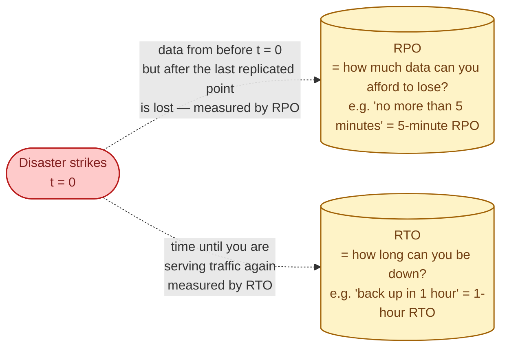
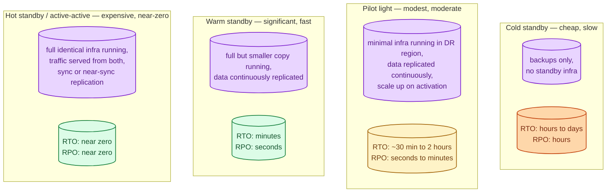
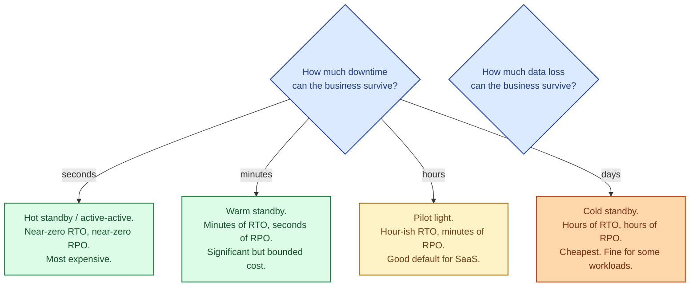

Disaster recovery is what you do after the disaster: a region outage, a deleted database, a ransomware attack, a fire in a data centre. It is not the same as everyday high availability; HA is for "the box died." DR is for "the data centre is gone." Every DR plan answers two numbers: **RTO** (how long until we are running again?) and **RPO** (how much data are we willing to lose?). Cheaper plans give you worse numbers. Expensive plans give you better ones. Pretending you do not need a plan gives you the worst numbers of all on the day you find out.

## The two numbers

- **RPO (Recovery Point Objective):** the maximum amount of data you are willing to lose. Measured in time. RPO = 1 hour means "we can tolerate losing the last hour of data."
- **RTO (Recovery Time Objective):** the maximum amount of time you can be down. Measured in time. RTO = 30 minutes means "we must be serving traffic again within 30 minutes."

Both numbers are business decisions, not engineering decisions. They translate directly into how much you have to spend on DR infrastructure.

## The cost / time trade-off

Better RTO and RPO cost more infrastructure: closer to live, closer to running, closer to instant. Cheaper plans accept some downtime and some data loss to keep the spend reasonable.

## What each tier looks like in practice

### Cold standby (backup-only)

You restore from backup into a freshly-provisioned environment in another region. Hours of work, possibly days for very large data.

- RTO: 4 to 24 hours
- RPO: as fresh as your last backup (often 1-24 hours)
- Cost: cheapest. You pay only for backup storage.

Fine for internal tools, side projects, and workloads where a half-day outage is annoying but not catastrophic. Not fine for customer-facing revenue paths.

### Pilot light

A skeleton of the production environment runs continuously in the DR region. Databases are replicated; application servers exist but in small numbers (or are turned off). On disaster, scale the application tier up, switch DNS or load balancer, traffic flows.

- RTO: 30 minutes to 2 hours
- RPO: seconds to minutes (continuous replication)
- Cost: modest. You pay for replication and a small footprint.

The right starting point for most SaaS companies serious about DR.

### Warm standby

A full but possibly smaller copy of production runs in the DR region. Replication is continuous. On disaster, you flip traffic; the DR site is already capable of serving everything but at reduced capacity. Scale up while serving.

- RTO: minutes
- RPO: seconds
- Cost: substantial. Roughly half to full second copy of the production fleet.

This is what most large SaaS companies eventually move to.

### Hot standby / active-active

Both regions are live and serving traffic. Replication is synchronous or near-synchronous. A regional failure removes one region from the rotation; the other absorbs the full load. See [Multi-region](/practice/system-design/concepts/043-multi-region/).

- RTO: near zero
- RPO: near zero
- Cost: full duplicate infrastructure, plus the complexity tax of running active-active.

Reserved for workloads where seconds of downtime are unacceptable: payments, healthcare, large-scale platforms.

## The picker

The honest conversation is "for each system in this business, how long can it be down, and how much data can be lost?" Different systems get different answers. Payments often need hot standby. Internal HR tools can run on cold standby.

## What a DR plan actually contains

- **The two numbers.** RTO and RPO, agreed with the business, written down.
- **Trigger criteria.** What event causes you to declare a disaster and start the runbook.
- **The runbook itself.** Step-by-step: who runs it, what commands, what order, what to verify at each step.
- **Communication plan.** Who tells customers, on what channels, when.
- **Rehearsal schedule.** Failed-over to DR at least once a quarter, preferably more.

A DR plan you have never executed is a hope. Rehearsals find the broken scripts, the expired credentials, the undocumented dependencies, the procedures that worked in development but do not work at 4 AM in a real outage.

## Two scenarios

**Scenario one: a SaaS at series-A.**

Pilot light DR in another region. Backups archived hourly with WAL streaming for PITR. Quarterly DR drills: provision the application tier in the DR region, point at the replicated database, send 5% synthetic traffic, validate. Cost: a few percent of normal infrastructure spend. RTO: 60 to 90 minutes. RPO: under 5 minutes.

**Scenario two: a payment processor.**

Active-active across two regions. Synchronous replication between primaries (paying the cross-region latency tax per write). Regional traffic distributed via DNS and BGP. A region going dark removes it from the pool; the other region absorbs all traffic. RTO: seconds. RPO: zero acknowledged transactions lost. Cost: roughly 2x single-region. Justified because seconds of downtime cost more than the duplicate infrastructure does in a year.

## What this connects to

- **Replication vs backup.** Both are inputs to DR; you need them combined. See [Replication vs backup](/practice/system-design/concepts/049-replication-vs-backup/).
- **Multi-region.** Hot standby and active-active are multi-region patterns. See [Multi-region](/practice/system-design/concepts/043-multi-region/).
- **Storage tiers.** Backups live in tiered cold storage; retention drives RPO and cost. See [Hot, warm, cold storage tiers](/practice/system-design/concepts/044-storage-tiers/).
- **CAP theorem.** Synchronous replication across regions trades latency for RPO=0. See [CAP theorem](/practice/system-design/concepts/016-cap-theorem/).
- **Read replicas.** Often double as DR copies. See [Read replicas](/practice/system-design/concepts/011-read-replicas/).

## Common mistakes

- **No DR plan at all.** "We have backups" is not a DR plan.
- **RTO and RPO never written down.** Without the numbers, the conversation about cost never happens.
- **A DR plan that has never been rehearsed.** It almost certainly does not work. The first real run is the rehearsal.
- **DR in the same region.** "Multi-AZ" is not multi-region. A regional event takes both down.
- **Forgetting the people part.** Who runs the runbook at 3 AM? Is on-call paged? Is the runbook accessible without the production environment that just went dark?
- **DNS failover slower than promised.** TTLs, cached resolvers, client-side DNS caching. A 30-second failover can take ten minutes for many users.
- **Backups that satisfy RPO but ignore restore time.** A 24-hour restore destroys your RTO no matter how recent the backup.

## Quick recap

- DR is for "the data centre is gone." Two numbers define it: RTO (time to recover) and RPO (data loss tolerated).
- Cold standby is cheap and slow; active-active is expensive and near-zero. Pick by business tolerance.
- A DR plan has: numbers, triggers, runbook, communication, rehearsal.
- A plan never executed is a plan that does not work. Drill quarterly.
- The DR conversation is a business conversation in engineering terms; do not have it alone.

This concept sits in **Stage 4 (Scaling and reliability)** of the [System Design Roadmap](/practice/system-design/roadmap/).
