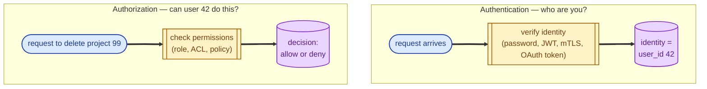
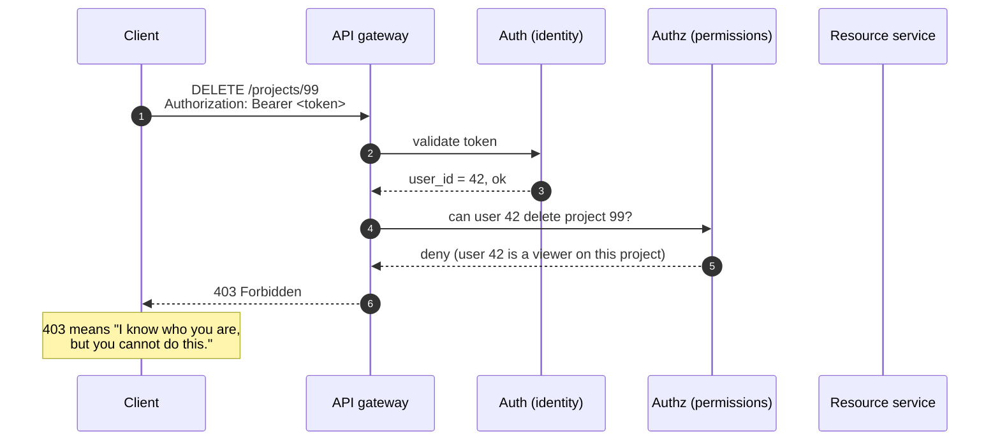
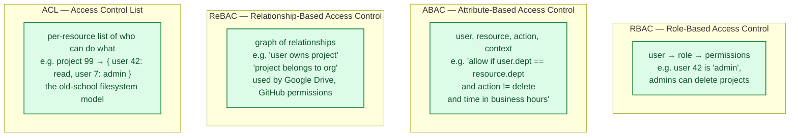
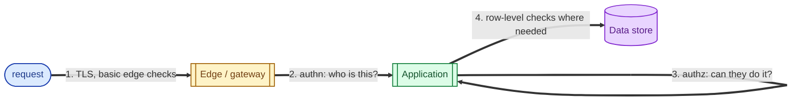

Authentication answers "who are you?" Authorization answers "are you allowed to do this?" They sound related, and they often live next to each other in code, but they are completely separate problems with completely separate failure modes. The bugs that matter come from mixing them up: an attacker who is authenticated as Alice can do everything Alice can do, even if "Alice" should not have been able to do most of it in the first place. Separating the two cleanly is one of the simplest, highest-leverage discipline moves in security.

## The two questions

Authentication establishes **who** the caller is. Authorization decides **what** that caller may do. Every request to a protected system passes through both gates, in that order.

## The full path of a request

The two HTTP status codes mirror the two checks:

- **401 Unauthorized:** we don't know who you are (authentication failed).
- **403 Forbidden:** we know who you are, but you cannot do this (authorization failed).

Returning the wrong code is a small bug; mixing the two checks in code is a big one.

## Common authentication mechanisms

How identity is established depends on the trust model:

- **Password + session cookie.** The classic web pattern.
- **JWT or signed token.** Stateless, common in APIs and SPAs. See [JWT vs session cookies](/practice/system-design/concepts/052-jwt-vs-session-cookies/).
- **OAuth / OpenID Connect.** "Sign in with Google" delegated identity. See [API key vs OAuth vs mTLS](/practice/system-design/concepts/054-api-key-oauth-mtls/).
- **API key.** Static long-lived credential for machine-to-machine or backend integrations.
- **mTLS.** Both sides present certificates; identity proved by the cert chain.

All of these answer the same question: "after the handshake, who is this caller?"

## Common authorization models

Once you know who is calling, you decide whether they may act. Several models have proven useful:

Most systems start with RBAC ("user has role"), add ABAC when context matters ("only during business hours, only from corporate IP"), and grow toward ReBAC when relationships matter (a Google Doc shared with three people). No single model is right for everything.

## The two failure modes

- **Confused deputy / privilege escalation:** authentication is fine, but authorization is missing or wrong. The user is genuinely user 42, but the code allows them to delete a project they should not own. The famous "/api/orders/{id}" endpoint that returns any order if you change the id.
- **Identity confusion:** authorization runs against the wrong identity. The caller pretended to be a different user, or the token belongs to another tenant, or "user 42" is actually a service account that should not be acting as a human.

Mixing the two checks in code makes both modes more likely. Separating them mechanically (an identity layer that hands a verified principal to the authorization layer) catches both.

## Where each check belongs

Authentication often happens once at the edge or in a middleware: validate the token, attach a verified user object to the request, never trust the client's claim of identity again. Authorization happens **everywhere** something is being accessed: per endpoint, per operation, often per row when multi-tenant.

## Two scenarios

**Scenario one: a multi-tenant SaaS.**

A user signs in (authentication: their JWT is valid; user_id = 42; tenant_id = 7). They request `GET /projects/99`. Authorization needs to check two things: does project 99 belong to tenant 7, and does user 42 have read access to it within that tenant. If either check is missed, you have a cross-tenant data leak; this is the canonical SaaS security bug.

**Scenario two: a machine-to-machine API.**

A partner service authenticates with an API key (or, better, mTLS). Authorization is "this key is allowed to read inventory but not write." Same two questions, applied to a service instead of a human. The mechanics differ; the structure does not.

## What this connects to

- **JWT vs session cookies.** Two authentication delivery mechanisms. See [JWT vs session cookies](/practice/system-design/concepts/052-jwt-vs-session-cookies/).
- **API key vs OAuth vs mTLS.** Three authentication styles for different trust models. See [API key vs OAuth vs mTLS](/practice/system-design/concepts/054-api-key-oauth-mtls/).
- **Idempotency.** Sometimes used as a weak form of "did I already do this for this caller?" but it is not authentication. See [Idempotency](/practice/system-design/concepts/021-idempotency/).
- **Secrets management.** Where authentication credentials live, and how they rotate. See [Secrets management](/practice/system-design/concepts/055-secrets-management/).

## Common mistakes

- **Authorization-by-obscurity.** "Nobody will guess this URL" is not a security model.
- **Authentication implies authorization.** "They signed in, so they can see this." No. Different question.
- **Implicit tenant scoping.** Forgetting to check tenant on every query in multi-tenant systems is the most common SaaS data leak. Use database-level tenant filters as a backstop.
- **Returning 401 when you mean 403.** Tells the attacker which one they need to fix.
- **Authorization checks only in the UI.** The API is the security boundary. The UI is decoration.
- **No deny-by-default.** A new endpoint shipped without an authorization rule defaults to "allowed" in many frameworks. Always start from "deny" and explicitly allow.
- **Reusing identity across boundaries.** A token meant for the audit service shouldn't authorise actions on the billing service. Scope tokens narrowly.

## Quick recap

- Authentication: who are you? Once per session or request, at the edge.
- Authorization: can you do this? Every time, per resource, per action.
- 401 means "we don't know you." 403 means "we know you, no."
- Separate them in code. Defaults to deny.
- The most common bug is good authentication paired with absent or sloppy authorization.

This concept sits in **Stage 4 (Scaling and reliability)** of the [System Design Roadmap](/practice/system-design/roadmap/).
