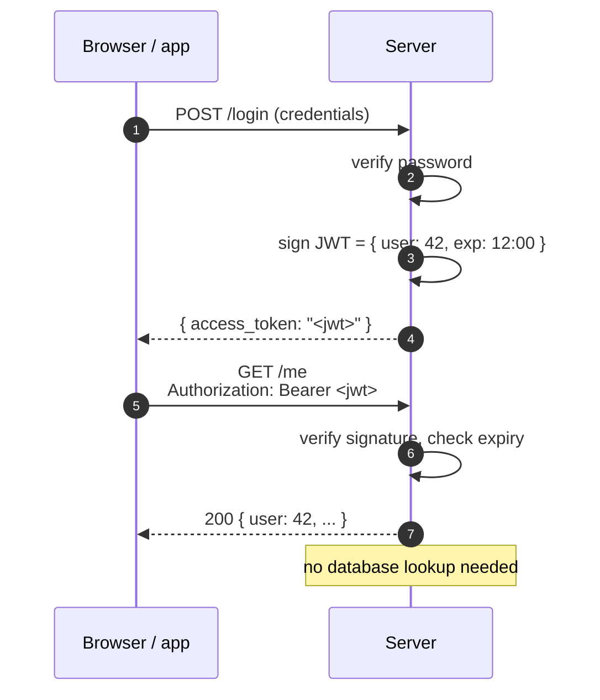
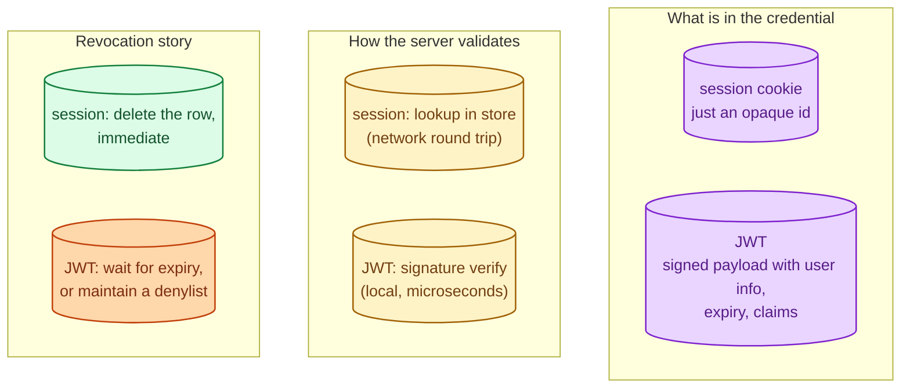
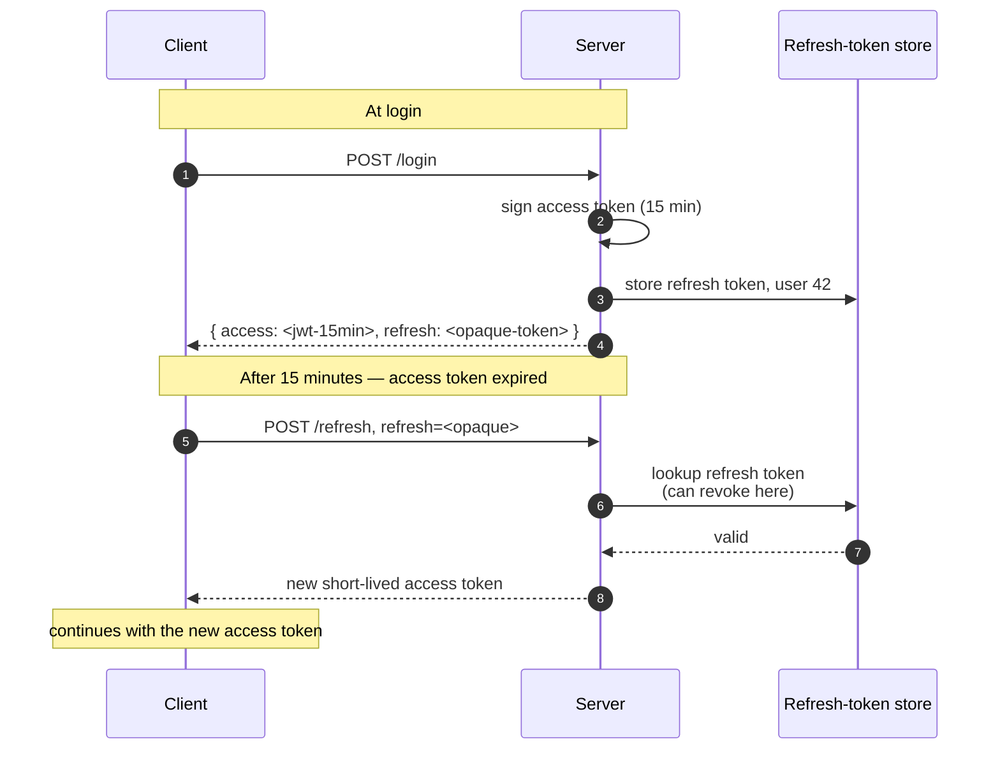

Both are ways of telling the server "remember that I logged in." A session cookie is a small opaque identifier the browser sends with every request; the server looks it up to find the session state. A JWT is a signed token that **contains** the session state, so the server can verify and use it without a lookup. JWTs sound technically superior and have become the default in modern APIs; they also have specific failure modes that session cookies do not. Pick the right one by use case, not by fashion.

## How a session cookie works

The server stores session state (user id, login time, permissions) in a session store (database, Redis, memory). It hands the client a small opaque string ("sid=abc123"); the client returns it with every request.

```mermaid
sequenceDiagram
    autonumber
    participant U as Browser
    participant S as Server
    participant SS as Session store (Redis)

    U->>S: POST /login (credentials)
    S->>S: verify password
    S->>SS: SET session abc123 = { user: 42, ... }
    S-->>U: Set-Cookie: sid=abc123; HttpOnly; Secure

    U->>S: GET /me<br/>Cookie: sid=abc123
    S->>SS: GET session abc123
    SS-->>S: { user: 42, ... }
    S-->>U: 200 { user: 42, ... }
```

The cookie itself is meaningless; it is just a pointer. All the real data lives on the server.

**Strength.** Easy to invalidate (delete the session row; the cookie is now useless). State is owned by the server.

**Weakness.** Every request needs a lookup. Stateful: scaling means putting the session store somewhere shared.

## How a JWT works

The server signs a token that contains the session data ("user: 42, expires: ..."). The client carries the whole token on every request. The server verifies the signature; if valid, it trusts the contents without any lookup.



The token is self-contained. The server's only job is to verify the signature, which is fast and stateless.

**Strength.** Stateless. Any server with the verification key can validate without a lookup. Scales horizontally with no shared session store.

**Weakness.** Cannot be invalidated before expiry. A leaked or stolen JWT is valid until it expires; revoking it requires a separate denylist (and now you have state again, defeating the win).

## Side by side



The trade-offs all flow from one fact: sessions keep state on the server, JWTs put it in the credential.

## The refresh-token pattern (JWT's saving grace)

Long-lived JWTs are dangerous because they cannot be revoked. The accepted fix is **short-lived access tokens** (15 minutes) paired with **long-lived refresh tokens** (days or weeks). The access token does most of the work; the refresh token is exchanged for new access tokens periodically and **can** be revoked (it lives in a database).



This pattern gets you the scalability of JWT for the hot path (every request validates without a lookup) while preserving the revocability of sessions for the slow path (refresh).

## When to pick session cookies

- A traditional web application served from a server-rendered backend.
- You want immediate logout on revocation (security event, password reset).
- You can afford a fast session lookup (Redis is right next door).
- Single domain, browser-only, no mobile or third-party clients.

This is most internal tools, traditional SaaS dashboards, and anything where the security team wants a hard "log everyone out now" button.

## When to pick JWT (with refresh tokens)

- Stateless APIs serving mobile, SPA, or third-party clients.
- Many services that need to authenticate without talking to a shared session store.
- Microservice architectures where every service should verify identity locally.
- Federated identity (SSO, social login) where the issuer is not the resource server.

This is most modern APIs. The combination of short access + revocable refresh gives you most of session cookies' safety with most of JWT's scalability.

## Cookie security flags

Whichever one you use, the browser cookie behaviour matters more than the credential format. Set:

- **HttpOnly:** JavaScript cannot read the cookie. Stops XSS from stealing it.
- **Secure:** browser only sends it over HTTPS.
- **SameSite:** Lax or Strict; stops CSRF on most user-driven submissions.
- **Path / Domain:** scope it as tightly as possible.

A JWT in `localStorage` (a common pattern in SPAs) is **less** safe than a session cookie with the right flags, because any XSS reads `localStorage`. A JWT in an HttpOnly cookie gets the same XSS protection as a session cookie.

## Two scenarios

**Scenario one: an internal admin dashboard.**

Web-only, security team needs immediate revocation, traffic is modest. Session cookies + Redis. "Log them out" is a single DELETE. No JWT theatre needed.

**Scenario two: a mobile app and a web SPA sharing a backend API.**

Stateless backend with short JWT access tokens (15 min) and refresh tokens stored in a database. Mobile and web both work identically. Backend scales without a session store; revocation is "revoke the refresh token" and the user is locked out within the access-token expiry window.

## What this connects to

- **Authentication vs authorization.** Both are mechanisms for the authentication half. See [Authentication vs authorization](/practice/system-design/concepts/051-authn-vs-authz/).
- **API key vs OAuth vs mTLS.** Other authentication styles, often paired with JWTs as the bearer token. See [API key vs OAuth vs mTLS](/practice/system-design/concepts/054-api-key-oauth-mtls/).
- **Stateless vs stateful services.** JWTs help with horizontal scaling because they remove a per-request shared lookup. See [Stateless vs stateful services](/practice/system-design/concepts/040-stateless-vs-stateful/).
- **Secrets management.** The signing key for JWTs is a critical secret. See [Secrets management](/practice/system-design/concepts/055-secrets-management/).

## Common mistakes

- **Long-lived JWTs with no refresh-token story.** A leaked token is valid for hours or days with no way to revoke.
- **JWTs in localStorage.** XSS reads them trivially. Use HttpOnly cookies for JWTs in browsers.
- **Trusting JWT claims without verifying.** The signature must be checked; the `alg: none` attack exists because libraries sometimes skip this.
- **Cookie without HttpOnly / Secure / SameSite.** A long list of attack vectors becomes easy.
- **Stuffing too much into JWTs.** Tokens grow, every request gets bigger, claims become hard to update.
- **Forgetting the signing key is a deployable secret.** Rotate it. Pin clients to a key id (kid) so rotation is non-breaking.
- **One token, one lifetime.** Access and refresh have different security profiles; treating them the same loses the value of separating them.

## Quick recap

- Session cookie: opaque id, server-side state, easy to revoke, requires a session store.
- JWT: self-contained signed token, stateless verification, cannot be invalidated before expiry.
- Modern pattern: short JWT access tokens + revocable refresh tokens. Best of both.
- Cookie flags (HttpOnly, Secure, SameSite) matter more than the credential format.
- Pick by use case (admin dashboard vs API), not by fashion.

This concept sits in **Stage 4 (Scaling and reliability)** of the [System Design Roadmap](/practice/system-design/roadmap/).
