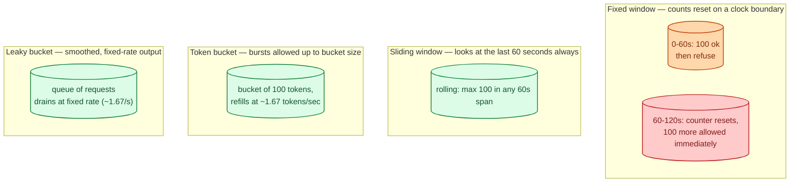
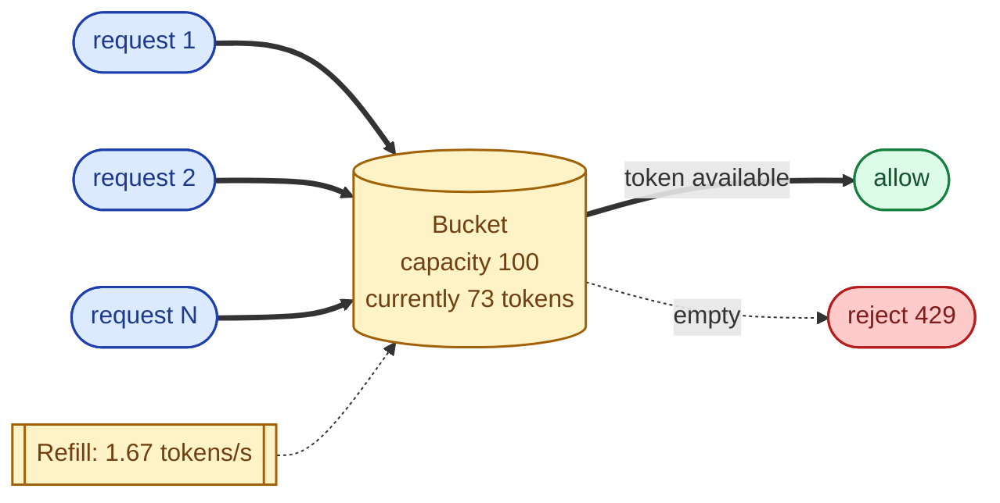
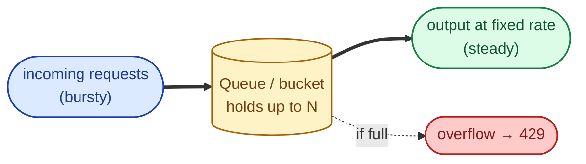
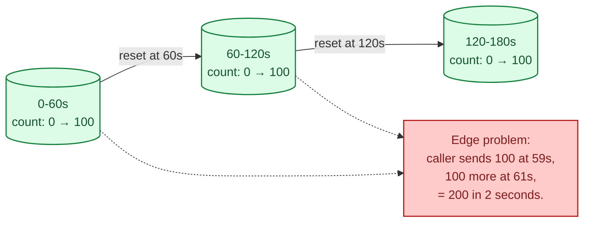
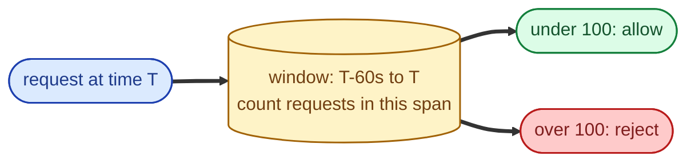
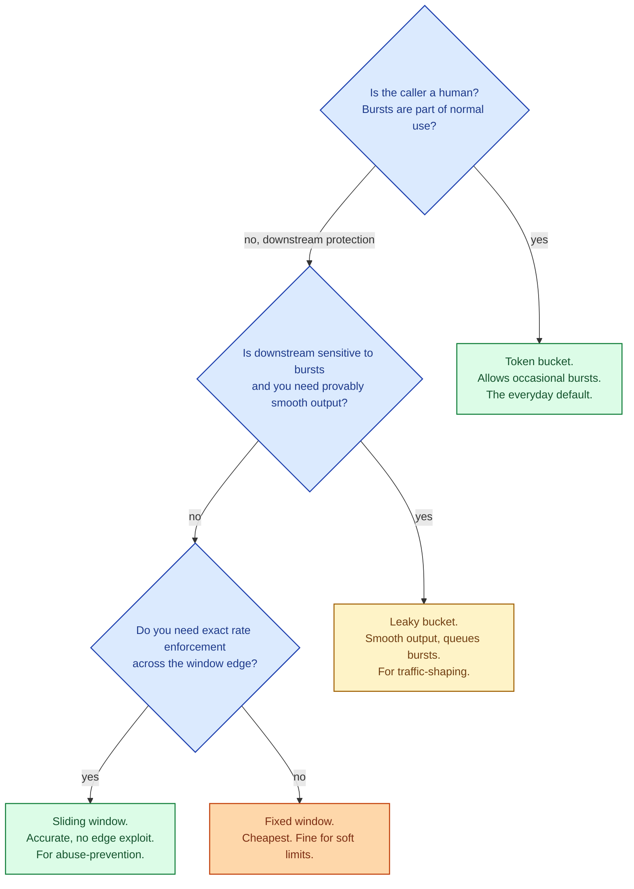

Rate limiting caps how many requests a caller may make in a given window. The reasons are familiar: protect the service from abuse, share capacity fairly across users, enforce contractual quotas, prevent runaway scripts from bringing down the system. The four classic algorithms (token bucket, leaky bucket, fixed window, sliding window) each shape that cap differently, and the difference matters at the boundary. The mistake is using one when another would have been smoother for the same workload.

## What "100 requests per minute" actually means

Imagine the limit is 100 requests per minute per user. A caller sends 100 requests in the first second of the minute. Are they under the limit or over? The answer depends entirely on the algorithm. Each one shapes the same nominal limit into a different actual experience.

Same nominal limit; four different shapes of "allowed."

## Token bucket: bursts are okay

A bucket holds N tokens. Each request takes one token. Tokens refill at a steady rate (e.g., one every 600 ms for a 100/min limit). Requests are allowed if a token is available; otherwise rejected.

**Strength.** Allows short bursts (full bucket) followed by sustained operation at the refill rate. Matches how users actually behave: occasional clusters of activity, mostly idle.

**Weakness.** A caller who saves up tokens can flood briefly. For the protected service, brief floods may be the thing you wanted to prevent.

Used by: AWS, Stripe, most modern APIs. Configurable per-key with separate "burst" and "sustained" rate.

## Leaky bucket: smooth output

Requests enter a queue. They leave the queue at a fixed rate. If the queue is full, new requests are dropped. The output is perfectly smooth.

**Strength.** Output is provably bounded and steady. Good for protecting a downstream that genuinely cannot handle bursts.

**Weakness.** Bursty callers must wait (latency penalty) instead of being allowed through quickly. Less friendly to user-facing flows where occasional bursts are normal.

Used by: network traffic shaping, some database write-throttling.

## Fixed window: simple, with edge problems

Count requests within fixed time buckets (e.g., per minute). When the bucket overflows, reject. When the clock turns over, reset.

**Strength.** Trivial to implement: one counter per user, reset on the minute. One Redis INCR per request.

**Weakness.** The window edge. A caller can double their "allowed" rate by hammering at the boundary. For a 100/min limit, the worst case is 200 in two seconds, every minute.

Used by: simple APIs, internal services where the edge effect does not matter.

## Sliding window: smooth and accurate

Always consider the last N seconds, not a fixed boundary. A naive implementation stores a timestamp per request and counts how many fall in the window. A more efficient one (sliding-window log, or sliding-window counter) approximates.

**Strength.** No edge effects. The rate is genuinely "100 per minute, always."

**Weakness.** More bookkeeping than fixed window. Naive implementations store every timestamp; efficient ones use weighted counters across two adjacent windows.

Used by: Cloudflare, many edge services, anything where the fixed-window edge would be exploitable.

## Picking a strategy

In practice, **token bucket** dominates user-facing APIs because real users come in bursts. **Sliding window** dominates security and abuse-prevention because the fixed-window edge is exploitable. **Leaky bucket** is for shaping output to a sensitive downstream.

## Where the limit lives

The same algorithm can be applied at many layers:

- **Edge / CDN.** Cloudflare, Fastly, AWS WAF. Cheap to enforce, blocks abuse before it reaches the origin.
- **API gateway.** Kong, Envoy, AWS API Gateway. Per-route, per-user limits.
- **Application code.** Fine-grained limits per endpoint, per tenant.
- **Database / external service.** A separate quota system to protect the dependency.

A real system layers multiple limits: a generous edge limit catches obvious abuse; per-user limits inside catch quota violations; downstream-protection limits guard expensive operations.

## Two scenarios

**Scenario one: a public API with paid tiers.**

Free users: 100 requests per minute, token bucket. Pro users: 1,000 requests per minute. Enterprise: custom. Token bucket fits because users naturally burst (loading a page makes 10 calls; idling makes 0). When users exceed, return `429 Too Many Requests` with `Retry-After: 15`.

**Scenario two: a login endpoint defending against credential stuffing.**

Per-IP and per-account limits, both sliding window. 5 attempts per 5 minutes. Sliding window because attackers exploit fixed-window edges. After lockout, send a captcha challenge instead of just rejecting; humans can solve it, scripts cannot.

## What this connects to

- **Bulkheads and rate limiting.** Rate limits protect against abuse; bulkheads protect against bad downstreams. See [Bulkheads and rate limiting](/practice/system-design/concepts/047-bulkheads-and-rate-limiting/).
- **Retry with backoff.** Clients should respect `Retry-After` and apply jitter; rate-limited retries are still retries. See [Retry with exponential backoff and jitter](/practice/system-design/concepts/046-retry-backoff-jitter/).
- **Authentication.** Rate limits often differ by authenticated identity vs anonymous. See [Authentication vs authorization](/practice/system-design/concepts/051-authn-vs-authz/).
- **CDN.** Edge rate limiting is one of a CDN's main jobs. See [CDN](/practice/system-design/concepts/027-cdn-when-you-need-it/).
- **Load balancing algorithms.** Consistent hashing on user id makes per-user limits actually work in a clustered limiter. See [Load balancing algorithms](/practice/system-design/concepts/030-lb-algorithms/).

## Common mistakes

- **One limit at the edge, nothing inside.** A noisy authenticated user inside the limit can still abuse expensive operations.
- **Per-IP only.** Many users share IPs (corporate NAT, ISP CGNAT). Per-IP limits punish good users in bulk.
- **No 429 response or Retry-After header.** Clients cannot back off intelligently. They retry harder.
- **Fixed window on a login endpoint.** Attackers time their attempts to the window edge and double their effective rate.
- **Limits stored only in memory.** Multi-instance services need a shared counter (Redis). Otherwise the limit is per-instance, not per-user.
- **Same limit for all endpoints.** A cheap `/health` and an expensive `/search` should not share quota.
- **Treating limits as security.** Limits slow abuse, they don't stop a determined attacker. Pair with authentication, MFA, and behavioural detection.

## Quick recap

- Token bucket: bursts allowed; the everyday default.
- Leaky bucket: smooth output; for protecting fragile downstreams.
- Fixed window: simple; vulnerable at the edge.
- Sliding window: accurate; better for abuse prevention.
- Layer limits at the edge, in the gateway, and inside the application.
- Always return 429 + Retry-After; clients are part of the contract.

This concept sits in **Stage 4 (Scaling and reliability)** of the [System Design Roadmap](/practice/system-design/roadmap/).
