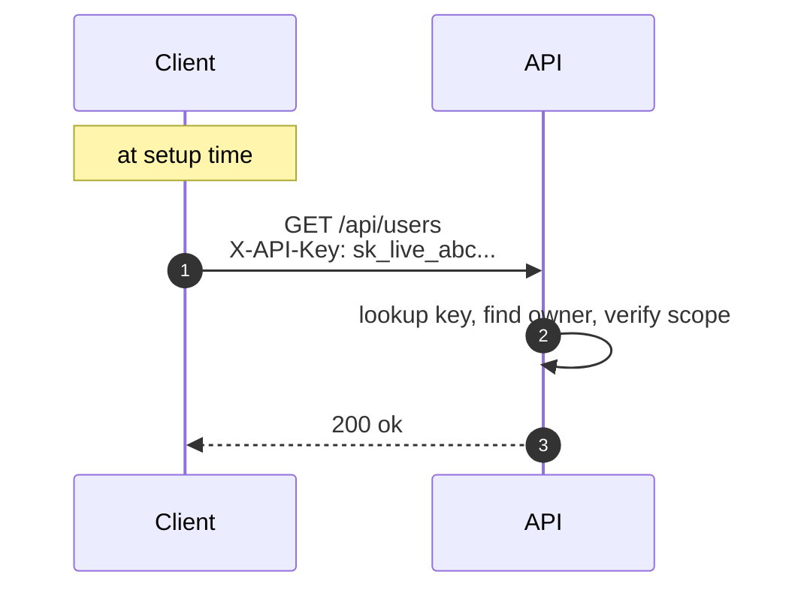
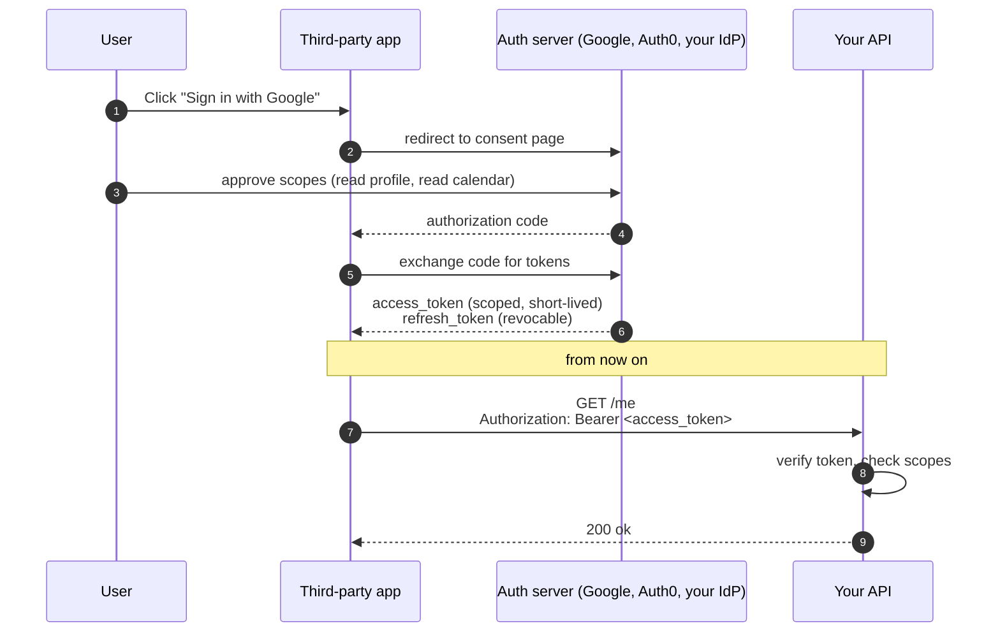
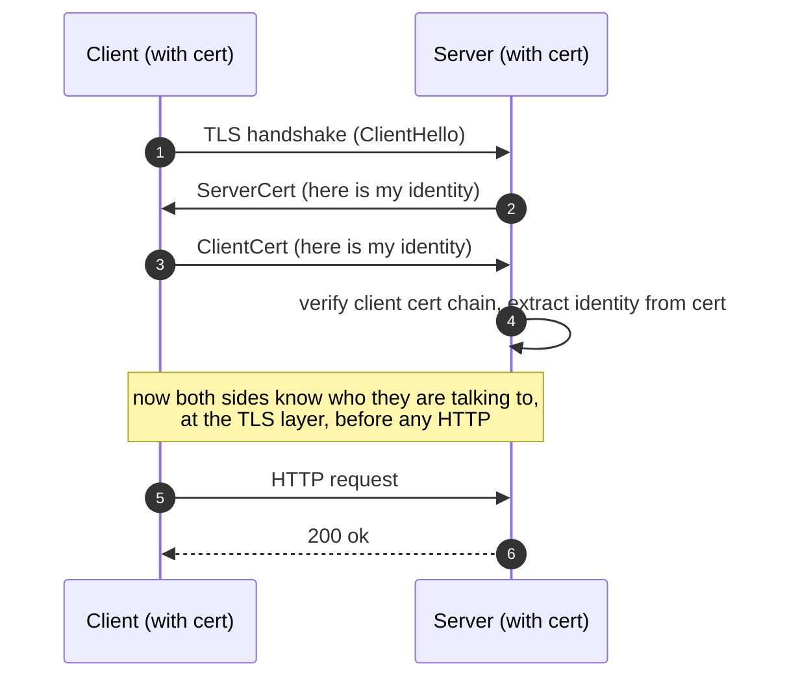
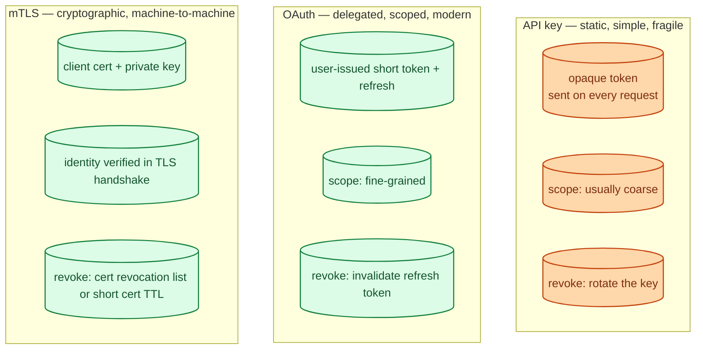
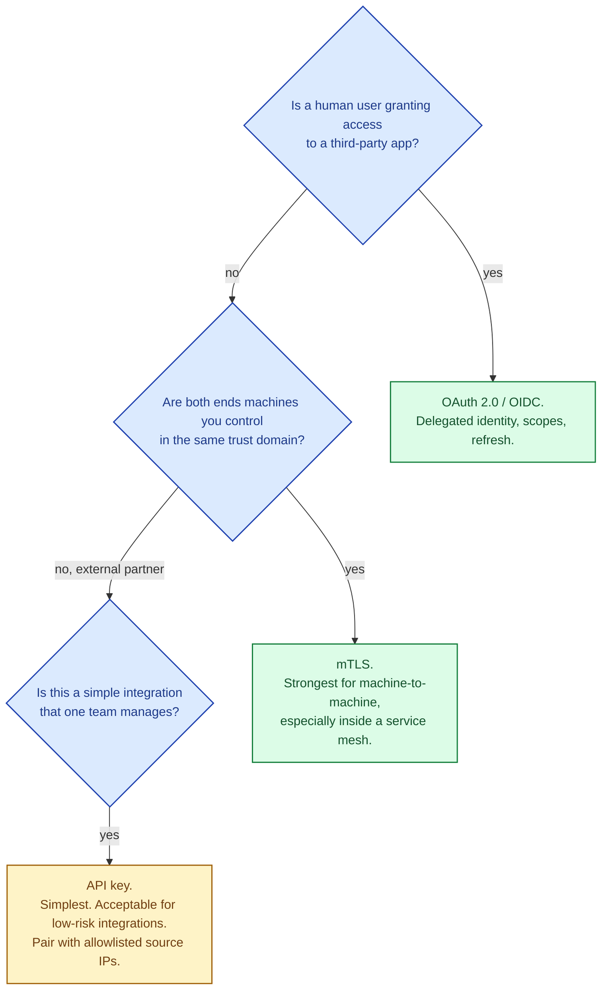

There are roughly three styles of API authentication in widespread use. **API keys** are static credentials you copy and paste; simplest, weakest. **OAuth** is delegated identity with scopes and refresh; the modern default for user-authorising-an-app flows. **mTLS** uses certificates on both sides; the strongest for machine-to-machine traffic. They are not direct substitutes. Each fits a specific trust model, and picking the wrong one for your workload leaks data or burns months of refactoring.

## API keys: simple, static, dangerous to lose

The server generates a long random string. The client stores it and sends it in a header on every request.

**Strength.** Trivial to use, trivial to integrate, supported everywhere.

**Weakness.** It is a bearer token: whoever has it, is you. No expiry by default. Hard to scope finely. If it leaks (committed to git, in a log, in a screenshot), it is fully usable until rotated. Most "stolen credentials" incidents in public reporting are API keys in repos.

Used by: simple integrations, server-to-server APIs, internal tooling, public APIs with paid tiers (Stripe `sk_test_*`, GitHub PATs).

## OAuth: delegated, scoped, refreshable

OAuth 2.0 separates **resource server** (your API), **authorization server** (issues tokens), and **client app** (the third-party making the request on behalf of a user). The user grants the app specific permissions; the app gets a token with those scopes.

**Strength.** The user controls what the app can do. Tokens are scoped (`read:profile` ≠ `delete:account`) and short-lived. Refresh tokens can be revoked. Standardised across providers.

**Weakness.** More machinery: PKCE, code exchange, token introspection, revocation endpoints. Doing it wrong is a long list of CVEs. Use a battle-tested library; do not roll your own.

Used by: anything where users grant access to a third party (Google APIs, GitHub Apps, Slack apps), customer-facing logins ("Sign in with X"), enterprise SSO.

## mTLS: certificates on both sides

In normal TLS, the server proves its identity with a certificate; the client trusts based on the chain. In **mutual TLS**, the client also presents a certificate, and the server verifies it the same way.

**Strength.** Identity is verified before any application-layer code runs. Cannot be replayed without the private key. Excellent for machine-to-machine where both sides have hardware key storage.

**Weakness.** Operationally heavier. Certificate distribution and rotation are real problems; this is what a PKI (or a service mesh like Istio / Linkerd) automates. Not browser-friendly without a hardware token.

Used by: service-to-service inside a Kubernetes mesh (mTLS is automatic in Istio), high-trust B2B integrations, financial APIs, IoT device authentication.

## Side by side

## The picker

For user-facing APIs that involve a "log in with X" or third-party apps: OAuth. For service-to-service inside a Kubernetes cluster: mTLS (your service mesh does it for free). For internal scripts, partner integrations, and personal access tokens: API keys, scoped tightly with short TTLs.

## Three scenarios

**Scenario one: a Stripe-like payments API.**

API keys, with separate `sk_live` (production) and `sk_test` (testing) prefixes. The key encodes which environment, so a leaked test key is far less dangerous than a leaked live key. Rotation is built into the dashboard. Webhook delivery uses a separate signing secret. This is the "API key done responsibly" template.

**Scenario two: a SaaS that integrates with Slack and Google Drive.**

OAuth. The user logs in with Slack; Slack hands you scoped tokens that let you post messages but not read DMs. The user can revoke at any time from their Slack settings. No long-lived secret stored on your servers.

**Scenario three: a microservice cluster on Kubernetes.**

mTLS via Istio or Linkerd. Every pod gets a short-lived cert automatically. Service-to-service identity is verified cryptographically without any application-level secrets. The mesh handles rotation. The application code does not even know mTLS is happening.

## What this connects to

- **Authentication vs authorization.** All three are mechanisms for the authentication half. See [Authentication vs authorization](/practice/system-design/concepts/051-authn-vs-authz/).
- **JWT vs session cookies.** OAuth tokens are usually JWTs. See [JWT vs session cookies](/practice/system-design/concepts/052-jwt-vs-session-cookies/).
- **Secrets management.** All three involve secrets that must be stored and rotated. See [Secrets management](/practice/system-design/concepts/055-secrets-management/).
- **L4 vs L7 load balancing.** mTLS termination is often pushed to or past the load balancer. See [L4 vs L7 load balancing](/practice/system-design/concepts/029-l4-vs-l7/).

## Common mistakes

- **API keys in git.** Use git-secrets, pre-commit hooks, and secret-scanning. Assume any key that touched a repo is compromised.
- **One API key for everything.** Scope keys to the smallest set of operations they need.
- **OAuth Implicit flow in 2025.** Deprecated. Use Authorization Code + PKCE.
- **Storing OAuth tokens in localStorage.** Same XSS problem as JWTs in localStorage. Use HttpOnly cookies or in-memory storage with refresh on reload.
- **mTLS certificates with year-long lifetimes.** Cert rotation should be automatic and frequent. SPIFFE / Istio default to hours.
- **Treating "OAuth" as a checkbox.** OAuth has many flows. Most security CVEs are people using the wrong one (Implicit, Resource Owner Password) or skipping PKCE.
- **No revocation path.** A static credential with no revocation story is a future incident waiting to happen.
- **Mixing auth styles in one path.** Different services authenticated three different ways across one request makes audit and incident response much harder.

## Quick recap

- API key: simple, static, scoped narrowly, rotated often. Fine for low-risk machine-to-machine.
- OAuth 2.0 / OIDC: delegated user identity, scoped tokens, refreshable. The default for user-authorising-an-app flows.
- mTLS: cryptographic machine identity at the TLS layer. The strongest for service mesh and B2B.
- Use the right one for the trust model; do not pick by familiarity.

This concept sits in **Stage 4 (Scaling and reliability)** of the [System Design Roadmap](/practice/system-design/roadmap/).
