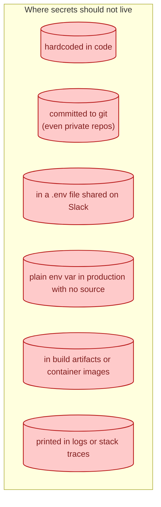
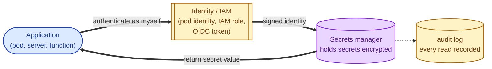
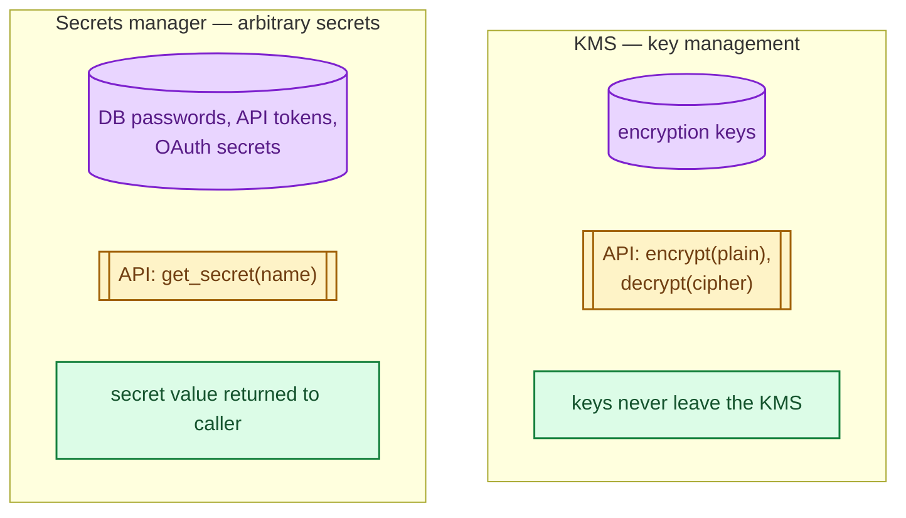
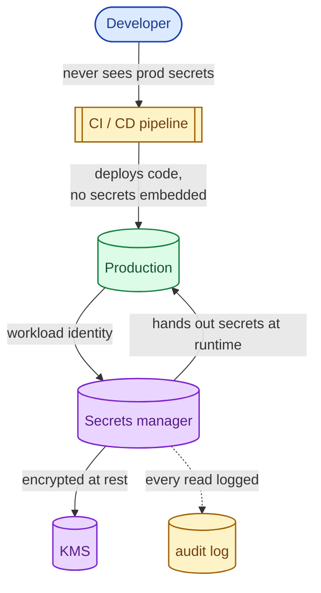

A secret is anything whose unauthorised disclosure is a problem: API keys, database passwords, OAuth client secrets, signing keys, TLS private keys, third-party tokens. Where you store them, how you rotate them, and what happens when one leaks are the questions every system has to answer. The wrong answers ("it's in the .env file in the repo") are how breaches start. The right ones use specialised infrastructure that is boring, well-understood, and worth setting up before you need it.

## The bad answers (and why they keep happening)



Every one of these is responsible for real incidents you have read about. They all share one property: the secret is permanently embedded in something that gets copied, shipped, or archived. The blast radius of a leak is "everyone who has ever had access to that copy."

## The shape of a good answer

A secrets manager is a service that holds secrets encrypted, hands them out only to authenticated callers, and logs every access. Examples: HashiCorp Vault, AWS Secrets Manager, Azure Key Vault, GCP Secret Manager, Kubernetes Secrets (with sealed-secrets or external-secrets).



The application doesn't store secrets; it has an **identity** (an IAM role, a pod identity, a workload identity token) that lets it request secrets at runtime. Crucially, the secret never lives in a git repo, an image, or a deploy artifact.

## KMS vs secrets manager

The two get confused. A **Key Management Service (KMS)** stores encryption keys and offers `Encrypt(plaintext)` and `Decrypt(ciphertext)` APIs. It never returns the key itself. A **secrets manager** stores arbitrary secret strings (passwords, tokens) and returns them on request to authorised callers.



Most systems use both: a KMS encrypts the data store the secrets manager keeps; a secrets manager hands out the application secrets the code needs.

## Rotation: the second half of the job

A secret that has never been rotated has been compromised for as long as it has existed. Rotation is the discipline of replacing secrets on a schedule, ideally without downtime.

```mermaid
sequenceDiagram
    autonumber
    participant SM as Secrets manager
    participant DB as Database
    participant APP as Application

    Note over SM,APP: 90 days have passed; time to rotate the database password

    SM->>DB: create new password (alongside old)
    DB-->>SM: ok, both work
    SM->>SM: store new value, mark old as expiring
    Note over APP: applications fetch on next refresh
    APP->>SM: get DB credentials (cached has expired)
    SM-->>APP: new password
    APP->>DB: reconnect with new password

    Note over SM,DB: After grace period
    SM->>DB: revoke old password
```

The trick is the **grace period** where both secrets work. Without it, the application sees "old works → old revoked → new not yet picked up → outage." Tools like Vault's dynamic secrets and AWS Secrets Manager's rotation Lambdas automate this.

## Dynamic / leased secrets (the gold standard)

Static secrets, even rotated, are still long-lived between rotations. **Dynamic secrets** go further: the secrets manager creates a brand-new credential per request, with a short lifetime (minutes to hours), and revokes it when the lease expires.

Examples:

- Vault creates a database user with a 1-hour TTL; the app uses it and discards it; Vault deletes the user when the lease ends.
- AWS STS issues temporary IAM credentials valid for one hour.
- OIDC federation issues short-lived workload tokens.

The blast radius of a leaked dynamic secret is bounded by its TTL. A leaked Vault-generated database credential from yesterday is already useless today.

## What this looks like in practice



The structural property is: developers do not see production secrets, CI does not ship them, code does not embed them, the audit log records every fetch. Each link is independent and replaceable.

## Two scenarios

**Scenario one: a small SaaS on AWS.**

AWS Secrets Manager for database passwords and third-party API keys. IAM roles per service, no static keys in env vars or code. Secrets Manager rotates the database password every 90 days via a Lambda. CloudTrail logs every Get call. Total ops cost: about an hour to set up plus a few cents per month per secret.

**Scenario two: a regulated fintech.**

HashiCorp Vault as the central secrets layer. Database credentials are dynamic: every connection comes from a freshly-leased user with a 30-minute TTL. The signing key for JWTs lives in the cloud KMS and never leaves; the application asks the KMS to sign on its behalf. Audit logs feed a SIEM. Every secret access is attributable to a specific workload identity at a specific time.

## What this connects to

- **JWT vs session cookies.** Signing keys are secrets that should live in a KMS, not in a config file. See [JWT vs session cookies](/practice/system-design/concepts/052-jwt-vs-session-cookies/).
- **API key vs OAuth vs mTLS.** All three involve secrets that must be stored and rotated correctly. See [API key vs OAuth vs mTLS](/practice/system-design/concepts/054-api-key-oauth-mtls/).
- **Authentication vs authorization.** The application authenticates to the secrets manager using its own identity; this is authentication you cannot skip. See [Authentication vs authorization](/practice/system-design/concepts/051-authn-vs-authz/).
- **Observability.** Audit logs from the secrets manager are critical signals. See [Observability: metrics, logs, traces](/practice/system-design/concepts/056-observability-metrics-logs-traces/).

## Common mistakes

- **Secrets in env vars from a source no one can find.** "It works in production" is not a secret strategy. Trace every secret to a managed source.
- **Long-lived secrets.** A static API key from three years ago is probably compromised; no audit log will tell you when.
- **Rotation without grace period.** Causes downtime. Pair every rotation with a window where both old and new work.
- **Secrets in container images.** Layers persist; even private registries get copied. Inject secrets at runtime, never bake them in.
- **One identity for everything.** When one component is compromised, the blast radius is unbounded. Each service should have its own identity and minimum scope.
- **No audit on reads.** You will not know after a compromise which secrets the attacker accessed.
- **Hardcoded "for development" that ships to production.** The .env.example file becomes the .env file becomes the production config.
- **Secret scanning only at commit time.** Scan history too. A secret committed once and rotated is still in the git history forever.

## Quick recap

- Secrets never live in code, git, images, or shared chat.
- A secrets manager hands them out at runtime to identified callers; a KMS protects encryption keys.
- Rotation, with a grace period, is the second half of the job.
- Dynamic / leased secrets minimise the blast radius of any single leak.
- The audit log is what tells you what happened after the incident.

This concept sits in **Stage 4 (Scaling and reliability)** of the [System Design Roadmap](/practice/system-design/roadmap/).
