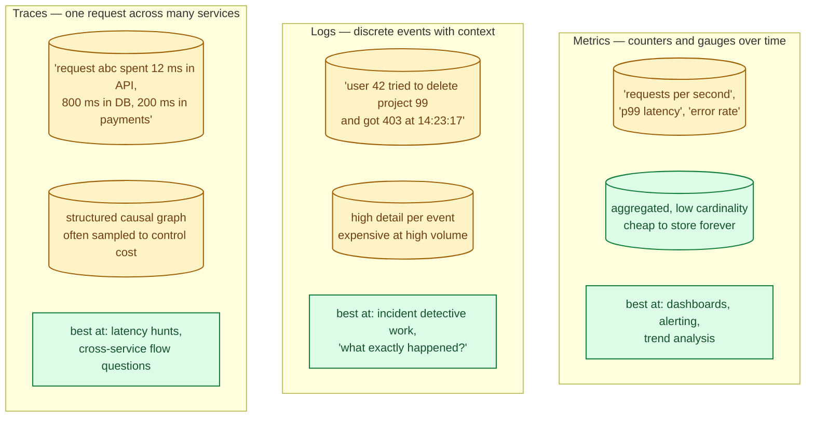
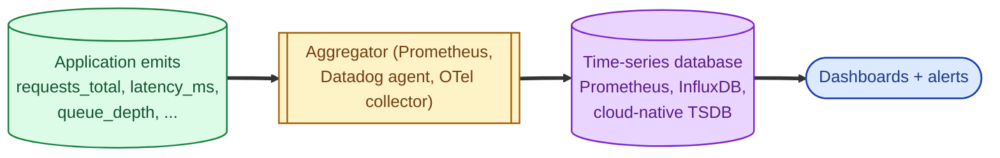
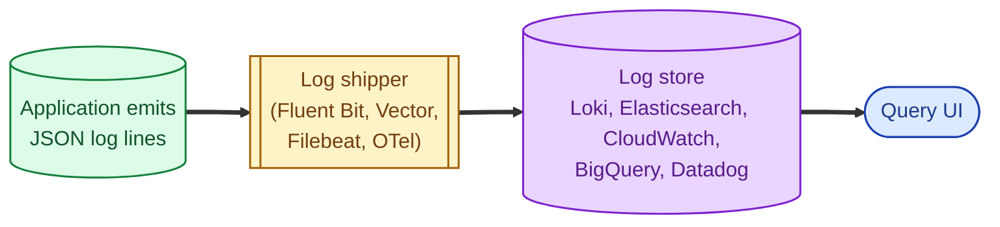
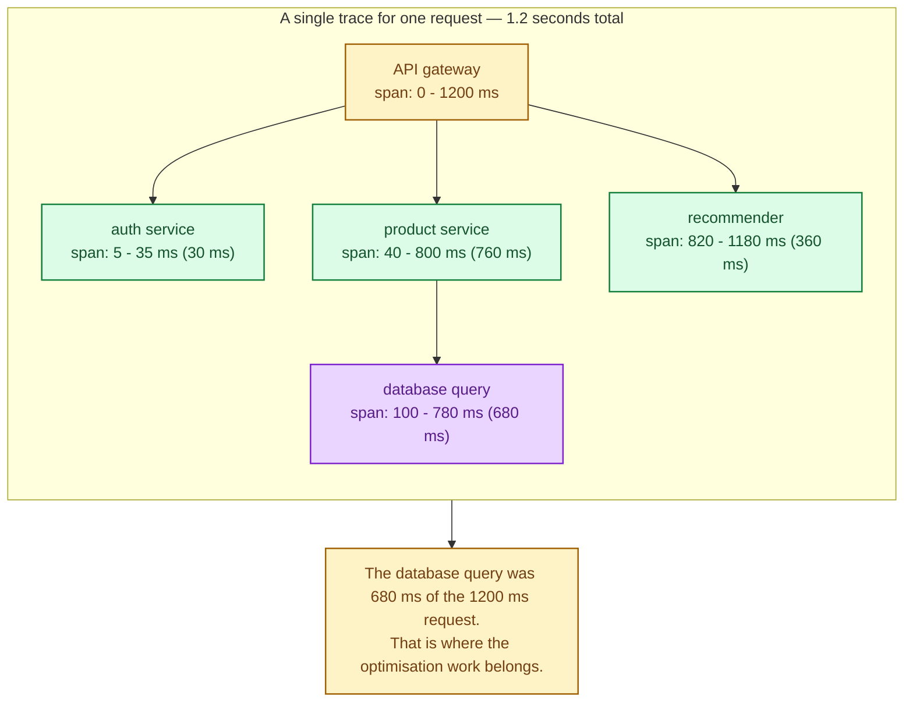

Observability is the discipline of being able to understand a running system from the outside. The three classic pillars (metrics, logs, traces) are not interchangeable; each answers a different kind of question, costs a different amount, and shines in different parts of an incident. A real production system uses all three, and the senior skill is knowing which one to reach for first when something breaks.

## The three pillars at a glance



Metrics tell you **something is wrong**. Logs tell you **what happened**. Traces tell you **where the time went**. They are complementary, not redundant.

## Metrics: the dashboard layer

Metrics are numbers sampled over time, aggregated. They compress huge amounts of activity into small, cheap numbers you can chart and alert on. Each one is a time series.

Three useful types:

- **Counters.** "Total HTTP requests served." Always go up.
- **Gauges.** "Current open connections." Goes up and down.
- **Histograms.** "Latency distribution." Lets you compute p50, p99, max.



A million requests become 60 datapoints per minute per metric. Storage is tiny. Alerts can be written cleanly: "fire when p99 latency > 500 ms for 5 minutes." Metrics are how you find out anything is wrong at all. See [Time-series databases](/practice/system-design/concepts/015-time-series-databases/).

## Logs: the detective layer

A log line is a single event with structured (or semi-structured) fields: timestamp, level, message, context. Logs are detailed but voluminous; every line is a few bytes per request, multiplied by every request.

Once you know something is wrong (from a metric), logs are where you go to find out **what specifically** happened. "Show me every error from the orders service in the last 10 minutes" is a log query.

Modern practice: **structured logs**. JSON, with consistent field names. So you can filter by `user_id`, `request_id`, `tenant_id` instead of grepping unstructured text.



Logs grow fast. A modest service can produce gigabytes per day. Tiered storage (hot for 14 days, warm for 90, cold for compliance) is the standard answer. See [Hot, warm, cold storage tiers](/practice/system-design/concepts/044-storage-tiers/).

## Traces: the cross-service layer

A trace follows **one request** across many services. Each hop is a "span" with a start time, duration, and parent. The result is a tree showing where a single user request spent its time.



Traces are how you answer "this one request was slow; where did the time go?" without grepping logs across five services and stitching timestamps by hand. They are essential the moment you have more than a couple of services. See [Microservices vs monolith](/practice/system-design/concepts/041-microservices-vs-monolith/).

Because traces store per-request structured data, they get expensive at scale. **Sampling** is standard: keep 1-5% of traces, plus 100% of error or slow traces. Open standards (OpenTelemetry) handle the wiring.

## How they fit together

In a real incident, you traverse them in order:

```mermaid
sequenceDiagram
    autonumber
    participant ONCALL as On-call engineer
    participant MET as Metrics dashboard
    participant TR as Traces
    participant LG as Logs

    Note over ONCALL: alert fires: p99 latency spiked
    ONCALL->>MET: which endpoint? which region?
    MET-->>ONCALL: /api/orders, eu-west, started 14:20

    Note over ONCALL: now find an example
    ONCALL->>TR: slow traces for /api/orders since 14:20
    TR-->>ONCALL: 12 traces, all stuck in DB span for ~3s

    Note over ONCALL: what exactly did the DB say?
    ONCALL->>LG: logs for trace_id = abc123
    LG-->>ONCALL: "query waiting on lock; pid 4711 holding"

    Note over ONCALL: root cause: a long-running migration holding a row lock
```

Metric → trace → log is the standard incident path. Each layer narrows the question. You cannot do this from any one of them alone; you need the chain.

## The fourth pillar most teams forget: events

Beyond the three pillars, the **change log** of the system (deploys, feature flag flips, infrastructure changes, scaling events) is usually the answer to "what changed at 14:20?" Wire deploys into the same observability stack so a spike on a chart is visually next to "deploy v452 at 14:19." Half of all incidents are explained the moment you correlate with a deploy.

## What this connects to

- **Time-series databases.** Where metrics live. See [Time-series databases](/practice/system-design/concepts/015-time-series-databases/).
- **Health checks.** Liveness, readiness, and startup probes are themselves observability signals. See [Health checks: liveness vs readiness vs startup](/practice/system-design/concepts/057-health-checks/).
- **Microservices vs monolith.** Tracing is essential the moment you split. See [Microservices vs monolith](/practice/system-design/concepts/041-microservices-vs-monolith/).
- **Storage tiers.** Logs and traces are classic candidates for tiered retention. See [Hot, warm, cold storage tiers](/practice/system-design/concepts/044-storage-tiers/).
- **Circuit breaker.** Breakers should expose state as metrics. See [Circuit breaker](/practice/system-design/concepts/045-circuit-breaker/).

## Common mistakes

- **Logs as your only observability tool.** Searching gigabytes of text to find a p99 spike is slow and expensive. Add metrics.
- **No correlation IDs.** Without a `request_id` or `trace_id` field on every log line, you cannot tie events across services. Inject one at the edge; propagate it through every hop.
- **High-cardinality labels on metrics.** One metric per user means millions of series. Costs explode. Reserve cardinality for trace data, not metrics.
- **Sampling traces by random chance without keeping errors.** Sampling at 1% means most failing traces are gone. Always keep 100% of errors and slow requests.
- **Logging secrets.** Tokens, passwords, full request bodies. The logs become a liability the moment they leak. Redact at emit time. See [Secrets management](/practice/system-design/concepts/055-secrets-management/).
- **No alert review.** Alerts that fire constantly are ignored constantly. Aggressively tune and delete the ones nobody acts on.
- **Three separate vendors for the three pillars with no glue.** The correlation step at 3 AM is what saves you; if metric → trace → log requires three logins and re-typing IDs, you have failed.

## Quick recap

- Metrics: numbers over time. Cheap, dashboards, alerts. Tells you something is wrong.
- Logs: structured events with context. Detailed, expensive at scale. Tells you what happened.
- Traces: one request across many services. Causal graph. Tells you where the time went.
- Use all three. Correlate via request_id / trace_id on every event.
- Wire deploys and feature flag changes into the same view; half of all incidents trace to "what just changed?"

This concept sits in **Stage 4 (Scaling and reliability)** of the [System Design Roadmap](/practice/system-design/roadmap/).
