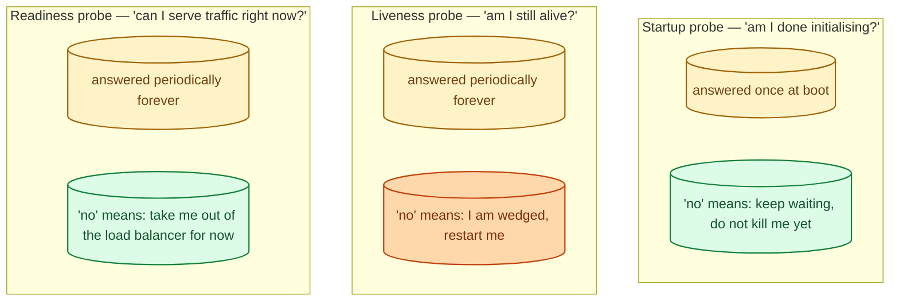
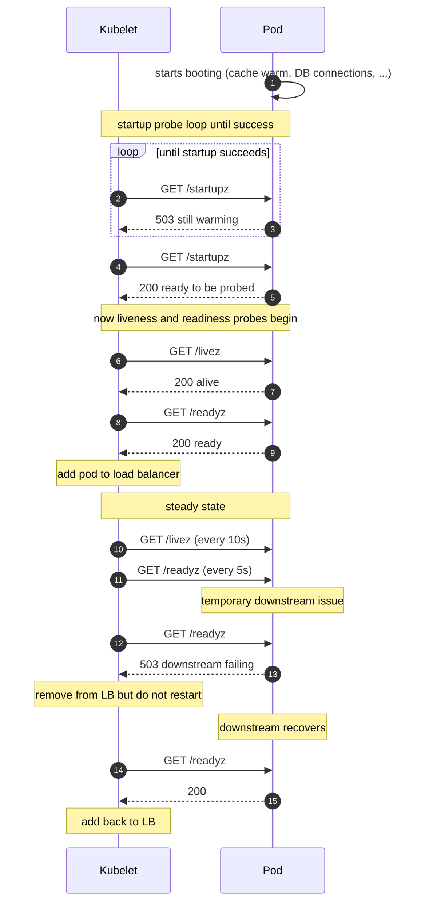
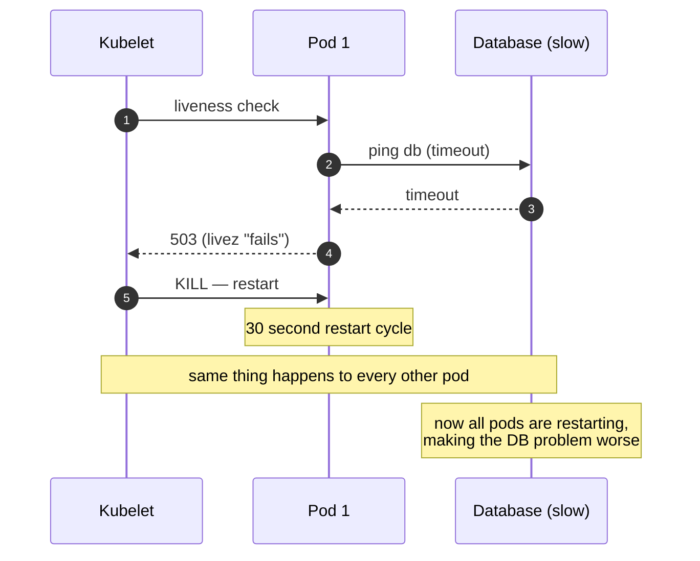
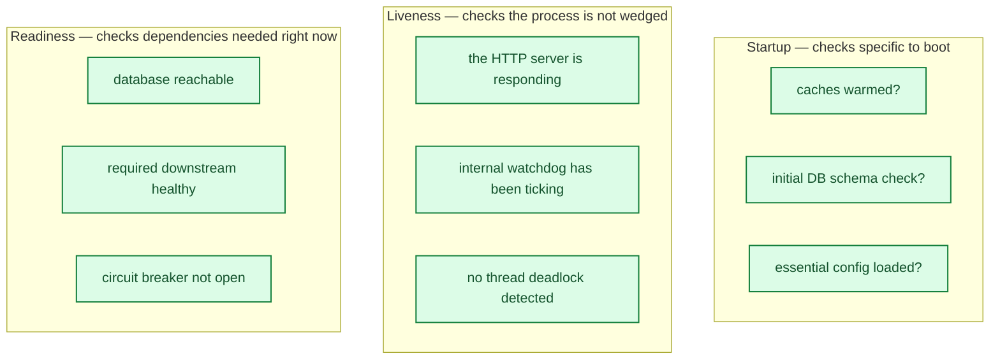

Health checks are how an orchestrator (Kubernetes, a load balancer, a service mesh) decides whether your process is doing its job. The three flavours sound similar but answer different questions, and conflating them is responsible for a famous class of self-inflicted outages: the "liveness probe restarts a perfectly healthy but slow pod every 30 seconds, forever." Knowing which check to run where, and what each one really means, prevents a category of incidents that take longer to find than to fix.

## The three questions, three checks

- **Startup:** "I am still booting; do not test me with the other probes yet."
- **Liveness:** "I am alive enough to be useful." A failure here kills the process.
- **Readiness:** "I can serve traffic right now." A failure here just removes the instance from the load balancer pool, no restart.

The actions are very different: liveness leads to a restart; readiness leads to a removal. Picking the wrong one for the wrong reason causes loops.

## A typical pod lifecycle, with all three

The pod was never killed. It was just shielded from traffic while the downstream was sick. That is exactly what readiness was designed for.

## The famous failure: liveness that is too clever

A common mistake: liveness probes that check downstream dependencies. "I am alive if and only if I can reach the database." When the database is briefly slow, every pod fails liveness, every pod gets restarted, the restart storm makes things worse.

Liveness should answer **only** "is my process wedged?" Things like: an internal deadlock, a thread that has spun for 60 seconds, a watchdog that has not been kicked. Downstream health belongs in readiness, where the recovery is "wait", not "kill."

## What each probe should actually check

The rule of thumb: **if the check failing should make the orchestrator restart you, put it in liveness; otherwise put it in readiness.**

## Probe budgets and what to tune

- **Period.** How often the probe runs. Too frequent = wasted load on the app. Typical: 5-15 seconds.
- **Failure threshold.** How many failures in a row before the orchestrator acts. Typical: 3.
- **Timeout.** How long to wait for a response. Should be short relative to the period.
- **Initial delay.** When liveness/readiness should start. Replaced by startup probes in modern Kubernetes; for systems without startup probes, set this generously.

The Kubernetes default is 10s period, 3 failures, which means a wedged pod takes ~30 seconds to restart. Aggressive defaults cause flapping; lax defaults mean slow recovery from real problems.

## Two scenarios

**Scenario one: a backend service depending on Redis.**

Liveness checks an internal deadlock detector. Readiness checks "can I reach Redis." If Redis has a brief blip, readiness fails, the pod is taken out of the load balancer, traffic goes to other pods. Liveness still passes; the pod is not restarted. Redis recovers, readiness passes, the pod returns. No restart storm.

**Scenario two: a Java service that takes 90 seconds to JIT-warm before it can serve a request without 30 seconds of latency spikes.**

Startup probe with a 5-minute success deadline. While startup probe is failing, neither liveness nor readiness runs. Once startup succeeds, the other two start. The pod never gets killed for "taking too long to boot."

## What this connects to

- **Load balancer basics.** Readiness probes are what the load balancer uses to decide pool membership. See [Load balancer: why, how, when](/practice/system-design/concepts/028-load-balancer-basics/).
- **Circuit breaker.** A breaker that is open is a sign your readiness probe should report 503. See [Circuit breaker](/practice/system-design/concepts/045-circuit-breaker/).
- **Observability.** Probe failures and restarts are critical signals. See [Observability: metrics, logs, traces](/practice/system-design/concepts/056-observability-metrics-logs-traces/).
- **Leader election.** A leader that has lost its lease should fail readiness. See [Leader election](/practice/system-design/concepts/019-leader-election/).
- **Graceful degradation.** Sometimes you stay ready and serve a degraded response instead of failing readiness. See [Graceful degradation](/practice/system-design/concepts/048-graceful-degradation/).

## Common mistakes

- **Liveness checks downstream dependencies.** Restart storms are guaranteed. Move that logic to readiness.
- **No startup probe for slow-booting services.** Liveness fires while the pod is still warming, killing it before it can answer.
- **Same endpoint for all three.** Liveness and readiness should be different endpoints with different semantics.
- **Returning 200 from `/healthz` no matter what.** Then the probe is meaningless. A liveness probe that always passes is worse than no probe.
- **Probe takes too long.** A `/livez` that itself takes 2 seconds runs every 10 seconds, eating 20% of an event loop. Probes should be cheap.
- **Aggressive failure thresholds.** One missed probe = restart means transient network blips cause needless restarts. Three failures in a row is typical.
- **No probe metric.** Restart loops happen quietly. Always emit a count of probe failures and restarts.

## Quick recap

- Startup probe: "I am still warming." Runs only at boot.
- Liveness probe: "my process is wedged." Failing it kills the process.
- Readiness probe: "I cannot serve traffic right now." Failing it removes from LB pool.
- Never check downstream health in liveness; it belongs in readiness.
- Probes should be cheap, separate, and meaningful.

This concept sits in **Stage 4 (Scaling and reliability)** of the [System Design Roadmap](/practice/system-design/roadmap/).
