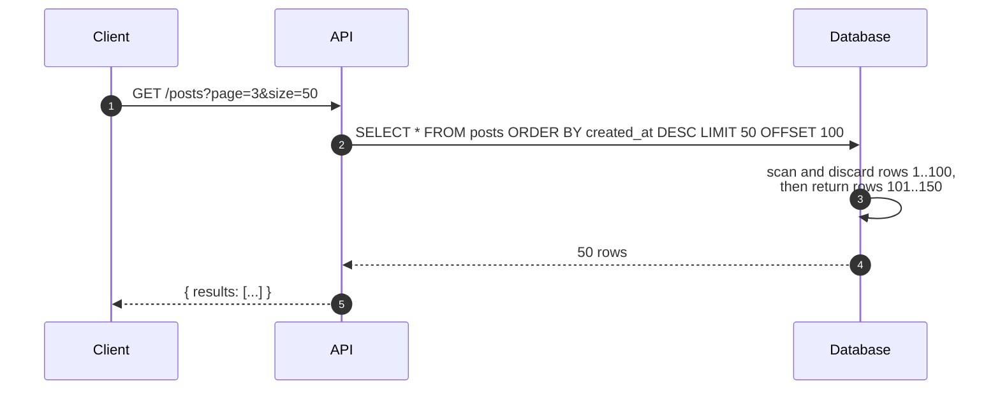
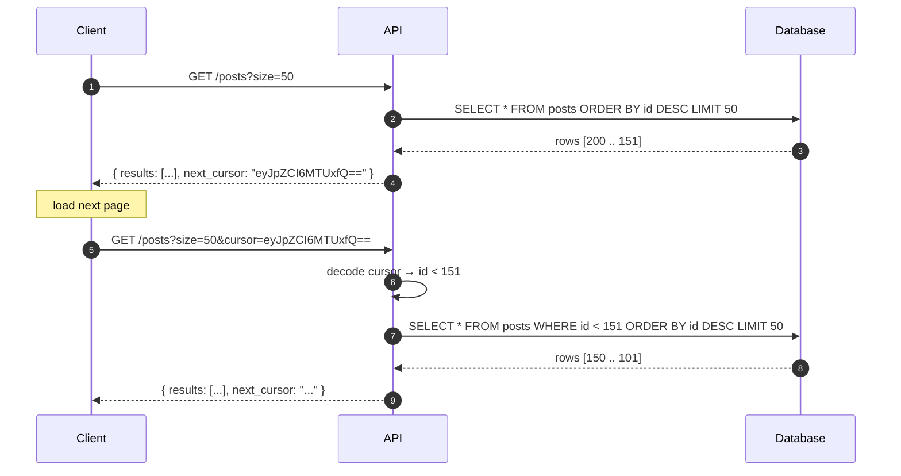
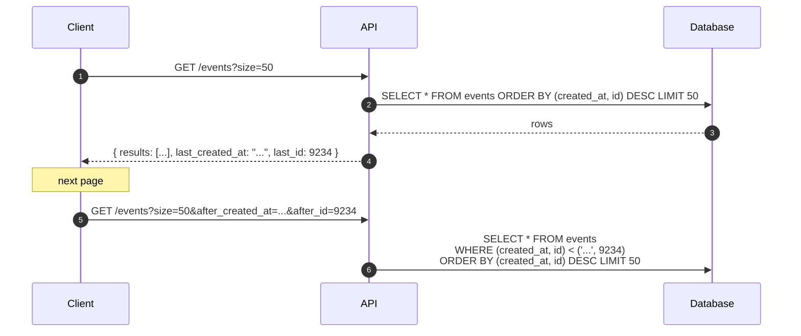
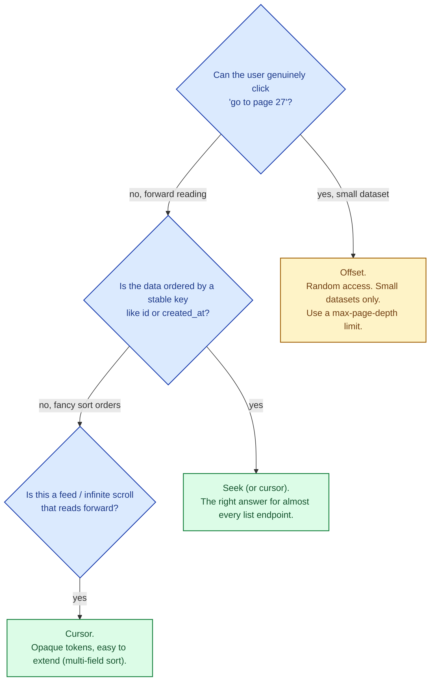

Showing 50 results at a time sounds simple. The first 50 are easy in any approach. Page 1,000 is where the choice of pagination algorithm starts to matter, and where the wrong one quietly becomes a database hot spot. Three patterns: **offset**, **cursor**, and **seek (keyset)**. They differ in correctness when data changes, in performance at depth, and in how well they survive the access patterns users actually have.

## Offset pagination: simple, slow at depth

The naive approach. `LIMIT 50 OFFSET 100` means "skip the first 100 rows and return 50." Page 3 of 50-per-page is `OFFSET 100`. Page 1,000 is `OFFSET 49,950`.

**Strength.** Trivial to implement and to understand. Random access to any page: page=27 just works.

**Weakness.** The database has to walk and discard every row before the offset. Page 1 reads 50; page 1,000 reads 50,000 then throws 49,950 away. Latency grows linearly with the page number. On a busy table with concurrent inserts, **rows can shift between pages**: a new row appears at the top, every later page now shows the previous page's data shifted down. Users see duplicates or skips.

Used for: small datasets, admin tools, anywhere the user genuinely picks a page number.

## Cursor pagination: stable, opaque

The server returns a token ("cursor") with each page that encodes "where to resume from." The next request sends the cursor; the server uses it to fetch the next slice.

The cursor is usually an opaque base64 token; conceptually it just encodes "the last seen sort key." Each page is a `WHERE` filter, not an `OFFSET`. The database uses the index directly; cost is constant regardless of page depth.

**Strength.** Stable in the presence of inserts. Constant time per page. The natural fit for infinite-scroll feeds, activity timelines, message lists.

**Weakness.** Cannot jump to "page 27" because there is no page 27; only "next from here". Going backwards is more work (cursor for previous, or `LIMIT` with reversed sort).

Used for: infinite scroll, feeds, timelines, chat, anything where users read forward continuously.

## Seek / keyset pagination: cursor's well-typed twin

Seek pagination is cursor pagination's explicit form: instead of an opaque token, the API exposes the sort key directly. The client passes the last value it saw.

Cursor and seek are essentially the same algorithm; cursor packages the sort key into an opaque token, seek hands it to the client directly. Both pay the same database cost: constant per page, no scan-and-discard.

The composite key trick (`(created_at, id)`) handles ties: if two events share the same timestamp, the id breaks the tie. Without this, pagination can repeat or skip rows.

**Strength.** Same as cursor. Plus: the API is more transparent and easier to debug.

**Weakness.** Same as cursor.

## Picking the right one

For 90% of new APIs: cursor or seek. Offset is fine for admin paginated tables where the user genuinely picks page numbers and the data is small.

## Two scenarios

**Scenario one: a Twitter-like home feed.**

Infinite scroll, hundreds of millions of users, billions of tweets. The user reads forward and never jumps to "page 1,000". Cursor pagination, with the cursor encoding `(created_at, tweet_id)`. Every page costs the same regardless of how deep the user scrolls.

**Scenario two: an admin "user management" page.**

100,000 users. Admin sometimes filters and jumps to "page 200" to find a specific user. Offset pagination is fine here. Add a hard cap (max page 1,000) so a curious admin cannot wedge the database; for deep navigation, force a search instead.

## What this connects to

- **Indexes that help and hurt.** Cursor and seek depend on a covering index on the sort key. See [Indexes that help, indexes that hurt](/practice/system-design/concepts/010-indexes-help-and-hurt/).
- **Latency.** Offset pagination's latency grows with page depth. See [Latency, throughput, bandwidth](/practice/system-design/concepts/004-latency-throughput-bandwidth/).
- **OLAP vs OLTP.** Reporting pagination on warehouses uses different patterns again (window functions, time partitions). See [OLTP vs OLAP](/practice/system-design/concepts/014-oltp-vs-olap/).
- **API versioning.** Changing pagination style mid-flight is a breaking change. See [API versioning strategies](/practice/system-design/concepts/060-api-versioning/).

## Common mistakes

- **Offset on a hot table.** Page 1,000 takes 10 seconds and counts as a real query. One user with a deep-link kills the database.
- **No tie-breaker in seek.** Sorting by `created_at` alone, with concurrent inserts at the same millisecond, causes rows to repeat or skip across pages. Always use `(sort_field, id)` for the composite.
- **Exposing internal IDs as cursors without signing them.** Users can guess cursors and skip past your filters. Sign or encrypt cursor tokens.
- **Page number AND cursor in the same API.** Pick one; mixing both creates a maintenance disaster.
- **Returning total counts.** "Page 1 of 47" requires a COUNT(*) on every page request. On large tables, that count alone is the slow query. Drop the total or compute it cached.
- **No max page or size limit.** A client requesting page=1,000,000 size=10,000 destroys the database. Cap both.
- **Cursor that includes mutable fields.** If the sort field is updated (e.g., last_active), the cursor becomes ambiguous. Sort on immutable fields where possible.

## Quick recap

- Offset: easy, but the database walks and discards rows; cost grows with page number; unstable under concurrent writes.
- Cursor: opaque token encoding the last sort key. Constant cost per page. Stable.
- Seek: cursor's transparent twin; client passes the sort key directly.
- For feeds and timelines, cursor or seek. For small admin tables, offset is fine.
- Always have a tie-breaker, a max page, and a max page size.

This concept sits in **Stage 4 (Scaling and reliability)** of the [System Design Roadmap](/practice/system-design/roadmap/).
