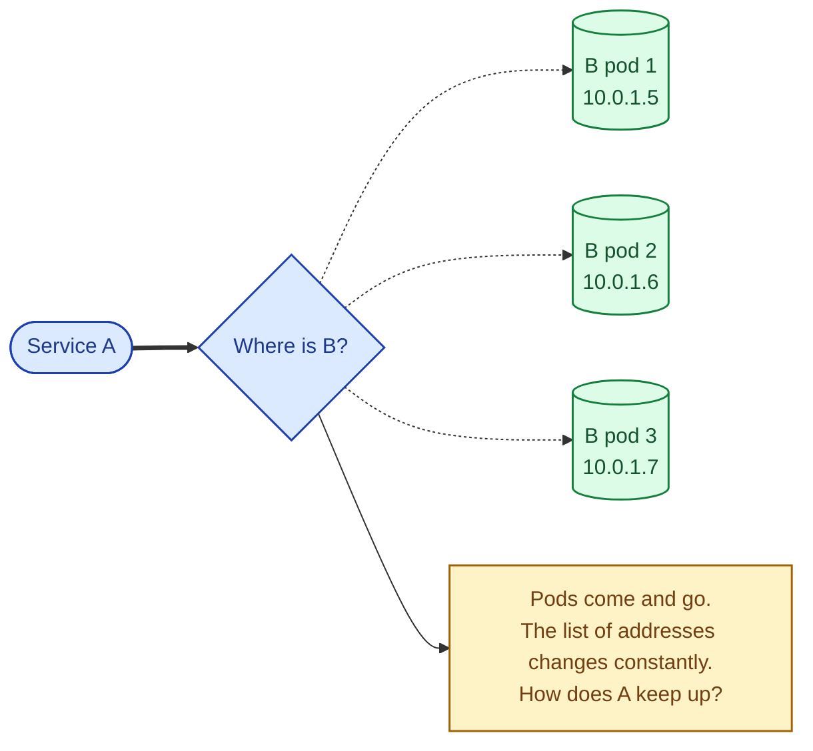
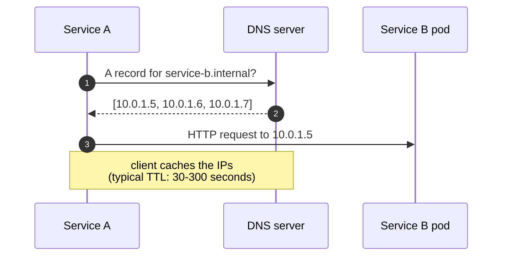
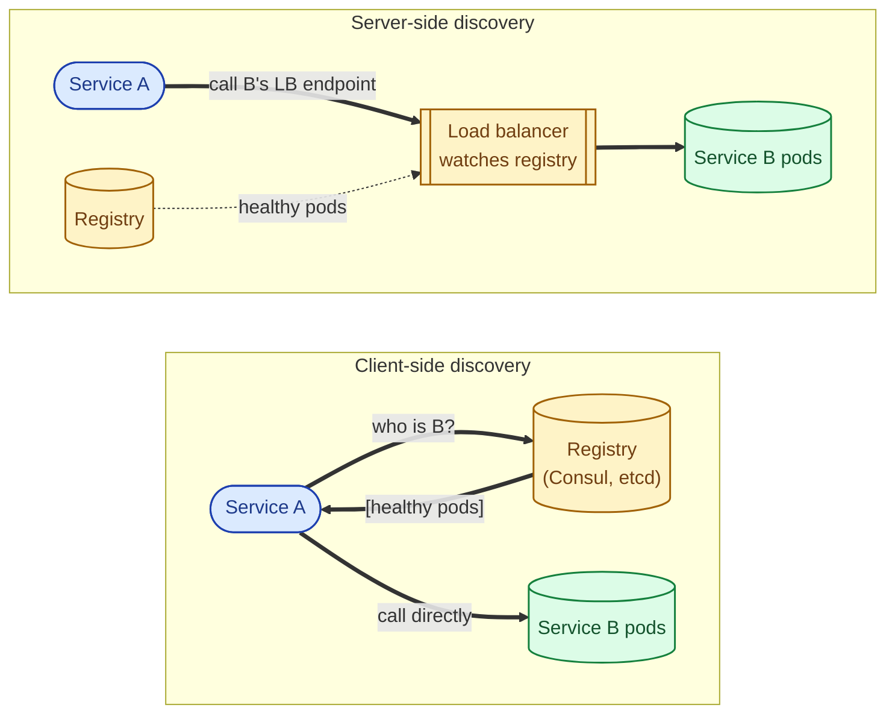
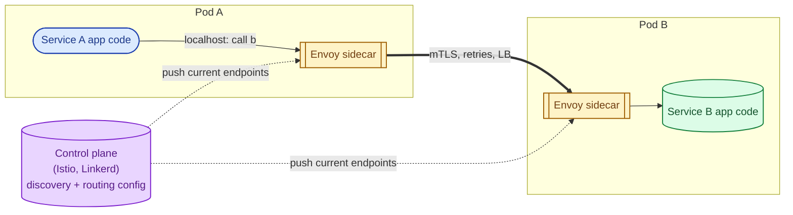
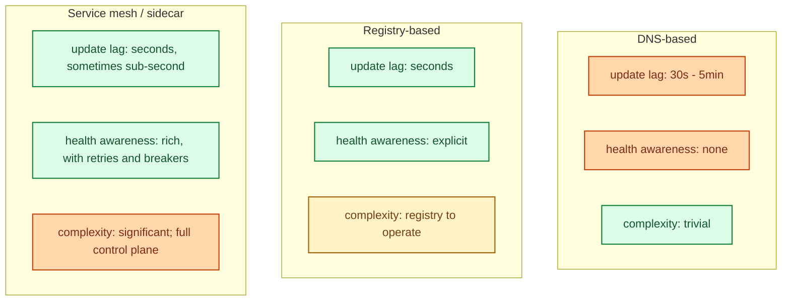
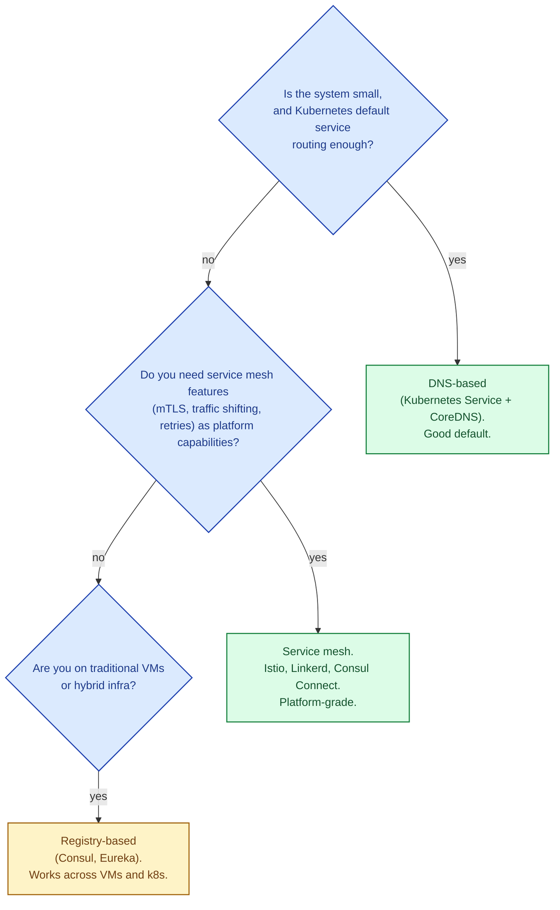

Service A wants to call service B. In a static world, B's address is in a config file. In the real world, B has 30 pods, spread across 3 availability zones, and the pods come and go every few minutes during rolling deploys, autoscaling, and node failures. Service discovery is how A finds the current set of B's pods, fast enough to be useful and accurate enough not to keep talking to dead ones. Three patterns dominate: **DNS-based**, **registry-based (client- or server-side)**, and **service mesh / sidecar**. Each one trades simplicity for accuracy.

## The problem

## DNS-based discovery: cheap, slow to update

A DNS name resolves to one or more IPs. The DNS server is the source of truth; clients ask DNS and trust the answer. This is how the world has worked since 1983.

In Kubernetes, every service has an internal DNS name (`service-b.namespace.svc.cluster.local`); the cluster's DNS (CoreDNS) keeps it updated as pods join and leave.

**Strength.** Every language has a DNS client. Zero application code needed. The cluster does the work.

**Weakness.** DNS caches. A pod that died 10 seconds ago may still be in the client's cache for another minute. Clients keep hammering dead IPs until the TTL expires. Cannot do health-aware routing (DNS just returns IPs; it does not know which are healthy beyond a coarse "are they registered").

Used for: internal Kubernetes service-to-service for simple cases, traditional infrastructure, anything where eventual consistency at minute-granularity is acceptable.

## Registry-based discovery: more accurate, more moving parts

A central registry (Consul, etcd, Eureka, Kubernetes itself) holds the current set of healthy instances per service. Clients consult the registry directly, or via a server-side load balancer that does.

Each service instance registers on startup ("I am service B, here is my address, here is my health check") and the registry removes it when it fails or goes away. Clients (or LBs) get fresh information within seconds, not minutes.

**Strength.** Fast updates, health-aware. Rich metadata (tags, version, region).

**Weakness.** The registry is itself a critical service. Every client needs registry-aware code (or a sidecar; see below). Server-side load balancing adds a hop.

Used for: traditional microservices on VMs (Consul + load balancer), some Kubernetes setups that use etcd directly through the API server.

## Service mesh / sidecar: the modern default

Every pod gets a sidecar proxy (Envoy is the canonical implementation; used by Istio, Linkerd, and others). The application makes plain HTTP calls to `service-b`; the sidecar intercepts, looks up the current healthy endpoints, and forwards. The application never deals with discovery at all.

**Strength.** Discovery is free at the application level. The mesh also handles mTLS, retries, circuit breaking, traffic shifting, and observability. Polyglot teams stop worrying about library support per language.

**Weakness.** Operationally heavy: a control plane to maintain, sidecar per pod (memory and CPU overhead), a steeper learning curve, more moving parts during incidents. Sidecars also add a hop to every request, costing a small amount of latency.

Used for: production Kubernetes deployments at scale, mixed-language microservices, anywhere you want service-to-service mTLS and traffic policies as a platform capability.

## Side by side

## Picking an approach

Most teams' progression: start with DNS-based (Kubernetes Service + CoreDNS), graduate to a service mesh once mTLS, traffic shifting, or per-service retries become real requirements.

## Two scenarios

**Scenario one: a small SaaS on Kubernetes, ~10 services.**

Built-in Kubernetes services with CoreDNS. Each service has a stable DNS name. Pods come and go; CoreDNS keeps the records updated. No mesh, no sidecar. Operational simplicity wins.

**Scenario two: a fintech with 200 services across 4 languages and mandatory mTLS.**

Istio with Envoy sidecars. Service-to-service mTLS is automatic. Traffic-shifting between versions during deploys is a platform capability. Per-service circuit breakers and retries are configured in the mesh, not in code. The complexity is real but every service inherits the resilience patterns for free.

## What this connects to

- **Load balancer basics.** Discovery feeds the LB pool. See [Load balancer: why, how, when](/practice/system-design/concepts/028-load-balancer-basics/).
- **Health checks.** What the discovery layer uses to decide who is healthy. See [Health checks: liveness vs readiness vs startup](/practice/system-design/concepts/057-health-checks/).
- **mTLS.** Service mesh's killer feature for security. See [API key vs OAuth vs mTLS](/practice/system-design/concepts/054-api-key-oauth-mtls/).
- **Circuit breaker.** Often configured in the mesh sidecar. See [Circuit breaker](/practice/system-design/concepts/045-circuit-breaker/).
- **Microservices vs monolith.** Discovery is a problem you only have once you have many services. See [Microservices vs monolith](/practice/system-design/concepts/041-microservices-vs-monolith/).

## Common mistakes

- **DNS TTL too high.** Dead pods stay in client caches for minutes. Drop TTL to 5-30 seconds for service discovery DNS.
- **No health-based removal.** Discovery returns IPs but does not know if they are healthy. Pair with readiness probes; let the discovery layer filter.
- **Sidecar without a control plane.** Envoy without Istio's control plane is just Envoy. The discovery part is missing.
- **Service mesh without a real need.** A mesh adds operational load; without mTLS, traffic shifting, or polyglot microservices, you are paying for capability you do not use.
- **Custom service discovery code.** Almost always wrong. The platform's primitives are tested by thousands of teams; your handwritten code is not.
- **Cross-cluster discovery as an afterthought.** Multi-cluster discovery is genuinely hard; pick a mesh that supports it explicitly if you need it.

## Quick recap

- DNS-based: simple, slow to update, no health awareness. Fine for many setups.
- Registry-based: faster updates, health-aware. Common on VM-based microservices.
- Service mesh / sidecar: discovery plus mTLS, retries, circuit breaking, traffic shifting as platform capabilities. Heavy but powerful.
- Default to Kubernetes' built-in DNS. Graduate to a mesh when you need its features, not because it sounds modern.

This concept sits in **Stage 4 (Scaling and reliability)** of the [System Design Roadmap](/practice/system-design/roadmap/).
