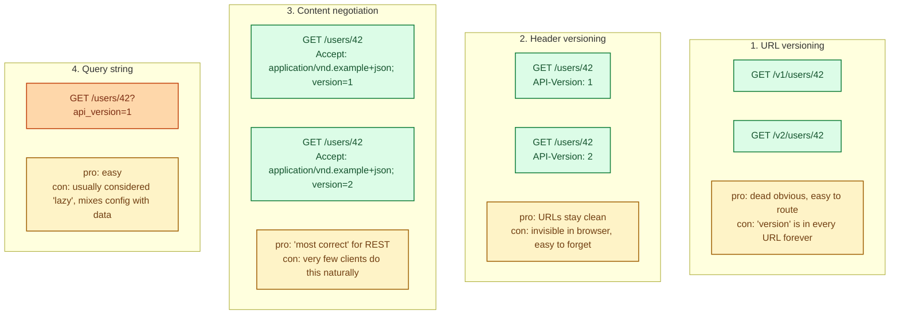
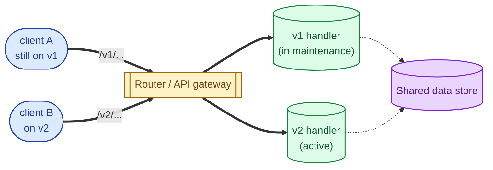
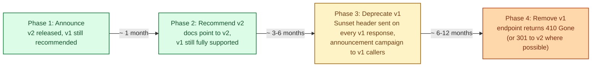
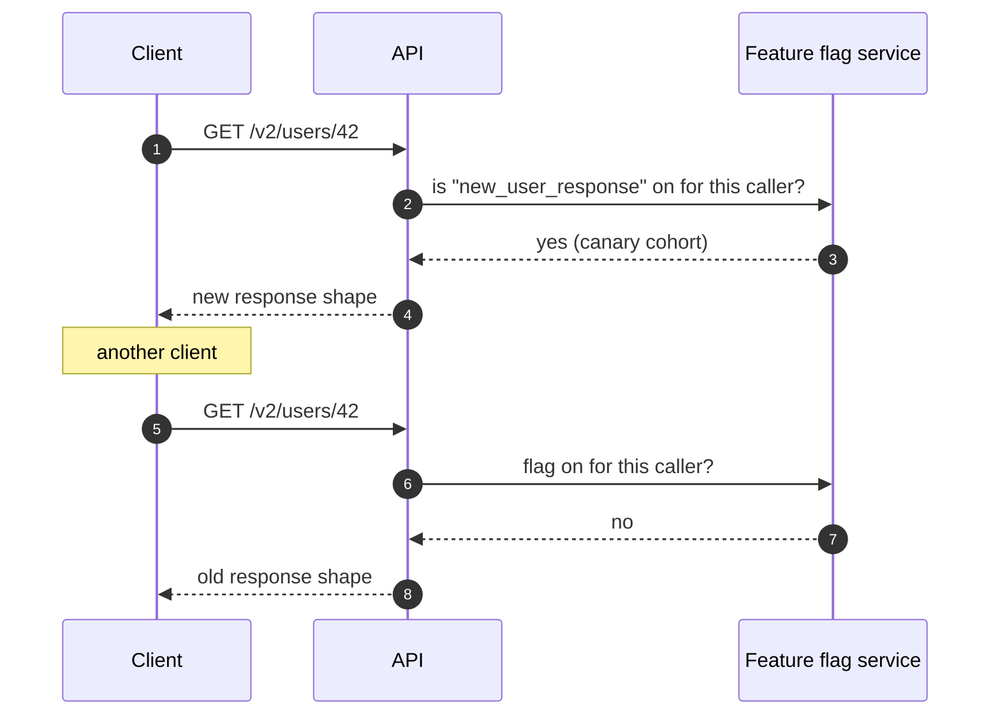

The moment your API has external callers you cannot redeploy, every change is a contract change. Versioning is how you let the API evolve without breaking those callers. There are several ways to express a version (in the URL, in a header, in the content type), and several disciplines for actually rolling out new versions (deprecation timelines, sunset headers, parallel stacks). The mechanics matter less than the discipline; the most common bug is shipping a "non-breaking" change that breaks somebody anyway.

## The four mechanisms

URL versioning dominates in practice. It is the easiest to route at the load balancer, the easiest to debug from a browser, and the easiest to communicate. Header versioning is the runner-up for systems that prize clean URLs. Content negotiation is the textbook answer that almost nobody picks. Query string versioning works but feels sloppy.

## What counts as a breaking change

This is the harder question than "where do we put the version." A change is **breaking** if any reasonable existing client would behave incorrectly after it ships. The non-obvious examples are usually what bite:

- **Removing a field from a response.** Even an unused-looking one. Some client tested for its presence.
- **Tightening validation.** A field that used to accept null no longer does.
- **Changing field types.** `count: "12"` becomes `count: 12`.
- **Reordering array results without a sort guarantee.** Clients that relied on the implicit order break.
- **Changing default behaviour.** A query that returned 10 items by default now returns 100.

Anything beyond "added a new optional field" or "added a new endpoint" deserves careful thought. Most teams underestimate this category.

## Two parallel versions, on the same hosts

Once you decide a change is breaking, you usually ship both versions at once and let clients move at their own pace.

Both versions share the underlying data and most of the business logic; only the request/response shape differs. The router picks which handler to use based on the version mechanism (URL prefix, header, content type).

## The deprecation timeline

Just shipping v2 is not enough; v1 has to eventually retire. A real deprecation has four phases.

The standardised way to communicate deprecation is the `Deprecation` and `Sunset` HTTP headers. Send them on every response from the dying version. Track who is still calling and reach out to the last few stragglers personally.

## Gradual rollout: the inside-the-version trick

Sometimes the change is not big enough to warrant a v2 but is too risky to ship to everyone at once. Feature flags inside one version are the answer.

A flag-controlled rollout lets you ship a "non-breaking-enough" change to 1% of traffic, watch the metrics, and roll it back instantly if anything looks wrong. After full rollout, the flag is removed and the new behaviour becomes the only behaviour. This is how most large companies actually ship "internal v2 of v2."

## Stripe's approach: pinned versions

Stripe pioneered a pragmatic alternative: every API request implicitly carries the customer's pinned version (set on signup, controlled in the dashboard). New API versions ship continuously, but existing customers stay on their pinned version forever unless they explicitly upgrade. Internally, Stripe runs a "version compatibility layer" that translates between versions.

This is the gold standard for B2B APIs where customer integrations are expensive to update. The cost is real: every breaking change must be reversible by the compatibility layer.

## What this connects to

- **Schema migrations.** Versioning at the API layer is the same problem at the data layer. See [Schema migrations with zero downtime](/practice/system-design/concepts/013-zero-downtime-migrations/).
- **Graceful degradation.** A deprecated version returning a partial response is a kind of degradation. See [Graceful degradation](/practice/system-design/concepts/048-graceful-degradation/).
- **REST/RPC/gRPC/GraphQL.** Each style has its own versioning conventions. See [REST, RPC, gRPC, GraphQL](/practice/system-design/concepts/003-rest-rpc-grpc-graphql/).
- **Event sourcing.** Event schemas have their own versioning problem. See [Event sourcing vs state-based persistence](/practice/system-design/concepts/036-event-sourcing/).
- **Observability.** Track usage per version to know who is still on v1. See [Observability: metrics, logs, traces](/practice/system-design/concepts/056-observability-metrics-logs-traces/).

## Common mistakes

- **Bumping the version for every change.** v17 in two years is a sign of poor backward-compatibility discipline. Most changes should be additive.
- **No deprecation timeline.** "We'll remove v1 eventually" becomes "v1 has been here for 7 years." Set dates. Communicate them.
- **No Sunset header.** Clients have no machine-readable way to know they are on a dying version. Send the standard headers.
- **Treating "added a new field" as breaking.** It is not, for any reasonable client. Adding is safe; removing or renaming is not.
- **Different versions, different data.** v1 and v2 should share the underlying data. Different data per version becomes a nightmare to maintain.
- **No usage metrics per version.** You cannot retire v1 if you do not know who is calling it.
- **Switching versioning mechanism mid-flight.** v1 in URL, v2 in header is a mess. Pick one and stick with it.
- **Internal services that never version.** "We can redeploy both sides" is true until it is not. Multi-service deploys eventually need versioning too.

## Quick recap

- URL versioning is the most common; header and content negotiation are alternatives.
- A breaking change is anything that breaks a reasonable existing client; this is broader than people think.
- Ship parallel versions; deprecate with a written timeline; communicate via Sunset headers.
- For gradual rollouts within a version, use feature flags.
- The mechanics matter less than the discipline: pick one approach, communicate clearly, and retire old versions on schedule.

This concept sits in **Stage 4 (Scaling and reliability)** of the [System Design Roadmap](/practice/system-design/roadmap/).
