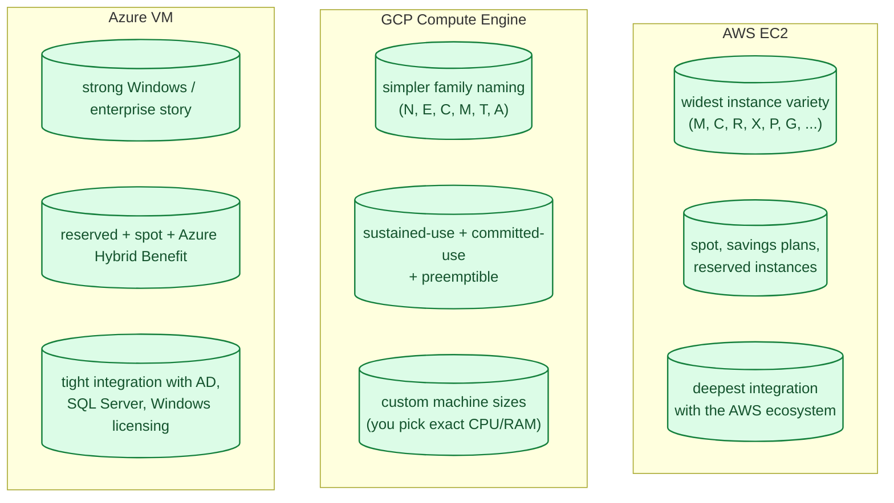
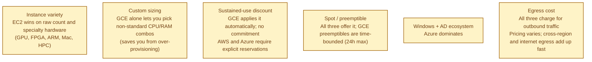
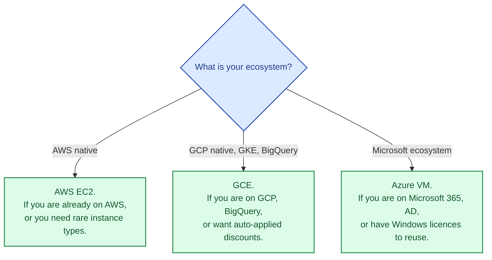

All three clouds give you the same primitive: a virtual machine. You pick a size, a region, an image, and you get a Linux or Windows box charged by the hour or second. The mental model is identical. The differences that actually matter are pricing, instance variety, network performance, and the operational tooling around the VM. Most teams who feel "we picked the wrong cloud" discover the real problem was not understanding their own workload, not the cloud they chose.

## The three offerings at a glance

## The differentiators that actually matter

The most under-appreciated of these is **custom machine sizes on GCE**: if your workload actually needs 6 vCPU and 9 GB of RAM, you can ask for exactly that instead of paying for the standard "8 vCPU + 32 GB" instance one step up.

## Pricing models

All three clouds offer a similar matrix:

- **On-demand / pay-as-you-go.** Highest price, no commitment.
- **Reserved / committed-use.** 1- or 3-year commitment, 40-72% off, locked to family.
- **Spot / preemptible.** Spare capacity at 60-90% off, can be reclaimed at any time.
- **Savings plans (AWS) / sustained-use (GCE).** Either flexible commitment (AWS) or auto-applied discount for running long uptime (GCE).

The headline rates look similar; the lifecycle features differ:

- **AWS Savings Plans** are commitments to spend `$X/hour`, not to a specific instance family. Most flexible.
- **GCE sustained-use** kicks in automatically as a VM runs longer in a month. You do not have to pre-commit.
- **Azure Hybrid Benefit** applies existing Windows Server / SQL Server licences to cloud VMs. For shops with existing Microsoft licensing, this is large.

## When to pick which

The honest answer for most teams is "the cloud you are already on." The compute primitive is similar enough across the three that switching for the VM service alone is rarely worth the cost of moving everything else with it.

## Common mistakes

- **Picking the wrong instance family.** Memory-optimised for a CPU-bound workload (or vice versa) doubles your bill for no benefit.
- **All on-demand forever.** Reservations or savings plans cut steady-state cost by 30-70%. Worth the commitment if your usage is predictable.
- **Forgetting egress.** Cross-region and internet egress are the silent line items that surprise teams. Budget for it.
- **Spot for stateful workloads.** Preemptible VMs can vanish in two minutes. Use them only for stateless, checkpointed, or batch work.
- **Manual instance management.** Auto-scaling groups (AWS), MIGs (GCE), VM Scale Sets (Azure) exist for a reason.
- **Ignoring custom sizing on GCE.** Standard-family overprovisioning is the most common waste on GCE.

## Quick recap

- Same primitive, three vendors. The compute layer is roughly equivalent across the three.
- EC2 has the widest instance catalogue; GCE has custom sizing and auto-discounts; Azure has the Windows / AD edge.
- Pick the cloud first, the instance type second. Cross-cloud moves rarely justify themselves at the compute layer alone.
- Reserve or commit when usage is steady; spot for batch; on-demand for spiky.

This concept sits in **Stage 4 (Scaling and reliability)** of the [System Design Roadmap](/practice/system-design/roadmap/).
