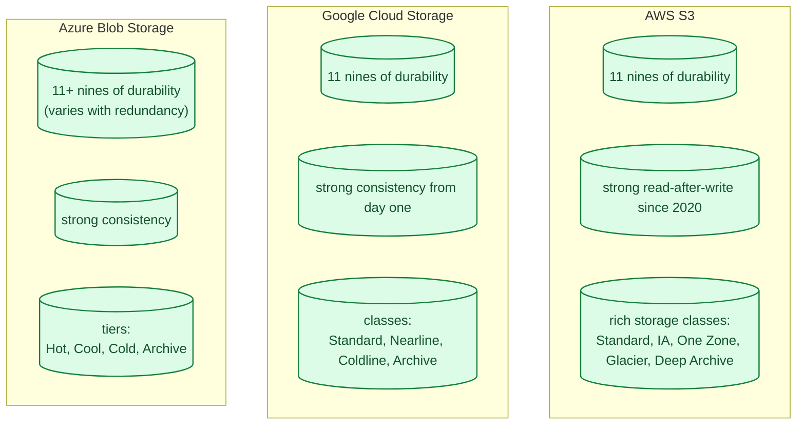
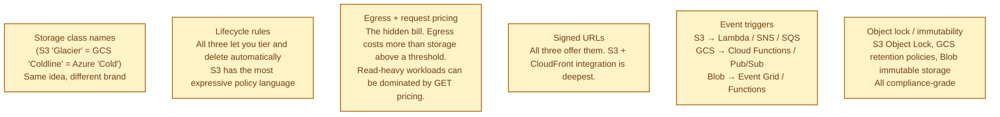
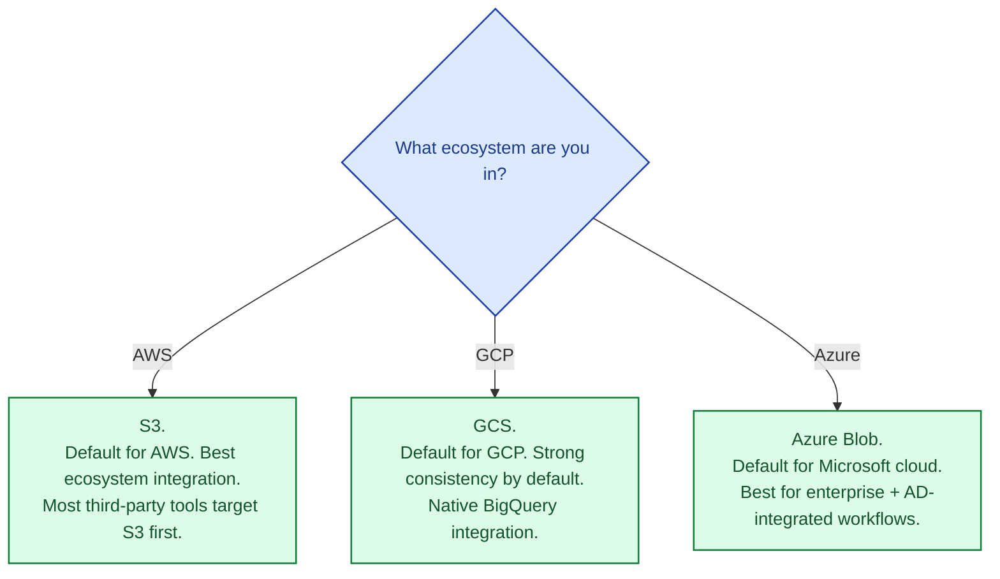

All three are "infinite buckets of files." The interface is essentially the same: put an object with a key, get it back later, list by prefix. The differences are in pricing tiers, lifecycle automation, consistency guarantees that historically diverged but have now converged, and the surrounding ecosystem (IAM, signed URLs, event triggers). S3 set the template; the others followed but with their own quirks.

## The three at a glance

All three claim 11 nines of durability (loss of one object per 100 billion per year). All three are now strongly consistent for reads after writes. The mental model is the same.

## What actually differs

For an application developer, the biggest day-to-day differences are how the SDK presents itself (similar shape, different conventions) and the IAM model (very different across the three; see [IAM](/practice/system-design/concepts/069-iam-aws-gcp-azure/)).

## Storage tiers compared

| Tier (use case) | S3 | GCS | Azure |
|---|---|---|---|
| Frequent access | Standard | Standard | Hot |
| Infrequent access | Standard-IA | Nearline | Cool |
| Rare access | Glacier Instant | Coldline | Cold |
| Archive | Glacier Flexible | Archive | Archive |
| Deep archive | Glacier Deep Archive | Archive (with retrieval delay) | Archive |

Prices are within striking distance across the three, and the lifecycle automation works similarly. Picking by tier alone is rarely the right axis.

## When to pick which

Many third-party tools (Snowflake, Databricks, Iceberg, Delta) speak S3 as their first-class storage; GCS and Azure work but sometimes have lower-quality drivers. If you are building a data lake intended for many third-party engines, the S3-compatible API is a small but real advantage.

## Common mistakes

- **No lifecycle rules.** Data lives in the hottest, most expensive tier forever. Tier old data automatically; see [Hot, warm, cold storage tiers](/practice/system-design/concepts/044-storage-tiers/).
- **Egress surprise.** Pulling 10 TB out of the bucket to your laptop or to another region costs real money. Set budgets and alerts.
- **GET fees on read-heavy workloads.** Per-request fees add up. Static content benefits from CDN caching; see [CDN](/practice/system-design/concepts/027-cdn-when-you-need-it/).
- **Public buckets by mistake.** S3, GCS, and Azure all default to private now, but legacy configs and mistakes happen. Block public access at the account level.
- **No versioning.** A bad `aws s3 cp` overwrites the file. Versioning gives you an undo button.
- **Cross-cloud replication done manually.** All three have native cross-region replication; cross-cloud needs careful tooling.
- **Treating object storage as a database.** No partial updates, no transactions, no rich queries. Use a database for relational data.

## Quick recap

- All three offer the same primitive: infinite durable buckets of objects, strongly consistent, 11+ nines of durability.
- Tier names differ; the structure is the same: hot, cool, cold, archive.
- Pick by cloud and ecosystem, not by storage capability. The interesting differences live elsewhere (IAM, lifecycle policy expressiveness, third-party tooling).
- Lifecycle rules and egress budgets are the two operational must-dos.

This concept sits in **Stage 4 (Scaling and reliability)** of the [System Design Roadmap](/practice/system-design/roadmap/).
