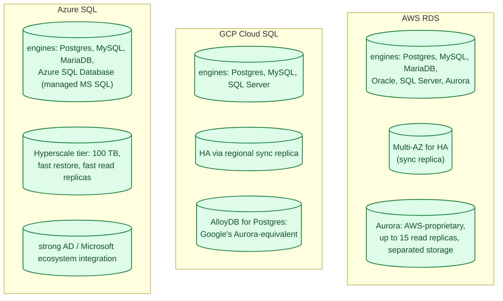
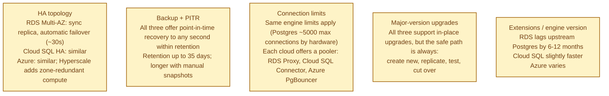
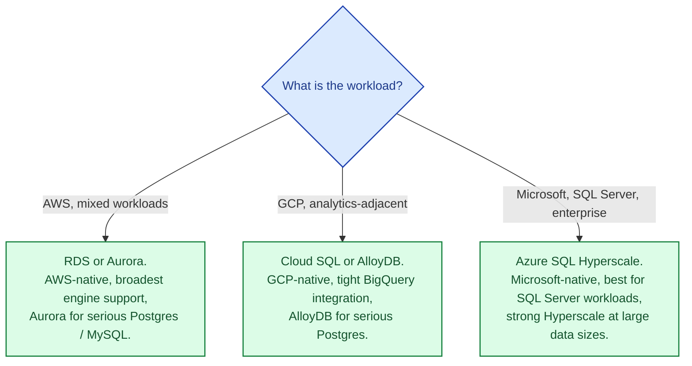

A managed SQL service runs Postgres, MySQL, or SQL Server for you: the cloud handles backups, replication, patching, failover, and (mostly) capacity. You handle schema, queries, and connection management. All three big clouds offer this, and the headline features look identical. The differences that matter are which engines they support natively, how failover actually works, what the limits are on big tables, and how much "managed" really means in practice.

## The three at a glance

## What actually differs

The flagship offerings (Aurora, AlloyDB, Hyperscale) are where each cloud has invested in proprietary differentiators:

- **AWS Aurora.** A MySQL- or Postgres-compatible engine where storage is decoupled from compute. Replication is at the storage layer; up to 15 read replicas; failover in seconds. Most "I need a serious database" deployments on AWS run on Aurora rather than vanilla RDS Postgres.
- **GCP AlloyDB.** Google's answer to Aurora; Postgres-compatible, columnar acceleration for analytical queries, replicated storage. Newer than Aurora, fewer features, but catching up.
- **Azure SQL Hyperscale.** Postgres or SQL Server with elastic compute and storage scaling to 100 TB; fast database copies; fast point-in-time restore.

The "vanilla" managed offerings (RDS Postgres, Cloud SQL Postgres, Azure Database for Postgres) are roughly equivalent: they run open-source Postgres with cloud-managed HA and backups.

## When to pick which

For most teams: the right managed SQL is "whichever your cloud offers natively." The vanilla offerings are close enough that the differentiators (Aurora, AlloyDB, Hyperscale) become the real choice only when you start needing very large data, very high write throughput, or very fast failover.

## Common mistakes

- **Treating managed as "no DBA needed."** You still need to design schemas, index correctly, write good queries, monitor performance. Managed means the cloud handles HA, backups, and patching, not your application.
- **No connection pooler.** All three clouds have a managed pooler. Use it. See [Connection pooling](/practice/system-design/concepts/042-connection-pooling/).
- **One reservation forever.** Cloud-managed databases are sized; if your workload changes shape, the right instance size changes too.
- **Skipping read replicas.** A read replica is the cheapest way to offload reporting and analytics queries.
- **Major-version laziness.** Stuck on Postgres 11 forever because the upgrade is scary. Plan upgrade windows; new versions ship real performance improvements.
- **No PITR enabled.** Point-in-time recovery is a setting; without it, you can only restore daily snapshots. Always on.
- **Aurora / AlloyDB / Hyperscale without measuring.** They are more expensive. Use them when you need them, not by default.

## Quick recap

- All three clouds offer roughly equivalent managed Postgres / MySQL.
- The serious offerings (Aurora, AlloyDB, Hyperscale) add proprietary storage/compute decoupling for big workloads.
- HA topology, backup, PITR, and failover times are similar across the three.
- Pick by cloud first. Pick the flagship variant when you actually need it.
- A managed database still needs a pooler, indexes, and an upgrade plan.

This concept sits in **Stage 4 (Scaling and reliability)** of the [System Design Roadmap](/practice/system-design/roadmap/).
