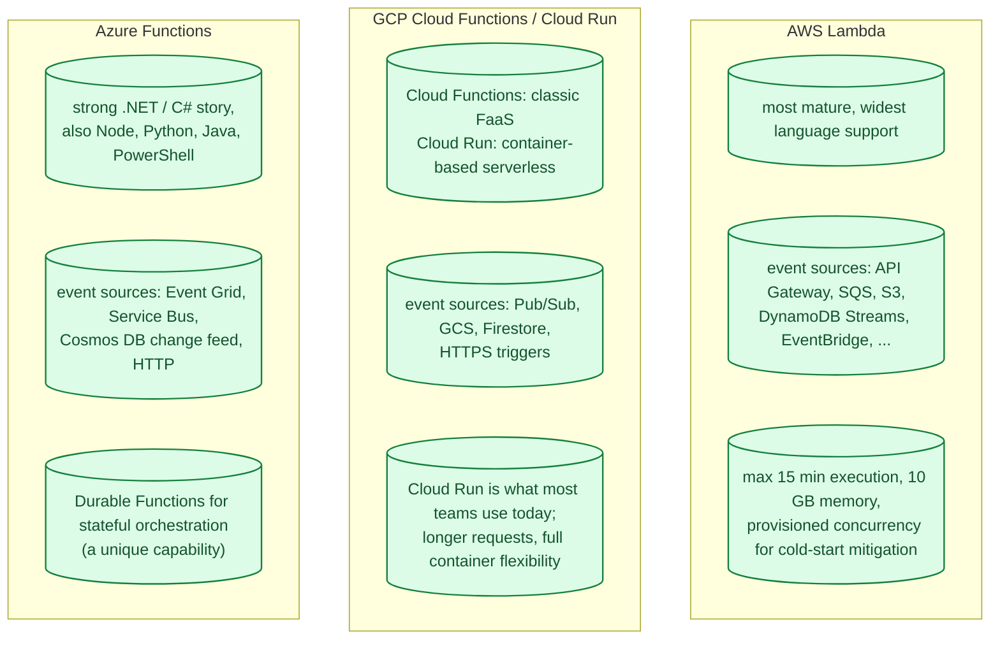
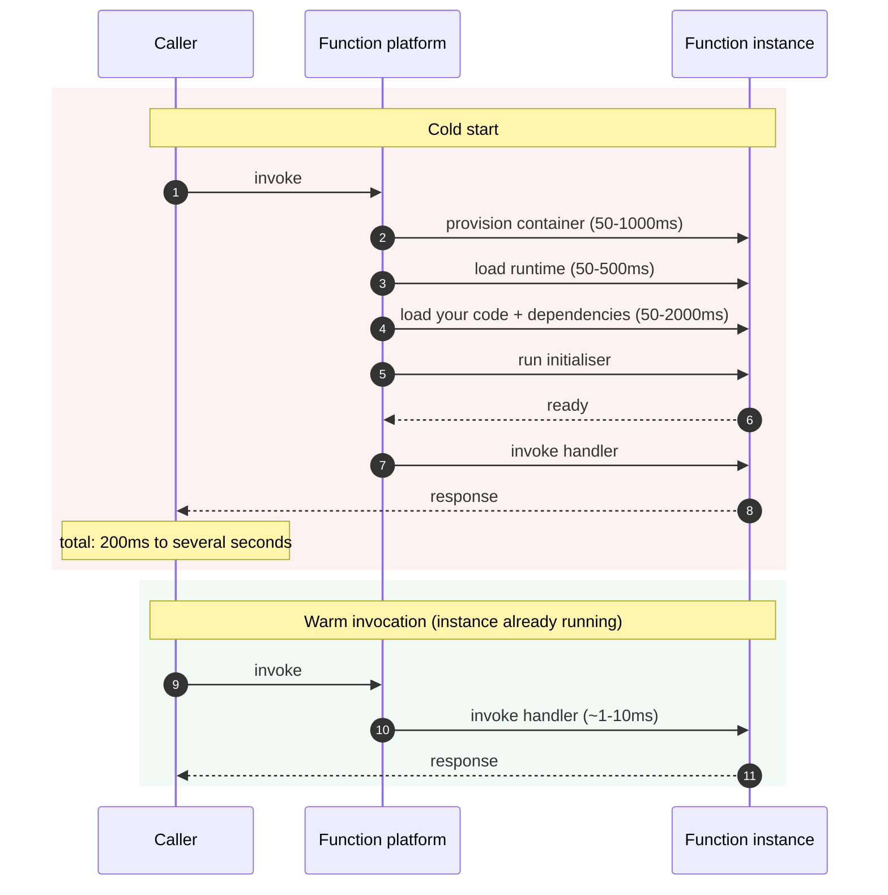
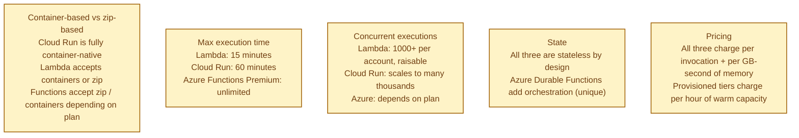
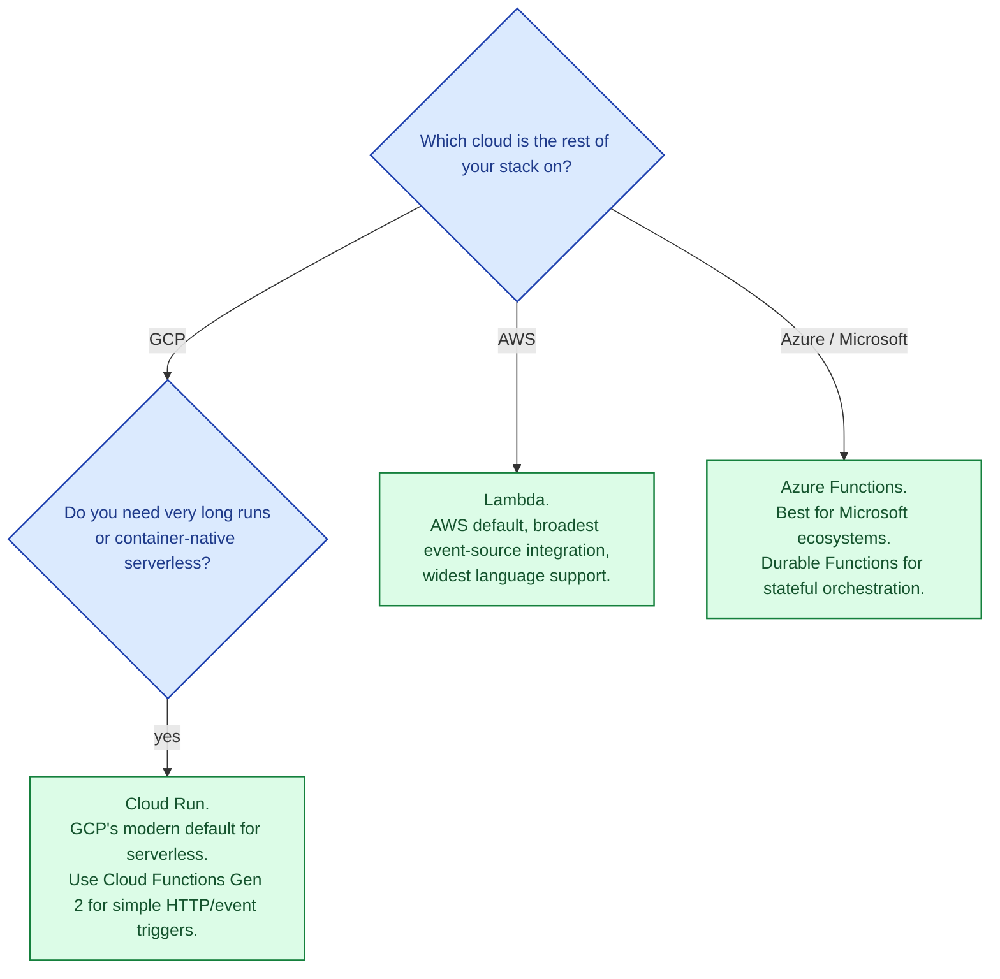

Serverless functions ("functions as a service") let you ship a function and have the cloud run it on demand, scaling automatically, billing per millisecond. AWS Lambda set the template; Google Cloud Functions and Azure Functions followed with similar shapes. The differences live in cold start behaviour, runtime support, limits per invocation, and how each integrates with the rest of its cloud. For some workloads, serverless is a magic productivity win. For others, it is a tax for a problem you do not have.

## The three at a glance

## Cold starts: the single most important number

A cold start happens the first time a function is invoked (or after the runtime has been idle long enough to be evicted). The cloud has to provision a container, load the runtime, load your code, and run your initialiser before the actual request runs. Cold starts dominate latency for low-traffic functions.

Cold start costs vary by language and dependency size:

- **Compiled / lightweight runtimes** (Go, Rust, small Node): 100-300 ms.
- **JVM / .NET**: 500 ms to several seconds.
- **Python with heavy imports**: 1-3 seconds.

All three clouds offer mitigations: **provisioned concurrency** (Lambda), **min instances** (Cloud Run / Cloud Functions Gen 2), **Premium plan** (Azure). They keep N instances warm at all times at a cost — at which point you have re-invented a small fleet of always-on containers and might want to ask whether serverless was the right shape.

## What actually differs

## When serverless is the right shape

- **Bursty, unpredictable traffic.** A cron job that runs once an hour, a webhook receiver, a fan-out from an event bus.
- **Glue between cloud services.** "When a file lands in S3, do this thing." Lambda is exactly this pattern.
- **Low traffic where provisioning a VM is overhead.** Internal tools, infrequent admin tasks.
- **Bursty fan-out.** Image resizing, video thumbnailing, document processing.

## When serverless is overhead

- **Steady, high-traffic workloads.** A VM or container is cheaper at sustained load.
- **Latency-critical paths** where cold starts are unacceptable.
- **Long-running work.** Encoding, ML training, batch processing.
- **Stateful sessions** beyond the function's lifetime.

## When to pick which

## Common mistakes

- **Reach for serverless for steady-state APIs.** A container behind a load balancer is usually cheaper at sustained traffic.
- **Heavy startup work in the handler.** Move it to module-level initialisation so it runs once per container, not per request.
- **Big dependency trees.** Larger code = slower cold starts. Tree-shake aggressively.
- **No timeout / retry policy.** Failed invocations either lose work or retry forever depending on the trigger source. Always configure both.
- **Stateful logic in stateless functions.** Use a queue + worker pattern; do not assume the function instance survives.
- **Forgetting cost at scale.** A function running 100M times a month at 200 ms each is significant. Run the numbers; compare to a container.
- **Provisioned concurrency for everything.** At that point, you are paying for always-on infra without the convenience.

## Quick recap

- Lambda, Cloud Functions/Run, Azure Functions: same primitive, similar pricing model, different language support and event sources.
- Cold starts dominate latency for low-traffic functions; mitigations exist but cost.
- Serverless wins for bursty, event-driven, glue-style workloads.
- Serverless loses for steady-state high-traffic APIs and long-running jobs.
- Pick by cloud first; pick the right serverless shape (FaaS vs container-serverless) second.

This concept sits in **Stage 4 (Scaling and reliability)** of the [System Design Roadmap](/practice/system-design/roadmap/).
