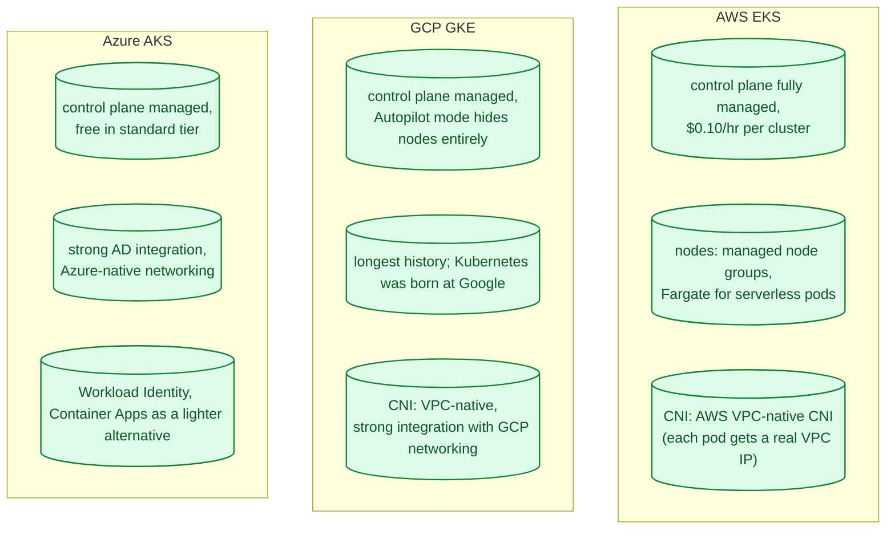
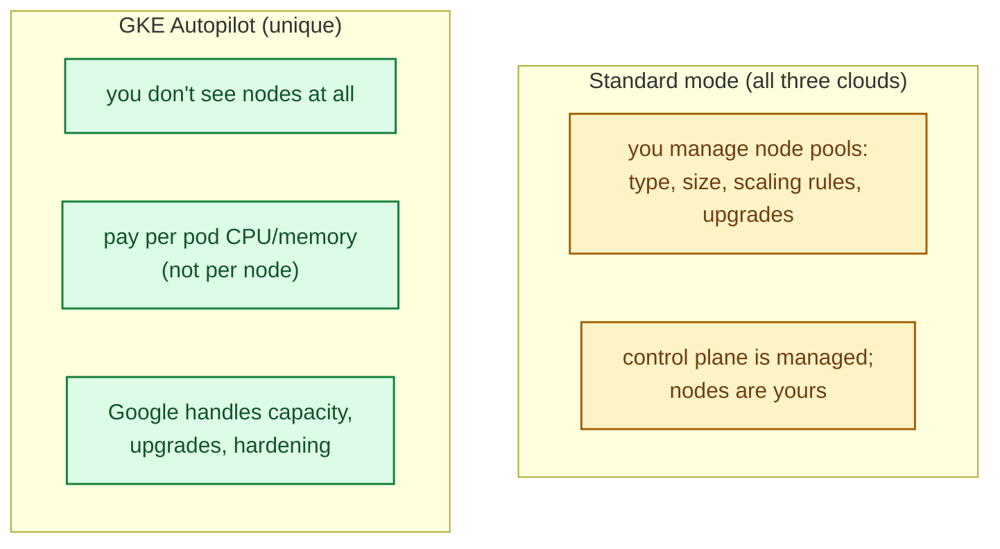
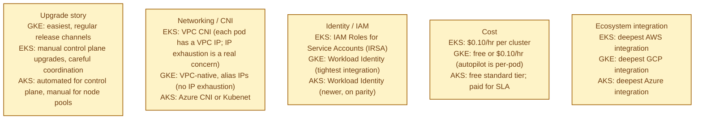
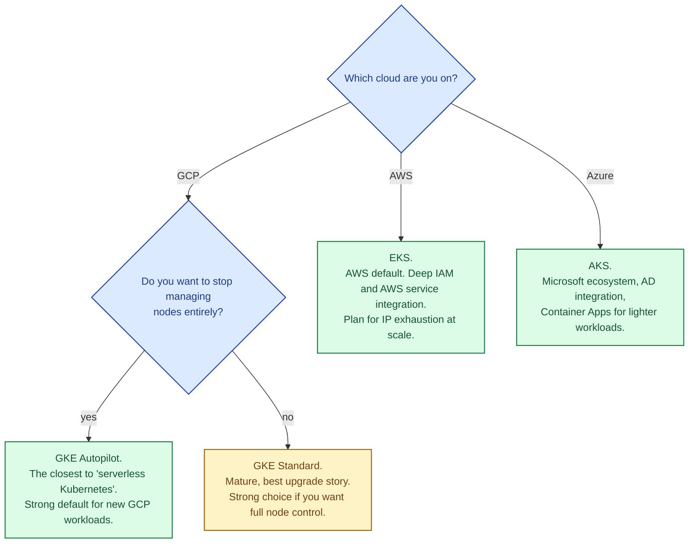

A managed Kubernetes service runs the control plane (API server, scheduler, controller manager, etcd) for you, while you provide the worker nodes (or even let the cloud do that too). All three big clouds offer one. The application surface is identical Kubernetes; the differences are in the control plane SLA, how easily you can upgrade, networking model, integration with cloud-native services, and how much "managed" really means.

## The three at a glance

## The single biggest differentiator: GKE Autopilot

GKE has a mode called **Autopilot** that fully manages the nodes too. You define pods; Google handles provisioning, scaling, security patches, upgrades, and capacity. It is the closest to "real serverless Kubernetes." You pay per pod resource usage, not per node.

EKS Fargate and AKS Virtual Nodes offer partial versions of this but with more limitations. For "I want Kubernetes but I do not want to think about nodes," Autopilot is the deepest implementation.

## What actually differs

The often-overlooked **networking** difference matters at scale. EKS VPC CNI assigns each pod a real VPC IP, which is great for AWS service integration but exhausts subnet IP space fast. Large clusters need careful subnet planning or alternative CNIs (Cilium). GKE's alias IPs handle this more gracefully.

## When to pick which

For teams new to Kubernetes: GKE Autopilot has the gentlest learning curve. For teams already on AWS: EKS is the natural choice despite the operational tax. For Microsoft shops: AKS plus Container Apps covers most needs.

## When to skip managed Kubernetes

- Small team, simple workload. A few containers behind a load balancer (ECS Fargate, Cloud Run, Container Apps) is much simpler than Kubernetes.
- No need for the operator/CRD ecosystem.
- Predictable, low-traffic services.

Kubernetes is genuinely powerful and genuinely complex. "Use Kubernetes" should be a deliberate choice, not a default.

## Common mistakes

- **Kubernetes for everything.** Most small services do not need it. ECS, Cloud Run, App Service, and Container Apps are lighter and cheaper.
- **No upgrade plan.** Control plane and node versions both age. Skipping versions is harder; staying current is operational discipline.
- **EKS without IP planning.** VPC CNI exhausts /22 subnets quickly. Plan for /16s or use Cilium.
- **One huge cluster.** Multi-tenancy in Kubernetes is genuinely hard. Separate clusters per environment (dev/stage/prod) is the safer default.
- **Manual cluster management.** Terraform, Pulumi, or the cloud's IaC. Click-ops a cluster and you will pay for it later.
- **No GitOps.** Manual kubectl on prod ages badly. ArgoCD or Flux give you auditable, declarative state.
- **Forgetting cost.** Kubernetes is operationally expensive even at low utilisation. Watch idle node-hours.

## Quick recap

- All three offer managed control planes; the application surface is identical.
- GKE Autopilot is uniquely close to "serverless Kubernetes."
- Networking, upgrade story, and IAM are where the real differences live.
- Pick by cloud first. Skip Kubernetes entirely if a lighter container runtime fits.
- Plan for IP exhaustion (EKS), upgrade cadence, and multi-cluster strategy.

This concept sits in **Stage 4 (Scaling and reliability)** of the [System Design Roadmap](/practice/system-design/roadmap/).
