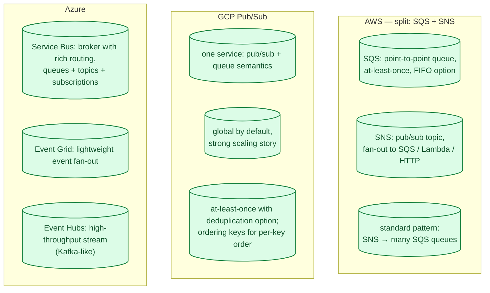
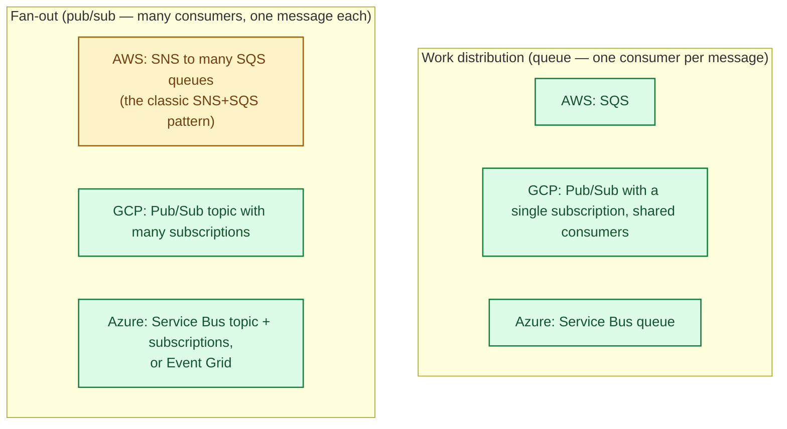
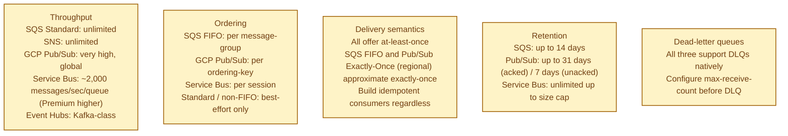
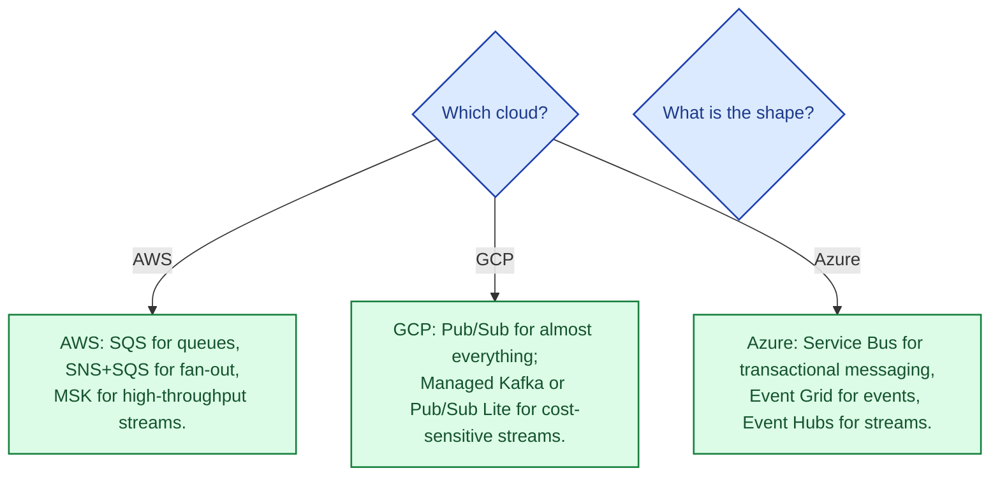

Every cloud has a managed messaging service. AWS splits it into SQS (queue) and SNS (topic / fan-out). GCP has Pub/Sub that does both natively. Azure has Service Bus (broker with rich routing) and Event Grid (event-driven fan-out). The choice mostly tracks your cloud, but the semantics differ in delivery guarantees, ordering, and what scales naturally.

## The three at a glance

## How each handles the two shapes

The two recurring shapes (see [Pub/sub vs point-to-point queue](/practice/system-design/concepts/035-pubsub-vs-queue/)) map to the cloud offerings differently:

GCP Pub/Sub does both natively in one product, which is the cleanest mental model. AWS makes you compose SNS and SQS, which works but requires understanding both. Azure has three different services depending on shape, which is more flexible but more decisions upfront.

## What actually differs

## Where Kafka fits in (a fourth option)

When the workload is a high-throughput event log with multiple independent consumers (analytics, ETL, ML feature pipelines, audit), managed Kafka (MSK, Confluent Cloud, GCP Managed Kafka, Azure Event Hubs) is often the right answer rather than any of the queue services above. See [Kafka vs RabbitMQ vs SQS](/practice/system-design/concepts/033-kafka-vs-rabbitmq-vs-sqs/) for the broader context.

The clouds blur this line: Event Hubs is Kafka-compatible. Pub/Sub overlaps significantly with Kafka use cases. AWS keeps Kafka (MSK) and SQS firmly separate.

## When to pick which

The honest answer: the right managed messaging service is the one in the cloud you are already in. Cross-cloud messaging is rarely worth the complexity.

## Common mistakes

- **Choosing exactly-once based on the brand name.** "Exactly-once" in any cloud is at-least-once + dedup. Always make consumers idempotent. See [Idempotency](/practice/system-design/concepts/021-idempotency/).
- **No DLQ.** Failed messages either loop forever or vanish. Configure a DLQ on every consumer.
- **One queue for everything.** Mixed-purpose queues complicate observability and scaling. One queue per logical job type.
- **Ordering when you do not need it.** FIFO queues are slower and have lower throughput. Use them only where order genuinely matters.
- **Polling SQS too aggressively.** Long polling (waitTimeSeconds=20) reduces cost and latency simultaneously.
- **No monitoring on queue depth.** A growing queue is a leading indicator of a consumer problem. Alert on it.
- **Pub/Sub without ack deadlines tuned.** Default ack deadline is short; long-running consumers get redelivered duplicates.

## Quick recap

- AWS splits messaging into SQS (queue) and SNS (topic); Kafka is a separate product (MSK).
- GCP Pub/Sub does both queue and pub/sub semantics in one service.
- Azure has Service Bus (rich), Event Grid (lightweight), and Event Hubs (Kafka-like).
- All offer at-least-once delivery; idempotent consumers are mandatory.
- Pick the service that matches the shape (queue vs pub/sub vs stream), in the cloud you are already on.

This concept sits in **Stage 4 (Scaling and reliability)** of the [System Design Roadmap](/practice/system-design/roadmap/).
