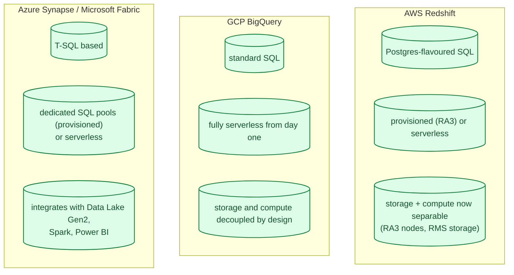
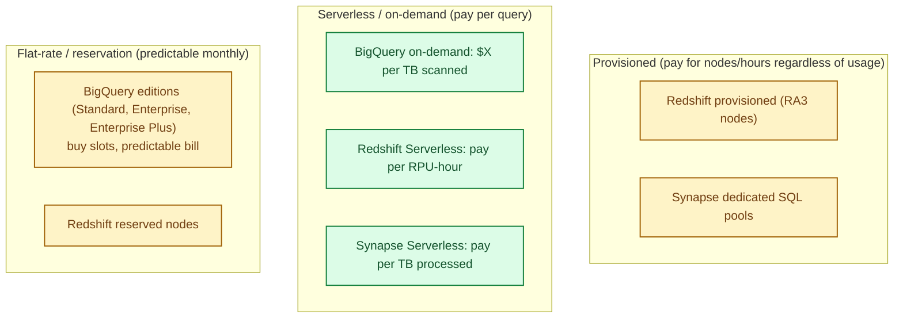
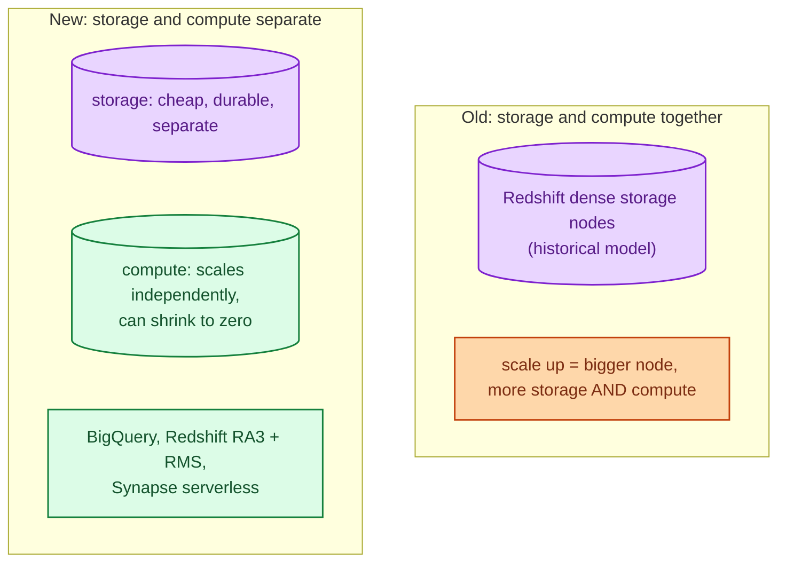
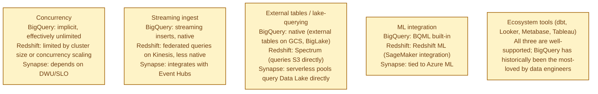
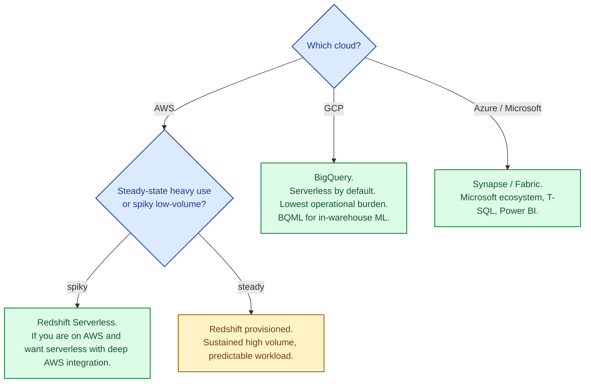

A cloud data warehouse runs SQL across huge analytical datasets, fast, at a price-per-byte-scanned that would have been impossible ten years ago. Redshift, BigQuery, and Synapse are the major-cloud answers. They all expose SQL, all use columnar storage, and all scale horizontally. The big difference is the pricing model (which shapes how you use it), the separation of storage and compute (which affects performance and cost), and the surrounding ecosystem. The right answer depends as much on how you want to be billed as on raw capability.

## The three at a glance

## Pricing: the biggest practical difference

The pricing model shapes how the warehouse feels to use.

The headline change of the last few years is that all three offer **serverless** modes now. BigQuery was always serverless; Redshift Serverless and Synapse Serverless caught up.

**Cost intuition:** at low query volumes, serverless is cheapest. At sustained high volumes, provisioned/reservation tiers win. The crossover happens at the "is this our main analytics engine running all day?" point.

## Storage vs compute: the architectural divide

Modern data warehouses all separate storage from compute. Storage is cheap and grows; compute scales up and down per workload. The whole industry converged on this around 2020.

## What actually differs

## When to pick which

For new projects on any cloud, the serverless tiers are usually the right starting point. Move to provisioned only when sustained costs justify the commitment.

## Snowflake: the cross-cloud option

Snowflake (the company) runs on all three clouds and is many teams' answer when they want a warehouse that does not lock them in. The performance is competitive with the native services; the pricing is usually higher; the operational simplicity and feature consistency across clouds is the win.

## Common mistakes

- **Querying the warehouse like an OLTP database.** Joins on terabyte tables are expensive; pay for the query plan you actually wrote.
- **No partitioning / clustering.** Both clustering (Redshift, Snowflake) and partitioning (BigQuery, Synapse) drastically reduce scanned bytes. Always design for it.
- **SELECT * on a wide table.** Columnar storage means you pay for the columns you read. Be specific.
- **Warehouse for transactional workloads.** Warehouses are OLAP. Use a proper OLTP database (see [OLTP vs OLAP](/practice/system-design/concepts/014-oltp-vs-olap/)).
- **Streaming small inserts.** Warehouses prefer batches. Either use the streaming API (BigQuery streaming inserts) or batch into reasonable chunks.
- **Cost surprises.** BigQuery's per-TB-scanned model can produce surprising bills if dashboards are inefficient. Set query cost limits.
- **One warehouse for everything.** Production analytics, ad-hoc exploration, and ML feature pipelines have different access patterns. Often separate workloads or workspaces are right.

## Quick recap

- All three offer columnar SQL warehouses with separated storage and compute and serverless options.
- BigQuery: serverless from day one, lowest operational burden, per-TB pricing.
- Redshift: deepest AWS integration, both serverless and provisioned tiers.
- Synapse / Fabric: Microsoft ecosystem, T-SQL, Power BI integration.
- Pick by cloud first, by usage pattern (steady vs spiky) second.
- Partitioning, clustering, and column selection are the universal "make queries cheap" levers.

This concept sits in **Stage 4 (Scaling and reliability)** of the [System Design Roadmap](/practice/system-design/roadmap/).
