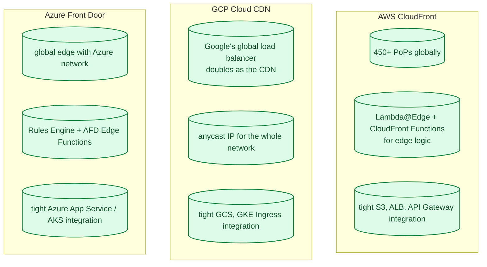
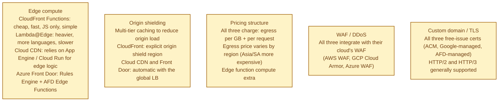
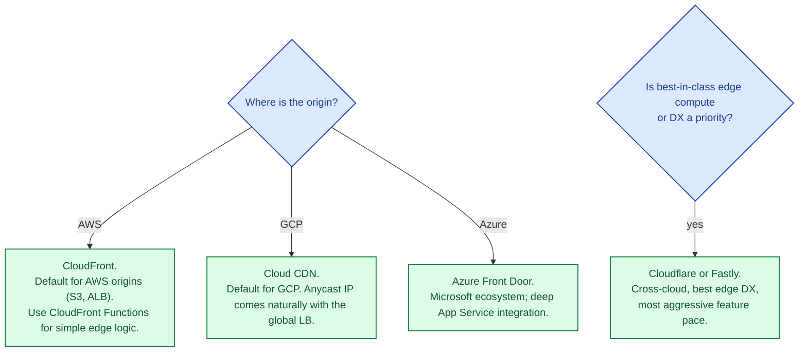

A CDN is a cache at the network edge that brings content closer to your users. AWS CloudFront, Google Cloud CDN, and Azure Front Door are the three big-cloud offerings. They all do the same fundamental job, with similar PoP (point of presence) footprints, similar pricing structures, and increasingly similar edge-compute capabilities. The decision usually tracks "which cloud is the origin on?" because tight origin-integration is the one place these CDNs genuinely beat dedicated competitors like Cloudflare and Fastly.

## The three at a glance

## What actually differs

The most under-appreciated edge feature is **CloudFront Functions** (note: not Lambda@Edge). They are JavaScript-only, sub-millisecond cold start, very cheap, and great for header rewriting, simple auth, A/B routing. Cloudflare Workers occupy the same niche cross-cloud and are often preferred for that reason.

## Cloudflare and Fastly: the cross-cloud options

Neither CloudFront, Cloud CDN, nor Front Door are dominant outside their own clouds. Cloudflare and Fastly own the cross-cloud CDN market and consistently rank higher on features (Workers' developer experience, Fastly's instant cache purge, both companies' security tooling).

If your origin is on AWS but you want best-in-class edge compute, Cloudflare Workers + AWS origin is a very common architecture. The cloud-native CDN is the right pick when origin-integration matters more than edge feature parity.

## When to pick which

## Common mistakes

- **No cache-control headers.** The CDN cannot cache what your origin does not tell it to cache. Always send explicit Cache-Control.
- **Caching private content.** `Cache-Control: public` on a logged-in user's response leaks to the next user behind the same edge. Always use `private` for personalised content.
- **Caching errors.** A 500 cached for 5 minutes is a 5-minute outage. Set error response TTL to zero (or very short).
- **Treating purge as instant.** Purge propagation is seconds (Fastly) to minutes (CloudFront). Don't depend on "I purged it, so it's gone everywhere now."
- **No CDN in front of an API.** Even uncached API responses benefit from TLS termination at the edge and edge auth/rate limiting.
- **Forgetting cold edges.** A new region's first hit is a miss; for predictable launches, pre-warm by sampling traffic ahead of time.
- **No metrics on hit rate.** If you do not know your cache hit ratio, you do not know if your CDN is working. Track per-PoP and per-route.

## Quick recap

- All three big-cloud CDNs do the same job with similar PoP footprints.
- Pick the one matching your origin cloud for the tightest integration.
- Cloudflare and Fastly often beat all three on edge DX, especially for Workers / Compute.
- The biggest operational wins (cache headers, purge strategy, private content) are universal.
- CDN in front of static assets is universally a win; in front of APIs it requires more care but is still worth it.

This concept sits in **Stage 4 (Scaling and reliability)** of the [System Design Roadmap](/practice/system-design/roadmap/).
