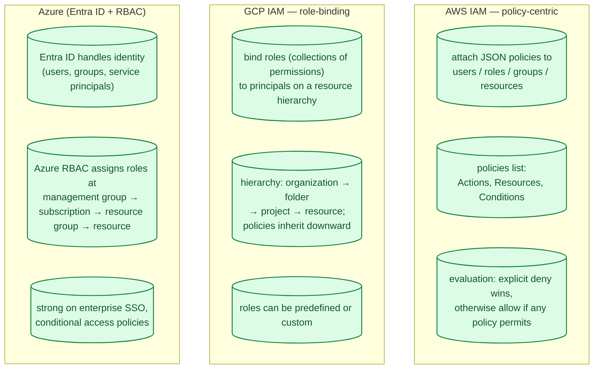
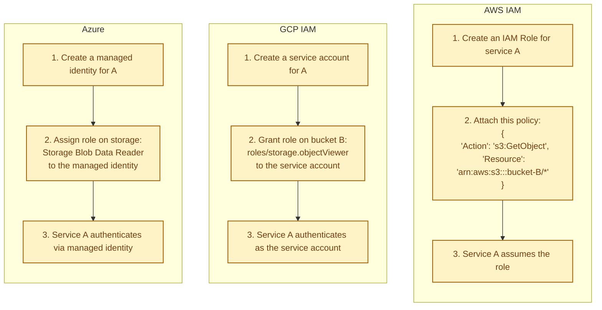
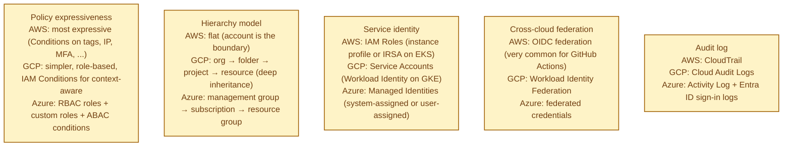
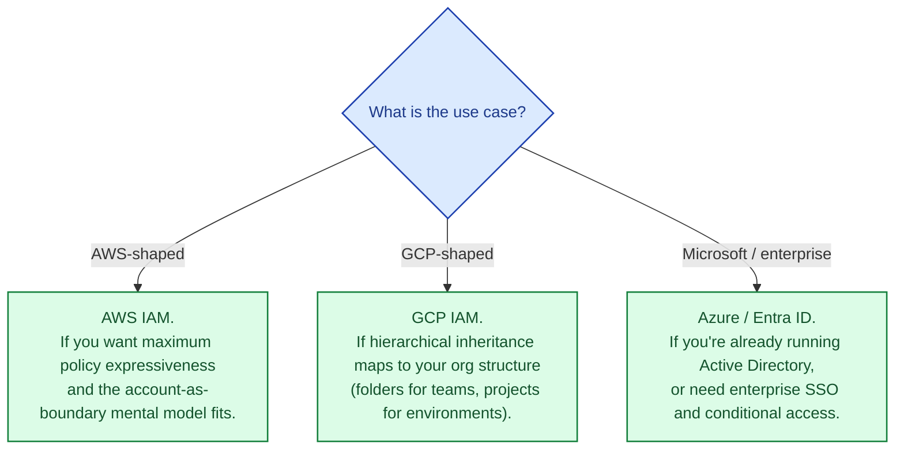

Every cloud has a system for "who can do what to which resource." AWS IAM, GCP IAM, and Azure (Entra ID, formerly Azure AD) all answer that question, and they all do it differently enough that knowledge transfers poorly. The same intention ("let this service read this bucket") is expressed in three different vocabularies, three different scope models, and three different audit shapes. This is the single largest cross-cloud knowledge gap, and the most common source of subtle privilege-escalation bugs.

## The three models compared

## The same intent, three different shapes

"Let service A read objects from bucket B":

The intent is the same; the vocabulary, scope, and tooling are very different. This is why "I am an AWS expert" does not automatically transfer to GCP or Azure.

## What actually differs

The single biggest practical difference is **scope inheritance**. GCP's deep hierarchy means a role granted at the organization level applies everywhere below; this is powerful and dangerous. AWS's flat-per-account model is more verbose but less surprising. Azure sits in between.

## When to pick which

You almost never pick an IAM system standalone; you inherit it with the cloud. But the IAM model is one of the most important parts of "should we adopt this cloud":

## Common mistakes

- **Long-lived static credentials.** Use roles, service accounts, managed identities. Static keys age into incidents.
- **Wildcard permissions.** `Action: "*"` on `Resource: "*"` is the most common cloud security finding. Be specific.
- **No least-privilege review.** Permissions accumulate; nobody removes them. Run access reviews quarterly.
- **Personal IAM users in production.** Federate identity from your IdP (Okta, Entra, Google Workspace) and use roles. Personal users are an audit nightmare.
- **Inheritance surprises.** A role granted at the org level on GCP inherits everywhere. Inheritance is great until it isn't.
- **No audit log retention.** Audit logs are how you reconstruct an incident. Keep them for years; ship to cold storage if needed.
- **Mixing service identity with user identity.** A service should never use a user's credentials. Always its own machine identity.
- **Custom roles before measuring need.** Predefined roles fit 90% of cases. Custom roles are a maintenance burden.

## Quick recap

- AWS IAM: policy-centric, account-as-boundary, most expressive policies.
- GCP IAM: role-binding on a deep hierarchy with inheritance.
- Azure / Entra: identity + RBAC + strong enterprise SSO.
- The same intent looks completely different in each model.
- Use machine identities (roles, service accounts, managed identities). Never static keys.
- Audit logs and least-privilege reviews are not optional.

This concept sits in **Stage 4 (Scaling and reliability)** of the [System Design Roadmap](/practice/system-design/roadmap/).
