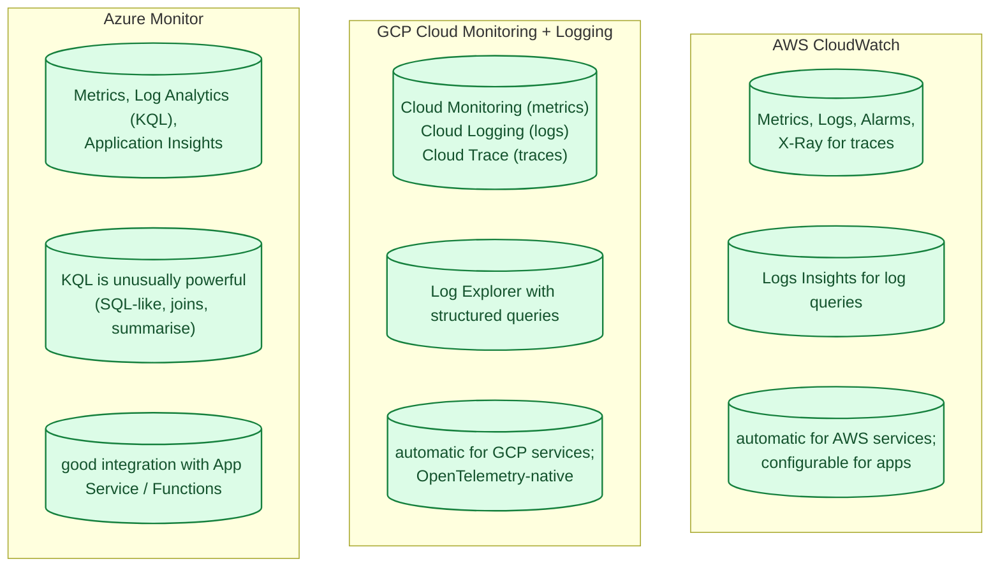
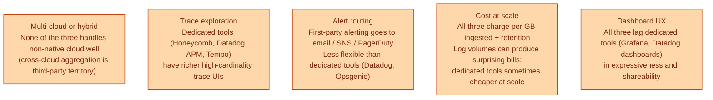
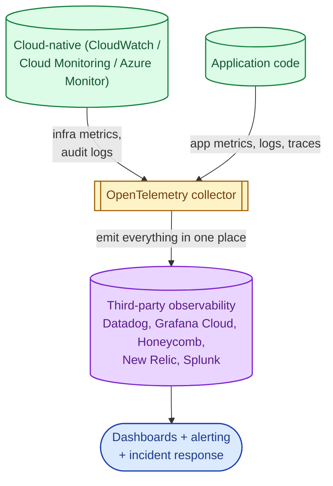
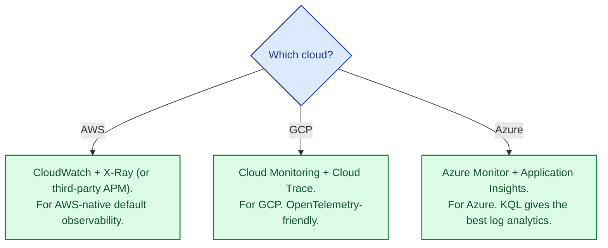

Each cloud ships a first-party observability stack: CloudWatch on AWS, Cloud Monitoring (Stackdriver) on GCP, Azure Monitor on Azure. Each one gives you metrics, logs, and (usually) traces, integrated with the cloud's own services and IAM. They are all serviceable; none of them dominate the dedicated observability market (Datadog, Honeycomb, New Relic, Grafana Cloud, Splunk). The question is rarely "which is best" but "first-party for the integration, third-party for the experience, or both."

## The three at a glance

## What each is genuinely good at

- **CloudWatch.** Metrics on every AWS service, automatically. Alarms wire cleanly into auto-scaling, EventBridge, SNS. Logs Insights is competent but the UI is dated.
- **Cloud Monitoring.** OpenTelemetry-native, clean integration with GKE, BigQuery sink for log analytics. The query language for logs is more straightforward than CloudWatch's.
- **Azure Monitor.** **KQL (Kusto Query Language)** is genuinely best-in-class for log analytics — SQL-like with first-class time-series operators. Application Insights is the strongest of the three for application-level tracing of .NET workloads.

## Where they all fall short

The most common pattern in production: **first-party for infrastructure metrics + audit logs + cloud-native alerting; third-party for application observability + dashboards + incident response**.

## The hybrid pattern most teams adopt

This hybrid stack is now the dominant production pattern. OpenTelemetry makes the wiring portable: instrument once, ship metrics, logs, and traces to one or many destinations, swap backends without re-instrumenting.

## When to stay all-cloud-native

- Small team, single cloud, modest scale. The cloud's first-party stack is the path of least resistance.
- Compliance / data-residency requirements that complicate shipping data to a third-party SaaS.
- Cost discipline: third-party observability bills can exceed compute bills surprisingly fast.

## When to go third-party

- Multi-cloud or hybrid. Dedicated tools were built for this.
- Application observability matters more than infrastructure observability.
- The team values UI / dashboard quality and incident-response tooling.
- Per-engineer productivity gains from a better tool justify the price.

## Pick within each cloud

## Common mistakes

- **Cloud-native for application observability and dashboards.** The UIs are competent but rarely loved. Most teams outgrow them.
- **No correlation across services.** Without consistent trace IDs and request IDs, the three pillars do not connect during an incident.
- **Sending every log line.** Log volume drives cost. Sample debug, keep errors and audit at 100%.
- **No retention policy.** Logs and metrics retained forever at hot-tier prices. Tier to warm/cold; delete what is past compliance.
- **OpenTelemetry without a destination strategy.** OTel is the wiring; the backend is the decision. Pick one or two; do not multicast everywhere.
- **Manual instrumentation forever.** Auto-instrumentation libraries cover most frameworks today. Use them; only instrument by hand where they fall short.
- **Alerts on every metric.** Alert fatigue is real. Alert on user-facing symptoms, not on every internal signal.

## Quick recap

- All three clouds offer competent first-party observability stacks.
- KQL (Azure) is the best log query language of the three.
- Most production teams use a hybrid: first-party for infra + audit, third-party for application observability.
- OpenTelemetry is the portable instrumentation layer; pick the backend separately.
- Retention, sampling, and alert hygiene are the universal cost and signal disciplines.

This concept sits in **Stage 4 (Scaling and reliability)** of the [System Design Roadmap](/practice/system-design/roadmap/).
