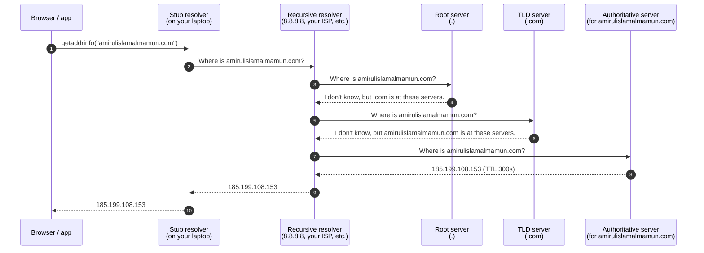
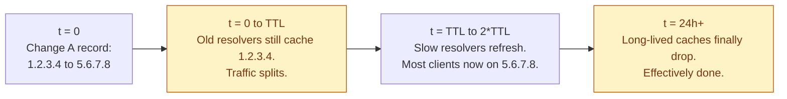

DNS turns names humans can remember into addresses computers can route to. You type `amirulislamalmamun.com`, and within a few milliseconds your laptop has the IP address of a GitHub Pages server somewhere. It looks simple until you ship something and a stale cache on a recursive resolver costs you twelve minutes of downtime nobody can debug.

## The problem it solves

Computers route packets to IP addresses. People remember names. Without DNS the internet is a phone book with a hundred billion entries that you have to keep on every device. DNS hides that problem behind one rule: ask a hierarchy, get an answer, cache it.

The hierarchy matters because nobody owns the whole answer. The folks running `.com` know nothing about your specific subdomain. Your authoritative DNS provider knows nothing about other domains. The chain only works because each level knows just enough to tell you where to ask next.

## The four servers in one lookup

A single lookup for `amirulislamalmamun.com` involves four kinds of servers. Most of them you never think about.

Once any of those answers is cached, the chain gets shorter. The next request from the same recursive resolver, for the same name, within the TTL window, returns in a single hop.

That is the whole trick. **DNS is fast because it caches, and complicated because it caches.**

## The four places an answer is cached

A change you make at your authoritative provider takes minutes to hours to actually reach a user. Not because the change is slow, but because the answer is sitting in four caches between you and them.

| Layer | Where it lives | TTL it respects |
|-------|----------------|-----------------|
| Browser | Per-tab, per-process, in memory | Browser's own (Chrome ~60s, Firefox ~60s) |
| OS resolver | systemd-resolved, mDNSResponder, Windows DNS Client | The authoritative TTL |
| Recursive resolver | ISP, 8.8.8.8, 1.1.1.1 | The authoritative TTL |
| Authoritative server | Your DNS provider (Route 53, Cloudflare, etc.) | Source of truth |

When you change a record at the authoritative level, you have to wait out the longest TTL that any of these layers is currently holding. That is the entire reason "DNS propagation" is a thing. There is no protocol-level "tell everyone to flush." There is only "wait for the TTL to expire."

## TTL: what it actually does

TTL is the number of seconds a resolver is allowed to keep an answer before it has to ask again. It is a hint, not a guarantee.

- **Low TTL** (60s, 300s) means fast cutovers and more queries hitting your authoritative server. Useful when you expect change.
- **High TTL** (3600s, 86400s) means a cheap, fast resolution path and a slow cutover. Useful for stable records (your `MX` for email, your `NS` records).
- **Resolvers can ignore your TTL.** Most respect it. Some cap it at a maximum (a few hours), some impose a minimum (you cannot go below 30s). You do not get to assume "1 second TTL means instant change."

The practical rule: lower the TTL **before** you change the record, not at the same time. Drop the TTL to 60s, wait for the old TTL to expire (so resolvers fetch the new low TTL), then make the change. Otherwise resolvers are still holding the old high-TTL answer when you do the swap.

## The record types you actually use

Most DNS work involves five record types. The others matter occasionally; these matter weekly.

| Record | What it says |
|--------|--------------|
| `A` | This name resolves to this IPv4 address. |
| `AAAA` | This name resolves to this IPv6 address. |
| `CNAME` | This name is an alias for that other name. Resolve that one instead. |
| `MX` | Email for this domain goes to that server, in this priority order. |
| `TXT` | Free-text. Used for SPF, DKIM, domain ownership verification, etc. |

Two more come up:

- **`NS`**: which authoritative servers are responsible for this domain.
- **`SRV`**: which host and port a particular service runs on. Older service discovery (XMPP, Kerberos) lives here; modern stacks use registries instead.

## The CNAME trap at the apex

You cannot point the apex of a domain (`example.com` itself, no `www.`) at a `CNAME`. The RFC forbids it because the apex also holds `SOA` and `NS` records, which a `CNAME` would override.

This bites every team that wants to point `example.com` at a load balancer's hostname. Workarounds:

- **`ALIAS` / `ANAME` records**: a vendor-specific flat record that behaves like a `CNAME` at the apex. Route 53, Cloudflare, NS1 all support these under different names. They resolve to an `A` record at lookup time.
- **Use `www.example.com`** as the primary and redirect `example.com` to it. Old-school but works everywhere.
- **Hard-code the IP** in an `A` record. Fragile; the LB's IP can change.

If you ever wondered why every guide pushes you to `www`, this is why.

## Cutovers: the part everyone gets wrong

Suppose you want to move a service from `1.2.3.4` to `5.6.7.8`. The naive plan is: change the `A` record, watch traffic move. What actually happens:

You cannot do this instantly. You can only minimise the window. The pattern:

1. A week ahead, lower the TTL of the record to 60s.
2. The day of the cutover, make the change.
3. Keep the old IP serving traffic for at least the original TTL plus a buffer. Long-running connections, mobile apps with hard-coded resolvers, and stale browser tabs will still hit it for a while.
4. After cutover stabilises, raise the TTL back up.

If you skip step 1 you lose. Some percentage of users will hit the old IP for hours.

## DNS for service discovery: works until it doesn't

Using DNS to find your own backend services is appealing. Every container, every cloud LB, every Kubernetes service has a DNS name. The OS caches it for free. You do not need a registry.

The problems show up under load and on failure:

- **Caching does the wrong thing during failover.** If a backend dies and you update DNS, clients with cached answers keep sending to the dead one. Connection-pool clients (JDBC, gRPC) hold the resolved IP for the life of the pool.
- **Round-robin DNS is not load balancing.** The order of returned `A` records is randomised, but each client only uses one, and once it has connected it stays.
- **Negative caching can hide a brief outage.** When the authoritative server returns `NXDOMAIN`, resolvers cache that too (per the SOA's negative TTL). A misfire during deploy can lock out clients for minutes.

DNS is fine for finding the front door of a service. For internal service-to-service discovery you usually want a registry (Consul, etcd, Eureka, Kubernetes Endpoints) and short-circuit DNS entirely. See [Service discovery](/practice/system-design/concepts/059-service-discovery/).

## What this connects to

- **TCP vs UDP**. DNS queries run over UDP first (small, fast, retry on timeout) and fall back to TCP for large responses or zone transfers. See [TCP vs UDP](/practice/system-design/concepts/001-tcp-vs-udp/).
- **CDN**. Edge providers steer users via DNS. You point a `CNAME` at the CDN, and the CDN's authoritative server returns the IP of the closest edge based on the resolver's geography. See [CDN](/practice/system-design/concepts/027-cdn-when-you-need-it/).
- **Multi-region**. DNS-based failover (health-checked records, latency-based routing, geo-routing) is one of the building blocks. See [Multi-region](/practice/system-design/concepts/043-multi-region/).
- **Service discovery**. DNS is one of three styles. The others compete with it specifically because of the caching problem above. See [Service discovery](/practice/system-design/concepts/059-service-discovery/).

## Common mistakes

- **Changing a record with the TTL unchanged.** Always drop the TTL ahead of time. The cutover window equals the TTL that was active when resolvers last fetched.
- **Treating TTL as a guarantee.** Some resolvers cap, some enforce a minimum, some ignore your value entirely. Treat TTL as "no resolver should cache for longer than this." Some will cache for less, some for more.
- **`CNAME` at the apex.** Use the provider's `ALIAS`/`ANAME` flat record or redirect from the apex to `www`.
- **Chains of CNAMEs.** Each hop is another resolution and another cache layer. `a.example.com` -> `b.example.com` -> `c.cdn.com` -> `d.lb.aws.com` resolves four times. Slow and fragile.
- **Long-lived clients.** A JVM resolves a hostname at startup and caches the IP for its entire lifetime by default. Set `networkaddress.cache.ttl` or you will be debugging a "DNS propagation" issue that is actually a stuck process.
- **Forgetting negative caching.** If something is briefly missing, resolvers cache the `NXDOMAIN` for the SOA's negative TTL (often hours). Set a low negative TTL in your SOA if you ship records dynamically.

## Quick recap

- DNS is a hierarchy: stub -> recursive -> root -> TLD -> authoritative.
- The result gets cached at four layers. Changes propagate at the speed of the slowest cache, not the speed of your update.
- TTL is the cache duration hint. Lower it before changes, raise it back after.
- Use `A` / `AAAA` for hosts, `CNAME` for aliases, `ALIAS` at the apex, `MX` for mail, `TXT` for verification.
- Never run a cutover without dropping the TTL first.
- DNS is fine for finding the front door, not for internal service-to-service discovery under load.

This concept sits in **Stage 1 (Foundations)** of the [System Design Roadmap](/practice/system-design/roadmap/).
