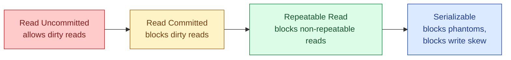
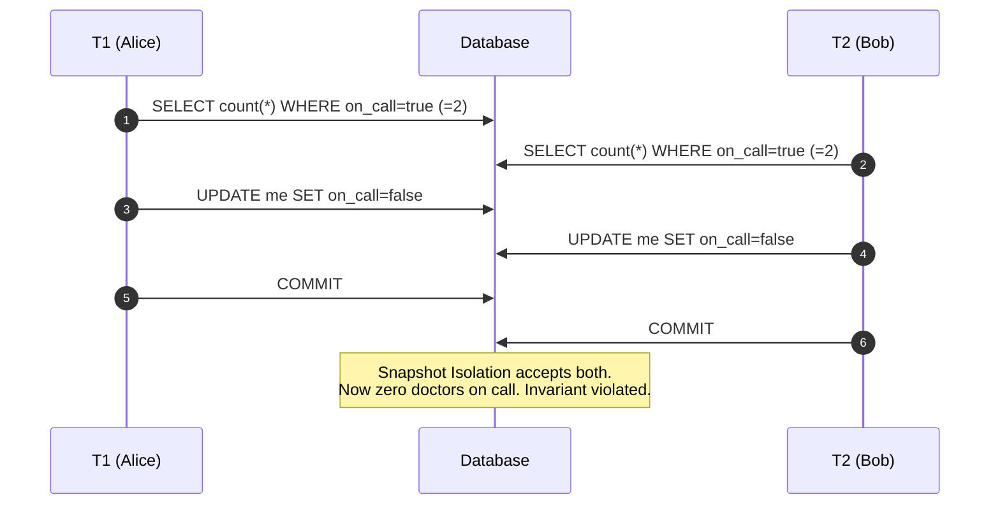

A transaction is the database promising you two things. First, the group of statements either all commit or none of them do. Second, while you are mid-transaction, other concurrent transactions will not let you see their half-finished work, and will not let you corrupt theirs. The first promise (atomicity) is easy to reason about. The second one (isolation) is a dial, and the dial has four standard positions plus a popular fifth one. Most engines default to a position that is wrong often enough to cause real bugs.

## What "ACID" actually means

The four letters get repeated a lot, so worth being precise:

- **Atomicity**: a transaction is all-or-nothing. Crash mid-way, the engine rolls it back.
- **Consistency**: a transaction moves the database from one valid state to another. Constraints hold at commit time.
- **Isolation**: concurrent transactions do not corrupt each other. The level of isolation is the thing we tune.
- **Durability**: once `COMMIT` returns, the change survives a power cut.

A and D are mostly free from the engine. C is mostly your schema. I is where the design work happens.

## The three classical anomalies

A transaction that runs alone on the database is always correct. The hard cases come when two transactions overlap. The SQL standard names three things that can go wrong:

```mermaid
flowchart TB
    subgraph DR["Dirty read"]
        direction LR
        A1["T1 writes balance=50<br/>(uncommitted)"]:::w
        A2["T2 reads balance=50"]:::r
        A3["T1 rolls back<br/>balance never was 50"]:::bad
        A1 --> A2 --> A3
    end
    subgraph NRR["Non-repeatable read"]
        direction LR
        B1["T1 reads balance=100"]:::r
        B2["T2 writes balance=80, commits"]:::w
        B3["T1 reads balance=80<br/>same row, different value"]:::bad
        B1 --> B2 --> B3
    end
    subgraph PR["Phantom read"]
        direction LR
        C1["T1: SELECT WHERE status='new'<br/>5 rows"]:::r
        C2["T2: INSERT new row, commits"]:::w
        C3["T1 repeats query<br/>6 rows now"]:::bad
        C1 --> C2 --> C3
    end

    classDef r fill:#dbeafe,stroke:#1e40af,color:#1e3a8a
    classDef w fill:#fed7aa,stroke:#c2410c,color:#7c2d12
    classDef bad fill:#fecaca,stroke:#b91c1c,color:#7f1d1d
```



There is a fourth one the standard does not list but you will hit in real systems: **write skew**, where two transactions each read the same data, decide independently that it is safe to write, and together break an invariant. Snapshot Isolation does not prevent it. Serializable does.

## The four standard levels

Each level prevents more anomalies and costs more concurrency.



**Read Uncommitted**: you can see another transaction's uncommitted writes. Almost no engine actually implements this differently from Read Committed today. Postgres just maps it to Read Committed.

**Read Committed**: you only see committed data, but two reads inside the same transaction can see different values if someone else committed in between. This is the **default** in Postgres, Oracle, and SQL Server.

**Repeatable Read**: a read returns the same value all transaction long, even if someone commits a newer one. Postgres implements this as full **Snapshot Isolation**: every read sees the snapshot taken at the first statement. MySQL InnoDB also defaults here.

**Serializable**: behaves as if every transaction ran one after another, with no overlap. Postgres uses Serializable Snapshot Isolation (SSI), which detects conflicting access patterns at commit and aborts one. Cost: more retries.

## Snapshot Isolation vs Serializable: the write-skew gap

This is the case nobody warns you about. Imagine an on-call rota: at least one doctor must always be on call. Two doctors named Alice and Bob are both on. Both decide independently to take themselves off.



Under Snapshot Isolation (Postgres `REPEATABLE READ`), both commits succeed. Serializable would abort one. This is why "Postgres Repeatable Read is enough" is wrong for any workload with cross-row invariants.

## How Postgres implements isolation: MVCC in one paragraph

Postgres stores multiple versions of each row. Every transaction has a transaction ID (`xid`). Every row version carries `xmin` (creating txn) and `xmax` (deleting/superseding txn). A snapshot is "the set of txns that had committed when I started." A row version is visible if its `xmin` is in your snapshot and its `xmax` is not. Read Committed takes a new snapshot at the start of each statement; Repeatable Read takes one at the first statement and reuses it. No locks needed for reads. This is why Postgres reads never block writes and vice versa. MySQL InnoDB does it differently with undo logs but the user-visible behaviour is similar.

## Worked example: setting the level

```sql
-- per-transaction (most common):
BEGIN;
SET TRANSACTION ISOLATION LEVEL SERIALIZABLE;
SELECT count(*) FROM doctors WHERE on_call = true;
-- ... business logic ...
UPDATE doctors SET on_call = false WHERE id = 42;
COMMIT;
-- if SSI detected a conflict, COMMIT throws:
-- ERROR: could not serialize access due to read/write dependencies
-- application must catch this and retry the whole transaction.

-- session-wide default:
SET SESSION CHARACTERISTICS AS TRANSACTION ISOLATION LEVEL REPEATABLE READ;

-- check current setting:
SHOW transaction_isolation;
```

Serializable in Postgres is not free, but it is much cheaper than people expect. If your retry rate stays under a few percent, just use it for the transactions that touch invariants.

## Picking a level for a real workload

- **Read-mostly OLTP** (a typical web app): default Read Committed is fine for 90% of statements. Wrap the few statements that update a balance or check inventory in a tighter level.
- **Anything with an invariant across rows** (rota, inventory, double-booking): Serializable, with a retry loop in the app.
- **Long-running reports inside the same transaction**: Repeatable Read so the report does not flicker.
- **Batch jobs**: Serializable or explicit row locks. The throughput cost is irrelevant because batches do not race users.

## Common mistakes

- **Assuming Read Committed is safe enough.** It is the default everywhere, and it lets non-repeatable reads through. Two `SELECT`s on the same row in one transaction can return different values.
- **Confusing Repeatable Read with Serializable.** Postgres `REPEATABLE READ` is Snapshot Isolation and does not stop write skew. If two transactions read the same set and each decides "I am safe to write," both commit.
- **Wrapping a long HTTP call inside a transaction.** You hold a snapshot and possibly locks for the duration of the call. Other writers stall. Push the side effect outside the transaction.
- **Forgetting to retry on serialization failures.** Under Serializable, `COMMIT` can fail with code `40001`. The app must catch it and rerun the whole transaction. No retry = silent data loss.
- **Mixing isolation levels in one logical operation.** The connection pool hands you a session with the previous user's `SET TRANSACTION` still in effect. Reset it explicitly or set per-transaction.
- **Using `SELECT FOR UPDATE` "to be safe" everywhere.** That is pessimistic locking sneaking in. It serializes writers and kills throughput. Pick a level deliberately. See [Optimistic vs pessimistic locking](/practice/system-design/concepts/073-optimistic-vs-pessimistic-locking/).

## Quick recap

- A transaction promises atomicity and isolation. Isolation is a dial.
- Four standard levels: Read Uncommitted, Read Committed, Repeatable Read, Serializable. Postgres adds Snapshot Isolation under the Repeatable Read name.
- The default almost everywhere is Read Committed. It allows non-repeatable reads and phantoms.
- Snapshot Isolation does not prevent write skew. Serializable does.
- Use Serializable for any code path that defends an invariant, and retry on `40001`.

This concept sits in **Stage 2 (Storage and data)** of the [System Design Roadmap](/practice/system-design/roadmap/).
