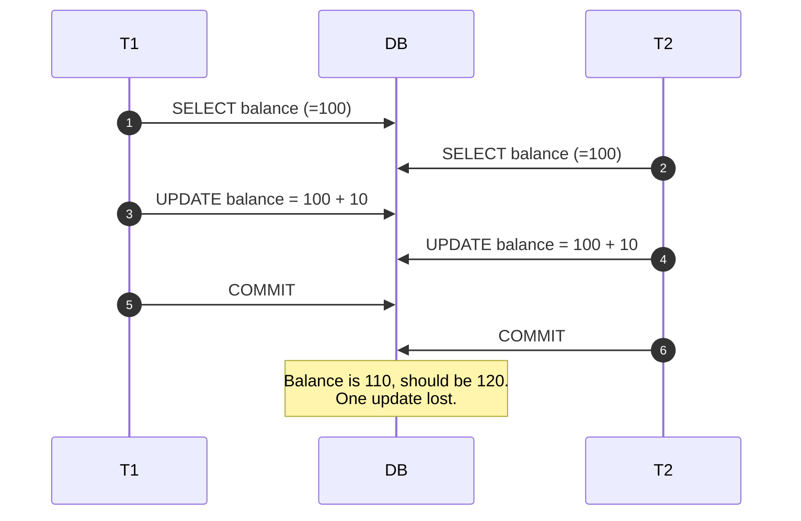
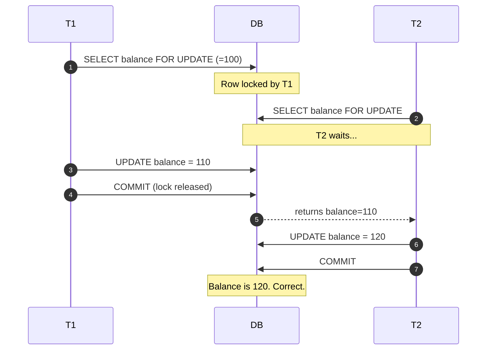
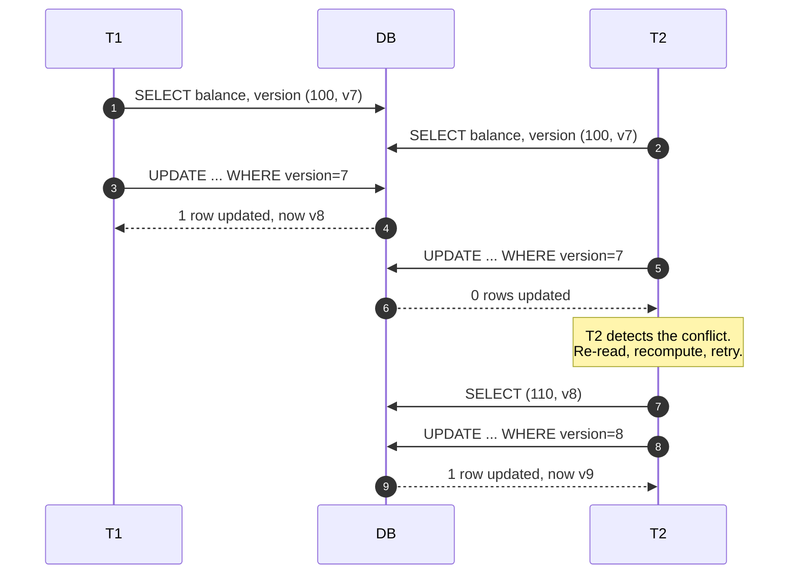
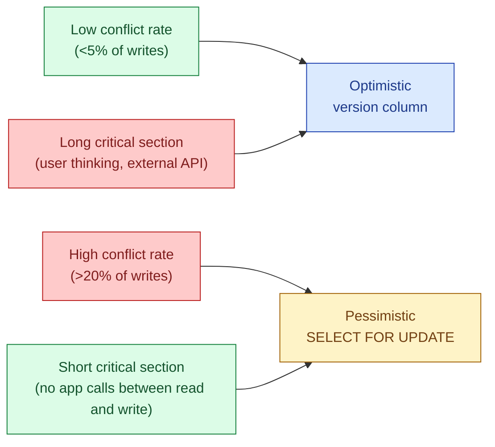

Two writers want to update the same row at the same time. Pessimistic locking says "I will grab the row now, you wait." Optimistic locking says "we both read freely, and at commit time I check whether you changed anything; if you did, I retry." Both are correct. They have opposite failure modes. Pessimistic costs throughput on contended rows; optimistic costs throughput when contention is high enough that retries pile up. The senior skill is knowing which side of that line your workload sits on.

## What "the lost update problem" looks like

A bank balance starts at 100. Two transactions both want to add 10.



This is the classic **lost update**. Both styles of locking fix it. They just fix it at different times.

## Pessimistic locking: hold the row

The first reader takes a row lock. The second reader blocks until the first commits or rolls back.



The cost: T2 sat idle the whole time T1 was thinking. If T1's transaction takes 50 ms and 50 clients hit the same row, the last client waits two and a half seconds. Throughput on contended rows collapses to one writer at a time.

```sql
-- Postgres / MySQL
BEGIN;
SELECT balance FROM accounts WHERE id = 42 FOR UPDATE;
-- application computes new balance
UPDATE accounts SET balance = balance + 10 WHERE id = 42;
COMMIT;
```

`FOR UPDATE` takes an exclusive row lock. `FOR SHARE` takes a shared one (others can read with `FOR SHARE` but not `FOR UPDATE`). Postgres also has `FOR UPDATE SKIP LOCKED`, which lets workers grab the next unlocked job from a queue table without stepping on each other, a great pattern for lightweight job queues.

## Optimistic locking: a version column

No lock at read time. The row carries a `version` number. The update says "set version to N+1 where version is still N." If someone else got there first, the row is no longer at version N, so zero rows are updated. The app sees `0 rows affected` and retries.

```sql
-- read
SELECT balance, version FROM accounts WHERE id = 42;
-- got balance=100, version=7

-- compute new balance in app

-- write with version check
UPDATE accounts
   SET balance = 110, version = 8
 WHERE id = 42 AND version = 7;

-- if rows_affected = 0, someone beat us. Re-read and retry.
```



No row lock was ever held outside the actual `UPDATE` statement. T2's only cost was one wasted round trip and one retry. If conflicts are rare (say, under 5% of writes), this is dramatically faster than pessimistic locking.

You do not need a `version` column if your engine exposes one. Postgres has `xmin` (the row version's creating transaction id) and you can use `WHERE xmin = ?` for the same effect. JPA/Hibernate, Django, and Rails all have built-in optimistic locking helpers.

## Inventory decrement: the canonical example

You have one unit left of a product. Two customers click "buy" within the same millisecond.

```sql
-- pessimistic
BEGIN;
SELECT stock FROM products WHERE id = 99 FOR UPDATE;
-- stock = 1, ok to sell
UPDATE products SET stock = stock - 1 WHERE id = 99;
INSERT INTO orders (...) VALUES (...);
COMMIT;
```

```sql
-- optimistic
UPDATE products
   SET stock = stock - 1, version = version + 1
 WHERE id = 99 AND stock > 0 AND version = :v;
-- if 0 rows: someone else got the last one. Show "sold out".
```

For a hot product (Black Friday flash sale), pessimistic is fine: contention is brief, the row lock matches the business reality of "one at a time." For a long-tail catalogue where conflicts are vanishingly rare, optimistic is faster and avoids holding any locks across application logic.

## When each fits



Two rules that work in practice:

- **Optimistic for user-facing writes.** A user clicks "save" after editing a form for two minutes. You cannot hold a row lock for two minutes. Use a version column; if they lost, show "someone else edited this, here is the diff."
- **Pessimistic for short, contended, server-side critical sections.** Job queues, sequence generators, hot inventory counters. The lock is held for milliseconds.

## Common mistakes

- **Using pessimistic locking across user think time.** A `SELECT FOR UPDATE` followed by an HTTP call to a third party blocks every other writer for the whole call. Lock at write time only.
- **Forgetting to check `rows_affected` on the optimistic update.** If you do not check, you silently swallowed the conflict and overwrote the other writer.
- **Retrying optimistic conflicts forever.** Under high contention, retries pile up and you live-lock the table. Cap retries (maybe 3) and either fall back to pessimistic or surface the error to the user.
- **Locking a parent row to protect children.** `SELECT FOR UPDATE` on the `accounts` row does not lock the `transactions` table. Lock what you actually mutate.
- **Mixing both styles on the same row without thinking.** If half the writers `SELECT FOR UPDATE` and half do optimistic, the pessimistic writers serialize while the optimistic ones happily overwrite. Pick one per row.
- **Deadlocks from inconsistent lock order.** Two transactions that lock rows in opposite orders will deadlock. Always lock in a deterministic order (e.g., always smaller account id first in a transfer).
- **Ignoring `SKIP LOCKED` for queues.** If you implement a job queue with plain `FOR UPDATE`, all workers serialize on the same row. `FOR UPDATE SKIP LOCKED` lets each worker grab a different unlocked row.

## Quick recap

- Pessimistic: lock the row at read time. Correct, simple, throughput dies under contention.
- Optimistic: version column, check at write, retry on conflict. Throughput stays high if conflicts are rare.
- Pick optimistic for user-facing writes with long think time. Pick pessimistic for short, hot, server-side critical sections.
- Always check `rows_affected` and cap retries. Always lock in a deterministic order if you lock more than one row.
- `SELECT FOR UPDATE SKIP LOCKED` is the right tool for a Postgres job queue.

This concept sits in **Stage 2 (Storage and data)** of the [System Design Roadmap](/practice/system-design/roadmap/).
