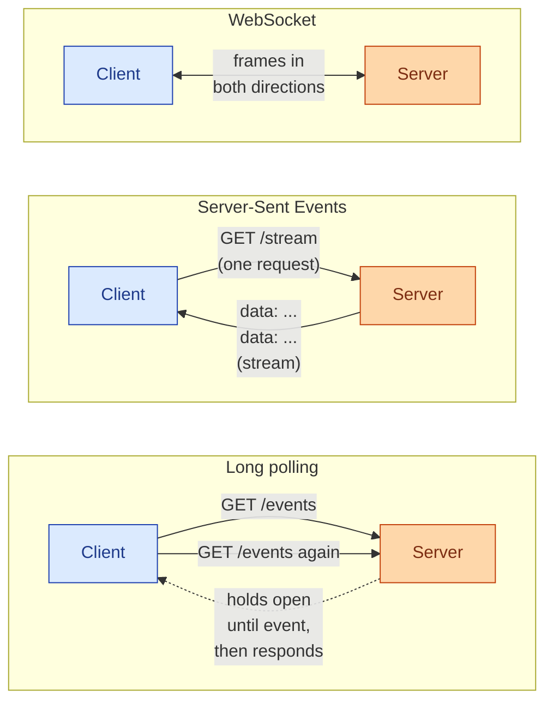
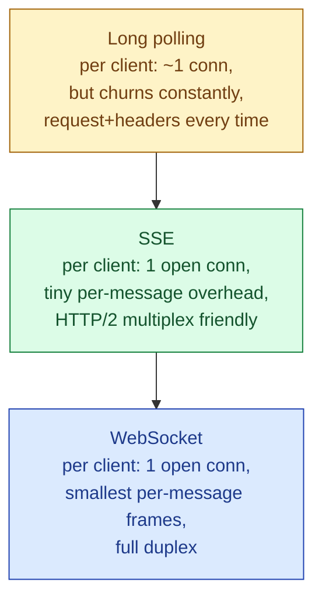

HTTP was designed for the client to ask and the server to answer. The moment you want the server to tell the client that something changed (a new chat message, a stock tick, a build finished), you are pushing against that grain. Three patterns have survived: long polling (the client keeps asking), Server-Sent Events (the server keeps one HTTP response open and writes to it), and WebSockets (both sides hold a full-duplex socket). They differ in latency, in resource cost at the gateway, in how they survive bad networks, and in how much you trust the boxes between client and server.

## What "server push" actually means



Long polling fakes push using plain HTTP. SSE is one long-running HTTP response. WebSocket is a real bidirectional socket negotiated by an HTTP upgrade and then leaves HTTP behind.

## Long polling: the lowest-tech option

The client opens a normal `GET`. The server holds the response open until something happens (or a timeout fires), then writes the event and closes. The client immediately opens another `GET`.

```js
async function poll() {
  while (true) {
    const res = await fetch("/events?since=" + cursor);
    const batch = await res.json();
    for (const ev of batch.events) handle(ev);
    cursor = batch.cursor;
    // loop; if the server times out at 30s, we just retry.
  }
}
poll();
```

Works through every proxy, every firewall, every corporate VPN, every CDN, because it is just HTTP. Reconnect logic is trivial: the next loop iteration. The cost is the constant churn of new connections plus the latency floor (an event that arrives one millisecond after the server closed has to wait for the next poll to open).

## Server-Sent Events: one-way, dead simple

The server returns `Content-Type: text/event-stream` and never closes the response. It writes `data: ...\n\n` chunks whenever it has news. The browser's built-in `EventSource` handles framing, reconnects automatically, and even resumes from the last event id.

```js
const es = new EventSource("/stream");
es.onmessage = (e) => handle(JSON.parse(e.data));
es.onerror = () => { /* browser reconnects on its own */ };
```

```
HTTP/1.1 200 OK
Content-Type: text/event-stream
Cache-Control: no-cache

id: 117
data: {"type":"price","sym":"AAPL","px":189.42}

id: 118
data: {"type":"price","sym":"AAPL","px":189.45}
```

SSE is what people reach for too rarely. It is plain HTTP, so every gateway understands it. It survives HTTP/2 multiplexing. It has built-in `Last-Event-ID` resume. It works through CDNs that allow chunked transfer. The single rule that disqualifies it: it is one-way. The client can still `POST` separately, but the open stream only flows server → client.

## WebSockets: full duplex, real socket

The client sends an HTTP request with `Upgrade: websocket`. The server accepts, the connection switches protocol, and from there it is a TCP socket with a framing layer. Either side can send a message at any time, with low overhead per message.

```js
const ws = new WebSocket("wss://example.com/chat");
ws.onopen = () => ws.send(JSON.stringify({ type: "subscribe", room: "42" }));
ws.onmessage = (e) => render(JSON.parse(e.data));
ws.onclose = () => setTimeout(connect, backoff());
```

The browser does not auto-reconnect. You write that. You also write heartbeats (`ping`/`pong` frames), because middleboxes love to silently drop idle TCP connections after a few minutes.

## What it costs at scale



The number to watch on the server side is **concurrent open connections**. A modern Linux box with tuned `nf_conntrack`, file descriptors, and a Go or Rust event loop comfortably holds hundreds of thousands of idle WebSockets or SSE streams. A Node or Python app server holding the same connections will fall over much sooner. This is why WebSocket-heavy systems (Slack, Discord, trading dashboards) sit on dedicated edge gateways and use a separate cluster for state.

Long polling has the opposite cost shape: not many simultaneous open connections, but a constant high rate of new ones, with full HTTP headers on each. Behind a CDN this is fine; behind a small fleet of app servers it eats CPU.

## Picking one in practice

- **Server pushes one-way updates** (dashboards, feed updates, build logs, AI token streams): **SSE**. It is the right answer more often than the WebSocket hype implies.
- **Two-way, latency-sensitive** (chat, collaborative editing, multiplayer): **WebSockets**.
- **Behind a hostile proxy or you cannot ship JS** (legacy enterprise, embedded device): **long polling**. It is ugly but it works.
- **You only need updates every few seconds and traffic is modest**: regular polling on a timer is honestly fine. Do not overbuild.

## Reconnect and message loss

All three lose messages during a network blip if you do not design for it. The pattern is the same in each:

- The server keeps a per-client `last_event_id` (SSE has it built in via the `id:` field; WebSockets you implement yourself).
- On reconnect, the client sends its last seen id.
- The server replays any newer events from a short in-memory or Redis buffer.

If you skip this, every flaky network drops messages and your "real-time" app silently desyncs.

## Worked example: a notification stream

Pick SSE. Endpoint `GET /notifications/stream`, response `text/event-stream`, server writes `id: <db_seq>\ndata: <json>\n\n`. Client uses `EventSource("/notifications/stream")` and on reconnect the browser sends `Last-Event-ID: <last_seq>` automatically. Server reads that header, replays from the DB or Redis stream from `last_seq + 1`. No `POST` channel needed because the user does not send anything back on this stream; their actions go through the normal API. Done.

If you had instead reached for WebSockets here you would have written 200 lines of reconnect, heartbeat, and replay code to end up at the same behaviour SSE gives you for free.

## Common mistakes

- **Reaching for WebSockets because they sound modern.** If the data flow is one-way, SSE is simpler, has built-in reconnect and resume, and works through more middleboxes.
- **Skipping heartbeats.** A WebSocket sitting idle for 5 minutes behind a corporate proxy will silently die. Send `ping` every 30 seconds and reconnect on missed `pong`.
- **No per-client cursor on the server.** Reconnects lose messages. Always track `last_event_id` and replay.
- **Holding all connection state in the app server's memory.** When the box restarts, every client reconnects to a different server and loses their session. Put session state in Redis, keep the socket process stateless.
- **Letting long polling open requests with no timeout.** If the server never closes, a flaky client leaks a connection per blip. Cap holds at 30 to 60 seconds.
- **Treating WebSockets like HTTP for sharding.** A sticky load balancer is fine for a few thousand sockets but does not scale to millions. Use a pub/sub layer (Redis, Kafka, NATS) so any gateway node can deliver to any client.
- **Forgetting that browsers cap connections per origin.** Old HTTP/1.1 capped at 6 per origin; SSE on HTTP/1.1 eats one of those. On HTTP/2 this is gone.

## Quick recap

- Long polling: plain HTTP, works everywhere, churns connections, latency floor.
- SSE: one HTTP response held open, server to client only, automatic reconnect and resume, underused.
- WebSockets: real duplex socket, lowest per-message cost, you write reconnect and heartbeats yourself.
- Pick SSE when the data flows one way; pick WebSockets when both sides talk; pick polling when nothing else gets through.
- Always design for reconnect with a client cursor and a server-side replay buffer.

This concept sits in **Stage 1 (Foundations)** of the [System Design Roadmap](/practice/system-design/roadmap/).
