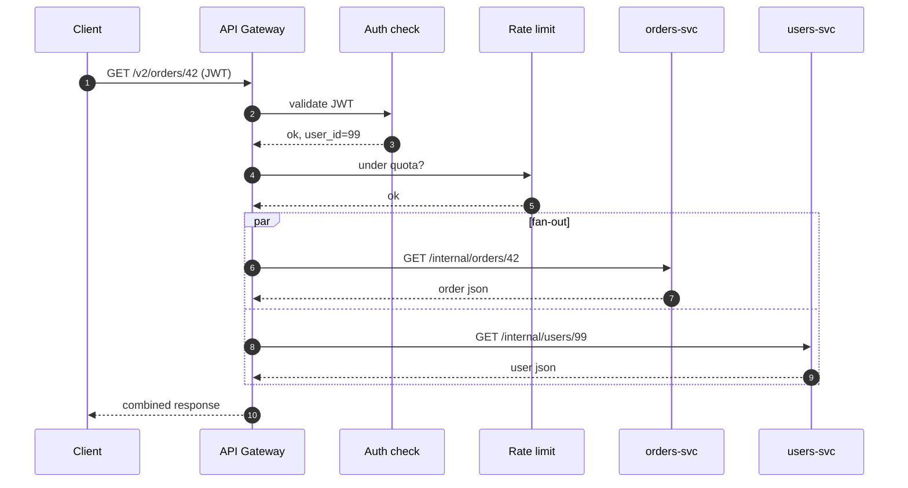
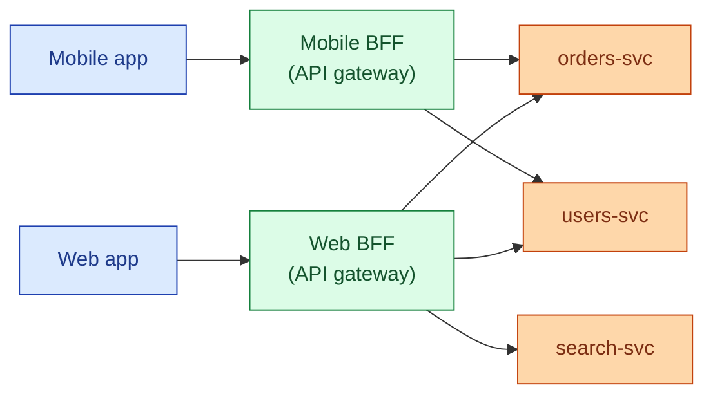

A load balancer routes a packet to a healthy backend. A reverse proxy terminates TLS and forwards the request. An API gateway does both, then adds the cross-cutting concerns that every public API needs anyway: authentication, rate limiting, request shaping, schema validation, response caching, and a single client-facing contract for whatever the backend looks like this quarter. Whether you need one depends on how many services sit behind it and who is calling them. A solo monolith does not need an API gateway. Twenty microservices that anyone on the public internet can hit absolutely do.

## Three boxes that sound similar

```mermaid
flowchart LR
    subgraph LB["Load balancer (L4)"]
        direction TB
        L1["routes by IP and port"]:::a
        L2["does not parse HTTP"]:::a
        L3["health checks, sticky sessions"]:::a
    end
    subgraph RP["Reverse proxy (L7)"]
        direction TB
        R1["terminates TLS"]:::b
        R2["routes by hostname / path"]:::b
        R3["adds X-Forwarded-For"]:::b
    end
    subgraph GW["API Gateway"]
        direction TB
        G1["everything reverse proxy does"]:::g
        G2["+ auth, rate limit, transform"]:::g
        G3["+ aggregation, BFF, observability"]:::g
    end

    LB --> RP --> GW

    classDef a fill:#dbeafe,stroke:#1e40af,color:#1e3a8a
    classDef b fill:#fed7aa,stroke:#c2410c,color:#7c2d12
    classDef g fill:#dcfce7,stroke:#15803d,color:#14532d
```



The line between reverse proxy and API gateway is fuzzy on purpose. NGINX is a reverse proxy that you can configure into doing gateway work. Envoy is a proxy that ships with most of the gateway primitives built in. Kong is "Envoy plus a plugin system." AWS API Gateway is a managed service that gives you the gateway features without running the proxy yourself.

## What a gateway does that a plain LB does not

A plain L4 load balancer hands a TCP connection to a backend and walks away. A gateway is in the middle of every request and can do work on each one:

- **Authentication and authorization** in one place. Validate the JWT or API key, attach the user identity to the upstream request as a header. Backends trust the header and stop reimplementing auth.
- **Rate limiting and quotas** per API key, per user, per route. See [Bulkheads and rate limiting](/practice/system-design/concepts/047-bulkheads-and-rate-limiting/).
- **Request and response transformation**: strip internal headers, rewrite paths, convert gRPC to REST or vice versa, redact PII before sending to a less-trusted backend.
- **Schema validation** at the edge so malformed requests never reach a service.
- **Caching** of GET responses at the edge, often with cache keys per user role.
- **Observability** in one place: structured logs, traces, request ids attached before fan-out.
- **Single public contract**: clients hit `api.example.com/v2/orders` and have no idea that `orders` is service A, B, and C glued together.

## How a request actually moves through one



The gateway here is doing three things a plain load balancer cannot: validating the token, enforcing quota, and stitching two backend calls into one response (request aggregation, the heart of the BFF pattern).

## Backend-for-Frontend (BFF)

A mobile app and a web app want different shapes of data. The mobile app wants 3 fields; the web app wants 12 plus thumbnails. Two options:

1. One generic API that returns everything and lets each client filter. Wasteful, leaks fields, version hell.
2. A small gateway per client (a "BFF"): mobile-bff and web-bff. Each one calls the same backend services and projects exactly what its client needs.



BFFs are owned by the client team, deployed alongside the client, and exist to keep the public contract clean.

## Common gateway implementations

- **Kong**: open source, runs on top of NGINX or Envoy, big plugin ecosystem, also a managed offering.
- **Envoy**: the proxy under most modern gateways and meshes. You can run it directly.
- **AWS API Gateway**: fully managed, deep IAM integration, pay-per-request. Easiest for serverless backends, painful for high-RPS streaming.
- **Cloudflare**: edge gateway, runs your auth and rate limit at every PoP. Wins on global latency.
- **Apigee, Azure APIM, GCP API Gateway**: enterprise managed gateways with portals, monetization, and lots of forms.
- **Istio / Linkerd**: service meshes, which handle east-west traffic between services. They overlap with gateways on auth and rate limit; the gateway handles north-south (client to cluster) traffic.

You can use both: a gateway at the edge for clients, a mesh inside the cluster for service-to-service.

## Worked example: a minimal gateway config (Kong-style)

```yaml
services:
  - name: orders
    url: http://orders.internal:8080
    routes:
      - name: orders-public
        paths: ["/v2/orders"]
    plugins:
      - name: jwt
      - name: rate-limiting
        config:
          minute: 60
          policy: redis
      - name: request-transformer
        config:
          remove:
            headers: ["X-Internal-Auth"]
          add:
            headers: ["X-User-Id:$(jwt.sub)"]
      - name: response-transformer
        config:
          remove:
            json: ["internal_notes"]
```

Same upstream service, but at the edge: JWT check, 60 RPM per consumer, internal headers stripped, user id forwarded, internal fields hidden from clients.

## When you do not need one

- **A small monolith with one client and internal users only.** A reverse proxy (NGINX, Caddy) plus a load balancer is enough.
- **No public API.** If only internal services call this, a mesh covers the same concerns and you skip the extra hop.
- **Hard real-time pipelines.** Every extra proxy adds latency. A gateway that adds 5 ms is fine for a REST API and terrible for a market-data fan-out.
- **You only have one or two services.** A gateway becomes worth it around the point where you would have to re-implement auth and rate limit in each service.

## Gateway as a single point of failure

The gateway sees every request. If it goes down, the public API is down even if all the backends are healthy. So run it as a fleet behind a load balancer, deploy it across zones, version its config the same way you version code, and keep a kill-switch path that bypasses fancy features and just proxies to the backend if a plugin misbehaves.

## Common mistakes

- **Putting business logic in the gateway.** A line of code in a gateway plugin looks innocent; six months later your gateway is a distributed monolith. The gateway is for cross-cutting concerns, not domain logic.
- **Calling everything that proxies traffic an "API Gateway."** NGINX in front of one service is a reverse proxy. Call it that.
- **Stacking three gateways.** CDN edge + cloud gateway + internal mesh gateway, each rewriting auth. Pick the smallest stack that works.
- **No per-route timeouts.** One slow backend hangs every request on the gateway worker. Set short timeouts per route and isolate slow upstreams.
- **Hot-pathing CPU-heavy work in the gateway.** Heavy crypto, JSON transforms on big payloads, or schema validation of huge documents at the gateway will pin CPU. Push heavy work to the backend or to a dedicated layer.
- **Using a managed gateway without understanding its quotas.** AWS API Gateway, for example, has a 29-second hard timeout. Streaming endpoints break in surprising ways.
- **Forgetting that the gateway is the auth boundary.** Backends still need a way to verify they were called through the gateway, otherwise a leaky pod can be called directly and bypass auth. Use mTLS or a signed header.

## Quick recap

- Load balancer: routes traffic. Reverse proxy: routes traffic and terminates TLS. API gateway: all that, plus auth, rate limit, transform, aggregate, observe.
- The gateway gives you one public contract on top of many services and stops every team from reimplementing the same five concerns.
- BFFs are gateways scoped to a single client.
- Run the gateway as a fleet, set per-route timeouts, keep business logic out of it.
- A small monolith does not need one. Twenty microservices on the public internet do.

This concept sits in **Stage 4 (Scaling and reliability)** of the [System Design Roadmap](/practice/system-design/roadmap/).
