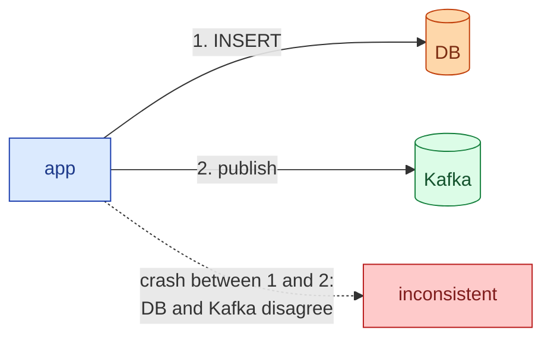

CDC turns a database into a stream. Every insert, update, and delete becomes an event that other systems can consume in order, with at-least-once delivery, without the application writing the event itself. It is the modern alternative to dual writes (write to the DB and to Kafka and pray they stay in sync) and to polling on `updated_at` (slow, misses deletes, breaks on clock skew). Once you have CDC, a lot of architectural questions get easier: cache invalidation, search index sync, microservice integration, lakehouse ingestion, audit logs. They all become "subscribe to the change stream."

## The dual-write problem CDC solves

The naive way to publish events for downstream consumers:

```python
def place_order(order):
    db.insert(order)            # step 1: write to DB
    kafka.publish("orders", order)   # step 2: publish event
```

Two storage systems, no shared transaction. If step 1 succeeds and step 2 crashes, the DB has the order and nobody downstream knows. If step 2 succeeds and step 1 rolls back, you published an event for an order that does not exist. There is no ordering of these calls that fixes it. This is the **dual-write problem**.



CDC fixes this by making the database the single source of truth and treating the change stream as a derived view of the DB's own commit log. The app writes once, to the DB. The events fall out.

## The three implementation styles

```mermaid
flowchart TB
    subgraph TRIG["Trigger-based"]
        direction LR
        T1["INSERT/UPDATE/DELETE"]:::a --> T2["trigger writes<br/>to audit table"]:::b
        T2 --> T3["poller reads<br/>audit table"]:::y
    end
    subgraph POLL["Query-based polling"]
        direction LR
        P1["job runs every Ns"]:::a --> P2["SELECT WHERE<br/>updated_at > cursor"]:::b
        P2 --> P3["emit rows<br/>to consumer"]:::y
    end
    subgraph LOG["Log-based (WAL / binlog)"]
        direction LR
        L1["INSERT/UPDATE/DELETE"]:::a --> L2["WAL entry"]:::g
        L2 --> L3["Debezium / connector<br/>reads WAL"]:::g
        L3 --> L4["events to Kafka"]:::g
    end

    classDef a fill:#dbeafe,stroke:#1e40af,color:#1e3a8a
    classDef b fill:#fed7aa,stroke:#c2410c,color:#7c2d12
    classDef y fill:#fef3c7,stroke:#a16207,color:#713f12
    classDef g fill:#dcfce7,stroke:#15803d,color:#14532d
```



**Trigger-based.** Database triggers fire on every write and append to an audit table. A poller drains the table. Works on any DB that supports triggers. Adds write overhead to the application transaction (the trigger runs inline). Hard to evolve when the schema changes.

**Query-based polling.** A job runs every N seconds, asks `SELECT ... WHERE updated_at > :cursor`, advances the cursor. Easy to implement, miserable in practice. Misses deletes (a deleted row has no row to read). Misses updates that move the row's `updated_at` backwards. Latency floor of the poll interval. Clock skew on multi-writer setups corrupts the cursor.

**Log-based.** The connector tails the DB's own replication log (Postgres logical WAL via a replication slot, MySQL binlog with row format, SQL Server's CDC tables, MongoDB oplog). The log is what the DB uses to replicate to its own replicas, so by definition it sees every committed change, in commit order, including deletes. Zero overhead on the application transaction. This is what you want.

## Log-based CDC with Debezium

Debezium is the canonical open source log-based CDC tool. It runs as a Kafka Connect source connector. Point it at a Postgres replication slot and a topic naming convention, and you get one Kafka topic per table, with every change as a typed event.

```json
{
  "before": null,
  "after": {
    "id": 42,
    "user_id": 7,
    "status": "paid",
    "total_cents": 1999
  },
  "source": {
    "ts_ms": 1717000123456,
    "db": "shop",
    "table": "orders",
    "lsn": 28394823
  },
  "op": "c",
  "ts_ms": 1717000123500
}
```

`op` is `c` (create), `u` (update), `d` (delete), or `r` (snapshot read). `before` and `after` give the full row state. `source.lsn` is the WAL position, used for ordering and resume.

Postgres setup looks roughly like this:

```sql
-- set up wal_level for logical replication
ALTER SYSTEM SET wal_level = 'logical';
-- restart Postgres

-- create a publication of the tables you want streamed
CREATE PUBLICATION shop_cdc FOR TABLE orders, payments, users;

-- Debezium creates the replication slot on its first connect
-- and tails it forever; the slot survives restarts.
```

## The outbox pattern: when CDC is not enough on its own

CDC gives you row-level events. Sometimes you want **domain events**: "OrderPlaced" with five fields hand-picked by the application, not "row inserted into orders table." The trick is the **outbox pattern**: in the same DB transaction as the business write, insert a row into an `outbox` table holding the domain event. CDC then streams the outbox like any other table.

```sql
BEGIN;
INSERT INTO orders (...) VALUES (...);
INSERT INTO outbox (aggregate, event_type, payload)
VALUES ('order', 'OrderPlaced',
        '{"order_id":42,"user_id":7,"total":1999}');
COMMIT;
```

Atomic with the order write. CDC publishes the outbox event. Consumers see a clean domain event. No dual write, no lost event, no event for a rolled-back order.

## Where CDC fits in a real architecture

- **Cache invalidation.** When a row changes, invalidate the cache key. See [Cache invalidation](/practice/system-design/concepts/026-cache-invalidation/).
- **Search index sync.** Stream changes into Elasticsearch or OpenSearch.
- **Microservice integration.** Service A's DB is the source of truth; service B subscribes to its CDC stream and updates its own read model.
- **Data lake / warehouse ingestion.** CDC into Kafka, then into Iceberg/Delta/BigQuery. Replaces nightly batch dumps.
- **Audit log.** The WAL already records every change; CDC turns it into a queryable timeline.

## What CDC does not give you for free

- **Exactly-once.** Connectors guarantee at-least-once. Consumers must be idempotent. See [Idempotency](/practice/system-design/concepts/021-idempotency/).
- **Strict global ordering across tables.** Per-table or per-key ordering, yes. Across tables, only if you keep everything on one topic partition, which kills throughput.
- **Schema evolution.** If you `ALTER TABLE`, downstream consumers see new fields. Plan a schema registry (Avro, Protobuf, JSON Schema) before you regret it.
- **Slot management on Postgres.** A stuck connector that does not advance its replication slot makes the WAL grow forever and eventually fills the disk. Monitor `pg_replication_slots.confirmed_flush_lsn`.

## Common mistakes

- **Dual writing and then "adding CDC later."** The two will drift. Pick one source of truth; if it is the DB, get rid of the dual write the same day you turn on CDC.
- **Polling on `updated_at` and calling it CDC.** It misses deletes, it misses out-of-order updates, and the cursor lies under clock skew. Use the log.
- **No outbox, then trying to derive domain events from raw row changes.** Downstream services end up rebuilding business logic from `before`/`after` diffs. Outbox the events you actually want.
- **Forgetting deletes.** Row deletes only appear as tombstones in log-based CDC. Trigger-based CDC has to capture deletes explicitly. Query polling cannot see them at all.
- **Letting the replication slot grow unboundedly.** A stopped consumer pins the WAL. Disk fills. DB stops accepting writes. Alert on slot lag.
- **Assuming exactly-once delivery.** All CDC is at-least-once. Consumers must dedupe on a stable id, usually the source LSN or an outbox event id.
- **Skipping a schema registry.** The first `ALTER TABLE` you ship will break every downstream consumer.

## Quick recap

- CDC streams every DB change to downstream consumers, in order, without the application doing a second write.
- Three styles: trigger-based, query-based polling, log-based. Use log-based.
- Debezium reading Postgres WAL or MySQL binlog is the canonical setup.
- Combine CDC with the outbox pattern to publish real domain events atomically with your DB write.
- CDC is at-least-once. Consumers must be idempotent. Monitor replication slot lag.

This concept sits in **Stage 2 (Storage and data)** and resurfaces in **Stage 3 (Caching, queues, and async work)** of the [System Design Roadmap](/practice/system-design/roadmap/).
