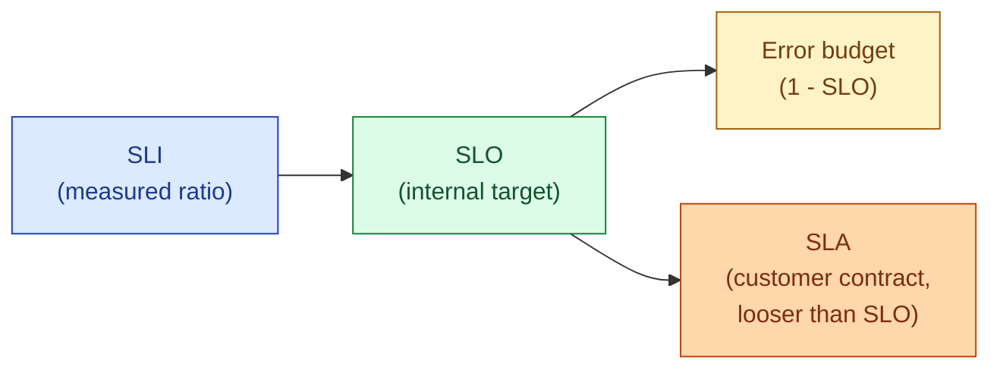
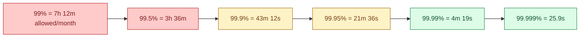
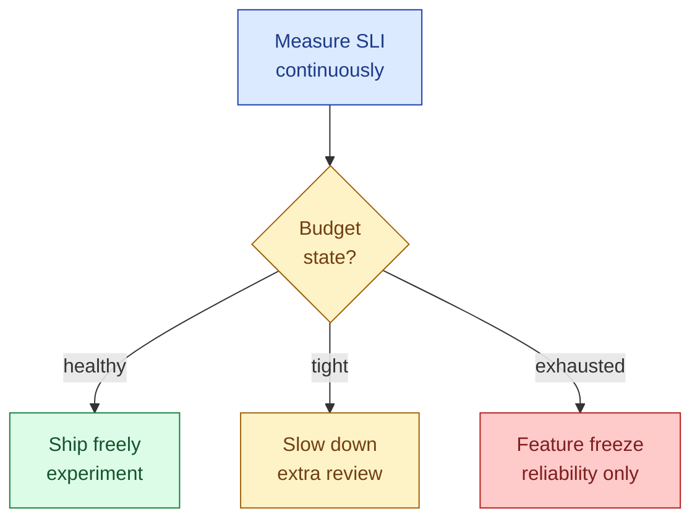

SLI is what you measure. SLO is the target you commit to internally. SLA is the contract you sign with a customer, almost always looser than the SLO so you have headroom. The error budget is what falls out of the SLO: if you committed to 99.9% availability over 30 days, you have 43 minutes 12 seconds of "allowed" badness per month. Spend the budget on shipping features when reliability is fine. Stop shipping and fix things when the budget is gone. That feedback loop is the entire point. Teams that talk about SLAs without SLOs are just signing promises with no internal way to decide what to do.

## The four terms, precisely

- **SLI (Service Level Indicator)**: a measurement of user-perceived behaviour. "Fraction of HTTP requests that returned 2xx or 3xx in under 300 ms." It is a ratio, computed from real production traffic.
- **SLO (Service Level Objective)**: an internal target on that SLI. "99.9% of requests in a 30-day window meet the SLI." This is what the team commits to. It is the dial that drives every other decision.
- **SLA (Service Level Agreement)**: a contract with a customer, including consequences (refund, credit, termination). Always set looser than the SLO. If your SLO is 99.9, your SLA might be 99.5, so when you start burning the SLO you still have room before customer money is on the line.
- **Error budget**: `1 - SLO`. The amount of badness you are allowed to ship. A 99.9% SLO over 30 days = 0.1% × 30 days = 43 minutes 12 seconds.



## Picking an SLI that matches user experience

The SLI must reflect what the user feels. The two most common are availability and latency, expressed as ratios.

```
availability SLI = good_requests / total_requests
latency SLI      = requests_under_300ms / total_requests
```

The unit is "requests" or "events," not "minutes of uptime," because users do not feel "the server was up." They feel "my request worked, fast." A long blip during low traffic burns less budget than a short blip during peak, which is the right shape.

For non-request systems the SLI looks different: data freshness (lag between produced and consumed), durability (loss rate), correctness (mismatch between expected and observed result), throughput floor. Pick whichever maps to "would the user complain if this got worse."

## The "nines" and what they cost in minutes



Each extra nine is roughly 10x more expensive to engineer and operate. 99.9 is achievable by a competent team. 99.99 requires multi-region and zero single points of failure. 99.999 is a multi-million-dollar program. Pick the lowest SLO your users will accept; the budget you save is what funds feature work.

## Why 100% is the wrong goal

If your SLO is 100%, you can never ship a risky change, ever. You also cannot run maintenance, deploy a new version, fail over a region, or do a chaos experiment. 100% means the system is brittle by definition. A non-100% SLO is a permission slip to take controlled risks. You spend the budget on speed when you have it; you slow down when you do not.

## Error budget policy: what changes when the budget is gone

The point of the budget is not to measure things, it is to drive decisions. A policy makes that explicit:

- **Budget healthy (> 50% remaining)**: ship freely, take risks, run chaos drills, deprecate old code.
- **Budget tight (< 50%)**: PRs that touch production paths need a second reviewer. No risky migrations.
- **Budget exhausted**: freeze feature work. Only reliability fixes and rollbacks until the rolling window clears.



The team that owns the SLO must also own the budget policy. Otherwise leadership ignores the freeze and the SLO becomes decorative.

## Burn-rate alerting: the right way to page

A naive alert says "page when error rate > 1%." That fires on every brief blip. Burn-rate alerts fire on **how fast you are consuming the error budget**. If your monthly budget is 43 minutes and you have burned 10 minutes in the last hour, you will be out in four hours; that is a real page. If you burned 30 seconds in the last hour, that is fine, do not wake anyone.

The Google SRE pattern is a **multi-window, multi-burn-rate** alert. Roughly:

- Fast burn (5 minute window) at 14.4x normal rate: page now.
- Slow burn (1 hour window) at 6x normal rate: page now.
- Slow burn (6 hour window) at 1x normal rate: ticket, not a page.

This catches both sudden outages and slow regressions while avoiding noise from one-off blips.

## Worked example: an availability SLO

Service has a 99.9% monthly availability SLO. SLI:

```
sli_availability = sum(rate(http_requests_total{code!~"5.."}[30d]))
                 / sum(rate(http_requests_total[30d]))
```

Monthly budget: `0.001 × 30 × 24 × 60 = 43.2 minutes` of allowed errors.

Burn-rate alert (Prometheus-style sketch):

```yaml
- alert: HighErrorBudgetBurn
  expr: |
    (
      sum(rate(http_requests_total{code=~"5.."}[5m]))
      / sum(rate(http_requests_total[5m]))
    ) > (14.4 * 0.001)
    and
    (
      sum(rate(http_requests_total{code=~"5.."}[1h]))
      / sum(rate(http_requests_total[1h]))
    ) > (14.4 * 0.001)
  for: 2m
  labels:
    severity: page
```

Both the 5-minute and the 1-hour error rates must exceed 14.4x the SLO error rate before paging. That double window kills the spike noise.

## SLA vs SLO: why the gap matters

Your SLO is 99.9, your SLA is 99.5. If something burns the budget for one week, you might miss the SLO that month and the team has work to do, but no customer credits go out. If you set the SLA equal to the SLO, you are one bad week from refunds. The SLA buffer is engineering breathing room paid for with looser external promises.

## Common mistakes

- **Signing an SLA without an SLO.** You committed to a number with no internal target driving the work. The first outage surprises everyone.
- **Picking an SLI the on-call cannot influence.** "External payment provider success rate" is not your SLI, it is theirs. Measure what your service does.
- **Chasing nines no user notices.** Going from 99.9 to 99.99 costs 10x and most users cannot tell. Spend that money on something they can feel.
- **Counting downtime in minutes instead of requests.** A 10-minute outage at 3am burns much less budget than a 10-minute outage at peak. The request-ratio SLI gets this right.
- **No error budget policy.** The team measures the budget but nothing changes when it runs out. The budget becomes a number on a dashboard, not a decision tool.
- **Page on raw error rate, not burn rate.** Every brief blip pages, on-call burns out, real burns get ignored.
- **SLO equals SLA.** No buffer between internal target and customer contract. One bad week and you owe credits.
- **Setting the SLO based on what the system does today, not what users need.** "We are currently at 99.95, so the SLO is 99.95." Now you cannot ever improve the system without burning budget. SLO should reflect user expectation, not current behaviour.

## Quick recap

- SLI = the measured ratio. SLO = the internal target. SLA = the customer contract, set looser than the SLO. Error budget = 1 - SLO.
- 99.9% per month is 43 minutes of allowed badness. Each extra nine costs roughly 10x more.
- Pick an SLI users actually feel: success ratio, latency under threshold, freshness lag.
- Pair every SLO with an error budget policy. When the budget is gone, feature work stops.
- Alert on burn rate over multiple windows. Never on raw error percentage.
- An SLA without an SLO is a promise with no internal steering wheel.

This concept sits in **Stage 4 (Scaling and reliability)** of the [System Design Roadmap](/practice/system-design/roadmap/).
