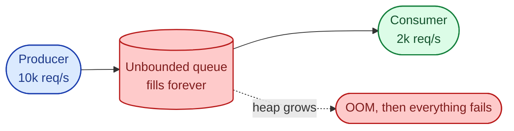
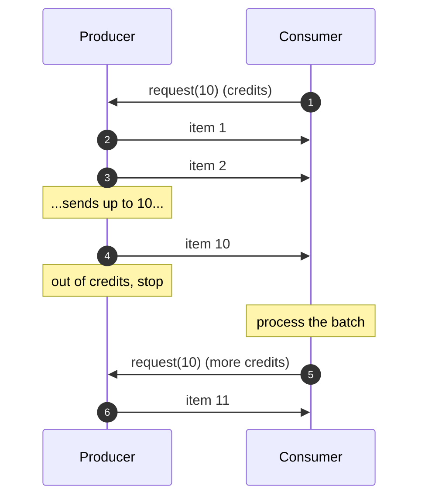

A fast producer pointed at a slow consumer is the most boring outage to debug and the easiest one to ship. The queue between them fills, memory grows, the next service in the chain inherits the pressure, and eventually something falls over. Backpressure is the umbrella term for the consumer telling the producer "slow down," and flow control is the protocol that carries that signal end to end.

## The default failure: unbounded buffers

The textbook wrong answer is "just give the queue more memory." It is also the most common production setting. An unbounded queue does not solve the mismatch, it hides it until the heap dies.



The consumer never catches up. Latency through the queue grows by one second every second. By the time you notice, every downstream service is also drowning, because the slow consumer was someone else's producer.

## The four strategies

There are really only four ways out, and every framework picks one (sometimes two).

```mermaid
flowchart TB
    subgraph BLOCK["1. Block the producer"]
        direction LR
        B1([Producer]):::a -- "write() blocks<br/>until buffer drains" --> B2([Consumer]):::g
    end

    subgraph REJECT["2. Bounded queue, reject when full"]
        direction LR
        R1([Producer]):::a -->|"queue full,<br/>HTTP 429 / NACK"| R2[("buffer<br/>fixed size")]:::y
        R2 --> R3([Consumer]):::g
    end

    subgraph CREDIT["3. Credit-based (consumer-pull)"]
        direction LR
        C1([Producer]):::a -- "send N items" --> C2([Consumer]):::g
        C2 -. "grant N more credits" .-> C1
    end

    subgraph SHED["4. Load shed at the edge"]
        direction LR
        S1([Client]):::a -->|"drop early<br/>before work starts"| S2([Edge / LB]):::y
        S2 --> S3([Consumer]):::g
    end

    classDef a fill:#dbeafe,stroke:#1e40af,color:#1e3a8a,stroke-width:1.5px
    classDef g fill:#dcfce7,stroke:#15803d,color:#14532d,stroke-width:1.5px
    classDef y fill:#fef3c7,stroke:#a16207,color:#713f12,stroke-width:1.5px
```



Each one trades a different thing.

### Block the producer

This is what TCP does. The receive window shrinks as the receiver's buffer fills, the sender stops sending until the window opens again. Java's `BlockingQueue.put()` does the same thing inside one process. The producer is forced to wait, which is exactly the right thing if the producer can wait.

The cost: any caller upstream of the producer is now blocked too. If the producer is an HTTP handler with a per-request thread, you have just held a socket open for 30 seconds. Blocking works inside a process or between two well-behaved services; it does not scale to public APIs.

### Bounded queue with rejection

Set a hard cap on the queue. When it is full, refuse new work and tell the producer.

- HTTP returns 429 Too Many Requests.
- Kafka rejects produces past the configured quota with `QuotaExceededException`.
- A thread pool with a bounded work queue throws `RejectedExecutionException`.

The producer's job is to retry with backoff, or give up. This is the right default for any service-to-service boundary. It keeps memory bounded and surfaces the problem instead of hiding it.

### Credit-based flow control

The consumer hands out credits. The producer can only send what it has credits for. When the consumer is ready for more, it grants more.

This is how Reactive Streams (`Flow.Subscription.request(n)`), gRPC over HTTP/2, and AMQP `prefetch` all work. The consumer is in charge, end to end. There is no "queue between us"; there is a window, and the window is the consumer's working set.



Credit-based protocols are the cleanest model for pipelines. They cost a bit more protocol overhead and make synchronous request-response feel awkward.

### Load shed at the edge

The cheapest request is the one you never accept. When the system is over capacity, drop excess load as close to the client as possible: at the load balancer, the ingress, or the API gateway. Doing this work after the request is already in flight wastes the cycles you were trying to save.

Good shedding is priority-aware: drop low-value traffic (background jobs, internal analytics) before high-value (paid users, payments). Envoy, NGINX, and most CDNs support this with rate limits and admission control.

## Worked example: bounded executor in Java

```java
// Bounded queue: at most 1000 pending tasks.
// Reject (don't block) when full so the caller learns immediately.
ThreadPoolExecutor pool = new ThreadPoolExecutor(
    8, 8,                              // 8 worker threads
    60, TimeUnit.SECONDS,
    new ArrayBlockingQueue<>(1000),    // bounded
    new ThreadPoolExecutor.AbortPolicy() // throw on overflow
);

try {
    pool.execute(task);
} catch (RejectedExecutionException e) {
    metrics.shed.increment();
    return Response.status(429)
        .header("Retry-After", "1")
        .build();
}
```

The combination of bounded queue plus reject policy plus 429 response is the canonical pattern. The unbounded default (`LinkedBlockingQueue`, no cap) is the trap most teams fall into.

## Worked example: Kafka quotas

Kafka has built-in producer and consumer quotas. They apply at the broker, before the data hits disk.

```properties
# server.properties or via kafka-configs.sh
quota.producer.default=10485760   # 10 MB/s per client by default
quota.consumer.default=20971520   # 20 MB/s per client by default

# Per-client override
# kafka-configs.sh --alter --entity-type clients --entity-name billing-svc \
#   --add-config 'producer_byte_rate=1048576'
```

When a client exceeds its quota, the broker throttles by delaying responses. The client's `KafkaProducer` notices and applies backpressure to the app. No special code needed on the producer side; the protocol carries the signal.

## How to measure backpressure

You cannot tune what you do not see. Three signals are non-negotiable:

- **Queue depth.** How many items are waiting. Trends up before everything else.
- **Time-in-queue (p50 and p99).** How long an item sits before a worker picks it up. The user-visible latency lives here.
- **Rejection rate.** How often the system says no. Zero is suspicious; it usually means an unbounded queue.

A healthy system has small queue depth, low time-in-queue, and a non-zero rejection rate during peak. The graph of "queue depth growing linearly" is the one that pages you before users notice.

## Common mistakes

- **Unbounded queues "to be safe."** This is the textbook wrong answer that ships in production every day. Memory pressure is not safer than rejection; it is just delayed and worse.
- **Blocking on a public boundary.** Holding an HTTP connection open for 30 seconds because the worker pool is full looks fine in load tests and falls over at peak. Reject with 429 instead.
- **No `Retry-After` on 429.** Without it, every client retries immediately and you create your own thundering herd.
- **Treating backpressure as the framework's job.** Reactive frameworks give you the primitives, not the policy. You still pick the queue size and the rejection policy.
- **Shedding deep in the stack.** Rejecting a request after it has hit the database is too late. Move the limit to the edge.
- **No bulkheads.** One slow downstream pulls the whole pool under. Separate executors per dependency stop that.
- **Ignoring rejection rate.** A dashboard with only latency and error rate misses the most useful signal of all.

## Quick recap

- Backpressure is the consumer telling the producer to slow down. Unbounded buffers are the silent failure mode.
- Four strategies: block (TCP, in-process), reject (HTTP 429, Kafka quotas), credit (Reactive Streams, gRPC, AMQP), or shed at the edge.
- Reject at service boundaries, block only inside a process you control, use credits for pipelines, shed at the front door under overload.
- Measure queue depth, time-in-queue, and rejection rate. Zero rejections at peak usually means an unbounded queue hiding the problem.

This concept sits in **Stage 4 (Scaling and reliability)** of the [System Design Roadmap](/practice/system-design/roadmap/).
