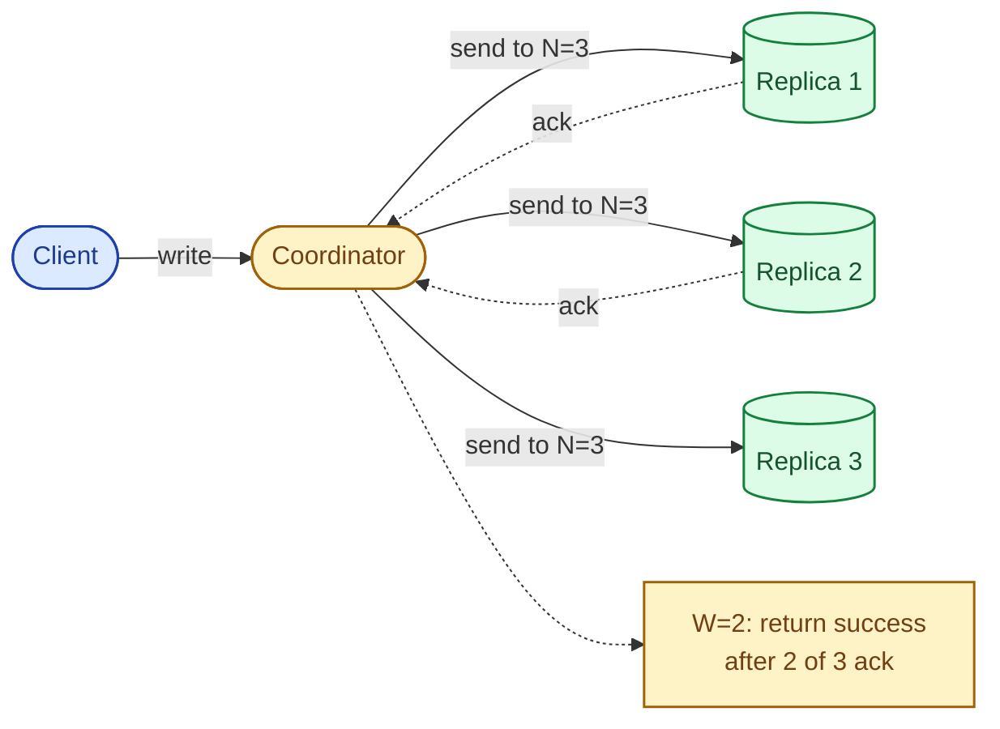
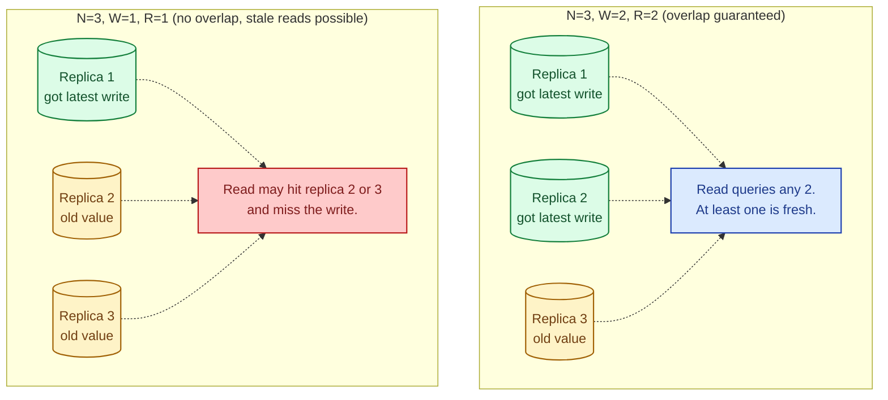
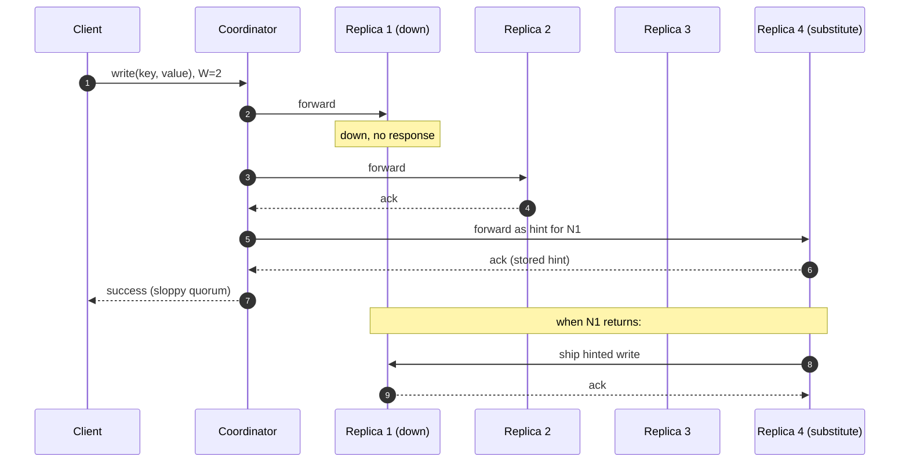

A replicated store keeps N copies of each key. A write succeeds when W of those replicas acknowledge. A read returns whatever the freshest of R replicas says. If `R + W > N`, every read overlaps at least one replica that saw the latest write, so reads cannot miss it. That small inequality is the whole trick behind tunable consistency in Dynamo-style systems, and it lets you trade latency for strictness one query at a time.

## What N, R, and W actually mean



- **N** is the replication factor for a key. Usually 3.
- **W** is how many replicas must ack a write before the client sees success.
- **R** is how many replicas the read coordinator queries and reconciles.

`W = N` means every replica must accept the write. Slow and intolerant of failure. `W = 1` means the first ack wins; fast and risky.

## Why R + W > N is the magic number

The replicas you read overlap the replicas the write reached, by at least one.



With N=3, W=2, R=2 you can lose one replica and still read and write. You read your own writes. Latency is the slowest of two replicas, not three. This is the default for a reason.

## The shape of the trade-off

| N | W | R | What you get | What it costs |
|---|---|---|--------------|---------------|
| 3 | 1 | 1 | Fastest writes and reads. Available even if 2 nodes are down. | Stale reads, lost writes during failover. |
| 3 | 2 | 2 | Read-your-writes. Tolerates 1 node down. | Two-replica latency on both paths. |
| 3 | 3 | 1 | Fast strict reads. | Writes fail if any replica is down. |
| 3 | 1 | 3 | Fast writes, strict reads. | Reads fail if any replica is down. |
| 3 | 2 | 3 | Survives a node down on writes only. | Reads must reach all replicas. |

`W = R = N/2 + 1` (so 2 of 3, 3 of 5, 4 of 7) is the safe default: it tolerates the most failures while still satisfying `R + W > N`.

## Worked example: Cassandra consistency levels

Cassandra exposes the knobs per query, not per cluster. The same table can be read strictly for one query and loosely for another.

```sql
-- Schema: replication factor 3 in one datacenter
CREATE KEYSPACE payments
  WITH replication = {'class': 'SimpleStrategy', 'replication_factor': 3};

-- A payment write: must not be lost. QUORUM = 2 of 3.
CONSISTENCY QUORUM;
INSERT INTO payments.charges (id, amount, status)
  VALUES (uuid(), 4999, 'captured');

-- A read for the user-facing receipt. Read-your-writes guaranteed
-- because R=QUORUM and the write was W=QUORUM, so R + W = 4 > N = 3.
CONSISTENCY QUORUM;
SELECT * FROM payments.charges WHERE id = ?;

-- An internal analytics scan. Stale data is fine, latency matters.
CONSISTENCY ONE;
SELECT count(*) FROM payments.charges WHERE status = 'captured';

-- A migration that must touch every replica. Slow and intolerant.
CONSISTENCY ALL;
UPDATE payments.charges SET schema_version = 2 WHERE id = ?;
```

The point is not that QUORUM is always right. The point is that you can pick per query, and that picking matters more than picking the cluster default.

## Sloppy quorum and hinted handoff

A strict quorum needs W replicas in the **preference list** for the key. If a node in that list is down, the write fails.

Sloppy quorum says: accept the write at any W live nodes, even if some are not in the preference list. The substitute node stores a **hint** and ships the write to the rightful owner when it comes back.



You traded a strict guarantee for availability. Reads from N1 right after it returns may still be stale until the hint is delivered. For most workloads that is fine. For a payment ledger, it is not.

## When to tune per query

The case for one cluster-wide setting is operational simplicity. The case for per-query tuning is that workloads differ inside one service:

- A payment capture: `W=QUORUM, R=QUORUM`. Read-your-writes, durable.
- The receipt PDF generator reading hours later: `R=ONE`. Latency over freshness.
- A reconciliation job that must see everything: `R=ALL`. Slow, run off-hours.
- A leaderboard counter: `W=ONE, R=ONE`. Cheap and approximate, by design.

The wrong move is `R=QUORUM` everywhere for "consistency" and `R=ONE` everywhere for "performance." Pick deliberately per access pattern.

## Worked example: DynamoDB

DynamoDB hides N (it is 3, in three AZs) and exposes two read modes:

```python
# Eventually consistent read: R=1, may be stale, half the cost.
table.get_item(Key={'pk': 'user#42'}, ConsistentRead=False)

# Strongly consistent read: hits the leader replica, no stale data.
# Costs more RCUs, slightly higher p99.
table.get_item(Key={'pk': 'user#42'}, ConsistentRead=True)
```

DynamoDB writes are always strongly consistent (single-leader per partition). The R knob is the only one the user sees. Use `ConsistentRead=True` after a write you need to read back, and the default everywhere else.

## Common mistakes

- **Assuming quorum gives you linearizability.** It gives you read-your-writes against a single key under stable membership. Concurrent writes still need conflict resolution (last-writer-wins, CRDTs, or application logic).
- **Picking W=1 to "make writes fast."** You will lose writes during failover. The user who paid does not care that the write was fast.
- **Picking R=ALL for "correctness."** Any node down breaks reads. R=QUORUM with proper repair gives the same guarantee in practice with vastly better availability.
- **Forgetting sloppy quorum is on by default.** A successful write may live on a substitute node. If a partition splits the cluster, two sides can ack different values for the same key.
- **Last-writer-wins on user data.** LWW is fine for caches and idempotent counters. For shopping carts or user profiles it silently throws away one of two writes.
- **Tuning the cluster default instead of the query.** The same cluster is used by jobs that care about freshness and jobs that do not. One number for both is always wrong somewhere.

## Quick recap

- N replicas, W acks per write, R replies per read. If `R + W > N`, reads see the latest write.
- `W = R = N/2 + 1` is the safe default. For N=3 that is 2 and 2.
- Sloppy quorum + hinted handoff keep the system available during partial failures, at the cost of stricter guarantees.
- Tune R and W per query. Payments and analytics do not deserve the same setting.

This concept sits in **Stage 5 (Distributed systems hard parts)** of the [System Design Roadmap](/practice/system-design/roadmap/).
