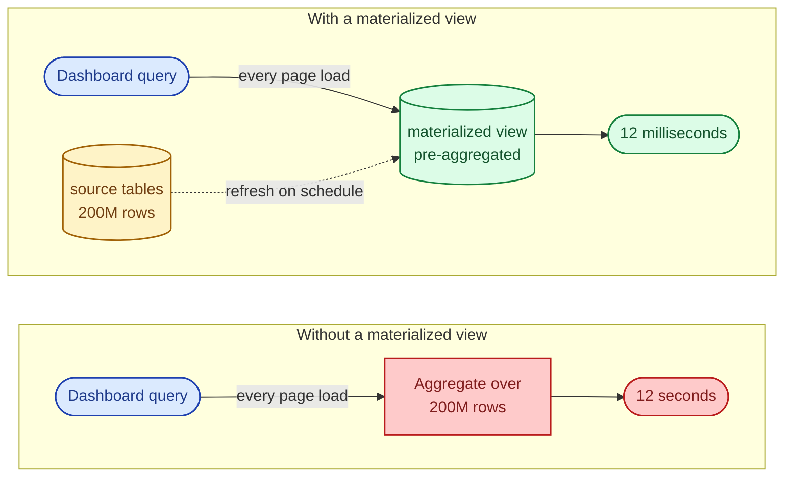
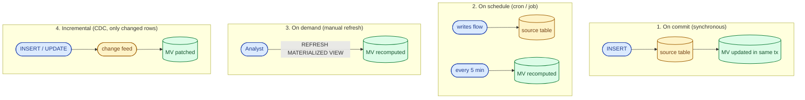
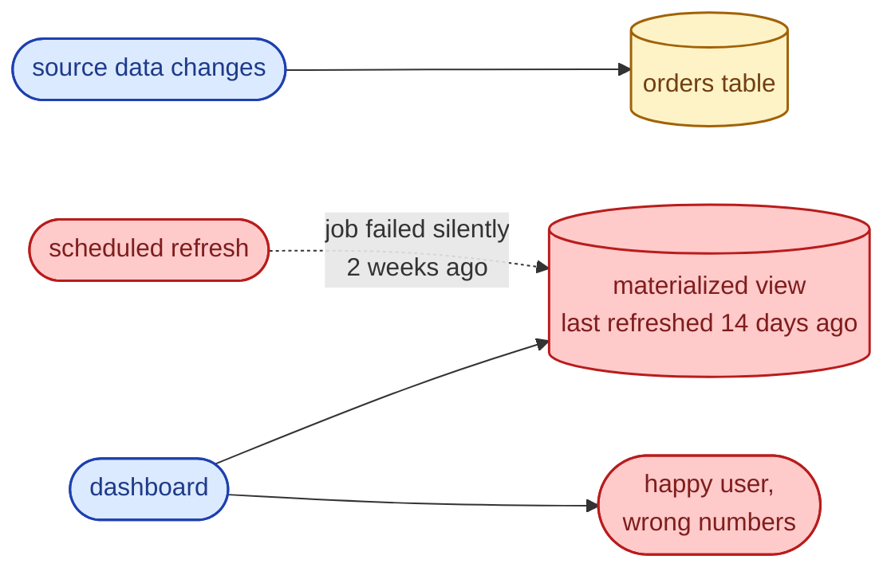

A regular view rewrites the query each time you read it. A materialized view runs the query once, stores the result as a real table, and lets you read that table directly. You pay storage and refresh cost up front, and queries against the view drop from seconds to milliseconds. The trick is knowing when that trade is worth it, and when it quietly turns into stale data nobody notices.

## The shape of the problem



The dashboard reads a tiny pre-built table. The expensive work moved from query time to refresh time, and refresh runs once instead of once per user.

## Refresh modes

There are four ways a materialized view can stay current, and each is a different deal.



- **On commit** is strict and expensive. Every write pays for the view. Oracle supports it; Postgres does not.
- **On schedule** is the common case. Pick a refresh window matched to how stale the view is allowed to be.
- **On demand** is fine for reports a human triggers, terrible for anything user-facing.
- **Incremental** is the modern win: only the rows that changed are recomputed. Snowflake `DYNAMIC TABLE`, Materialize, ClickHouse `MATERIALIZED VIEW`, and Postgres extensions like `pg_ivm` do this. It is the right answer when you can get it.

## Worked example: Postgres

Postgres materialized views are stored tables that you refresh explicitly. There is no automatic refresh.

```sql
-- Source: an orders table with millions of rows.
CREATE TABLE orders (
    id          bigserial PRIMARY KEY,
    customer_id bigint NOT NULL,
    amount_cents int NOT NULL,
    created_at  timestamptz NOT NULL DEFAULT now()
);

-- A dashboard wants daily revenue per customer.
-- Computed live, this scans the whole table per page load.
CREATE MATERIALIZED VIEW daily_revenue AS
SELECT
    customer_id,
    date_trunc('day', created_at) AS day,
    sum(amount_cents) AS revenue_cents,
    count(*) AS order_count
FROM orders
GROUP BY customer_id, date_trunc('day', created_at);

-- An index on the materialized view, just like a normal table.
CREATE UNIQUE INDEX ON daily_revenue (customer_id, day);

-- Refresh: rebuilds the whole thing. Locks reads.
REFRESH MATERIALIZED VIEW daily_revenue;

-- Refresh without blocking readers. Requires a unique index.
REFRESH MATERIALIZED VIEW CONCURRENTLY daily_revenue;
```

`REFRESH MATERIALIZED VIEW` re-runs the whole query. `CONCURRENTLY` lets reads continue but does even more work (a diff against the existing rows). Neither is incremental: a 5-minute refresh on a 2-billion-row source table is exactly as expensive as the original query.

A daily cron job is fine for a dashboard that updates overnight. For a leaderboard that needs to be fresh in 60 seconds, this is the wrong tool.

## Materialized view vs summary table vs streaming aggregation

These three patterns solve overlapping problems and people confuse them constantly.

| Pattern | Who computes | Freshness | When it fits |
|---------|--------------|-----------|--------------|
| Materialized view | DB engine, on refresh | Minutes to hours | Aggregates over data the DB already owns. |
| Summary table maintained by triggers | App or trigger code | Real-time, transactional | Critical counters where staleness is unacceptable. |
| Streaming aggregation (Flink, ClickHouse, Materialize) | A stream processor | Sub-second | High-volume event streams, multiple consumers. |

A daily revenue dashboard: materialized view. A real-time "items in cart" counter: trigger-maintained summary table. A second-by-second fraud score over a Kafka stream: streaming aggregation. Pick by freshness budget, not by which one you have used before.

## Where it goes wrong

The most common production failure is the silent stale view. The refresh job dies, nobody alerts, the dashboard keeps loading instantly with last week's numbers. Two weeks later someone notices.



The fix is non-optional: alert on `now() - last_refreshed_at > expected_interval * 2`. Every materialized view in production should have that monitor.

## When materialized views win

- Aggregations (sum, count, avg) over large tables read often.
- Joins across denormalised data where the join cost dwarfs the storage cost.
- Reporting and dashboard queries that tolerate minutes of staleness.
- Reusable pre-computation: one view feeds many queries.

## When they hurt

- Write-heavy tables where refresh cost approaches query cost.
- Queries that need sub-second freshness (use streaming aggregation instead).
- Tiny source tables where the live query is already fast.
- Refresh windows longer than the freshness SLO (then you do not have a materialized view, you have a snapshot).

## Common mistakes

- **No staleness alert.** The single most common materialized view failure is silent staleness. Add the monitor before the view goes live.
- **Treating Postgres `REFRESH` as cheap.** It re-runs the full query. A nightly refresh of a small view is fine; refreshing a billion-row view every five minutes is not.
- **Using a materialized view where a normal index would do.** If the query is fast with the right index, you do not need a view.
- **Refreshing during peak.** A non-`CONCURRENTLY` refresh locks readers. Schedule it for off-hours or use the concurrent path.
- **Cascading refreshes.** A view of a view of a view sounds clean and means one source change triggers three slow rebuilds. Flatten when you can.
- **Forgetting the index on the view.** A materialized view is a table, and tables without indexes scan. Index it like the source.
- **Confusing materialized views with caches.** A cache has a TTL and invalidation; a materialized view has a refresh schedule. They are not interchangeable.

## Quick recap

- A materialized view is a stored, pre-computed query result. You pay refresh cost; reads become a normal table scan or index lookup.
- Refresh modes: on commit, on schedule, on demand, incremental. Incremental wins when your engine supports it.
- Right tool for aggregates and joins read far more than written. Wrong tool for sub-second freshness or write-heavy tables.
- Always alert on staleness. Index the view. Compare against summary tables and streaming aggregation before defaulting to it.

This concept sits in **Stage 2 (Storage and data)** of the [System Design Roadmap](/practice/system-design/roadmap/).
