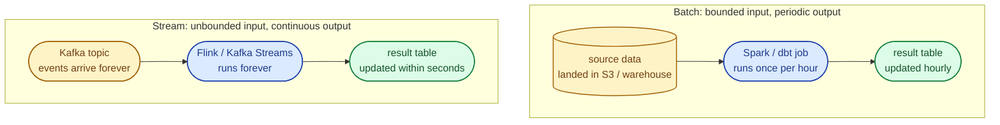
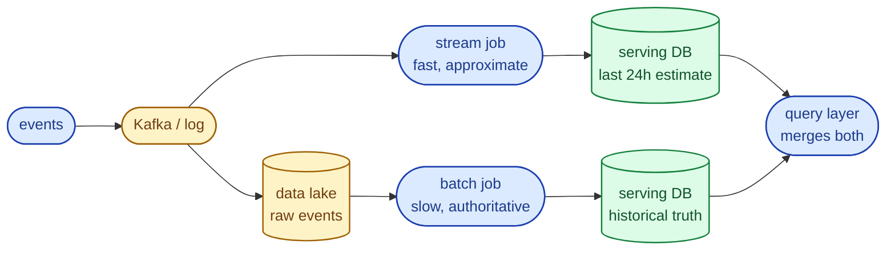
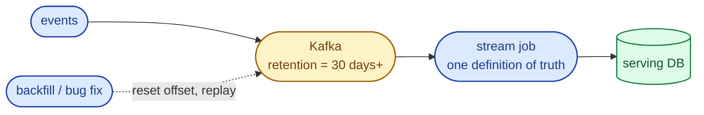
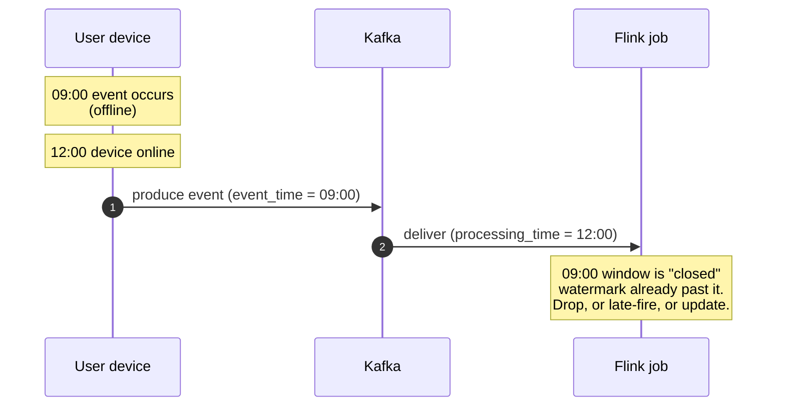

Batch processes a finite chunk of data on a schedule: yesterday's sales, last hour's logs, this month's invoices. Stream processes an unbounded sequence of events as they arrive: every click, every transaction, every sensor reading. Most real systems need both. Batch gives you the canonical, replayable, accurate-but-late number. Stream gives you the up-to-the-second view a dashboard or alerting rule can act on. The hard part is keeping them in agreement.

## The two shapes



Batch is simpler. You know exactly which rows are in scope (the ones in the partition you read), you can re-run on failure, the output is deterministic. Stream is harder. The input never ends, events arrive late, the job must be running when an event lands, and "re-run" means replay.

## When batch fits, when stream fits

- **Batch fits** when freshness can be measured in hours, when the computation is heavy (joins, ML training), when the input is files in object storage, when you want one canonical "last run" to point at.
- **Stream fits** when freshness must be measured in seconds, when alerts depend on the result, when the data is already in a log (Kafka, Kinesis, EventBridge), when you want to react to individual events.

A revenue dashboard the finance team looks at the next morning: batch. A fraud rule that blocks transactions in real time: stream. A monthly billing run: batch. A live "users online" counter: stream.

## Lambda architecture: run both

Lambda says: run a batch pipeline for accuracy and a stream pipeline for freshness, and have the consumer reconcile. The batch result eventually overwrites the stream estimate.



Lambda was the right answer in 2014. Today it has one big problem: you maintain the same logic in two engines. Every change is two diffs, two test suites, two on-call rotations. Subtle drift between the batch and stream definitions of "revenue" is one of the most common data bugs in the industry.

## Kappa architecture: one pipeline, replay for backfill

Kappa says: there is no batch. There is only a stream, and a long enough retention window so you can replay it. To backfill, you reset the consumer offset to the beginning of the log and let the stream job rebuild the result table.



Kappa is cleaner if your stream engine can handle a full historical replay. Flink can. Spark Structured Streaming can with care. Kafka Streams struggles on big rewinds. The constraint is real: Kappa works when one engine can do both jobs well.

## The modern reality: one logical pipeline, two execution modes

Most teams in 2026 do neither pure Lambda nor pure Kappa. The shape that actually wins:

- One source of truth for the events (Kafka, or Iceberg / Delta tables in a lakehouse).
- One transformation spec, expressed in SQL or in Beam, that runs in batch on a schedule and in stream continuously.
- Shared sink (the same warehouse table or service DB) that both modes write to.

dbt for the batch path, Flink SQL or Spark Structured Streaming for the stream path, the same column definitions on both sides. Tools like Apache Beam and Snowflake Dynamic Tables push toward "write the logic once."

## Worked example: daily revenue from the same logs

The same revenue number, computed two ways from the same Kafka topic of order events.


```sql
-- BATCH: dbt model, runs hourly on the lakehouse.
-- Reads yesterday's partition from the lake.
-- Authoritative. Late by up to one hour.
SELECT
    date_trunc('day', occurred_at) AS day,
    sum(amount_cents) AS revenue_cents
FROM {{ ref('orders_raw') }}
WHERE occurred_at >= dateadd(day, -1, current_date)
GROUP BY 1;
```


```sql
-- STREAM: Flink SQL, runs forever against the same Kafka topic.
-- Updates every few seconds. Slightly behind real time, can be wrong on late arrivals.
CREATE TABLE orders_stream (
    order_id   STRING,
    amount_cents INT,
    occurred_at TIMESTAMP(3),
    WATERMARK FOR occurred_at AS occurred_at - INTERVAL '5' SECOND
) WITH ('connector' = 'kafka', 'topic' = 'orders', ...);

INSERT INTO revenue_by_day
SELECT
    window_start AS day,
    SUM(amount_cents) AS revenue_cents
FROM TABLE(
    TUMBLE(TABLE orders_stream, DESCRIPTOR(occurred_at), INTERVAL '1' DAY)
)
GROUP BY window_start;
```

Both target the same `revenue_by_day` shape. If the two ever disagree at end-of-day, you have a bug (usually late events outside the watermark). The batch run is the tiebreaker.

## Event time vs processing time

A stream job sees two clocks: when the event happened (event time), and when it arrived at the job (processing time). They are not the same. Mobile clients buffer offline and dump a batch when the network returns; an event from 3 hours ago can land now.



This is what watermarks, allowed lateness, and side outputs are for. Batch ignores this whole problem because it just waits until the day is over.

## Exactly-once is a promise with conditions

"Exactly-once processing" in stream frameworks (Flink checkpoints, Kafka Streams EOS, Spark Structured Streaming) means: under failure and replay, your output looks as if each input was processed once. It requires:

- A replayable source (Kafka, Kinesis with checkpoints).
- A transactional or idempotent sink.
- Both sides participating in the framework's commit protocol.

Write to a sink that does not support transactional commits and your "exactly-once" job is at-least-once with extra steps. Read the sink's docs before you trust the marketing.

## Common mistakes

- **Building stream-first for a daily report.** If the user looks at the number once a morning, batch is half the cost and a tenth the operational complexity.
- **Maintaining two copies of the same logic in Lambda forever.** Drift is the bug you will find at quarter-end.
- **Kappa with a 7-day Kafka retention and a 6-month backfill need.** The replay strategy must match the retention.
- **Ignoring watermarks.** Late events are not a corner case; mobile, IoT, and webhook sources all produce them. Pick an allowed lateness deliberately.
- **Trusting "exactly-once" without a transactional sink.** The framework guarantees what it commits; the sink decides what that means.
- **Backfilling a streaming job by re-deploying with old data.** Use the source's replay primitive (Kafka offsets, Kinesis trim horizon). Anything else loses ordering.
- **No reconciliation job.** When stream and batch disagree, you need a daily check that compares them. Without it, the silent drift wins.

## Quick recap

- Batch is finite, scheduled, easy to reason about. Stream is continuous, low-latency, harder under late data and replay.
- Lambda runs both and reconciles, at the cost of two implementations. Kappa runs only stream and replays for backfill, when the engine can take it.
- The modern shape is one logical spec, two execution modes, shared sink. dbt + Flink against a lakehouse is a common pairing.
- Watermarks handle late event-time data. "Exactly-once" depends on the source replaying and the sink committing transactionally.

This concept sits in **Stage 3 (Caching, queues, and async work)** of the [System Design Roadmap](/practice/system-design/roadmap/).
