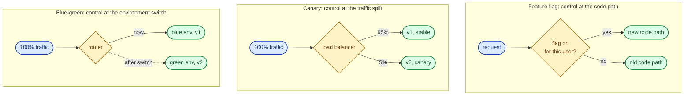
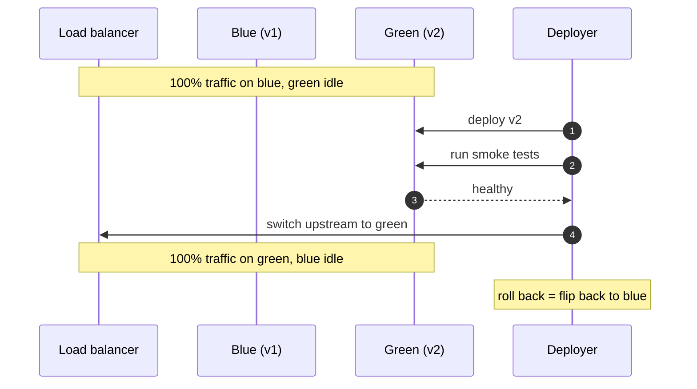
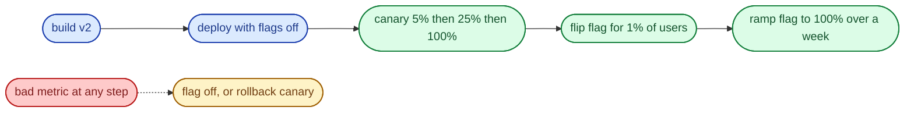

Three patterns make production deploys boring. Feature flags decouple "the code is deployed" from "the feature is on," so you can flip behaviour without redeploying. Canary routes a small slice of real traffic at the new version and watches the metrics before ramping. Blue-green keeps a full parallel environment ready and switches the load balancer in one step. They solve different problems and compose well. Treating them as substitutes is the common mistake.

## What each pattern actually does



- **Feature flag** is a runtime branch inside the code. The deploy ships dark code; the flag turns it on.
- **Canary** is a deploy strategy. Both versions are deployed; the router decides who sees which.
- **Blue-green** is two complete environments. Switch once, atomically.

Feature flags can be evaluated per user. Canary cannot (the user gets whichever pod the LB picked, which can change request to request). Blue-green is all or nothing.

## When each fits

- **Feature flags** for product changes. New checkout flow, new pricing display, a setting only beta users see. The flag lives in the code for weeks or months and lets product turn things on per cohort.
- **Canary** for backend rollouts. New service version, library upgrade, schema migration on the read path. Small percentage first, watch error rate and latency, ramp if good.
- **Blue-green** for stateless infrastructure swaps. New container image, JVM upgrade, OS patch, ingress change. You want instant rollback and you do not need gradual traffic.

Real teams use all three on the same deploy. Ship the binary with feature flags off, canary the binary to 5% to verify the deploy itself is healthy, then flip flags on per cohort over days.

## Worked example: a feature flag in code

A flag is just a guarded branch. The discipline is that the guard reads from a central system, not a deploy-time constant.

```python
from flags import client

def render_checkout(user, cart):
    if client.is_enabled("new_checkout_flow", user=user, default=False):
        return new_checkout_v2(user, cart)
    return legacy_checkout(user, cart)
```

The targeting lives in the flag system (LaunchDarkly, Unleash, Flagsmith, or a home-grown table). Rules look like:

```json
{
  "key": "new_checkout_flow",
  "default": false,
  "rules": [
    { "if": { "user.country": "SE" }, "value": true },
    { "if": { "user.cohort": "beta" }, "value": true },
    { "if": { "rollout_percent": 10 }, "value": true }
  ]
}
```

Three things this gives you that a deploy does not:

- Turn off in seconds when something breaks, no redeploy.
- Ramp from 1% to 100% over a week.
- Different value per user, region, plan, or A/B group.

## Worked example: a canary with Argo Rollouts

A canary is a deploy strategy. Argo Rollouts (or Flagger, or Spinnaker) describes it declaratively.

```yaml
apiVersion: argoproj.io/v1alpha1
kind: Rollout
metadata:
  name: checkout-api
spec:
  replicas: 20
  strategy:
    canary:
      steps:
        - setWeight: 5      # 5% of traffic to v2
        - pause: { duration: 10m }
        - analysis:         # automated check
            templates: [{ templateName: error-rate-and-latency }]
        - setWeight: 25
        - pause: { duration: 10m }
        - setWeight: 50
        - pause: { duration: 10m }
        - setWeight: 100    # fully rolled out
  template:
    spec:
      containers:
        - name: api
          image: registry/checkout-api:v2
```

The analysis step queries Prometheus for error rate and p99 latency on the canary pods, compares to the stable pods, and aborts the rollout if the canary is worse. Without that automated comparison, a canary is just "deploy to a few pods and hope someone notices."

## Worked example: blue-green switch

Two full environments behind one router. The deploy is: build green, smoke test green, flip router.



Rollback is one router change. No redeploy, no rebuild. The cost is double infrastructure during the deploy window, and the hard part: any database migration the new code needs must be **backward compatible**, because both environments share the same DB.

## How they compose



The deploy is canary. The behaviour change is a flag. The two failure modes (bad binary, bad feature) have different rollback paths: rollback the deploy for the first, flip the flag for the second. Conflating them is how teams end up redeploying old code in a panic.

## The gotchas that bite every team

**Flag debt.** Every flag is a branch in the code. The branch was meant to be temporary. Six months later there are 400 flags, half of them at 100% on every cohort, and the code reads like a maze. Have a policy: flags get a ticket, a TTL, and a removal owner.

**Canary observability.** A 5% canary is only useful if you can compare canary metrics to stable metrics. Per-version dashboards (`{version="v2"}`) are non-negotiable. Without them you are just deploying slowly.

**Blue-green and the database.** The atomic switch is a lie if the new version's code requires a schema the old version cannot read. Plan migrations as expand-then-contract: deploy the schema change first (additive only), then the code, then the cleanup migration after the old version is fully retired.

**Cohort skew.** A canary that only serves bot traffic, or only the user agent that happens to load-balance to one pod, tells you nothing. Stratify the comparison.

**Flag config drift.** Production has the flag on. Staging has it off. Tests have it set the wrong way. Treat flag config as code; sync it across environments deliberately.

## Tools

- **Flags:** LaunchDarkly (commercial, best targeting), Unleash and Flagsmith (open source), Statsig (analytics-first), home-grown for very simple cases.
- **Canary:** Argo Rollouts, Flagger, Spinnaker, AWS CodeDeploy with traffic shifting.
- **Blue-green:** any load balancer with two upstream pools. Kubernetes services with label-selector switches.

The tooling is solved; the discipline is not. The team that runs canaries without automated analysis is a team that pages itself manually for every deploy.

## Common mistakes

- **Treating canary and flags as substitutes.** Canary is for the binary, flags are for the behaviour. You need both.
- **No automated canary analysis.** A canary without metric comparison is just a slow deploy. Wire it to Prometheus or Datadog and let it abort itself.
- **Blue-green with a non-backward-compatible migration.** The atomic switch breaks the moment the new code writes a column the old code does not understand.
- **Long-lived flags.** Flags meant to live for two weeks live for two years. Add a TTL, alert on expired flags, delete the dead branch.
- **Flag evaluation in a hot loop.** Re-evaluating per request is fine. Re-fetching the config from the flag server per request is not. Cache it.
- **Rolling back the wrong layer.** A bad feature is a flag flip. A bad binary is a deploy rollback. Reaching for the wrong one wastes the outage minutes you have.
- **Skipping the rollback drill.** If you have never rehearsed flipping the flag off under load, you do not actually have a rollback plan.

## Quick recap

- Three patterns, three layers: flags at the code path, canary at the traffic split, blue-green at the environment.
- Flags fit product changes per cohort, canary fits backend rollouts, blue-green fits stateless infrastructure swaps.
- Compose them: ship dark behind a flag, canary the binary, ramp the flag over days.
- Watch for flag debt, missing canary analysis, blue-green DB migrations, and rolling back the wrong layer.

This concept sits in **Stage 4 (Scaling and reliability)** of the [System Design Roadmap](/practice/system-design/roadmap/).
