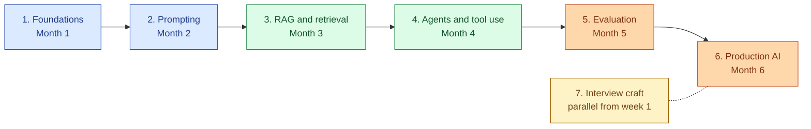
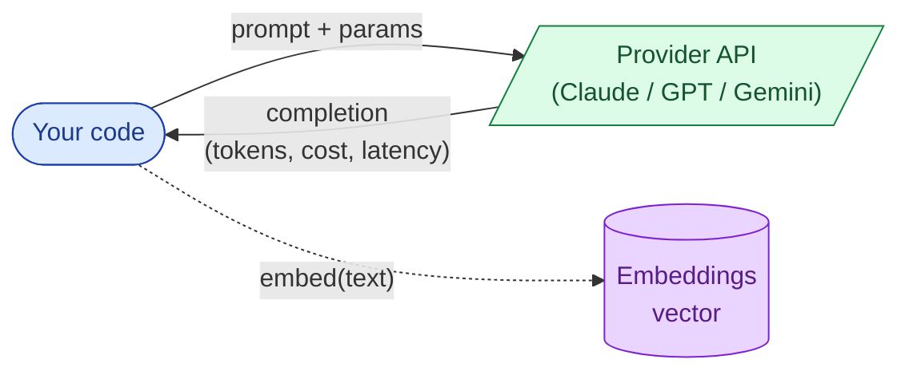
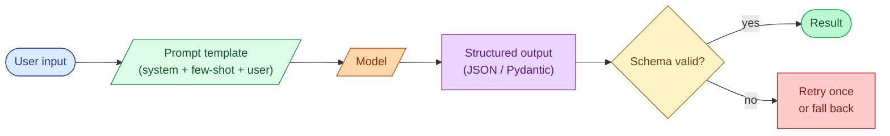
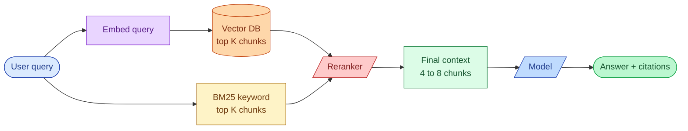
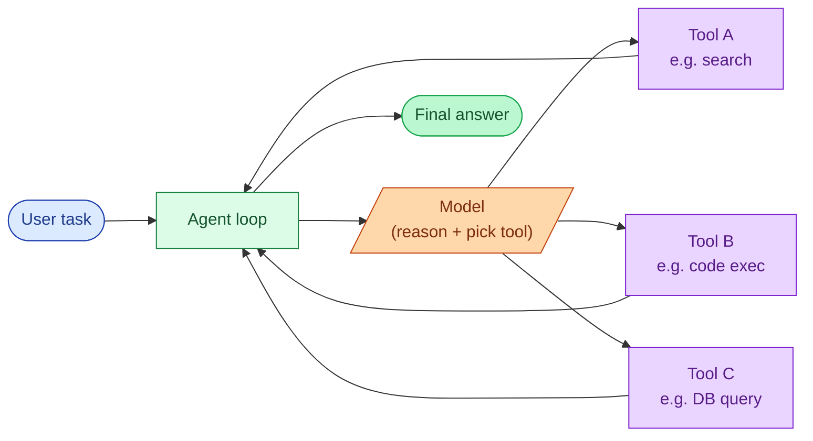
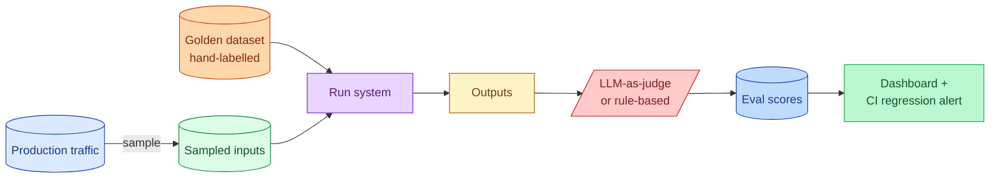
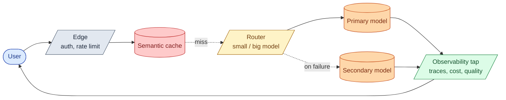
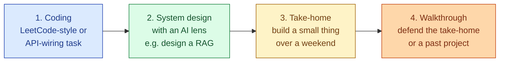
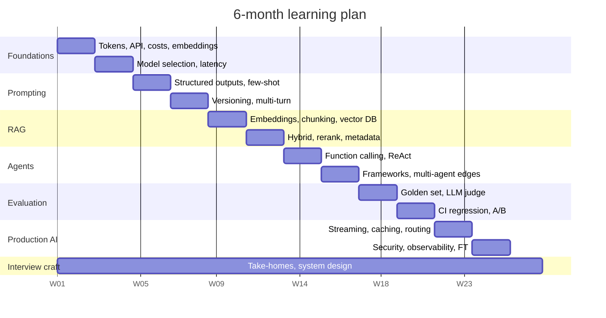

<link rel="stylesheet" href="/assets/css/practice.css">

<section class="pr-hero">
  

    AI Engineering Roadmap
    <h1 class="pr-title">Six months. Seven stages. From your first API call to LLM systems people trust in production.</h1>
    

      An honest, ordered learning path for engineers moving into AI. Each stage builds on the last one. You finish each stage by building something small, not by collecting course certificates.
    

  

</section>

> **Heads-up on dated content.** This roadmap covers what AI engineers do in 2026. Provider names, model versions, and prices change every quarter. The patterns hold. If a model name below is replaced by something else by the time you read this, the lesson still applies.

> **Looking for a single concept?** The [System Design Concepts library](/practice/system-design/concepts/) has short explanations of the foundations any AI engineer also needs (HTTP, caching, queues, observability, security). Use it as a quick lookup when a stage below mentions something unfamiliar.

## How to read this page

Read top to bottom. Do the stages in order. The order matters more than people think. If you try to build agents before you understand evaluation, you will ship something that looks great in a demo and quietly fails in production.

Two paces:

- If you already write code at work, plan on **three months**.
- If you are still learning to code, plan on **six months**.

Either way, the structure is the same.

The biggest difference between this roadmap and the typical AI roadmap online is what is **not** here. There is no deep dive into building neural networks from scratch, no PyTorch fundamentals, no separate course on linear algebra. Most AI engineers in 2026 are not training models from scratch. They are wiring LLM APIs into production systems and being held accountable for whether the output is correct, fast, cheap, and safe. This roadmap teaches that job.

---

## The journey, in one picture

Stages 1 to 6 are sequential. Stage 7 runs alongside the whole thing.

---

## What you can do at each level

A quick honesty check. Where are you now, where do you want to be?

| Level | What you can do | What people pay you for |
|-------|-----------------|-------------------------|
| **Beginner** | Call an API, get a response, parse JSON. | Following a tutorial. |
| **Practitioner** | Ship a working RAG over a real dataset. Pick a model on purpose. Notice when an output is wrong. | Owning a single AI feature inside a larger product. |
| **Senior AI Engineer** | Design an end-to-end LLM system. Set up evaluation that catches regressions. Talk about cost, latency, and quality as one conversation, not three. | Owning an AI product surface. Choosing the architecture. Telling the team what not to build. |
| **Staff-flavoured AI Engineer** | Predict where the LLM will fail before the demo. Have a real opinion on framework vs bare-metal. Lead the call on when to fine-tune. | Setting AI direction across teams. Catching the failure mode in design review. |

By the end of Stage 4 you are a practitioner. By the end of Stage 6 you are senior. Staff comes from production scars, not from a roadmap.

---

## Stage 1: Foundations: working with LLMs

**Goal.** Learn what an LLM actually is when you call it from code, and learn the API contract well enough that you stop guessing.

**The picture in your head.**

**Topics.**

| Group | Topics |
|-------|--------|
| **What a model actually is** | Tokens, context window, completion, the difference between a model and a chat product. The 10,000-foot view of how a model is trained (parameters, pretraining, instruction tuning, RLHF). |
| **The API contract** | System / user / assistant messages. Streaming vs blocking. Stop tokens. Temperature, top-p, top-k. Why "deterministic" is mostly a lie. |
| **Model selection** | The big four in 2026 (Anthropic Claude, OpenAI GPT, Google Gemini, Meta Llama). The honest pick for cheap-and-fast, smart-and-expensive, and self-hosted. |
| **Costs and latency** | Input tokens vs output tokens. Pricing math. Time-to-first-token vs total latency. Why streaming changes the experience even though it does not change the cost. |
| **Embeddings** | What an embedding is, how you get one, what cosine similarity actually means. Why you need this in Stage 3. |
| **HTTP, auth, rate limits** | API keys, organisation IDs, rate-limit headers, retries with backoff, idempotency at the API boundary. |
| **Tools that pay for themselves on day 1** | Token counters. A simple cost tracker. The provider's playground for prompt iteration. |

**Build this in week 4.** A small CLI that takes a question, calls Claude or GPT, streams the response, and prints the total cost and latency at the end. Add a `--model` flag and try the same question on a small model and a big model. Notice the difference in price and quality.

**You are done when** you can look at a provider's pricing page and predict, within 20%, what a feature will cost per month at 10,000 users a day.

---

## Stage 2: Prompting as engineering

**Goal.** Treat the prompt as code. Structured input, structured output, versioned, testable.

**The picture in your head.**

**Topics.**

| Group | Topics |
|-------|--------|
| **Prompt anatomy** | System prompt as the role definition. User prompt as the request. Assistant turns as the reasoning trace. Why the order of these matters. |
| **Structured outputs** | JSON mode, OpenAI structured outputs, Anthropic tool use with JSON schemas, Pydantic models, response_format. Why "ask for JSON in the system prompt" is the old way. |
| **Few-shot examples** | When 2 to 5 examples earn their token cost, when zero-shot is enough, when fine-tuning is the better answer. |
| **Chain-of-thought** | When asking the model to reason out loud helps. When it just doubles your cost without helping. |
| **Cost-aware prompting** | Trimming the system prompt. Avoiding "you are an expert" preambles. Caching the prefix. Compressing context. |
| **Multi-turn conversation** | Building up state. Summarising old turns. The "forget the old conversation but keep the system prompt" trick. |
| **Prompt versioning** | Keep prompts in git. Tag them. Run the eval suite (Stage 5) on every change. The "prompt is code" rule. |
| **Failure modes** | Hallucination. Refusal. Truncated JSON. Off-topic drift. Recognising each one in production logs. |

**Build this in week 8.** Pick a real task you can describe in one sentence (e.g. "extract the line items from this invoice PDF text", "classify these support tickets into one of five buckets"). Build it with structured outputs. Write a small eval set of 20 to 50 hand-labelled examples. Measure accuracy. Iterate the prompt three times and watch the number move.

**You are done when** you stop writing prompts in chat playgrounds and start writing them in your editor, with examples and a number that tells you if the change was good.

---

## Stage 3: RAG and retrieval

**Goal.** Give the model the right context so it can answer questions about things it was not trained on.

**The picture in your head.**

**Topics.**

| Group | Topics |
|-------|--------|
| **Embeddings in practice** | Picking an embedding model. Dimensionality vs storage cost. Normalising. Why two embeddings for the same text never match exactly. |
| **Chunking** | Token-aware chunking. Semantic chunking. Hierarchical (parent-child). Sliding window. Why "chunk by 500 tokens" is a starting point, not an answer. |
| **Vector DBs** | pgvector for "we already have Postgres". Pinecone for managed scale. Weaviate / Qdrant for self-hosted. FAISS for "I just want a library in-process". When each fits. |
| **Hybrid search** | BM25 keyword search alongside vector search. Why pure vector loses to hybrid on proper-noun queries. Combining scores (reciprocal rank fusion). |
| **Reranking** | Cross-encoders (Cohere Rerank, BGE reranker). Why you almost always want one. The cost. |
| **Context window management** | What to do when your top-10 chunks do not fit. Summarising. Map-reduce. Late-chunking strategies. |
| **Metadata and filtering** | Per-tenant filters. Date filters. Why filtering inside the vector store beats post-filtering. |
| **The honest part** | Citations. Refusing to answer when the retrieved context does not contain the answer. Why "I do not know" is a feature, not a bug. |

**Build this in week 12.** Take a real corpus you own (your notes, your team's docs, a project's GitHub issues). Build a RAG over it. Use pgvector or Pinecone. Add BM25. Add a reranker. Hand-label 30 to 50 query-and-correct-answer pairs as an eval set. Measure recall at 5 (did the right chunk appear in the top 5?). Aim for above 80%.

**You are done when** you can take any new document, ingest it, and answer "is this question covered in the corpus?" with citations in under three seconds.

---

## Stage 4: Agents and tool use

**Goal.** Let the model call code. Understand when this earns its complexity and when a single prompt was the right answer.

**The picture in your head.**

**Topics.**

| Group | Topics |
|-------|--------|
| **Function calling, the right way** | Defining tools as functions. Clear names. Strict argument schemas. Why ambiguous tool names cause the model to pick the wrong one. |
| **The agent loop** | The basic ReAct pattern: reason, act, observe, repeat. Max steps as a safety belt. |
| **Planning vs reactive** | When to ask the model for a plan up front. When to let it iterate. The honest answer: usually reactive, sometimes plan-first for long tasks. |
| **Memory and state** | Short-term (current task), session-level, persistent. When you actually need a memory store vs when the conversation history is enough. |
| **Multi-agent: usually overkill** | The "specialist agents talking to each other" pattern. Real production multi-agent is rare and expensive. Most "multi-agent" should be a router + workers. |
| **Frameworks vs bare-metal** | LangChain (fast prototype, hard to debug at scale). LangGraph (better for real agents). LlamaIndex (data-flavoured). Writing it yourself in 200 lines (often the right answer). |
| **Tool design** | Tools should be idempotent. Tools should validate. Tools should return errors the model can act on, not stack traces. |
| **The honest take on agents** | Most things called "agents" should be a fixed prompt chain. Real agentic behaviour earns its complexity only when the steps are genuinely unknown in advance. |

**Build this in week 16.** A single-agent research assistant. Three tools: web search (or a fake one), a SQL-over-a-local-DB tool, and a calculator. Give it a task that requires at least two tool calls. Then break one of the tools on purpose and watch how the agent recovers (or does not). Build it bare-metal first, then port to LangGraph. Notice which lines the framework took away from you and which lines you had to write back.

**You are done when** you can articulate the trade-off "do this in two prompts or as an agent" and pick the right one for a given problem without flipping a coin.

---

## Stage 5: Evaluation

**Goal.** Know if your AI works. Catch regressions before users do.

**The picture in your head.**

**Topics.**

| Group | Topics |
|-------|--------|
| **The non-determinism problem** | Why `assert output == "yes"` breaks. Why the same prompt gives different answers. Why this changes how you test. |
| **Golden datasets** | Hand-label 50 to 500 inputs with the correct answer. Treat this as the most valuable asset on your team. Version it. |
| **Rule-based evals** | When the right answer fits a regex or a schema check, use a regex or a schema check. Cheap, fast, deterministic. |
| **LLM-as-judge** | When the answer is open-ended. Picking a judge model. Calibrating the judge against human ratings. Why the judge is its own product. |
| **Reference-free evals** | "Was the answer grounded in the retrieved context?" "Did it refuse when it should have?" "Is the JSON valid?" |
| **RAG-specific evals** | Recall at K (did the right chunk show up?). Faithfulness (did the answer use the chunks?). |
| **Tools** | Ragas. Promptfoo. Braintrust. LangSmith. Phoenix. Internal CI scripts. When each fits. |
| **Regression in CI** | Run your eval suite on every prompt change. Fail the build on a drop above some threshold. The cost is real; pay it. |
| **A/B in production** | Shadow traffic. Side-by-side comparison. Picking the metric that decides. |

**Build this in week 20.** Take your Stage 3 RAG. Write a 100-example golden set. Add an eval that measures faithfulness with an LLM judge. Add a recall-at-5 eval that does not need a model. Add a CI step that runs both on every prompt change and fails the build if either drops by 5%. Run this end to end at least once.

**You are done when** you can answer "is this prompt change better?" with a number, not a vibe.

---

## Stage 6: Production AI systems

**Goal.** Survive real users. Stay cheap. Stay safe.

**The picture in your head.**

**Topics.**

| Group | Topics |
|-------|--------|
| **Latency** | Streaming (lower perceived latency, same total). Parallel tool calls. Speculative decoding (when the provider supports it). Prompt compression. |
| **Caching** | Provider-side prefix caching (free wins). Semantic caching (embed-the-query, look up similar past answers). Why exact-match caches almost never hit. |
| **Cost optimisation** | Model routing: a small model for easy, a big model for hard, a classifier that picks. Token trimming. Output length caps. Aggressive system-prompt diets. |
| **Open vs closed models** | When self-hosting Llama / Mistral / Qwen pays off (volume, privacy, fine-tuning). When it does not (most cases). vLLM, TGI, Ollama for serving. |
| **Security** | Prompt injection at every input boundary. Output validation before any side effect. PII redaction. Data residency. The "never let the model decide whether to delete" rule. |
| **Observability** | End-to-end tracing across model calls. Cost per request, per user, per feature. Quality drift detection (eval scores on production samples over time). |
| **Failover** | When OpenAI is down, route to Anthropic. When all providers are down, degrade gracefully. Circuit breakers around the model call. |
| **Fine-tuning, only when needed** | The honest test: have you tried better prompts, better retrieval, and a bigger model first? If yes and it is still not enough, LoRA / QLoRA on Llama / Mistral. Synthetic data generation. The trap of overfitting to your eval set. |

**Build this in week 24.** A production-grade rebuild of one earlier project. Add streaming. Add a semantic cache. Add a model router that sends 80% of traffic to a cheap model and 20% to a big one based on a classifier. Add a tracing dashboard (Langfuse, Phoenix, or your own). Run a small load test. Measure p50, p99 latency, cost per request, and quality from the Stage 5 eval against production samples.

**You are done when** you can take any AI feature in your product and answer "what happens at 10x traffic?" with a real, calm answer.

---

## Stage 7: Interview craft (running in parallel from week 1)

**Goal.** Get the offer, not just know the material. Be honest about the fact that AI Engineer interviews are still inconsistent across companies in 2026.

**The four shapes of AI Engineer interview.**

**Topics.**

| Group | Topics |
|-------|--------|
| **Reading the loop** | Most companies do not have a stable AI Engineer interview. Some ask LeetCode. Some ask system design. Some ask ML theory (rare and shrinking). Some only do a take-home. Ask the recruiter what to expect. |
| **The system design moves** | Clarify the user, the volume, the quality bar. Sketch the minimum (RAG / agent / chain). Pick the model on purpose. Talk about cost and latency next to architecture, not after. |
| **Designing a RAG in 45 minutes** | Corpus shape, chunking choice, embedding model, vector DB pick, hybrid vs vector-only, reranker yes or no, the eval you would build. Each one a sentence, not a paragraph. |
| **Designing an eval pipeline** | Golden set, judges, what you measure, where you draw the regression line, how it runs in CI. Most candidates skip this and lose. |
| **Designing an agent** | What tools it needs, how you guard against runaway loops, how you observe it, how you test it. |
| **Cost and latency as one conversation** | Always be ready with rough cost-per-request math. Always be ready to explain when streaming helps and when it does not. |
| **Handling "what if the model is wrong?"** | The senior answer: layered defence (better prompt, structured output, validation, eval, fallback model, human review for high-stakes paths). Not "make the model better." |
| **The take-home** | Treat it as a small portfolio piece. Eval set included. Cost numbers included. A 30-line README that reads like you have shipped before. |
| **Common traps** | Over-using LangChain to look modern (interviewers know). Ignoring evaluation entirely. Picking the most expensive model without justifying it. Forgetting the human review step on anything destructive. |

**Practice every day.** Sketch one system on paper. Read the description in [the Concept Library](/practice/system-design/concepts/) for the part you struggled on. Then sketch it again from memory.

**Practice every week.** A 30 to 60 minute take-home-style mini-project. Push it to GitHub. Add a README that explains your choices.

**You are done when** you can walk into an AI Engineer interview, accept that you do not know exactly which shape it will take, and feel ready for any of them.

---

## The full topic matrix

If you want a single page to scan and check off, this is it.

| Area | Stage 1 | Stage 2 | Stage 3 | Stage 4 | Stage 5 | Stage 6 |
|------|---------|---------|---------|---------|---------|---------|
| **Models** | Tokens, context, training at 10K feet | | | | | Routing, open vs closed, fine-tune |
| **API contract** | Streaming, params, costs | Structured outputs, tool use | | Function calling | | Failover, retries |
| **Prompts** | | System, few-shot, CoT, versioning | | | Eval-aware prompting | Cost-aware compression |
| **Retrieval** | Embeddings basics | | Chunking, vector DB, hybrid, rerank | | RAG-specific evals | Caching, scaling |
| **Agents** | | | | ReAct, tools, frameworks vs bare-metal | Agent eval | Observability, guardrails |
| **Evaluation** | | Small eval set per task | Recall at K | | Golden sets, LLM-judge, CI | A/B in production |
| **Production** | HTTP, auth, rate limits | | | | | Latency, cost, security, observability |
| **Interview** | Reading the loop | System design moves | Designing RAG | Designing agents | Designing eval | Cost-latency talk |

Every cell that is empty is intentional. Those topics belong to a later stage. Do not jump.

---

## The 6-month plan, week by week

Same plan as a table.

| Month | Stage | Focus | Build by the end |
|-------|-------|-------|------------------|
| **1** | Foundations | Tokens, context, the API, model selection, cost math, embeddings as a mental model. | A CLI chatbot that streams, prints cost per call, and supports two models. |
| **2** | Prompting | Structured outputs, few-shot, CoT, prompt versioning. | A structured-output extractor with a 50-example eval set. |
| **3** | RAG | Embeddings, chunking, vector DB, hybrid search, reranker. | A RAG over your own docs with recall-at-5 above 80%. |
| **4** | Agents | Function calling, ReAct, planning vs reactive, framework vs bare-metal. | A single-agent assistant that uses three tools and survives a tool failure. |
| **5** | Evaluation | Golden sets, LLM judge, CI regression, A/B. | An eval harness for the Stage 3 RAG that runs in CI and fails the build on regression. |
| **6** | Production AI | Latency, caching, model routing, security, observability, fine-tuning only if needed. | A production-grade rebuild of one earlier project with full dashboards. |

Block one hour every morning. That is enough. Two hours is better. Three hours and you burn out.

The interview track runs alongside the whole thing. One take-home-style mini-project per week, pushed to GitHub.

---

## A short note before you start

Nobody learns AI engineering by reading papers. You learn it by shipping something small, watching it fail in a surprising way, and building the eval that would have caught it.

The roadmap is the map of the territory, not the territory. The territory is everything that lives in production: real users, real costs, real prompt-injection attempts, real moments where the model confidently says something wrong.

Go build something small. Break it on purpose. Then fix it.
