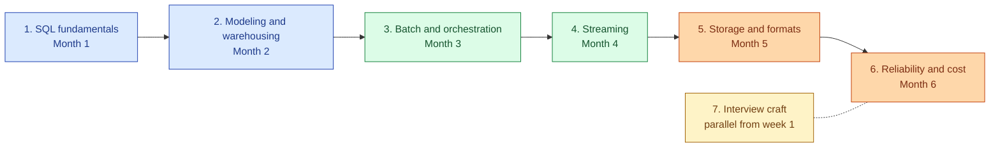
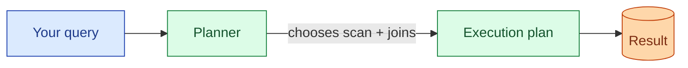
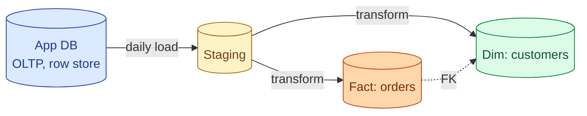
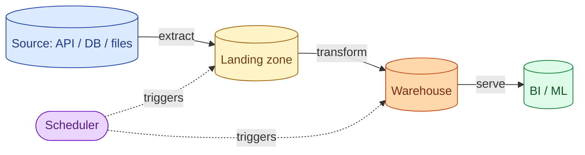
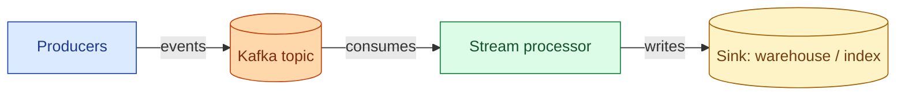
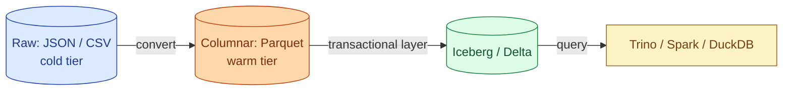
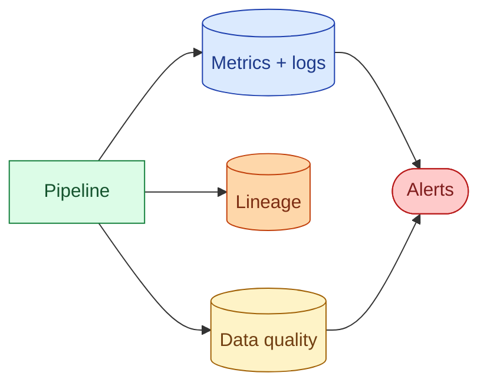

<link rel="stylesheet" href="/assets/css/practice.css">

<section class="pr-hero">
  

    Data Engineering Roadmap
    <h1 class="pr-title">Six months. Seven stages. From SQL basics to running data systems at scale.</h1>
    

      A real, ordered learning path for becoming a senior data engineer. Each stage builds on the last one. You finish each stage by shipping something small, not by collecting certificates.
    

  

</section>

## How to read this page

Read top to bottom. Do the stages in order. The order matters more than people admit. If you try to learn Kafka before you can read a query plan, you will paste tutorials together and hope. Most people who get stuck in data engineering get stuck because they skipped the boring basics: SQL, modeling, and what a transaction actually is.

Two paces:

- If you already write code at work, plan on **four months**.
- If you are still learning to code or come from analytics, plan on **eight months**.

Either way, the structure is the same.

---

## The journey, in one picture

Stages 1 to 6 are sequential. Stage 7 runs alongside the whole thing.

---

## What you can do at each level

A quick honesty check. Where are you now, where do you want to be?

| Level | What you can do | What people pay you for |
|-------|-----------------|-------------------------|
| **Junior** | Write a SQL query. Load a CSV into a warehouse. Run a notebook. | Filling in pieces of someone else's pipeline. |
| **Mid** | Build a batch pipeline from source to dashboard. Read a query plan. Backfill safely. | Owning a pipeline end to end and keeping it healthy. |
| **Senior** | Choose between batch and streaming. Design a warehouse model. Spot the cost bomb before it ships. | Designing pipelines other engineers will build. |
| **Staff** | Set platform direction. Predict the failure mode you have never seen. Have an opinion on every trade-off. | Setting direction across teams. Catching the failure nobody else sees. |

By the end of Stage 4 you are mid-level. By the end of Stage 6 you are senior. Staff comes from production scars, not from a roadmap.

---

## Stage 1: SQL fundamentals

**Goal.** Be fluent in SQL. Not "I can write a SELECT", but "I can read a 200-line query someone else wrote and tell you what it does and where it is slow."

**The picture in your head.**

**Topics.**

| Group | Topics |
|-------|--------|
| **Selecting and filtering** | SELECT, WHERE, ORDER BY, LIMIT, DISTINCT, IS NULL semantics. |
| **Joins** | INNER, LEFT, RIGHT, FULL OUTER, CROSS, anti-joins. When each one fits. |
| **Aggregation** | GROUP BY, HAVING, COUNT, SUM, AVG, GROUPING SETS, ROLLUP, CUBE. |
| **Window functions** | OVER, PARTITION BY, ROW_NUMBER, RANK, LAG, LEAD, running totals. |
| **CTEs and subqueries** | WITH, correlated vs uncorrelated, why CTEs help readability. |
| **Reading a plan** | EXPLAIN, EXPLAIN ANALYZE, seq scan vs index scan, hash join vs nested loop. |
| **Set theory and dates** | UNION vs UNION ALL, INTERSECT, EXCEPT, date arithmetic, time zones. |

**Build this in week 4.** Find a small public dataset (NYC taxi, Stack Overflow dump, anything 1 to 5 GB). Load it into Postgres or DuckDB. Write 10 queries that answer real questions about it. Run EXPLAIN on each. Add one index that makes a slow query 10x faster.

**You are done when** you can look at any reasonable SQL query and predict roughly how long it will take to run on a given table size, before you press execute.

---

## Stage 2: Data modeling and warehousing

**Goal.** Decide what tables to build. Models age slower than code. A bad model will haunt the company for years.

**The picture in your head.**

**Topics.**

| Group | Topics |
|-------|--------|
| **OLTP vs OLAP** | Row stores vs column stores. Why the same table is laid out differently in each. |
| **Normalisation** | 1NF, 2NF, 3NF. When to denormalise on purpose. |
| **Dimensional modeling** | Facts, dimensions, surrogate keys, conformed dimensions. |
| **Slowly changing dimensions** | SCD Type 1, Type 2, Type 3. Which one your stakeholders actually need. |
| **Schemas in the warehouse** | Star, snowflake, data vault. Trade-offs between them. |
| **Grain** | What one row in this fact table means. The most underrated question in modeling. |
| **Naming** | Consistent prefixes, plurals, tenses. Future you will thank present you. |

**Build this in week 8.** Take your Stage 1 dataset. Design a small star schema for it: one fact table, two or three dimensions. Add a Type 2 SCD for one dimension. Write the load query that handles a row update without breaking history.

**You are done when** someone asks "what is the grain of this table?" and you answer in one sentence without checking.

---

## Stage 3: Batch pipelines and orchestration

**Goal.** Move data from A to B, on a schedule, without waking up at 3am. This is the bread-and-butter of the job.

**The picture in your head.**

**Topics.**

| Group | Topics |
|-------|--------|
| **ETL vs ELT** | Why ELT won for warehousing. When ETL still makes sense. |
| **Idempotency** | What it really means. Why every task should be safe to re-run. |
| **Incremental loads** | Watermarks, CDC, merge vs full refresh. Picking the right one. |
| **Orchestration** | DAGs, dependencies, sensors, backfills, retries with backoff. |
| **Tools** | Airflow, Dagster, Prefect, dbt. What each one is good at. |
| **Testing data** | Schema tests, freshness tests, uniqueness tests. Where dbt tests fit. |
| **Backfills** | How to backfill 6 months without melting the warehouse or blowing the budget. |

**Build this in week 12.** Wrap your Stage 2 work in dbt or Airflow. Add: a daily refresh, one incremental model with a watermark, three data tests, and a backfill command. Run it on a free Airflow image or in dbt Cloud.

**You are done when** you can take any source-to-dashboard pipeline request, sketch the DAG on a napkin in 5 minutes, and confidently estimate it in days, not weeks.

---

## Stage 4: Streaming and event-driven

**Goal.** Handle data that arrives one event at a time, often out of order, often late, sometimes twice. The hardest mental shift in data engineering.

**The picture in your head.**

**Topics.**

| Group | Topics |
|-------|--------|
| **Kafka basics** | Topics, partitions, offsets, consumer groups, retention. |
| **Delivery semantics** | At-most-once, at-least-once, exactly-once. What each actually guarantees. |
| **Time** | Event time vs processing time. Why this distinction matters more than it sounds. |
| **Watermarks** | What they are. Why late data is the default, not the exception. |
| **Schema evolution** | Avro, Protobuf, schema registry, backward and forward compatibility. |
| **Stateful streaming** | Joins, windows (tumbling, sliding, session), state stores. |
| **Tools** | Kafka Streams, Flink, Spark Structured Streaming, ksqlDB. What each is for. |

**Build this in week 16.** Stand up local Kafka (Docker is fine). Produce events with a script. Consume them with Kafka Streams or Flink. Compute a tumbling 1-minute count. Send one event late, see what happens. Add a schema registry and break compatibility on purpose.

**You are done when** someone says "let us add streaming" and your first three questions are about ordering, late events, and what happens when a consumer falls behind, not about which tool to pick.

---

## Stage 5: Storage and file formats

**Goal.** Decide where bytes live and in what shape. Cheap to ignore until your bill or your latency tells you otherwise.

**The picture in your head.**

**Topics.**

| Group | Topics |
|-------|--------|
| **File formats** | CSV, JSON, Avro, Parquet, ORC. When each one wins. |
| **Columnar storage** | Why Parquet is the right default for analytics. Encoding, compression, predicate pushdown. |
| **Partitioning** | How to partition. How to not partition. Small file problem. |
| **Clustering and Z-ordering** | When partitioning is not enough. |
| **Object storage** | S3, GCS, ADLS. Consistency model. Cost of LIST. |
| **Lakehouse** | Iceberg, Delta Lake, Hudi. ACID on top of files, table format, time travel. |
| **Hot vs cold** | Tiers. Lifecycle policies. Glacier and what it actually costs to read back. |

**Build this in week 20.** Take your Stage 3 output. Save it as Parquet to local disk or S3 (Minio is fine locally). Partition by date. Query it with DuckDB. Convert one table to Iceberg or Delta. Do a time-travel query. Read the small file count and fix it.

**You are done when** a teammate asks "should we keep this in Parquet or in the warehouse?" and your answer is a cost and a query pattern, not a vibe.

---

## Stage 6: Reliability, debugging, and cost

**Goal.** Run pipelines the way you would run a service. This is what separates a senior data engineer from a mid one.

**The picture in your head.**

**Topics.**

| Group | Topics |
|-------|--------|
| **Observability** | Logs, metrics, traces. SLAs, SLOs, error budgets for data. |
| **Lineage** | Column-level lineage. Why dashboards break and how to find out before users do. |
| **Data quality** | Freshness, completeness, uniqueness, drift. Great Expectations, dbt tests, custom checks. |
| **Debugging** | Slow queries, skewed joins, OOM in Spark, Airflow stuck in queued. How to find the cause fast. |
| **Capacity** | Estimating warehouse credits or cluster size before someone else estimates them for you. |
| **Cost** | Reading a query bill. Killing the top three offenders. Warehouse auto-scaling vs fixed. |
| **Incident response** | Postmortems that change something. Blameless writing. The one-pager template. |

**Build this in week 24.** Add monitoring to your Stage 3 pipeline. Pick three things you would page yourself for and three you would not. Wire them up. Trigger a fake incident: change a source schema. Write a one-page postmortem.

**You are done when** you can take a vague "the dashboard is wrong" complaint and trace it to the exact query, table, or upstream change in under an hour.

---

## Stage 7: Interview craft (parallel from week 1)

**Goal.** Be the person who can also explain it on a call, on a whiteboard, in 45 minutes.

This stage runs alongside Stages 1 to 6. Spend one hour a week on it from day one.

**Topics.**

| Group | Topics |
|-------|--------|
| **DE system design** | Designing a metrics pipeline, a CDC pipeline, an event collection system. |
| **Trade-off framing** | "Here are three options, here is what each one costs, here is what I would pick and why." |
| **Estimation** | Rows per day. Bytes per row. Storage cost per month. Doing this in your head. |
| **Narrating debugging** | Walking through a real incident out loud, with the wrong turns. |
| **Behaviour interviews** | STAR stories about ownership, conflict, and the worst day you had at work. |

**Build this every week.** One mock interview a week. Record yourself answering one DE design question, then watch it back the next day. The first three times will hurt; that is the point.

**You are done when** you can do one DE design question end to end, out loud, in 40 minutes, without a panic spike when the interviewer says "scale this to 10x."

---

## The full topic matrix

| Stage | Core topics | Tools you should touch |
|-------|-------------|------------------------|
| 1 | SQL fluency, query plans | Postgres or DuckDB |
| 2 | Modeling, SCDs, grain | Any warehouse, dbt (light) |
| 3 | Orchestration, idempotency, tests | Airflow or Dagster, dbt |
| 4 | Streaming, watermarks, schema registry | Kafka, Flink or Kafka Streams |
| 5 | Parquet, partitioning, lakehouse | S3 or Minio, Iceberg or Delta, DuckDB |
| 6 | Lineage, DQ, cost, incidents | Any observability stack, OpenLineage |
| 7 | Design, narration, estimation | Whiteboard, webcam, a friend |

---

## The 6-month plan, week by week

| Month | Weeks | Focus | Build |
|-------|-------|-------|-------|
| 1 | 1 to 4 | SQL fundamentals | Querying and indexing a small dataset |
| 2 | 5 to 8 | Modeling and warehousing | Star schema with a Type 2 SCD |
| 3 | 9 to 12 | Batch and orchestration | dbt or Airflow pipeline with tests and backfill |
| 4 | 13 to 16 | Streaming | Kafka + stream processor with windows |
| 5 | 17 to 20 | Storage and formats | Parquet on object storage + lakehouse table |
| 6 | 21 to 24 | Reliability and cost | Monitoring, alerts, one postmortem |
| All | 1 to 24 | Interview craft | One mock per week |

---

## A short note before you start

This roadmap is opinionated. There are other paths. The point is to pick one and finish it.

Do not skip Stage 1 because you "already know SQL". Most engineers think they know SQL and then write queries that scan a billion rows when an index would have answered in milliseconds. Spend the four weeks. Read your own EXPLAIN plans. You will not regret it.

The build exercises are the whole point. A stage you only read is a stage you did not finish.
